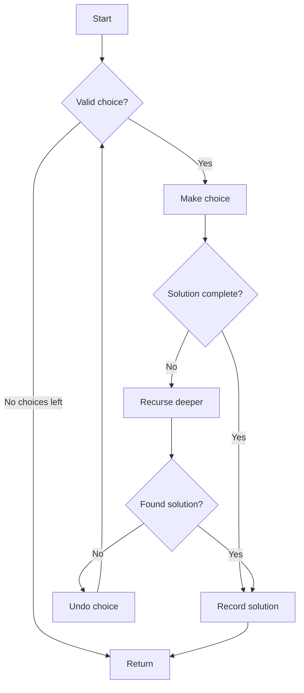

# Backtracking

A general algorithmic technique for finding solutions by incrementally building candidates and abandoning them ("backtracking") when they cannot lead to valid solutions.

## Overview

| Aspect | Details |
|--------|---------|
| **Type** | Algorithmic technique |
| **Paradigm** | Recursive depth-first search with pruning |
| **Use Case** | Constraint satisfaction, combinatorial problems |
| **Time Complexity** | Exponential O(b^d) where b=branching factor, d=depth |
| **Space Complexity** | O(d) for recursion stack |
| **Key Advantage** | Prunes invalid paths early, avoiding exhaustive search |

## Core Concept

Backtracking explores the solution space as a tree:

1. **Choose** - Make a decision and add to current solution
2. **Explore** - Recursively solve the remaining problem
3. **Unchoose** - Backtrack by removing the choice if it fails



## General Pattern

```python
def backtrack(candidate: list, solutions: list) -> None:
    """Template for backtracking algorithms."""
    if is_valid_solution(candidate):
        solutions.append(candidate.copy())  # Found solution
        return

    for choice in get_choices(candidate):
        if is_valid_choice(candidate, choice):
            # Choose
            candidate.append(choice)

            # Explore
            backtrack(candidate, solutions)

            # Unchoose (backtrack)
            candidate.pop()
```

## Key Techniques

### Pruning

Early termination of invalid branches:

| Technique | Description | Example |
|-----------|-------------|---------|
| **Constraint Checking** | Validate constraints before recursing | N-Queens: No two queens in same row/column |
| **Bound Checking** | Stop if current path cannot improve best | Optimization problems |
| **Early Success** | Return immediately on first solution | Sudoku solver |
| **Memoization** | Cache invalid states | Graph coloring with state memory |

### State Management

| Approach | When to Use | Trade-off |
|----------|-------------|-----------|
| **Modify in-place** | Grid problems, chess boards | ✅ Fast, ❌ Requires undo logic |
| **Copy state** | Immutable structures | ✅ Simple, ❌ Memory overhead |
| **Track changes** | Complex state | ✅ Efficient undo, ❌ More code |

## Classic Problems

### N-Queens

Place N queens on N×N chessboard with no attacks.

```python
def solve_n_queens(n: int) -> list[list[str]]:
    """Find all solutions to N-Queens problem."""
    def backtrack(row: int, cols: set, diag1: set, diag2: set):
        if row == n:
            solutions.append([''.join(row) for row in board])
            return

        for col in range(n):
            d1, d2 = row - col, row + col
            if col in cols or d1 in diag1 or d2 in diag2:
                continue  # Prune invalid placement

            # Choose
            board[row][col] = 'Q'
            cols.add(col)
            diag1.add(d1)
            diag2.add(d2)

            # Explore
            backtrack(row + 1, cols, diag1, diag2)

            # Unchoose
            board[row][col] = '.'
            cols.remove(col)
            diag1.remove(d1)
            diag2.remove(d2)

    board = [['.'] * n for _ in range(n)]
    solutions = []
    backtrack(0, set(), set(), set())
    return solutions
```

**Time:** O(N!) with pruning vs O(N^N) brute force

### Sudoku Solver

Fill 9×9 grid following Sudoku rules.

```python
def solve_sudoku(board: list[list[str]]) -> bool:
    """Solve Sudoku puzzle in-place."""
    def is_valid(row: int, col: int, num: str) -> bool:
        # Check row, column, and 3x3 box
        for i in range(9):
            if board[row][i] == num or board[i][col] == num:
                return False

        box_row, box_col = 3 * (row // 3), 3 * (col // 3)
        for i in range(box_row, box_row + 3):
            for j in range(box_col, box_col + 3):
                if board[i][j] == num:
                    return False
        return True

    def backtrack() -> bool:
        for i in range(9):
            for j in range(9):
                if board[i][j] == '.':
                    for num in '123456789':
                        if is_valid(i, j, num):
                            board[i][j] = num  # Choose

                            if backtrack():  # Explore
                                return True

                            board[i][j] = '.'  # Unchoose
                    return False  # No valid number found
        return True  # All cells filled

    return backtrack()
```

**Optimization:** Track available numbers per cell, choose cell with fewest options.

### Permutations

Generate all arrangements of elements.

```python
def permute(nums: list[int]) -> list[list[int]]:
    """Generate all permutations."""
    def backtrack(path: list[int], used: set[int]):
        if len(path) == len(nums):
            result.append(path.copy())
            return

        for i, num in enumerate(nums):
            if i in used:
                continue

            path.append(num)
            used.add(i)
            backtrack(path, used)
            used.remove(i)
            path.pop()

    result = []
    backtrack([], set())
    return result
```

**Time:** O(N × N!) - N! permutations, O(N) to copy each

### Combinations

Select k elements from n elements.

```python
def combine(n: int, k: int) -> list[list[int]]:
    """Generate all combinations of k numbers from 1 to n."""
    def backtrack(start: int, path: list[int]):
        if len(path) == k:
            result.append(path.copy())
            return

        # Optimization: stop if not enough elements left
        need = k - len(path)
        for i in range(start, n + 1 - need + 1):
            path.append(i)
            backtrack(i + 1, path)  # i+1 prevents duplicates
            path.pop()

    result = []
    backtrack(1, [])
    return result
```

**Time:** O(C(n,k) × k) = O((n choose k) × k)

### Subsets

Generate all possible subsets (power set).

```python
def subsets(nums: list[int]) -> list[list[int]]:
    """Generate all subsets (power set)."""
    def backtrack(start: int, path: list[int]):
        result.append(path.copy())  # Every path is valid

        for i in range(start, len(nums)):
            path.append(nums[i])
            backtrack(i + 1, path)
            path.pop()

    result = []
    backtrack(0, [])
    return result
```

**Time:** O(N × 2^N) - 2^N subsets, O(N) to copy each

### Word Search

Find if word exists in 2D grid of letters.

```python
def exist(board: list[list[str]], word: str) -> bool:
    """Check if word exists in board using DFS backtracking."""
    rows, cols = len(board), len(board[0])

    def backtrack(r: int, c: int, index: int) -> bool:
        if index == len(word):
            return True

        if (r < 0 or r >= rows or c < 0 or c >= cols or
            board[r][c] != word[index]):
            return False

        temp = board[r][c]
        board[r][c] = '#'  # Mark visited

        # Explore all 4 directions
        found = (backtrack(r + 1, c, index + 1) or
                backtrack(r - 1, c, index + 1) or
                backtrack(r, c + 1, index + 1) or
                backtrack(r, c - 1, index + 1))

        board[r][c] = temp  # Restore
        return found

    for i in range(rows):
        for j in range(cols):
            if backtrack(i, j, 0):
                return True
    return False
```

**Time:** O(N × M × 4^L) where L = word length

### Graph Coloring

Assign colors to graph vertices with no adjacent vertices sharing colors.

```python
def color_graph(graph: dict[int, list[int]], colors: int) -> list[int]:
    """Color graph with minimum colors using backtracking."""
    n = len(graph)
    result = [-1] * n

    def is_safe(node: int, color: int) -> bool:
        for neighbor in graph[node]:
            if result[neighbor] == color:
                return False
        return True

    def backtrack(node: int) -> bool:
        if node == n:
            return True

        for color in range(colors):
            if is_safe(node, color):
                result[node] = color

                if backtrack(node + 1):
                    return True

                result[node] = -1

        return False

    return result if backtrack(0) else None
```

## Complexity Analysis

### Time Complexity Comparison

| Problem | Brute Force | Backtracking | Improvement |
|---------|-------------|--------------|-------------|
| **N-Queens** | O(N^N) | O(N!) | Prunes invalid columns/diagonals |
| **Sudoku** | O(9^81) | O(9^k) where k=empty cells | Constraint checking |
| **Permutations** | O(N!) | O(N × N!) | Already optimal structure |
| **Combinations** | O(2^N) | O(C(n,k)) | Stops at target size |
| **Graph Coloring** | O(K^N) | O(K^N) worst case | Early pruning on conflicts |

### Space Complexity

- **Recursion stack:** O(d) where d = maximum depth
- **Solution storage:** Problem-dependent
- **State tracking:** O(N) for sets/arrays tracking choices

## Backtracking vs Other Approaches

| Approach | Best For | Trade-off |
|----------|----------|-----------|
| **Backtracking** | Finding all solutions, constraint satisfaction | ✅ Prunes invalid paths<br>❌ Still exponential |
| **Dynamic Programming** | Overlapping subproblems, optimization | ✅ Polynomial time often<br>❌ Requires optimal substructure |
| **Greedy** | Local optimal choices lead to global optimum | ✅ Fast (linear/log)<br>❌ Doesn't guarantee correctness |
| **Branch & Bound** | Optimization problems | ✅ Finds optimal solution<br>❌ Complex bound functions |

## Optimization Strategies

### 1. Constraint Propagation

Update remaining possibilities after each choice:

```python
# Instead of checking validity each time
if is_valid(choice):
    make_choice()

# Propagate constraints
remaining = propagate_constraints(current_state, choice)
if remaining:
    make_choice()
```

### 2. Choose Wisely

Select most constrained variable first (MRV heuristic):

```python
# Pick cell with fewest remaining possibilities
next_cell = min(empty_cells, key=lambda c: len(available_values[c]))
```

### 3. Symmetry Breaking

Avoid exploring symmetric solutions:

```python
# N-Queens: Only try half the columns in first row
for col in range(n // 2):  # Leverages horizontal symmetry
    backtrack(col)
```

### 4. Memoization

Cache computed states:

```python
@lru_cache(maxsize=None)
def backtrack(state: tuple) -> bool:
    # state must be hashable (tuple, frozenset)
    pass
```

## When to Use Backtracking

### Strengths

- ✅ Guarantees finding solution if one exists
- ✅ Finds all solutions efficiently
- ✅ Works on constraint satisfaction problems
- ✅ Better than brute force with good pruning

### Considerations

- ❌ Still exponential time complexity
- ❌ Not suitable for very large problem spaces
- ❌ Requires careful state management

### Best For

- Puzzles (Sudoku, crosswords, N-Queens)
- Combinatorial generation (permutations, subsets)
- Constraint satisfaction (graph coloring, scheduling)
- Path finding with constraints
- Game solving (chess positions, mazes)

## Related

- [[Dynamic Programming]] - Optimization with overlapping subproblems
- [[Graph Algorithms]] - DFS forms the basis of backtracking
- [[Sorting Algorithms]] - Different algorithmic paradigm
- [[Recursion]] - Core mechanism for backtracking
- [[Constraint Satisfaction]] - Problem class backtracking solves
