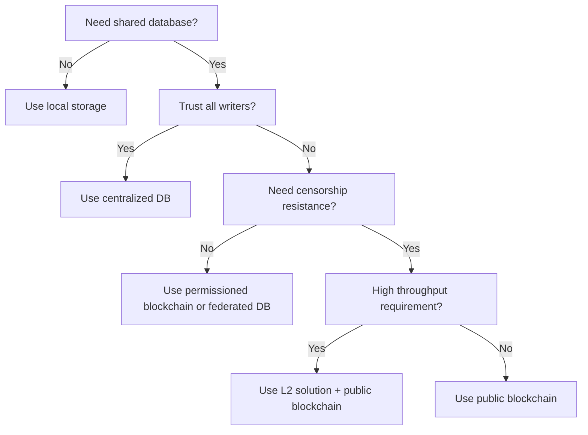

# Blockchain Fundamentals

A distributed, immutable ledger maintained across a network of nodes using cryptographic hashing and consensus mechanisms to ensure data integrity without central authority.

## Overview

| Aspect | Details |
|--------|---------|
| **Core Innovation** | Trustless consensus in distributed systems |
| **Key Properties** | Immutability, transparency, decentralization |
| **Primary Use Cases** | Cryptocurrencies, supply chain, identity, smart contracts |
| **First Implementation** | Bitcoin (2009, Nakamoto consensus) |
| **Data Structure** | Linked list of cryptographically sealed blocks |
| **Scaling Challenge** | CAP theorem tradeoffs (consistency vs availability vs partition tolerance) |

## Core Components

### Blocks

**Structure**: Header + transaction data + metadata

| Component | Purpose |
|-----------|---------|
| **Block Hash** | Unique identifier (SHA-256 of header) |
| **Previous Hash** | Links to parent block, creating chain |
| **Merkle Root** | Hash tree root of all transactions |
| **Timestamp** | Block creation time |
| **Nonce** | Proof-of-Work random value |
| **Difficulty** | Target hash threshold |

### Chains

**Blockchain = Genesis Block → Block₁ → Block₂ → ... → Block_n**

- Each block cryptographically references its predecessor
- Tampering requires rehashing entire chain from modified point
- Longest valid chain wins (heaviest in some protocols)
- Forks occur when multiple valid blocks found simultaneously

### Hashing

**Properties Required:**

- Deterministic (same input = same output)
- Fast to compute
- Collision-resistant
- Avalanche effect (small input change = completely different hash)
- One-way (infeasible to reverse)

**Common Algorithms**: SHA-256 (Bitcoin), Keccak-256 (Ethereum), BLAKE2

### Merkle Trees

Binary hash trees enabling efficient verification:

```
        Root Hash
       /         \
    Hash_AB     Hash_CD
    /    \      /    \
  H(A)  H(B)  H(C)  H(D)
```

**Benefits:**

- Verify single transaction without downloading entire block
- Compact fraud proofs
- Light client support (SPV - Simplified Payment Verification)

## Consensus Mechanisms

### Proof of Work (PoW)

**How it Works**: Miners compete to find nonce making block hash meet difficulty target.

| Aspect | Details |
|--------|---------|
| **Security Model** | 51% hashpower required to attack |
| **Energy Use** | ❌ Extremely high (mining farms) |
| **Finality** | Probabilistic (6+ confirmations typical) |
| **Decentralization** | ✅ High (anyone can mine) |
| **Speed** | ❌ Slow (Bitcoin: ~10 min/block) |
| **Examples** | Bitcoin, Ethereum (pre-Merge), Litecoin |

**Strengths**: Battle-tested, simple game theory, Sybil-resistant
**Weaknesses**: Environmental impact, hardware arms race, slow throughput

### Proof of Stake (PoS)

**How it Works**: Validators stake capital, selected pseudo-randomly to propose blocks.

| Aspect | Details |
|--------|---------|
| **Security Model** | 51% stake + slashing penalties |
| **Energy Use** | ✅ Minimal (~99.95% less than PoW) |
| **Finality** | Deterministic after checkpoint |
| **Decentralization** | ⚠️ Plutocracy risk (rich get richer) |
| **Speed** | ✅ Fast (Ethereum: ~12 sec/block) |
| **Examples** | Ethereum (post-Merge), Cardano, Polkadot |

**Strengths**: Energy efficient, economic security, faster finality
**Weaknesses**: Nothing-at-stake problem (mitigated by slashing), wealth concentration

### Delegated Proof of Stake (DPoS)

**How it Works**: Token holders vote for limited validator set (e.g., 21-100 nodes).

| Aspect | Details |
|--------|---------|
| **Decentralization** | ❌ Lower (small validator set) |
| **Speed** | ✅ Very fast (sub-second blocks) |
| **Throughput** | ✅ High (thousands of TPS) |
| **Governance** | On-chain voting |
| **Examples** | EOS, Tron, Cosmos (Tendermint variant) |

**Tradeoff**: Sacrifices decentralization for performance.

### Practical Byzantine Fault Tolerance (PBFT)

**How it Works**: Three-phase voting (pre-prepare, prepare, commit) among known validators.

| Aspect | Details |
|--------|---------|
| **Security Model** | Tolerates ⌊(n-1)/3⌋ Byzantine nodes |
| **Finality** | ✅ Immediate (no forks) |
| **Speed** | ✅ Very fast |
| **Network** | Permissioned (known validators) |
| **Scalability** | ❌ Poor (O(n²) messages) |
| **Examples** | Hyperledger Fabric, Zilliqa (hybrid) |

**Best for**: Enterprise/private blockchains where participants are vetted.

## Consensus Comparison

| Mechanism | Finality | Energy | Throughput | Decentralization | Best Use |
|-----------|----------|--------|------------|------------------|----------|
| **PoW** | Probabilistic | ❌ Very High | ❌ Low | ✅ High | Public, trustless, censorship-resistant |
| **PoS** | Deterministic | ✅ Low | ⚠️ Medium | ✅ Medium-High | Public, eco-friendly, staking rewards |
| **DPoS** | Deterministic | ✅ Low | ✅ High | ❌ Low | High-performance dApps, governance |
| **PBFT** | Immediate | ✅ Low | ✅ High | ❌ Very Low | Enterprise, permissioned networks |

## Key Concepts

### Decentralization

**Definition**: No single point of control or failure.

**Spectrum:**

- **Full nodes**: Store complete blockchain, validate all blocks
- **Light nodes**: Store headers only, trust full nodes for transactions
- **Mining/validator pools**: Concentration risk

**Measuring**: Nakamoto coefficient (min entities controlling >50% hashpower/stake)

### Immutability

**Why Tamper-Proof**:

1. Changing block N requires rehashing blocks N → tip
2. Attacker must outpace honest chain growth
3. Economic cost (PoW electricity, PoS slashing) exceeds gain

**Caveats**: Not absolute (51% attacks possible, social consensus can override via hard fork)

### Byzantine Fault Tolerance

**Byzantine Generals Problem**: Reaching consensus when some participants are malicious/faulty.

**Blockchain Solutions:**

- PoW: Computational majority assumed honest
- PoS: Economic majority assumed honest
- PBFT: 2/3 honest validator supermajority required

### Forks

| Type | Cause | Outcome |
|------|-------|---------|
| **Soft Fork** | Backwards-compatible rule change | Old nodes still validate new blocks |
| **Hard Fork** | Breaking protocol change | Chain split (both continue or one dies) |
| **Accidental Fork** | Simultaneous block discovery | Resolves to longest chain |
| **Contentious Fork** | Community disagreement | Permanent split (e.g., Bitcoin/Bitcoin Cash) |

### Finality

**Probabilistic Finality (PoW)**:

- Each confirmation increases reversal difficulty
- Never 100% certain (but exponentially unlikely)
- Bitcoin convention: 6 confirmations ≈ irreversible

**Deterministic Finality (PoS/PBFT)**:

- Explicit checkpoint after supermajority attestation
- Mathematically guaranteed (barring >33% validator collusion)
- Faster economic settlement

## Nodes

| Type | Stores | Validates | Participates in Consensus |
|------|--------|-----------|---------------------------|
| **Full Node** | ✅ All blocks | ✅ All transactions | ⚠️ If mining/staking |
| **Light Node (SPV)** | Headers only | ❌ Trusts full nodes | ❌ No |
| **Archive Node** | ✅ All + historical states | ✅ All | ⚠️ If mining/staking |
| **Miner/Validator** | ✅ All blocks | ✅ All transactions | ✅ Yes |

## Mining vs Staking

| Aspect | Mining (PoW) | Staking (PoS) |
|--------|-------------|---------------|
| **Entry Barrier** | Specialized hardware (ASICs/GPUs) | Minimum token balance |
| **Operating Cost** | ❌ High (electricity, cooling) | ✅ Low (server hosting) |
| **Rewards** | Block reward + transaction fees | Transaction fees + issuance |
| **Penalty** | Wasted electricity on orphaned blocks | Slashing for malicious behavior |
| **Competition** | Hashpower race | Economic stake competition |
| **Accessibility** | Economies of scale favor pools | Lower barrier (staking pools exist) |

## When to Use Blockchain

### Blockchain is Ideal When

| Requirement | Why Blockchain Helps |
|-------------|---------------------|
| **Multiple untrusted parties** | Consensus without central authority |
| **Audit trail critical** | Immutable, timestamped history |
| **Censorship resistance needed** | No single point of control |
| **Transparency required** | Public verification of rules/state |
| **Value transfer** | Native support for digital assets |

### Blockchain is Overkill When

| Scenario | Better Solution |
|----------|----------------|
| **Single trusted authority** | Traditional database |
| **High throughput needed (>10K TPS)** | Centralized system or L2 scaling |
| **Data privacy required** | Private database (blockchain transparency conflicts) |
| **Mutable data** | Standard CRUD application |
| **Real-time performance** | In-memory cache or event streaming |

### Decision Framework



## Challenges & Limitations

| Challenge | Description | Mitigations |
|-----------|-------------|-------------|
| **Scalability Trilemma** | Can't maximize decentralization, security, and scalability simultaneously | Layer 2 solutions, sharding, state channels |
| **Energy Consumption** | PoW mining environmental impact | Migrate to PoS, renewable energy mining |
| **Finality Latency** | PoW confirmation delays | Use PoS or PBFT for instant finality |
| **Storage Growth** | Full nodes store all history | Pruning, state expiry, light clients |
| **Governance** | Protocol upgrade coordination difficulty | On-chain voting (DPoS), formalized governance frameworks |
| **Privacy** | Transparent ledger exposes transaction patterns | Zero-knowledge proofs (zk-SNARKs), mixing services |

## Related

- [[Cryptography]]
- [[Distributed Systems]]
- [[Consensus Algorithms]]
- [[Byzantine Generals Problem]]
- [[Smart Contracts]]
- [[Ethereum]]
- [[Bitcoin]]
