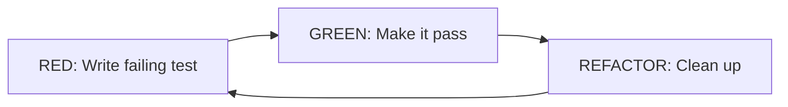
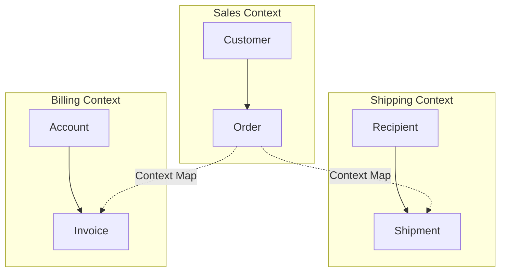
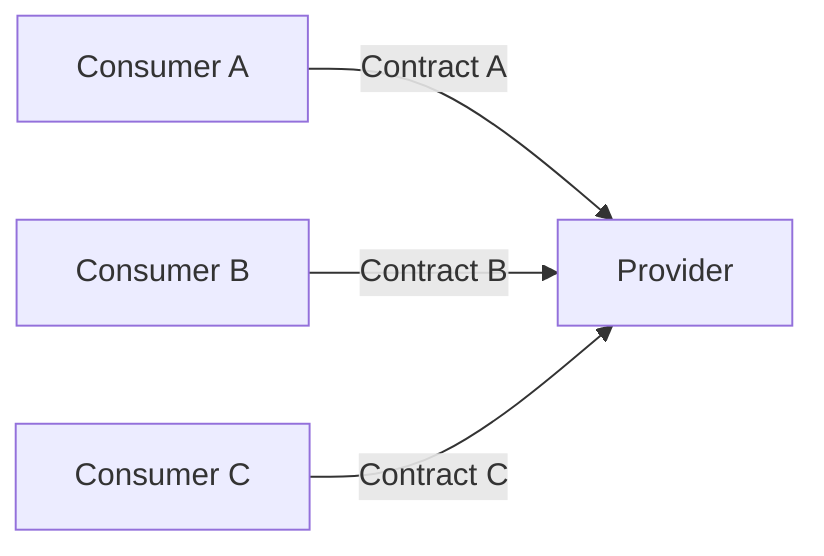
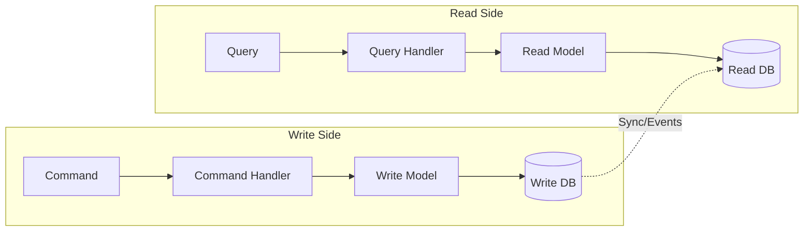

# Coding Philosophies

Different schools of thought on how to write good code, from enterprise patterns to kernel hacking.

## Overview

| Philosophy | Key Proponent | Core Idea | Context |
|------------|---------------|-----------|---------|
| **Clean Code** | Robert C. Martin | Readable code through small functions, good names | Enterprise/OOP |
| **Refactoring** | Martin Fowler | Improve structure without changing behavior | All codebases |
| **Linux Kernel Style** | Linus Torvalds | Simple, obvious, performant C | Systems programming |
| **Pragmatic** | Hunt & Thomas | Trade-offs matter, context is king | General |
| **Functional** | Various | Immutability, composition, pure functions | FP languages |
| **Unix Philosophy** | McIlroy, Thompson | Do one thing well, compose via pipes | CLI tools, systems |
| **Worse is Better** | Richard Gabriel | Simplicity beats correctness for adoption | Language/system design |
| **TDD** | Kent Beck | Write tests first, red-green-refactor | All (especially OOP) |
| **DDD** | Eric Evans | Model the domain, ubiquitous language | Complex business logic |
| **Design by Contract** | Bertrand Meyer | Pre/postconditions, invariants | Safety-critical |

## Clean Code (Robert C. Martin)

Popularized through "Clean Code" (2008). Influential in enterprise Java/.NET circles.

### Core Principles

| Principle | Description |
|-----------|-------------|
| **Meaningful names** | Variables/functions should reveal intent |
| **Small functions** | Functions should do one thing, be <20 lines |
| **Single Responsibility** | Classes should have one reason to change |
| **DRY** | Don't Repeat Yourself |
| **Boy Scout Rule** | Leave code cleaner than you found it |
| **Comments are failures** | Code should be self-documenting |

### The SOLID Principles

| Principle | Meaning | Practical Impact |
|-----------|---------|------------------|
| **S**ingle Responsibility | One class, one reason to change | Smaller, focused classes |
| **O**pen-Closed | Open for extension, closed for modification | Use interfaces/inheritance |
| **L**iskov Substitution | Subtypes must be substitutable for base types | Don't violate contracts |
| **I**nterface Segregation | Many specific interfaces > one general interface | Avoid fat interfaces |
| **D**ependency Inversion | Depend on abstractions, not concretions | Inject dependencies |

### Criticisms

| Criticism | Argument |
|-----------|----------|
| **Over-abstraction** | Leads to "enterprise FizzBuzz" — simple problems buried in interfaces |
| **Dogmatic application** | Rules applied without considering context |
| **Java-centric** | Many principles don't translate well to other paradigms |
| **Function size obsession** | Arbitrary line limits can harm readability |
| **Performance blind** | Abstractions have costs; ignored in enterprise contexts |

**Example of over-engineering:**

```java
// "Clean" version with abstractions
interface NumberProcessor { int process(int n); }
class IncrementProcessor implements NumberProcessor {
    public int process(int n) { return n + 1; }
}
class ProcessorFactory {
    public NumberProcessor createIncrementProcessor() {
        return new IncrementProcessor();
    }
}

// What it replaced
n + 1
```

### When It's Useful

- Large teams needing consistency
- Long-lived enterprise codebases
- Onboarding junior developers
- Code that changes frequently

### When to Be Skeptical

- Performance-critical code
- Small scripts or utilities
- Functional programming contexts
- When it adds complexity without benefit

## Martin Fowler's Approach

Chief Scientist at ThoughtWorks. Author of "Refactoring" (1999), "Patterns of Enterprise Application Architecture" (2002).

### Refactoring

Improving code structure without changing behavior.

| Refactoring | Before | After |
|-------------|--------|-------|
| **Extract Method** | Long function | Smaller functions with clear names |
| **Rename** | `d` | `elapsedDays` |
| **Extract Class** | God class | Focused classes |
| **Replace Conditional with Polymorphism** | Switch statements | Method dispatch |
| **Introduce Parameter Object** | Many params | Single object |

**Key insight:** Refactoring is continuous, not a separate phase. Small, safe changes compound.

### Code Smells

Indicators that code might need refactoring:

| Smell | Description |
|-------|-------------|
| **Long Method** | Function doing too much |
| **Large Class** | Class with too many responsibilities |
| **Primitive Obsession** | Using primitives instead of small objects |
| **Feature Envy** | Method more interested in other class's data |
| **Data Clumps** | Same group of data appearing together |
| **Shotgun Surgery** | One change requires editing many classes |
| **Divergent Change** | One class changed for multiple reasons |

### Enterprise Patterns

| Pattern | Use Case |
|---------|----------|
| **Repository** | Abstract data access |
| **Unit of Work** | Track changes for transaction |
| **Domain Model** | Rich business logic objects |
| **Service Layer** | Coordinate domain operations |
| **Data Transfer Object** | Move data between layers |

### Fowler's Pragmatism

Unlike dogmatic approaches, Fowler emphasizes:

- **"It depends"** — Context matters
- **Trade-offs** — Every pattern has costs
- **Evolutionary design** — Don't over-architect upfront
- **Technical debt** — Sometimes it's okay, but track it

## Linux Kernel Style (Linus Torvalds)

Systems programming philosophy from Linux development.

### Core Principles

| Principle | Description |
|-----------|-------------|
| **Simplicity** | Simple, stupid code over clever abstractions |
| **Obviousness** | Code should be immediately understandable |
| **Performance** | Abstractions have costs; measure everything |
| **Practicality** | Working code beats elegant theory |
| **Direct communication** | Say what you mean, bluntly |

### Kernel Coding Style

```c
// Tabs for indentation (8 spaces wide)
// Forces you to keep nesting shallow

// Function names: lowercase with underscores
void good_function_name(void);
void BadFunctionName(void);  // No

// Braces: opening brace on same line (except functions)
if (condition) {
    do_something();
}

// But functions: opening brace on new line
int function(void)
{
    return 0;
}
```

### Philosophy in Practice

**On abstraction:**

> "Bad programmers worry about the code. Good programmers worry about data structures and their relationships."

**On complexity:**

> "Controlling complexity is the essence of computer programming."

**On debugging:**

> "Given enough eyeballs, all bugs are shallow." (Linus's Law)

### Criticisms of "Enterprise" Style

From kernel perspective:

| Enterprise Practice | Kernel Criticism |
|--------------------|------------------|
| Deep class hierarchies | Adds indirection, harms understanding |
| Design patterns everywhere | Patterns are not goals |
| Getters/setters for everything | Just make the field public if that's what you mean |
| "Future-proofing" | You aren't gonna need it (YAGNI) |

### When It's Useful

- Systems programming (kernels, drivers, embedded)
- Performance-critical code
- C and low-level languages
- Small, focused projects

## Pragmatic Programming

From "The Pragmatic Programmer" (Hunt & Thomas, 1999).

### Key Principles

| Principle | Description |
|-----------|-------------|
| **DRY** | Don't Repeat Yourself — knowledge in one place |
| **Orthogonality** | Components shouldn't affect each other |
| **Reversibility** | Design for change; avoid irreversible decisions |
| **Tracer Bullets** | Build end-to-end skeleton first |
| **Prototypes** | Throw-away code to learn |
| **Domain Languages** | Write code in problem domain terms |
| **Estimate** | Learn to estimate time and resources |

### Good Enough Software

> "Great software today is often preferable to perfect software tomorrow."

- Ship iteratively
- Get feedback early
- Know when to stop polishing

### The Broken Window Theory

One piece of bad code invites more. Fix broken windows (bad code) immediately or the whole neighborhood (codebase) degrades.

## Functional Programming Style

Different philosophy from OOP-centric clean code.

### Core Principles

| Principle | Description |
|-----------|-------------|
| **Immutability** | Data doesn't change; create new versions |
| **Pure functions** | Same input → same output, no side effects |
| **Composition** | Build complex from simple via function composition |
| **Data > Objects** | Data structures + functions, not objects with behavior |
| **Declarative** | Describe what, not how |

### FP vs Clean Code Tension

| Clean Code Says | FP Says |
|-----------------|---------|
| Use objects to encapsulate | Use data + pure functions |
| Dependency injection | Partial application, closures |
| Design patterns | Higher-order functions eliminate most patterns |
| Class hierarchies | Algebraic data types + pattern matching |
| Mutable state is okay if encapsulated | Immutability by default |

### Example: Strategy Pattern

```java
// OOP Strategy Pattern
interface PaymentStrategy { void pay(int amount); }
class CreditCard implements PaymentStrategy { ... }
class PayPal implements PaymentStrategy { ... }

class ShoppingCart {
    private PaymentStrategy strategy;
    void checkout() { strategy.pay(total); }
}
```

```haskell
-- FP: Just pass a function
checkout :: (Int -> IO ()) -> Int -> IO ()
checkout paymentFn total = paymentFn total

-- Usage
checkout creditCardPay 100
checkout paypalPay 100
```

The pattern disappears — it's just a function parameter.

## Unix Philosophy

From Bell Labs, 1970s. Ken Thompson, Dennis Ritchie, Doug McIlroy.

### Core Tenets

| Principle | Description |
|-----------|-------------|
| **Do one thing well** | Programs should do one thing and do it well |
| **Compose via pipes** | Expect output to become another program's input |
| **Text streams** | Text is the universal interface |
| **Prototype early** | Build a working version quickly, refine later |
| **Prefer portability** | Portability over efficiency |
| **Avoid captive UIs** | Prefer filters to interactive programs |
| **Small is beautiful** | Small programs are easier to understand and maintain |

### McIlroy's Summary

> "Write programs that do one thing and do it well. Write programs to work together. Write programs to handle text streams, because that is a universal interface."

### In Practice

```bash
# Unix philosophy in action: composable tools
cat access.log | grep "404" | cut -d' ' -f1 | sort | uniq -c | sort -rn | head

# Each tool does one thing:
# cat    - read file
# grep   - filter lines
# cut    - extract fields
# sort   - sort lines
# uniq   - count duplicates
# head   - take first N
```

### Rule of Silence

> "When a program has nothing surprising to say, it should say nothing."

No output = success. Errors go to stderr.

## Worse is Better

Richard Gabriel's 1989 essay comparing MIT/Lisp and New Jersey/Unix approaches.

### The Two Philosophies

| Aspect | MIT Approach ("The Right Thing") | New Jersey ("Worse is Better") |
|--------|----------------------------------|--------------------------------|
| **Correctness** | Must be correct in all cases | Simplicity can compromise correctness |
| **Consistency** | Must be consistent | Consistency sacrificed for simplicity |
| **Completeness** | Must handle all cases | Can drop features for simplicity |
| **Simplicity** | Implementation can be complex | Implementation must be simple |

### Why "Worse" Won

Unix/C spread faster than Lisp systems because:

1. **Simpler to implement** → More platforms got it
2. **Simpler to port** → Viral spread
3. **"Good enough"** → Users adapted to limitations
4. **Easier to understand** → More contributors

### The Paradox

> "The right thing" may be the enemy of the good.

Systems that are 90% correct and simple often beat 100% correct but complex systems in adoption and longevity.

### Modern Examples

| "Worse" (Won) | "Right Thing" (Lost/Niche) |
|---------------|----------------------------|
| JavaScript | Scheme, ML |
| REST | SOAP, CORBA |
| JSON | XML |
| Git | Darcs, Monotone |
| HTTP/HTML | Hypercard, Xanadu |

## Language-Specific Philosophies

### The Zen of Python (PEP 20)

```python
>>> import this
```

| Aphorism | Meaning |
|----------|---------|
| **Beautiful is better than ugly** | Aesthetics matter |
| **Explicit is better than implicit** | No magic |
| **Simple is better than complex** | Prefer straightforward |
| **Complex is better than complicated** | If complexity needed, keep it organized |
| **Flat is better than nested** | Avoid deep hierarchies |
| **Sparse is better than dense** | Whitespace and clarity |
| **Readability counts** | Code is read more than written |
| **Special cases aren't special enough to break the rules** | Consistency |
| **Although practicality beats purity** | ...but be pragmatic |
| **Errors should never pass silently** | Fail loudly |
| **In the face of ambiguity, refuse the temptation to guess** | Be explicit |
| **There should be one obvious way to do it** | Unlike Perl |
| **Now is better than never** | Ship it |
| **If the implementation is hard to explain, it's a bad idea** | Simplicity test |

### Go Proverbs (Rob Pike)

| Proverb | Meaning |
|---------|---------|
| **Don't communicate by sharing memory; share memory by communicating** | Use channels |
| **Concurrency is not parallelism** | Different concepts |
| **Channels orchestrate; mutexes serialize** | Choose the right tool |
| **The bigger the interface, the weaker the abstraction** | Small interfaces |
| **Make the zero value useful** | `var wg sync.WaitGroup` works |
| **interface{} says nothing** | Avoid empty interface |
| **Gofmt's style is no one's favorite, yet gofmt is everyone's favorite** | Consistency > preference |
| **A little copying is better than a little dependency** | Avoid import for trivial code |
| **Clear is better than clever** | Readability |
| **Errors are values** | Handle them, don't panic |
| **Don't just check errors, handle them gracefully** | Meaningful error handling |
| **Don't panic** | Return errors instead |

### Rust's Philosophy

| Principle | Implementation |
|-----------|----------------|
| **Zero-cost abstractions** | High-level code compiles to optimal low-level |
| **Fearless concurrency** | Ownership prevents data races at compile time |
| **Memory safety without GC** | Borrow checker instead of garbage collection |
| **If it compiles, it works** | Strong type system catches bugs early |
| **Explicit over implicit** | No null, no implicit conversions |

## Test-Driven Development (TDD)

Kent Beck, 1990s. Write tests before implementation.

### The Cycle: Red-Green-Refactor



1. **Red:** Write a test that fails (code doesn't exist yet)
2. **Green:** Write minimal code to make test pass
3. **Refactor:** Improve code while keeping tests green

### Rules

| Rule | Description |
|------|-------------|
| **Only write code to fix a failing test** | No speculative code |
| **Only write enough test to fail** | One assertion at a time |
| **Only write enough code to pass** | Minimal implementation |

### Benefits

- Design emerges from tests
- High test coverage by default
- Confidence to refactor
- Documentation via tests

### Criticisms

| Criticism | Counter-argument |
|-----------|------------------|
| **Slower initial development** | Faster long-term maintenance |
| **Over-testing** | Test behavior, not implementation |
| **Doesn't suit all domains** | Use where it fits (UI, exploratory work harder) |
| **Can lead to bad design** | Need design skills too, TDD isn't magic |

### BDD: Behavior-Driven Development

Evolution of TDD. Dan North.

```gherkin
Feature: User login
  Scenario: Successful login
    Given a registered user with email "test@example.com"
    When they enter valid credentials
    Then they should see the dashboard
```

Focus on behavior specifications, not implementation tests.

## Design by Contract

Bertrand Meyer (Eiffel language), 1986.

### The Contract

| Component | Description | Example |
|-----------|-------------|---------|
| **Precondition** | What must be true before calling | `amount > 0` |
| **Postcondition** | What will be true after calling | `balance == old balance - amount` |
| **Invariant** | What's always true for the class | `balance >= 0` |

### In Code

```python
def withdraw(self, amount):
    """
    Precondition: amount > 0, amount <= self.balance
    Postcondition: self.balance == old_balance - amount
    Invariant: self.balance >= 0
    """
    assert amount > 0, "Amount must be positive"
    assert amount <= self.balance, "Insufficient funds"

    old_balance = self.balance
    self.balance -= amount

    assert self.balance == old_balance - amount
    assert self.balance >= 0
```

### Liskov Substitution via Contracts

Subtypes must:

- **Preconditions:** Same or weaker (accept more)
- **Postconditions:** Same or stronger (guarantee more)
- **Invariants:** Maintain all parent invariants

## Domain-Driven Design (DDD)

Eric Evans, "Domain-Driven Design" (2003).

### Core Concepts

| Concept | Description |
|---------|-------------|
| **Ubiquitous Language** | Shared vocabulary between devs and domain experts |
| **Bounded Context** | Explicit boundary where a model applies |
| **Aggregate** | Cluster of objects treated as unit |
| **Entity** | Object with identity (User, Order) |
| **Value Object** | Object defined by attributes (Money, Address) |
| **Repository** | Collection-like interface for aggregates |
| **Domain Event** | Something that happened in the domain |
| **Domain Service** | Logic that doesn't belong to an entity |

### Bounded Contexts



Same concept (Customer) can mean different things in different contexts.

### Strategic vs Tactical

| Strategic (Architecture) | Tactical (Code) |
|--------------------------|-----------------|
| Bounded Contexts | Entities |
| Context Maps | Value Objects |
| Subdomains | Aggregates |
| | Repositories |
| | Domain Events |

### When to Use DDD

| Good Fit | Bad Fit |
|----------|---------|
| Complex business logic | CRUD apps |
| Long-lived systems | Throwaway projects |
| Domain experts available | Pure technical domains |
| Multiple teams | Solo projects |

## Spec-Driven Development

### API-First / Contract-First

Design the API specification before implementation.

```yaml
# OpenAPI spec written first
openapi: 3.0.0
paths:
  /users/{id}:
    get:
      summary: Get user by ID
      responses:
        '200':
          description: User found
          content:
            application/json:
              schema:
                $ref: '#/components/schemas/User'
        '404':
          description: User not found
```

**Benefits:**

- Frontend and backend can work in parallel
- Contract is documentation
- Can generate client SDKs, mocks, tests
- API review before implementation

### Consumer-Driven Contracts

Consumers define what they need from providers.



Provider must satisfy all consumer contracts. Tools: Pact, Spring Cloud Contract.

### Type-Driven Development

Use types as specifications. If it compiles, it's likely correct.

```typescript
// Type makes invalid states unrepresentable
type OrderStatus =
  | { status: 'pending' }
  | { status: 'paid'; paidAt: Date }
  | { status: 'shipped'; paidAt: Date; shippedAt: Date };

// Can't create shipped order without payment
const invalid: OrderStatus = {
  status: 'shipped',
  shippedAt: new Date()
}; // Error: missing paidAt
```

## Software Architectures

### Layered Architecture (Traditional)

```
┌─────────────────────────┐
│    Presentation Layer   │  UI, Controllers
├─────────────────────────┤
│    Business Layer       │  Services, Logic
├─────────────────────────┤
│    Data Access Layer    │  Repositories, ORM
├─────────────────────────┤
│    Database             │
└─────────────────────────┘
```

**Problem:** Dependencies point downward. Business logic depends on database.

### Hexagonal Architecture (Ports & Adapters)

Alistair Cockburn, 2005.

```
              ┌─────────────────────┐
    REST ────►│                     │◄──── CLI
              │    ┌───────────┐    │
   GraphQL ──►│    │  Domain   │    │◄──── Tests
              │    │  (Core)   │    │
    Queue ───►│    └───────────┘    │◄──── Cron
              │                     │
              └──────────┬──────────┘
                         │
          ┌──────────────┼──────────────┐
          ▼              ▼              ▼
       Database      External API    File System
```

| Concept | Description |
|---------|-------------|
| **Core/Domain** | Business logic, no external dependencies |
| **Ports** | Interfaces defined by the core |
| **Adapters** | Implementations connecting to external world |

**Key insight:** Dependencies point inward. Core doesn't know about HTTP, databases, etc.

### Onion Architecture

Jeffrey Palermo, 2008. Similar to hexagonal, with explicit layers.

```
┌─────────────────────────────────────────┐
│            Infrastructure               │  DB, HTTP, Files
│  ┌───────────────────────────────────┐  │
│  │         Application Services      │  │  Use cases, orchestration
│  │  ┌─────────────────────────────┐  │  │
│  │  │       Domain Services       │  │  │  Business logic
│  │  │  ┌───────────────────────┐  │  │  │
│  │  │  │     Domain Model      │  │  │  │  Entities, Value Objects
│  │  │  └───────────────────────┘  │  │  │
│  │  └─────────────────────────────┘  │  │
│  └───────────────────────────────────┘  │
└─────────────────────────────────────────┘
```

**Rule:** Dependencies only point inward. Inner layers have no knowledge of outer layers.

### Clean Architecture

Robert C. Martin. Combines hexagonal/onion with explicit rules.

| Layer | Contains | Depends On |
|-------|----------|------------|
| **Entities** | Business objects | Nothing |
| **Use Cases** | Application logic | Entities |
| **Interface Adapters** | Controllers, Presenters | Use Cases |
| **Frameworks** | Web, DB, external | Interface Adapters |

### Vertical Slice Architecture

Jimmy Bogard. Organize by feature, not layer.

```
Traditional (horizontal):        Vertical Slice:

Controllers/                     Features/
  UserController                   CreateUser/
  OrderController                    Command.cs
Services/                            Handler.cs
  UserService                        Validator.cs
  OrderService                     GetUser/
Repositories/                        Query.cs
  UserRepository                     Handler.cs
  OrderRepository                  Orders/
                                     CreateOrder/
                                     GetOrders/
```

**Benefits:**

- All code for a feature in one place
- Changes don't ripple across layers
- Features can use different patterns
- Easier to understand and modify

**Trade-off:** Some duplication between slices vs shared abstractions.

### Architecture Comparison

| Architecture | Organize By | Best For |
|--------------|-------------|----------|
| **Layered** | Technical layer | Simple CRUD apps |
| **Hexagonal** | Ports/Adapters | Testability, multiple interfaces |
| **Onion** | Concentric layers | Domain-rich applications |
| **Clean** | Strict dependencies | Large, complex systems |
| **Vertical Slice** | Feature/use case | Feature teams, rapid development |

### CQRS (Command Query Responsibility Segregation)

Separate read and write models.



**When to use:**

- Read and write patterns differ significantly
- Different scaling requirements
- Complex domains with event sourcing

### Event Sourcing

Store events, not current state. Rebuild state by replaying events.

```
Events (source of truth):
┌──────────────────────────────────────────┐
│ AccountCreated(id=123)                   │
│ MoneyDeposited(id=123, amount=100)       │
│ MoneyWithdrawn(id=123, amount=30)        │
│ MoneyDeposited(id=123, amount=50)        │
└──────────────────────────────────────────┘

Current State (derived):
Account { id: 123, balance: 120 }
```

**Benefits:** Complete audit log, can rebuild any point in time, supports CQRS
**Complexity:** Event versioning, eventual consistency, storage growth

## Comparing Philosophies

### By Context

| Context | Recommended Approach |
|---------|---------------------|
| **Large enterprise team** | Clean Code principles (with judgment) |
| **Systems/kernel code** | Linux kernel style |
| **Startup/small team** | Pragmatic, ship fast |
| **Functional language** | FP principles |
| **Performance critical** | Measure first, optimize with intent |
| **Throwaway script** | Whatever works |

### What Everyone Agrees On

| Principle | Universal? |
|-----------|-----------|
| **Meaningful names** | ✅ Yes |
| **Avoid duplication** | ✅ Yes (mostly) |
| **Test your code** | ✅ Yes |
| **Version control** | ✅ Yes |
| **Code review** | ✅ Yes |
| **Small functions** | ⚠️ Depends on context |
| **Comments** | ⚠️ Debated |
| **Abstractions** | ⚠️ Trade-offs |

### What's Actually Debated

| Topic | Range of Opinions |
|-------|-------------------|
| **Function length** | 4 lines (Uncle Bob) → "as long as needed" (Torvalds) |
| **Comments** | "Code smell" → "Essential documentation" |
| **OOP vs FP** | Objects everywhere → Functions everywhere |
| **DRY extremism** | "Never repeat" → "Some duplication is fine" |
| **Testing** | 100% coverage → Test what matters |

## Practical Guidelines

### What Actually Helps

1. **Consistent style** — Pick one and stick to it
2. **Clear names** — Time spent naming is well spent
3. **Appropriate abstraction** — Not too much, not too little
4. **Tests for important paths** — Don't need 100% coverage
5. **Regular refactoring** — Small, continuous improvements
6. **Code review** — Fresh eyes catch issues

### Red Flags

| Warning Sign | Problem |
|--------------|---------|
| Following rules without understanding why | Cargo culting |
| Every class has interface + impl | Over-abstraction |
| Can't explain code to junior dev | Too clever |
| Premature optimization | Wrong priorities |
| Premature abstraction | Also wrong priorities |
| "Best practices" without context | Dogma |

## Related

- [[CS Fundamentals Glossary]]
- [[Design Patterns]]
- [[Testing Strategies]]
- [[Code Review]]

## References

- Fowler, M. "Refactoring: Improving the Design of Existing Code"
- Hunt & Thomas. "The Pragmatic Programmer"
- Martin, R. "Clean Code" (read critically)
- Evans, E. "Domain-Driven Design"
- Beck, K. "Test-Driven Development by Example"
- Meyer, B. "Object-Oriented Software Construction"
- Gabriel, R. ["Worse is Better"](https://www.dreamsongs.com/WorseIsBetter.html)
- [Linux Kernel Coding Style](https://www.kernel.org/doc/html/latest/process/coding-style.html)
- [The Zen of Python (PEP 20)](https://peps.python.org/pep-0020/)
- [Go Proverbs](https://go-proverbs.github.io/)
- [Write Code That Is Easy to Delete](https://programmingisterrible.com/post/139222674273/write-code-that-is-easy-to-delete-not-easy-to)
