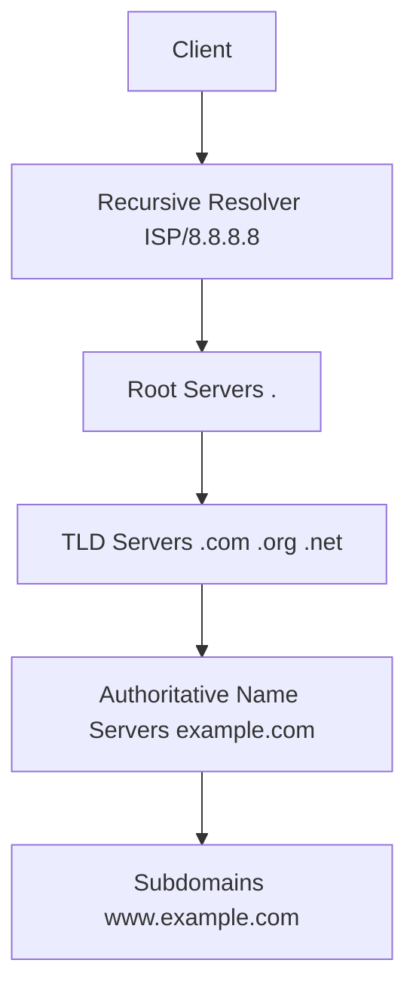
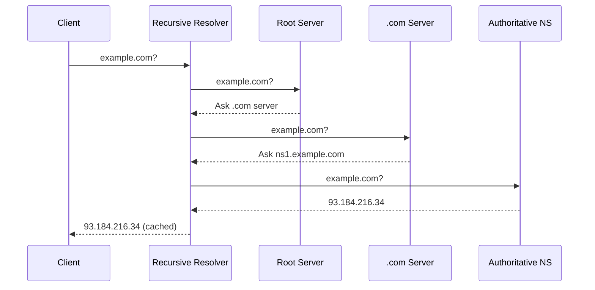

# DNS

The Domain Name System translates human-readable domain names into IP addresses and provides distributed, hierarchical infrastructure for internet naming.

## Overview

| Aspect | Details |
|--------|---------|
| **Purpose** | Translate domain names to IP addresses and vice versa |
| **Architecture** | Distributed, hierarchical database |
| **Port** | 53 (UDP/TCP), 853 (DoT), 443 (DoH) |
| **Key RFCs** | RFC 1034, 1035 (core), 4033-4035 (DNSSEC), 8484 (DoH) |
| **Resolution Types** | Recursive, Iterative |
| **Primary Operations** | Query, Response, Zone Transfer |

## DNS Hierarchy



**Structure:**

- **Root Servers** - 13 root server clusters worldwide (a-m.root-servers.net)
- **TLD Servers** - Top-Level Domain servers (.com, .org, country codes)
- **Authoritative Servers** - Hold actual DNS records for domains
- **Recursive Resolvers** - Query on behalf of clients, cache results

## DNS Record Types

| Record | Purpose | Format | Example |
|--------|---------|--------|---------|
| **A** | IPv4 address | Domain → IPv4 | `example.com → 93.184.216.34` |
| **AAAA** | IPv6 address | Domain → IPv6 | `example.com → 2606:2800:220:1:248:...` |
| **CNAME** | Canonical name (alias) | Domain → Domain | `www.example.com → example.com` |
| **MX** | Mail exchange server | Priority + Domain | `10 mail.example.com` |
| **TXT** | Text records (SPF, DKIM, verification) | Text string | `v=spf1 include:_spf.google.com ~all` |
| **NS** | Name server delegation | Domain → Nameserver | `example.com → ns1.provider.com` |
| **SOA** | Start of Authority | Zone metadata | Serial, refresh, retry, expire, TTL |
| **SRV** | Service locator | Priority + Weight + Port + Target | `0 5 5060 sipserver.example.com` |
| **CAA** | Certificate Authority Authorization | Flags + Tag + Value | `0 issue "letsencrypt.org"` |
| **PTR** | Reverse DNS lookup | IP → Domain | `34.216.184.93.in-addr.arpa → example.com` |

**Additional Records:**

- **DNSKEY** - Public key for DNSSEC
- **DS** - Delegation Signer for DNSSEC chain of trust
- **RRSIG** - DNSSEC signature
- **NSEC/NSEC3** - DNSSEC authenticated denial of existence
- **TLSA** - DANE (DNS-based Authentication of Named Entities)

## Resolution Process

### Recursive Resolution



**Steps:**

1. Client queries recursive resolver
2. Resolver checks cache
3. If not cached, queries root servers
4. Root servers return TLD server
5. Resolver queries TLD server
6. TLD returns authoritative nameserver
7. Resolver queries authoritative server
8. Authoritative server returns IP address
9. Resolver caches result and returns to client

### Iterative Resolution

Resolver returns referrals to client; client performs each step itself. Less common for end clients, more common between nameservers.

## Caching and TTL

**Time To Live (TTL):**

- Defines how long records can be cached
- Specified in seconds
- Balances performance vs. freshness
- Common values: 300s (5min), 3600s (1hr), 86400s (24hr)

**Caching Layers:**

- Browser cache
- Operating system cache
- Recursive resolver cache
- Intermediate nameserver cache

**TTL Strategy:**

| Use Case | Recommended TTL | Reason |
|----------|----------------|--------|
| **Static infrastructure** | 86400s (24hr) | ✅ Reduces query load |
| **Dynamic/load balanced** | 300-600s | ✅ Faster failover |
| **Before migration** | 60-300s | ✅ Quick switchover |
| **CDN endpoints** | 3600s (1hr) | ✅ Balance between performance and flexibility |

## DNSSEC

DNS Security Extensions provide authentication and integrity verification.

**Purpose:**

- Prevent cache poisoning
- Verify DNS responses are authentic
- Establish chain of trust from root to domain

**Key Components:**

| Component | Purpose |
|-----------|---------|
| **DNSKEY** | Public key published in DNS |
| **RRSIG** | Signature of record set |
| **DS** | Delegation Signer linking parent to child |
| **NSEC/NSEC3** | Proof of non-existence |

**Validation Chain:**

1. Root zone signs TLD records
2. TLD signs authoritative nameserver records
3. Authoritative server signs domain records
4. Resolver validates entire chain

**Considerations:**

- ✅ Prevents DNS spoofing and cache poisoning
- ✅ Essential for high-security environments
- ❌ Increased response size (UDP fragmentation issues)
- ❌ Complexity in key rotation and management

## Encrypted DNS

### DNS over HTTPS (DoH)

| Aspect | Details |
|--------|---------|
| **Protocol** | HTTPS (port 443) |
| **RFC** | RFC 8484 |
| **Format** | DNS queries in HTTP/2 or HTTP/3 |
| **Privacy** | ✅ Encrypted queries, hard to detect/block |
| **Providers** | Cloudflare (1.1.1.1), Google (8.8.8.8), Quad9 |

### DNS over TLS (DoT)

| Aspect | Details |
|--------|---------|
| **Protocol** | TLS (port 853) |
| **RFC** | RFC 7858 |
| **Format** | DNS over dedicated TLS connection |
| **Privacy** | ✅ Encrypted, ❌ Easier to detect than DoH |
| **Providers** | Cloudflare, Google, Quad9 |

### Comparison

| Feature | Traditional DNS | DoT | DoH |
|---------|----------------|-----|-----|
| **Encryption** | ❌ Plain text | ✅ TLS | ✅ HTTPS |
| **Port** | 53 | 853 | 443 |
| **Blocking Resistance** | ❌ Easy | ⚠️ Moderate | ✅ Hard |
| **Enterprise Control** | ✅ Easy | ✅ Possible | ❌ Difficult |
| **Performance** | ✅ Fastest | ⚠️ Good | ⚠️ Good |

## Advanced DNS Patterns

### Split-Horizon DNS

Serve different DNS responses based on query source.

**Use Cases:**

- Internal vs. external clients see different IPs
- Corporate networks with private internal services
- VPN users receive internal addresses

**Example:**

```
External query: www.company.com → 203.0.113.10 (public IP)
Internal query: www.company.com → 10.0.1.50 (private IP)
```

### GeoDNS

Return different IP addresses based on geographic location of requester.

**Benefits:**

- ✅ Route users to nearest server
- ✅ Reduce latency
- ✅ Comply with data residency requirements
- ✅ Load distribution across regions

**Providers:**

- Route 53 (AWS)
- Cloudflare
- Azure Traffic Manager
- NS1

### DNS Load Balancing

**Round Robin:**

```
example.com A 192.0.2.1
example.com A 192.0.2.2
example.com A 192.0.2.3
```

Resolver rotates through addresses. Simple but no health checking.

**Weighted Round Robin:**
Assign different probabilities to each IP address.

**Failover:**

- Monitor health of endpoints
- Remove failed servers from DNS responses
- Requires low TTL for faster failover

**Considerations:**

- ❌ No session persistence
- ❌ Caching delays failover
- ❌ No real-time health awareness (client-side)
- ✅ Simple to implement
- ✅ Works globally without infrastructure

## DNS Query Tools

### dig (Domain Information Groper)

**Basic Query:**

```bash
dig example.com

# Specific record type
dig example.com AAAA

# Query specific nameserver
dig @8.8.8.8 example.com

# Trace full resolution path
dig +trace example.com

# Short output (just answer)
dig +short example.com

# Reverse DNS lookup
dig -x 93.184.216.34
```

**Output Sections:**

- **QUESTION** - Query sent
- **ANSWER** - Response records
- **AUTHORITY** - Authoritative nameservers
- **ADDITIONAL** - Extra info (glue records)

### nslookup

**Basic Query:**

```bash
nslookup example.com

# Specific server
nslookup example.com 8.8.8.8

# Interactive mode
nslookup
> set type=MX
> example.com
```

**Note:** dig is preferred for detailed diagnostics; nslookup is simpler for basic queries.

### host

**Basic Query:**

```bash
host example.com

# All records
host -a example.com

# Reverse lookup
host 93.184.216.34
```

## Common Issues and Troubleshooting

| Issue | Symptoms | Diagnosis | Solution |
|-------|----------|-----------|----------|
| **DNS Propagation** | Different IPs in different locations | `dig @8.8.8.8` vs `dig @1.1.1.1` | Wait for TTL expiry, lower TTL before changes |
| **NXDOMAIN** | Domain doesn't exist | `dig example.com` shows NXDOMAIN | Check domain spelling, verify NS records |
| **SERVFAIL** | Server-side error | `dig` shows SERVFAIL | Check authoritative server health, DNSSEC validation |
| **Slow Resolution** | High latency | `dig +trace` shows delays | Optimize resolver, reduce delegation layers |
| **Cache Poisoning** | Wrong IPs returned | Compare multiple resolvers | Enable DNSSEC, use trusted resolvers |
| **UDP Fragmentation** | Large responses fail | EDNS0 issues with DNSSEC | Enable TCP fallback, reduce response size |

**Debugging Workflow:**

1. Test local cache: `dig example.com` (may be cached)
2. Bypass cache: `dig @8.8.8.8 example.com`
3. Trace resolution: `dig +trace example.com`
4. Check authoritative: `dig @ns1.example.com example.com`
5. Verify DNSSEC: `dig +dnssec example.com`

## DNS Zone File Example

```zone
$ORIGIN example.com.
$TTL 3600

@       IN  SOA   ns1.example.com. admin.example.com. (
                  2025113001  ; Serial (YYYYMMDDNN)
                  7200        ; Refresh (2 hours)
                  3600        ; Retry (1 hour)
                  1209600     ; Expire (2 weeks)
                  3600 )      ; Minimum TTL (1 hour)

        IN  NS    ns1.example.com.
        IN  NS    ns2.example.com.

        IN  A     93.184.216.34
        IN  AAAA  2606:2800:220:1:248:1893:25c8:1946

www     IN  CNAME example.com.
mail    IN  A     93.184.216.35

        IN  MX    10 mail.example.com.
        IN  MX    20 mail2.example.com.

        IN  TXT   "v=spf1 include:_spf.google.com ~all"

_dmarc  IN  TXT   "v=DMARC1; p=quarantine; rua=mailto:dmarc@example.com"

        IN  CAA   0 issue "letsencrypt.org"
```

## Best Practices

**Configuration:**

- Use at least 2 authoritative nameservers in different networks
- Implement DNSSEC for security-critical domains
- Set appropriate TTLs (lower before changes, higher for stability)
- Monitor DNS query patterns and latency

**Security:**

- Use DoH/DoT for sensitive environments
- Enable DNSSEC validation on resolvers
- Implement CAA records to control certificate issuance
- Regular audit of DNS records for unauthorized changes

**Performance:**

- Minimize DNS lookup chains (CNAME depth)
- Use Anycast for globally distributed services
- Implement proper caching strategy
- Consider GeoDNS for global applications

**Operational:**

- Automate DNS updates via API (Terraform, Route53 API)
- Test changes in staging zones first
- Monitor authoritative server uptime
- Plan migrations with gradual TTL reduction

## Public DNS Resolvers

| Provider | IPv4 | IPv6 | Features |
|----------|------|------|----------|
| **Cloudflare** | 1.1.1.1, 1.0.0.1 | 2606:4700:4700::1111 | Fast, privacy-focused, DoH/DoT |
| **Google** | 8.8.8.8, 8.8.4.4 | 2001:4860:4860::8888 | Reliable, DNSSEC, DoH/DoT |
| **Quad9** | 9.9.9.9 | 2620:fe::fe | Security filtering, privacy, DoH/DoT |
| **OpenDNS** | 208.67.222.222 | 2620:119:35::35 | Filtering options, family shield |

## Related

- [[Networking Fundamentals]]
- [[Essential RFCs]]
- [[HTTP]]
- [[TLS and SSL]]
- [[CDN]]
- [[Load Balancing]]
