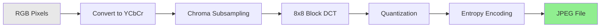
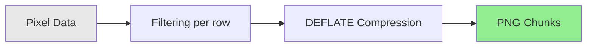

# Image Formats

How digital images are stored — from raw pixel grids to compressed representations, with deep dives into JPEG, PNG, GIF, WebP, and AVIF.

## Overview

| Format | Compression | Transparency | Animation | Lossy/Lossless | Typical Use |
|--------|-------------|-------------|-----------|----------------|-------------|
| JPEG | DCT-based | No | No | Lossy | Photos |
| PNG | DEFLATE | Yes (alpha) | No | Lossless | UI, screenshots, graphics |
| GIF | LZW | Yes (1-bit) | Yes | Lossless (256 colors) | Simple animations |
| WebP | VP8/VP8L | Yes | Yes | Both | Web (modern replacement) |
| AVIF | AV1 intra-frame | Yes | Yes | Both | Web (next-gen) |
| BMP | None (usually) | No | No | Uncompressed | Legacy, simple storage |
| TIFF | Various | Yes | No | Both | Print, medical, GIS |
| SVG | N/A (vector) | Yes | Yes (SMIL) | N/A | Icons, logos, diagrams |
| HEIF/HEIC | HEVC intra-frame | Yes | Yes | Both | Apple photos |
| ICO | PNG or BMP | Yes | No | Both | Favicons, Windows icons |

---

## JPEG (Joint Photographic Experts Group)

The most common photo format on the web and in cameras. Designed for photographic content.

### How JPEG Compression Works



1. **Color space conversion** — RGB to YCbCr (luminance + two chrominance channels). Human eyes are more sensitive to brightness than color, so chrominance can be compressed more aggressively.

2. **Chroma subsampling** — Reduce chrominance resolution (4:2:0 means half resolution in each axis for color, keeping full resolution for brightness). This alone cuts data by ~50% with minimal perceptual loss.

3. **Block splitting** — Divide each channel into 8x8 pixel blocks.

4. **DCT (Discrete Cosine Transform)** — Transform each block from spatial domain to frequency domain. Low frequencies (smooth gradients) cluster in the top-left; high frequencies (sharp edges) cluster in the bottom-right.

5. **Quantization** — Divide DCT coefficients by a quantization matrix and round. **This is the lossy step.** Higher quality = smaller divisors = more preserved detail. Many high-frequency coefficients become zero.

6. **Entropy encoding** — Huffman or arithmetic coding compresses the quantized coefficients. Zigzag scan order groups zeros together for efficient run-length encoding.

### JPEG Binary Structure

```
FF D8 FF                     ← SOI (Start of Image) + marker prefix
FF E0 [len] "JFIF"          ← APP0: JFIF header (or FF E1 for EXIF)
FF DB [len] [tables]         ← DQT: Quantization tables
FF C0 [len] [params]        ← SOF0: Start of Frame (dimensions, channels)
FF C4 [len] [tables]        ← DHT: Huffman tables
FF DA [len] [params] [data] ← SOS: Start of Scan (compressed image data)
... compressed scan data ...
FF D9                        ← EOI (End of Image)
```

Hex dump of a JPEG start:

```
00000000  FF D8 FF E0 00 10 4A 46  49 46 00 01 01 01 00 48   ......JFIF.....H
00000010  00 48 00 00 FF DB 00 43  00 08 06 06 07 06 05 08   .H.....C........
```

- `FF D8` — Every JPEG starts with this (SOI marker)
- `FF E0` — APP0 marker (JFIF metadata)
- `4A 46 49 46 00` — "JFIF\0" identifier string
- `FF DB` — Quantization table follows
- `FF D9` — Every JPEG ends with this (EOI marker)

### JPEG Variants

| Variant | How It Differs |
|---------|---------------|
| Progressive JPEG | Multiple scans, coarse-to-fine rendering. Better perceived load time on slow connections. |
| JPEG 2000 | Wavelet-based (not DCT). Better quality at low bitrates. Rare on the web but used in medical imaging and cinema (DCI). |
| JPEG XL | Modern successor. Supports lossless, HDR, animation. Can losslessly recompress existing JPEG. Adoption stalled (dropped from Chrome). |
| Motion JPEG | Each video frame is an independent JPEG. Simple but inefficient (no inter-frame compression). |

### JPEG Artifacts

Visible compression artifacts at low quality settings:

- **Blocking** — Visible 8x8 grid boundaries (quantization too aggressive)
- **Ringing** — Halos around sharp edges (high-frequency loss)
- **Color banding** — Smooth gradients become stepped (chroma subsampling + quantization)
- **Mosquito noise** — Flickering artifacts near edges in video MJPEG

---

## PNG (Portable Network Graphics)

Lossless format designed to replace GIF. Supports full alpha transparency.

### How PNG Works



1. **Filtering** — Each row is filtered to improve compressibility. Five filter types (None, Sub, Up, Average, Paeth) encode each pixel relative to its neighbors instead of as absolute values.

2. **DEFLATE compression** — LZ77 + Huffman coding on the filtered data. Same algorithm as gzip/ZIP.

3. **Chunked storage** — Data organized as typed chunks with length, type, data, and CRC checksum.

### PNG Chunk Structure

Every PNG chunk follows this layout:

```
┌──────────────┬───────────────┬────────────┬──────────────┐
│ Length (4B)   │ Type (4B)     │ Data (var) │ CRC (4B)     │
│ big-endian   │ ASCII name    │            │ of type+data │
└──────────────┴───────────────┴────────────┴──────────────┘
```

Critical chunks (must be present):

| Chunk | Name | Contents |
|-------|------|----------|
| `IHDR` | Image Header | Width, height, bit depth, color type |
| `IDAT` | Image Data | Compressed pixel data (can be multiple) |
| `IEND` | Image End | Empty, marks end of file |

Ancillary chunks (optional):

| Chunk | Name | Contents |
|-------|------|----------|
| `PLTE` | Palette | Color palette for indexed-color images |
| `tRNS` | Transparency | Simple transparency without full alpha |
| `tEXt` | Text | Key-value metadata (Latin-1) |
| `iTXt` | International Text | Key-value metadata (UTF-8) |
| `gAMA` | Gamma | Display gamma value |
| `cHRM` | Chromaticity | Color space white point and primaries |
| `iCCP` | ICC Profile | Embedded color profile |
| `pHYs` | Physical Dimensions | Pixels per unit (DPI) |
| `tIME` | Timestamp | Last modification time |
| `eXIf` | EXIF data | Embedded EXIF metadata (since 2017) |

### PNG Hex Walkthrough

```
Offset    Hex                                       Meaning
00000000  89 50 4E 47 0D 0A 1A 0A                   PNG signature
          │  │           │  │
          │  "PNG"       │  SUB (stops type display)
          │              CR LF (detects line ending conversion)
          0x89 (non-ASCII, detects 7-bit stripping)

00000008  00 00 00 0D                               IHDR chunk length: 13 bytes
0000000C  49 48 44 52                               Chunk type: "IHDR"
00000010  00 00 04 00                               Width: 1024
00000014  00 00 03 00                               Height: 768
00000018  08                                        Bit depth: 8
00000019  02                                        Color type: 2 (RGB)
0000001A  00                                        Compression: 0 (deflate)
0000001B  00                                        Filter: 0 (adaptive)
0000001C  00                                        Interlace: 0 (none)
0000001D  XX XX XX XX                               CRC-32 checksum
```

The PNG signature is cleverly designed — each byte serves a detection purpose:

- `0x89` — Non-ASCII, detects systems that strip the high bit
- `PNG` — Human-readable identification
- `0D 0A` — CR LF, detects Unix-to-DOS line ending conversion
- `1A` — Ctrl+Z, stops file display on DOS `type` command
- `0A` — LF, detects DOS-to-Unix line ending conversion

### PNG Color Types

| Value | Type | Channels | Common Use |
|-------|------|----------|------------|
| 0 | Grayscale | 1 | Black and white images |
| 2 | RGB | 3 | Full-color photos |
| 3 | Indexed | 1 (palette lookup) | Simple graphics, small files |
| 4 | Grayscale + Alpha | 2 | Transparent grayscale |
| 6 | RGBA | 4 | Full color + transparency |

---

## GIF (Graphics Interchange Format)

The original web animation format from 1987. Limited but ubiquitous.

### GIF Structure

```
47 49 46 38 39 61          ← "GIF89a" signature
[Logical Screen Descriptor]  ← Canvas size, global color table flag
[Global Color Table]         ← Up to 256 RGB entries
[Extension Blocks]           ← Animation control, comments, etc.
[Image Descriptor + Data]*   ← One per frame, LZW-compressed
3B                           ← Trailer byte (end of file)
```

### Key Limitations

| Aspect | Limitation |
|--------|-----------|
| Colors | 256 per frame (8-bit palette) |
| Transparency | 1-bit only (fully transparent or fully opaque) |
| Compression | LZW (patented until 2004, which prompted PNG's creation) |
| Color depth | No 16-bit, no HDR |
| Animation | Millisecond timing, disposal methods, no audio |

### Why GIF Persists

Despite being technically inferior to APNG and WebP for animation, GIF remains dominant because of universal support — every browser, messaging app, and social platform handles GIF. The format is effectively a social media lingua franca.

---

## WebP

Developed by Google, based on VP8 video codec technology. Designed as a universal web image format.

### WebP Structure

WebP uses the RIFF container format:

```
52 49 46 46  [size]         ← "RIFF" + file size
57 45 42 50                 ← "WEBP" format identifier
[VP8 chunk]                 ← Lossy data (VP8 codec), OR
[VP8L chunk]                ← Lossless data (VP8L codec), OR
[VP8X chunk + sub-chunks]   ← Extended format (alpha, EXIF, animation)
```

| Mode | Chunk | Compression |
|------|-------|-------------|
| Lossy | `VP8` | VP8 intra-frame (similar to JPEG but with better prediction) |
| Lossless | `VP8L` | Predictive coding + entropy coding (better than PNG) |
| Extended | `VP8X` | Lossy or lossless + alpha + animation + metadata |

### WebP vs JPEG vs PNG

| Metric | JPEG | PNG | WebP |
|--------|------|-----|------|
| Lossy photos | Baseline | N/A | 25-35% smaller than JPEG |
| Lossless graphics | N/A | Baseline | 26% smaller than PNG |
| Transparency | No | Yes | Yes |
| Animation | No | APNG (limited support) | Yes |
| Browser support | Universal | Universal | ~97% (all modern browsers) |
| Metadata | EXIF, XMP | tEXt, eXIf | EXIF, XMP |
| Max dimensions | 65,535 x 65,535 | 2,147,483,647 x 2,147,483,647 | 16,383 x 16,383 |

---

## AVIF (AV1 Image File Format)

Next-generation format based on the AV1 video codec. Backed by the Alliance for Open Media (Google, Apple, Mozilla, Netflix, etc.).

### How AVIF Works

Uses AV1 intra-frame coding — the same techniques that make AV1 video efficient, applied to single frames:

- Advanced prediction modes (directional intra, cross-component)
- Larger block sizes (up to 128x128 vs JPEG's 8x8)
- Film grain synthesis (store grain parameters instead of grain pixels)
- HDR and wide color gamut support (10/12-bit, BT.2020)

### AVIF vs WebP vs JPEG

| Aspect | JPEG | WebP | AVIF |
|--------|------|------|------|
| Compression efficiency | Baseline | ~30% better | ~50% better |
| Encode speed | Fast | Moderate | Slow |
| Decode speed | Fast | Fast | Moderate |
| HDR | No | No | Yes (10/12-bit) |
| Browser support | Universal | ~97% | ~92% |
| Max dimensions | 65K | 16K | 8K (tiled for larger) |
| Animation | No | Yes | Yes |

Tradeoff: AVIF achieves the best compression but is significantly slower to encode, making it better suited for static assets than real-time generation.

---

## BMP (Bitmap)

The simplest raster format — essentially raw pixel data with a header.

### BMP Header Structure

```
Offset  Size  Field
0x00    2     Signature: "BM" (42 4D)
0x02    4     File size in bytes
0x06    4     Reserved (zero)
0x0A    4     Offset to pixel data
0x0E    4     DIB header size (40 for BITMAPINFOHEADER)
0x12    4     Width in pixels
0x16    4     Height in pixels (negative = top-down)
0x1A    2     Color planes (always 1)
0x1C    2     Bits per pixel (1, 4, 8, 16, 24, 32)
0x1E    4     Compression method (0 = none)
0x22    4     Image data size
0x26    4     Horizontal resolution (pixels/meter)
0x2A    4     Vertical resolution (pixels/meter)
0x2E    4     Colors in palette
0x32    4     Important colors
```

Pixel data is stored **bottom-up** by default (first row in the file is the bottom row of the image) and each row is padded to a 4-byte boundary.

---

## Choosing a Format

| Scenario | Recommended | Why |
|----------|-------------|-----|
| Photos on the web | WebP with JPEG fallback | Best size/quality, near-universal support |
| UI screenshots | PNG | Lossless, sharp edges preserved |
| Photos with transparency | WebP or PNG | JPEG has no alpha channel |
| Simple animations | WebP or GIF | WebP is smaller, GIF is more universal |
| Print/archival | TIFF or PNG | Lossless, high bit depth |
| Icons/logos | SVG | Scalable, tiny file size, editable |
| Maximum compression | AVIF | Best ratio but slower encode and less support |
| Camera raw editing | DNG, CR3, NEF | Unprocessed sensor data, maximum editing latitude |
| Apple ecosystem | HEIF/HEIC | Default camera format since iOS 11 |

---

## Related

- [[File Formats]] — Parent overview of all file format concepts
- [[File Metadata]] — EXIF, GPS, XMP metadata systems
- [[Audio and Video Formats]] — Codecs, containers, streaming formats
- [[Character Encoding]] — UTF-8, Unicode, text encoding
