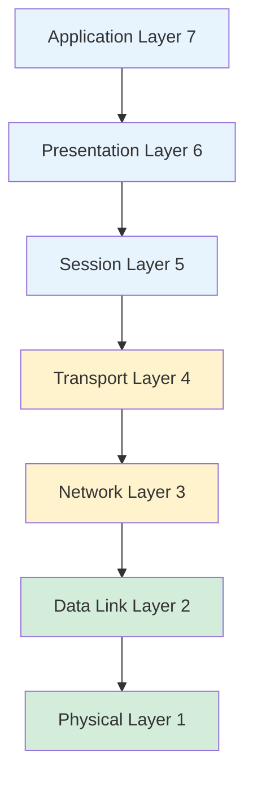
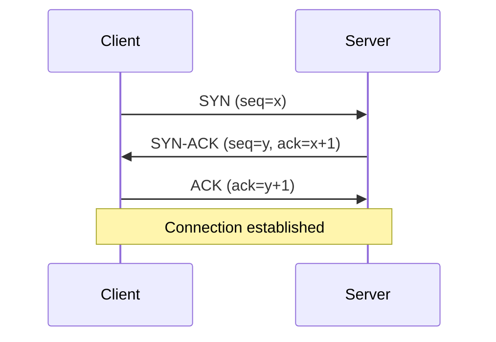
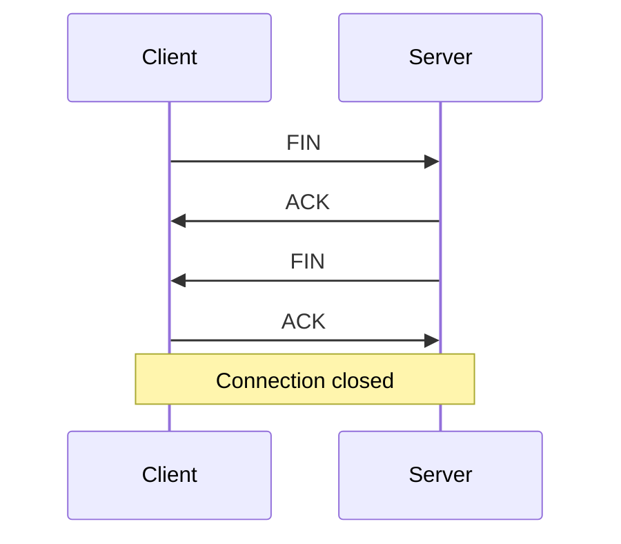
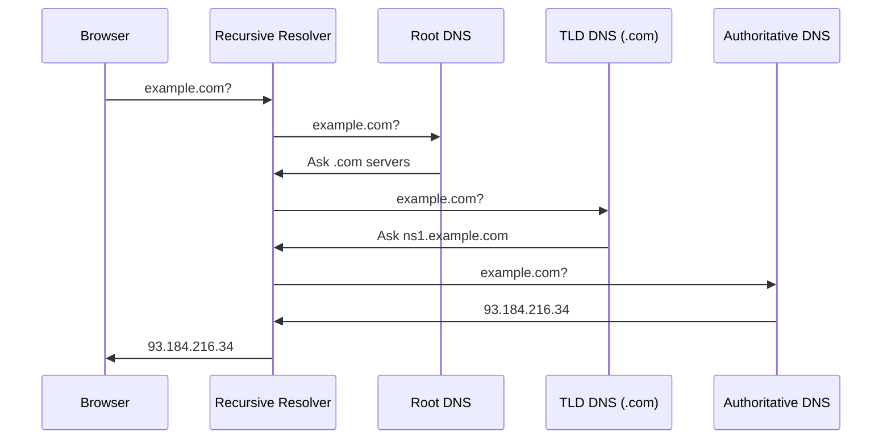
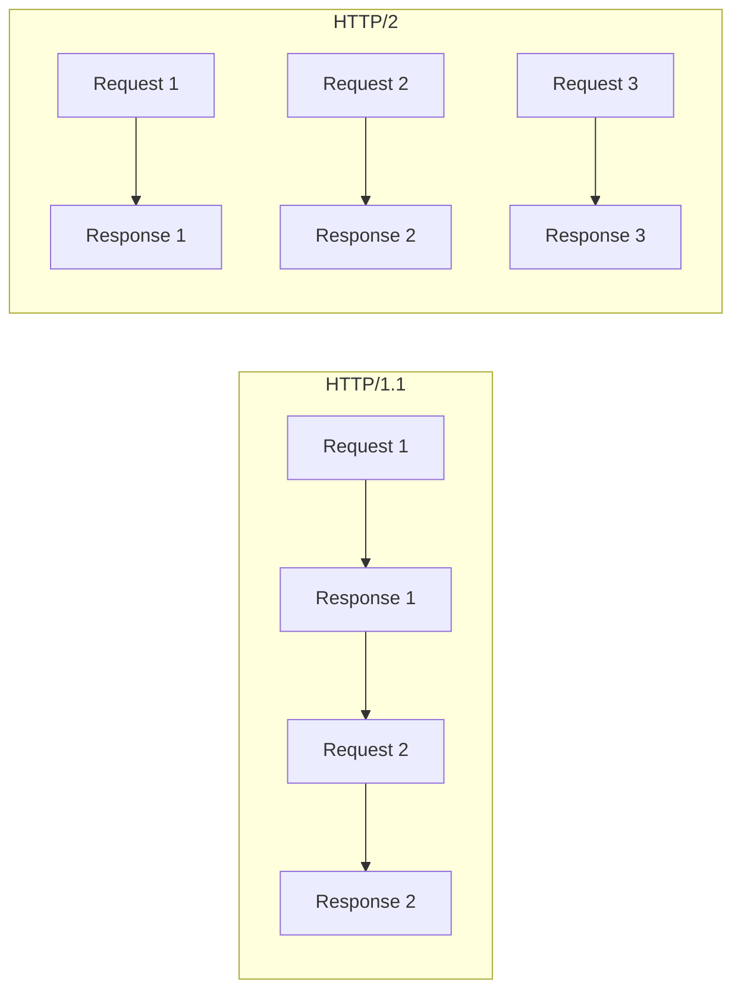
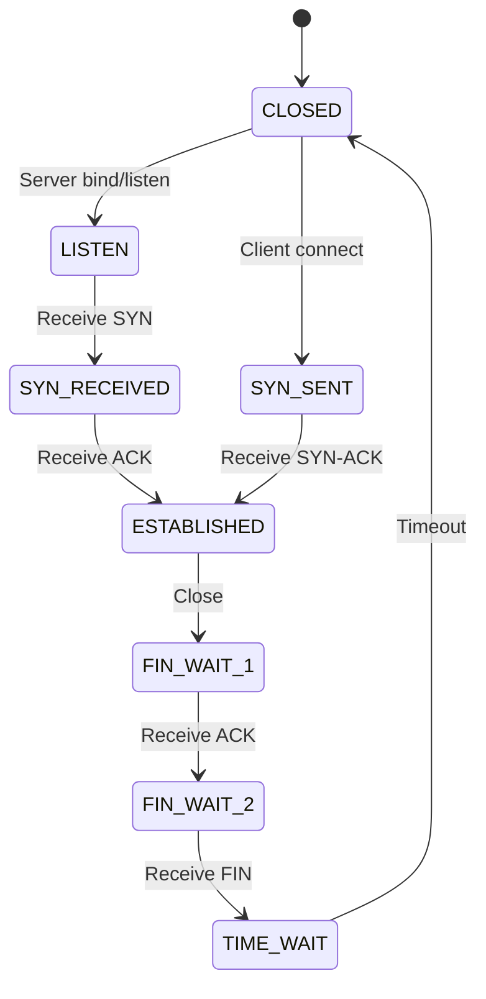
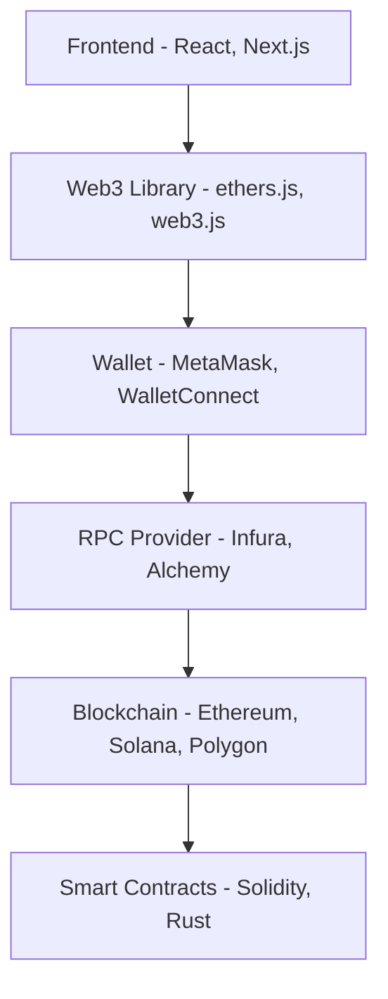

# Networking Fundamentals

Core concepts of computer networking: how data moves between machines across the internet.

## OSI Model

The 7-layer reference model for understanding network communication.

| Layer | Name | Purpose | Protocols/Examples |
|-------|------|---------|-------------------|
| 7 | Application | User-facing protocols | HTTP, FTP, SMTP, DNS |
| 6 | Presentation | Data formatting, encryption | SSL/TLS, JPEG, JSON |
| 5 | Session | Connection management | NetBIOS, RPC |
| 4 | Transport | Reliable delivery | TCP, UDP |
| 3 | Network | Routing between networks | IP, ICMP, OSPF |
| 2 | Data Link | Local network delivery | Ethernet, Wi-Fi, MAC |
| 1 | Physical | Raw bit transmission | Cables, radio waves |

**Memory trick:** "Please Do Not Throw Sausage Pizza Away" (Physical → Application)

---

## TCP/IP Model

The practical 4-layer model that the internet actually uses.

| TCP/IP Layer | OSI Equivalent | Function |
|--------------|----------------|----------|
| Application | 5, 6, 7 | HTTP, DNS, FTP |
| Transport | 4 | TCP, UDP |
| Internet | 3 | IP, ICMP |
| Link | 1, 2 | Ethernet, Wi-Fi |

**Why two models?** OSI is theoretical/educational. TCP/IP is what's implemented.

---

## TCP vs UDP

| Aspect | TCP | UDP |
|--------|-----|-----|
| Connection | Connection-oriented (handshake) | Connectionless |
| Reliability | Guaranteed delivery, ordering | Best effort, no guarantees |
| Speed | Slower (overhead) | Faster (minimal overhead) |
| Flow control | Yes (congestion control) | No |
| Use cases | HTTP, email, file transfer | Video streaming, gaming, DNS |

### TCP Three-Way Handshake

### TCP Connection Termination

### When to Use Each

| Use TCP | Use UDP |
|---------|---------|
| Data integrity matters | Speed matters more |
| Order matters | Loss is acceptable |
| Web traffic, APIs | Live video/audio |
| File transfers | Online gaming |
| Email | DNS queries |

---

## IP Addressing

### IPv4

- 32-bit address: `192.168.1.1`
- ~4.3 billion addresses (exhausted)
- Private ranges: `10.x.x.x`, `172.16-31.x.x`, `192.168.x.x`

### IPv6

- 128-bit address: `2001:0db8:85a3:0000:0000:8a2e:0370:7334`
- 340 undecillion addresses
- Built-in security (IPsec)

### CIDR Notation

`192.168.1.0/24` = First 24 bits are network, last 8 are host

| CIDR | Subnet Mask | Hosts |
|------|-------------|-------|
| /8 | 255.0.0.0 | 16.7M |
| /16 | 255.255.0.0 | 65,534 |
| /24 | 255.255.255.0 | 254 |
| /32 | 255.255.255.255 | 1 |

### NAT (Network Address Translation)

Maps private IPs to public IPs. How your home network shares one public IP.

---

## DNS (Domain Name System)

Translates domain names to IP addresses.

### Resolution Process

### Record Types

| Type | Purpose | Example |
|------|---------|---------|
| A | IPv4 address | `example.com → 93.184.216.34` |
| AAAA | IPv6 address | `example.com → 2606:2800:...` |
| CNAME | Alias to another domain | `www → example.com` |
| MX | Mail server | `mail.example.com` |
| TXT | Arbitrary text | SPF, DKIM, domain verification |
| NS | Name server | `ns1.example.com` |

### TTL (Time To Live)

How long DNS responses are cached. Lower = faster updates, more queries.

---

## HTTP Evolution

### HTTP/1.0 vs 1.1 vs 2 vs 3

| Feature | HTTP/1.0 | HTTP/1.1 | HTTP/2 | HTTP/3 |
|---------|----------|----------|--------|--------|
| Year | 1996 | 1997 | 2015 | 2022 |
| Connections | New per request | Keep-alive | Multiplexed | Multiplexed |
| Head-of-line blocking | Yes | Yes | At TCP level | No |
| Header compression | No | No | HPACK | QPACK |
| Server push | No | No | Yes | Yes |
| Transport | TCP | TCP | TCP | QUIC (UDP) |
| TLS | Optional | Optional | Effectively required | Required |

### HTTP/1.1

- **Keep-alive:** Reuse TCP connections
- **Pipelining:** Send multiple requests without waiting (rarely used)
- **Host header:** Multiple domains per IP
- **Problem:** Head-of-line blocking—one slow response blocks all

### HTTP/2

- **Binary protocol:** More efficient parsing
- **Multiplexing:** Multiple streams over one connection
- **Header compression:** HPACK reduces overhead
- **Server push:** Send resources before client asks
- **Stream prioritization:** Important resources first

### HTTP/3

- **QUIC:** UDP-based transport (developed by Google)
- **No TCP head-of-line blocking:** Lost packets don't block other streams
- **Faster connections:** 0-RTT resumption
- **Built-in TLS 1.3:** Always encrypted
- **Connection migration:** Survives network changes (mobile)

---

## Sockets

Programming interface for network communication.

### Socket Lifecycle (TCP)

### Common Operations

| Operation | Description |
|-----------|-------------|
| `socket()` | Create socket |
| `bind()` | Assign address |
| `listen()` | Mark as passive (server) |
| `accept()` | Accept connection |
| `connect()` | Initiate connection (client) |
| `send()`/`recv()` | Transfer data |
| `close()` | Terminate |

---

## Load Balancing

Distributing traffic across multiple servers.

### L4 vs L7

| Layer 4 (Transport) | Layer 7 (Application) |
|---------------------|----------------------|
| Balances TCP/UDP connections | Balances HTTP requests |
| Faster, less overhead | Content-aware routing |
| No SSL termination | SSL termination |
| Can't route by URL/header | Route by path, header, cookie |

### Algorithms

| Algorithm | Description | Use Case |
|-----------|-------------|----------|
| Round Robin | Rotate through servers | Equal capacity servers |
| Weighted Round Robin | Servers get proportional traffic | Mixed capacity |
| Least Connections | Route to least busy | Variable request duration |
| IP Hash | Same client → same server | Session affinity |
| Consistent Hashing | Minimal redistribution on change | Caching layers |

---

## Proxies & CDNs

### Forward Proxy

Client → **Proxy** → Server

- Hides client identity
- Caching, filtering
- Corporate networks, VPNs

### Reverse Proxy

Client → **Proxy** → Server(s)

- Hides server identity
- Load balancing, SSL termination
- Nginx, HAProxy, Cloudflare

### CDN (Content Delivery Network)

Globally distributed reverse proxies caching static content.

**Benefits:**

- Reduced latency (geographic proximity)
- DDoS protection
- Reduced origin load
- Edge computing

---

## Web3

The decentralized web built on blockchain technology.

### Web Evolution

| Generation | Era | Characteristics |
|------------|-----|-----------------|
| Web1 | 1990s-2000s | Read-only, static pages, portals |
| Web2 | 2000s-present | Read-write, social, platforms own data |
| Web3 | 2020s+ | Read-write-own, decentralized, user-owned data |

### Core Concepts

| Concept | Description |
|---------|-------------|
| **Blockchain** | Distributed ledger, immutable transaction history |
| **Smart Contracts** | Self-executing code on blockchain (Ethereum, Solana) |
| **dApps** | Decentralized apps with blockchain backend |
| **Wallet** | Identity and asset management (MetaMask, etc.) |
| **Token** | Digital asset (fungible: ERC-20, non-fungible: ERC-721/NFT) |
| **DeFi** | Decentralized finance (lending, exchanges without intermediaries) |
| **DAO** | Decentralized Autonomous Organization (code-governed entities) |

### Web3 Stack

### Trade-offs

| Aspect | Web2 | Web3 |
|--------|------|------|
| Speed | Fast (centralized) | Slower (consensus required) |
| Cost | Free/cheap | Transaction fees (gas) |
| UX | Familiar | Wallet complexity |
| Data ownership | Platform owns | User owns |
| Censorship | Can be censored | Censorship resistant |
| Recovery | Password reset | Lost keys = lost access |

### When to Consider Web3

| Good Fit | Poor Fit |
|----------|----------|
| Trustless transactions | Speed-critical apps |
| Censorship resistance needed | Complex queries |
| User data ownership | Low-value transactions |
| Transparent governance | Frequent updates |
| Digital scarcity/ownership | Privacy-sensitive data |

---

## Common Ports

| Port | Protocol | Service |
|------|----------|---------|
| 20, 21 | TCP | FTP |
| 22 | TCP | SSH |
| 23 | TCP | Telnet |
| 25 | TCP | SMTP |
| 53 | TCP/UDP | DNS |
| 80 | TCP | HTTP |
| 443 | TCP | HTTPS |
| 3306 | TCP | MySQL |
| 5432 | TCP | PostgreSQL |
| 6379 | TCP | Redis |
| 8080 | TCP | HTTP (alt) |

---

## Latency Reference

| Action | Time |
|--------|------|
| L1 cache | 1 ns |
| L2 cache | 4 ns |
| RAM | 100 ns |
| SSD read | 100 μs |
| HDD seek | 10 ms |
| Same datacenter | 0.5 ms |
| Same region | 1-5 ms |
| Cross-continent | 50-150 ms |
| Satellite | 500+ ms |

**Rule of thumb:** Light travels ~100km per ms. Geography matters.

---

## Related

- [[HTTP Clients]]
- [[API Design Patterns]]
- [[Security Concepts]]
- [[Distributed Systems]]
- [[System Design]]
