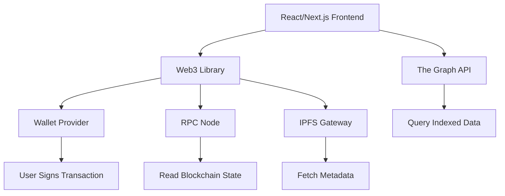

# Web3 Development

Building decentralized applications (dApps) that interact with blockchain networks through browser wallets and web3 libraries.

## Overview

| Aspect | Details |
|--------|---------|
| **Purpose** | Frontend applications interacting with smart contracts and blockchain data |
| **Key Components** | Wallet integration, contract interaction, IPFS storage, blockchain indexing |
| **Primary Networks** | Ethereum, Polygon, BSC, Arbitrum, Optimism, Base |
| **Languages** | JavaScript, TypeScript (client-side) |
| **Core Libraries** | ethers.js, viem, web3.js, wagmi, RainbowKit |
| **Infrastructure** | RPC nodes (Infura, Alchemy, QuickNode), IPFS, The Graph |

## Core Concepts

**Web3 Provider**
A connection to an Ethereum node enabling read/write operations. Provided by wallet extensions (MetaMask) or RPC services (Alchemy).

**Wallet Connection**
User authentication via cryptographic wallet (MetaMask, WalletConnect). Users sign messages to prove ownership without passwords.

**Contract ABI**
Application Binary Interface - JSON describing contract functions and events. Required to encode function calls and decode responses.

**Gas & Transactions**
Users pay gas fees in native tokens (ETH, MATIC) to execute state-changing operations. Developers estimate gas, users approve via wallet.

**Events & Logs**
Smart contracts emit events for state changes. dApps listen to events for real-time updates without polling.

**RPC Nodes**
Blockchain infrastructure providers offering HTTP/WebSocket access to read state and broadcast transactions.

## Wallet Integration

### Popular Wallets

| Wallet | Type | Networks | Features |
|--------|------|----------|----------|
| **MetaMask** | Browser extension | EVM chains | Most popular, desktop + mobile |
| **WalletConnect** | Protocol | Multi-chain | QR code pairing, mobile wallets |
| **Coinbase Wallet** | Browser + mobile | EVM chains | Easy onboarding, built-in dApp browser |
| **Rainbow** | Mobile-first | Ethereum, L2s | Beautiful UX, WalletConnect support |
| **Rabby** | Browser extension | EVM chains | Multi-chain, security features |

### Connection Flow

1. **Detect Provider** - Check for `window.ethereum` (injected by wallet extension)
2. **Request Accounts** - Call `eth_requestAccounts` to trigger wallet connection prompt
3. **Check Network** - Verify user is on correct chain, prompt switch if needed
4. **Listen for Changes** - Handle account/network changes via events
5. **Sign Messages/Transactions** - Request signatures from user's wallet

### Connection Patterns

**Modern (wagmi + RainbowKit):**
- Handles multi-wallet support automatically
- Built-in UI for wallet selection
- Account and network management
- React hooks for wallet state

**Direct (ethers.js/viem):**
- Manual wallet detection and connection
- Custom UI required
- More control, more code

## Web3 Libraries Comparison

| Library | Size | API Style | TypeScript | Chain Support | Active |
|---------|------|-----------|------------|---------------|--------|
| **viem** | ~40KB | Functional, tree-shakable | ✅ Native | EVM chains | ✅ 2023+ |
| **ethers.js v6** | ~120KB | Class-based | ✅ Built-in | EVM chains | ✅ 2022+ |
| **web3.js** | ~200KB | Callback/Promise | ⚠️ Added | EVM chains | ✅ Legacy |

### Detailed Comparison

**viem** (Modern, Recommended)

| Aspect | Details |
|--------|---------|
| **Philosophy** | Lightweight, modular, TypeScript-native |
| **Strengths** | Tree-shakable, excellent DX, fast, type-safe |
| **API Design** | Functional (no classes), composable utilities |
| **Performance** | 2-6x faster than ethers.js in benchmarks |
| **Use Cases** | New projects, performance-critical apps |
| **Learning Curve** | Steeper initially, better long-term DX |

**ethers.js** (Established Standard)

| Aspect | Details |
|--------|---------|
| **Philosophy** | Complete, developer-friendly, well-documented |
| **Strengths** | Mature ecosystem, extensive docs, familiar API |
| **API Design** | Class-based (Provider, Signer, Contract) |
| **Adoption** | Most tutorials and examples use ethers.js |
| **Use Cases** | Production apps, teams wanting stability |
| **Learning Curve** | Gentle, lots of resources available |

**web3.js** (Legacy)

| Aspect | Details |
|--------|---------|
| **Philosophy** | Original web3 library, mimics Web3.py |
| **Strengths** | Long history, comprehensive features |
| **Weaknesses** | Large bundle, older API patterns, slower updates |
| **Use Cases** | Legacy codebases, Web3.py familiarity |
| **Status** | Still maintained but ethers/viem preferred |

### Code Style Comparison

**Reading Contract (Count Value)**

```typescript
// viem
import { createPublicClient, http } from 'viem';
import { mainnet } from 'viem/chains';

const client = createPublicClient({
  chain: mainnet,
  transport: http('https://eth.llamarpc.com'),
});

const count = await client.readContract({
  address: '0x...',
  abi: counterABI,
  functionName: 'count',
});

// ethers.js
import { ethers } from 'ethers';

const provider = new ethers.JsonRpcProvider('https://eth.llamarpc.com');
const contract = new ethers.Contract('0x...', counterABI, provider);
const count = await contract.count();
```

**Writing Contract (Increment)**

```typescript
// viem
import { createWalletClient, custom } from 'viem';

const walletClient = createWalletClient({
  chain: mainnet,
  transport: custom(window.ethereum),
});

const hash = await walletClient.writeContract({
  address: '0x...',
  abi: counterABI,
  functionName: 'increment',
  account: address,
});

// ethers.js
const provider = new ethers.BrowserProvider(window.ethereum);
const signer = await provider.getSigner();
const contract = new ethers.Contract('0x...', counterABI, signer);
const tx = await contract.increment();
await tx.wait();
```

## dApp Architecture Patterns

### Client-Side Architecture



### Data Layer Strategies

**Direct RPC (Simple Apps)**
- Read contract state directly via web3 library
- Listen to events for real-time updates
- Good for: Simple contracts, low data requirements
- Limitations: Slow queries, no historical data aggregation

**The Graph (Complex Queries)**
- Indexer that creates GraphQL API from blockchain events
- Define subgraph schema mapping events to entities
- Good for: NFT marketplaces, DeFi dashboards, analytics
- Limitations: Indexing delay, subgraph development overhead

**Centralized API + Verification (Hybrid)**
- Backend indexes blockchain data into database
- Frontend verifies critical data on-chain
- Good for: Fast UX with trust verification
- Limitations: Requires backend infrastructure

### State Management

**On-Chain State (Source of Truth)**
- Token balances, NFT ownership, contract configuration
- Read via RPC, updated via transactions
- Always verify critical data on-chain

**Off-Chain State (Performance)**
- UI preferences, cached data, draft transactions
- Use React state, Zustand, or Jotai
- Sync with on-chain state after confirmations

**Hybrid Pattern**
- Optimistic updates in UI (instant feedback)
- Transaction pending state (wallet confirms)
- Block confirmation (finalized state)
- Revert UI if transaction fails

## IPFS Integration

**InterPlanetary File System** - Decentralized storage for NFT metadata, dApp assets, and user content.

| Aspect | Details |
|--------|---------|
| **Use Cases** | NFT images/metadata, dApp frontends, user uploads |
| **Addressing** | Content-addressed (hash-based), immutable by default |
| **Access** | Public gateways (ipfs.io, Cloudflare) or dedicated nodes |
| **Services** | Pinata, NFT.Storage, Web3.Storage (managed pinning) |

**Common Patterns:**
- Store metadata JSON on IPFS, reference by hash in smart contract
- Use `ipfs://` URIs in contracts, resolve via gateway in frontend
- Pin important content to prevent garbage collection
- Consider Filecoin for long-term storage guarantees

## The Graph Protocol

Indexing protocol that transforms blockchain events into queryable GraphQL APIs.

### Subgraph Components

**Schema (GraphQL)**
```graphql
type Token @entity {
  id: ID!
  tokenId: BigInt!
  owner: Bytes!
  uri: String!
  transfers: [Transfer!]! @derivedFrom(field: "token")
}

type Transfer @entity {
  id: ID!
  token: Token!
  from: Bytes!
  to: Bytes!
  timestamp: BigInt!
}
```

**Mapping (Event Handlers)**
- AssemblyScript functions triggered by contract events
- Create/update entities in graph database
- Handle Transfer, Mint, Burn events

**Query (Frontend)**
```graphql
query NFTsByOwner($owner: Bytes!) {
  tokens(where: { owner: $owner }, orderBy: tokenId) {
    id
    tokenId
    uri
    transfers(orderBy: timestamp, orderDirection: desc, first: 1) {
      timestamp
    }
  }
}
```

**When to Use The Graph:**
- ✅ Complex queries (filters, sorting, aggregations)
- ✅ Historical data and time-series analytics
- ✅ Multi-contract data joins
- ❌ Real-time updates (slight indexing delay)
- ❌ Simple single-contract reads (use RPC)

## Common dApp Features

### Reading Blockchain State

**Token Balances**
- ERC-20: `balanceOf(address)` - Returns wei/smallest unit
- ERC-721: `balanceOf(address)` - Returns NFT count
- ERC-1155: `balanceOf(address, tokenId)` - Returns amount of specific token

**Contract Configuration**
- Read public state variables (name, symbol, totalSupply)
- Call view/pure functions (no gas cost)
- Batch reads with multicall for efficiency

**Block Data**
- Current block number, timestamp, gas price
- Used for deadlines, auctions, time-based logic

### Writing Transactions

**Transaction Lifecycle**

1. **Prepare** - Encode function call with parameters
2. **Estimate Gas** - Predict gas needed, add buffer
3. **Request Signature** - User approves in wallet
4. **Broadcast** - Send signed transaction to network
5. **Wait for Receipt** - Monitor transaction status
6. **Handle Result** - Update UI, show confirmation

**Gas Optimization**
- Use `eth_estimateGas` for accurate estimates
- Add 10-20% buffer for safety
- Consider EIP-1559 (base fee + priority fee)
- Allow users to customize gas settings

### Event Listening

**Real-Time Updates**

```typescript
// Watch for Transfer events
const unwatch = publicClient.watchContractEvent({
  address: '0x...',
  abi: erc721ABI,
  eventName: 'Transfer',
  args: { to: userAddress },
  onLogs: (logs) => {
    // Update UI with new NFT
    logs.forEach((log) => {
      console.log(`Received token ${log.args.tokenId}`);
    });
  },
});
```

**Historical Events**
- Query past events with filters (block range, indexed parameters)
- Reconstruct state from event history
- Use for activity feeds, provenance tracking

## NFT Development

### Standards

| Standard | Type | Features |
|----------|------|----------|
| **ERC-721** | Non-fungible | Unique tokens, one per ID |
| **ERC-1155** | Multi-token | Batch transfers, fungible + non-fungible |

### Metadata Pattern

**On-Chain Reference (Contract)**
```solidity
function tokenURI(uint256 tokenId) public view returns (string) {
    return string(abi.encodePacked("ipfs://", _baseURI, "/", tokenId, ".json"));
}
```

**Off-Chain Metadata (IPFS)**
```json
{
  "name": "Cool NFT #123",
  "description": "A very cool NFT",
  "image": "ipfs://QmX.../image.png",
  "attributes": [
    { "trait_type": "Background", "value": "Blue" },
    { "trait_type": "Rarity", "value": "Legendary" }
  ]
}
```

**Frontend Loading**
1. Read `tokenURI(tokenId)` from contract
2. Resolve IPFS URI via gateway
3. Fetch and parse JSON metadata
4. Display image and attributes

### Collection Features

- **Enumeration** - `tokenOfOwnerByIndex` to list user's NFTs
- **Royalties** - EIP-2981 standard for marketplace royalties
- **Opensea Compatibility** - Follow metadata standards for proper display
- **Reveal Mechanics** - Update baseURI after mint for surprise reveals

## DeFi Basics

### Token Approvals

Before interacting with DeFi protocols, users must approve token spending.

**Two-Transaction Pattern:**
1. `approve(spenderAddress, amount)` - Grant allowance
2. `protocol.deposit(amount)` - Protocol transfers approved tokens

**Infinite Approvals** - Common UX pattern, security tradeoff
- Approve `type(uint256).max` to avoid repeated approvals
- Convenient but risky if protocol has vulnerabilities
- Consider limited approvals for security-conscious users

### Common Interactions

**DEX Swaps**
- Approve token A, call swap function, receive token B
- Handle slippage tolerance (max acceptable price change)
- Display price impact before execution

**Lending Protocols**
- Deposit collateral, borrow assets, repay loans
- Monitor health factor (collateral ratio)
- Handle liquidation warnings

**Staking**
- Stake tokens, earn rewards, claim/compound, unstake
- Track APY/APR, staking duration, lock periods

**Liquidity Provision**
- Add paired tokens to pools, receive LP tokens
- Calculate impermanent loss risk
- Track fees earned and pool composition

## Security Considerations

### Smart Contract Risks

- **Audit Reports** - Check if contract is audited by reputable firms
- **Open Source** - Verify contract code on Etherscan
- **Time Locks** - Admin functions should have time delays
- **Proxy Patterns** - Understand upgrade mechanisms and risks

### Frontend Security

- **RPC Reliability** - Use multiple fallback providers
- **Transaction Simulation** - Show users what transaction will do
- **Phishing Protection** - Verify contract addresses, warn on unknown contracts
- **Signing Safety** - Never sign arbitrary data, explain what user is signing

### User Protection

- **Gas Estimation** - Prevent failed transactions wasting gas
- **Slippage Limits** - Protect against MEV/sandwich attacks
- **Network Warnings** - Confirm user is on correct chain
- **Error Handling** - Show clear error messages for transaction failures

## Library Decision Guide

| Scenario | Recommendation | Reason |
|----------|---------------|---------|
| **New project (2024+)** | viem + wagmi | Modern, performant, best TypeScript DX |
| **Learning web3** | ethers.js | Better docs, more tutorials, gentler learning curve |
| **Bundle size critical** | viem | Smallest size, tree-shakable |
| **Large existing codebase** | ethers.js | Stability, proven at scale, extensive ecosystem |
| **Multi-chain app** | viem + wagmi | Excellent chain configuration, account abstraction ready |
| **Backend/Node.js** | ethers.js or viem | Both work well, viem slightly faster |
| **Migrating from web3.js** | ethers.js | Easier migration path, similar patterns |

## Framework Integration

### Next.js + wagmi + RainbowKit (Recommended)

**Strengths:**
- Complete wallet management out of the box
- Server-side rendering support
- Built-in hooks for contracts, balances, transactions
- Beautiful wallet connection UI

**Setup:**
1. Wrap app with `WagmiConfig` and `RainbowKitProvider`
2. Configure chains and providers
3. Use hooks: `useAccount`, `useContractRead`, `useContractWrite`

### Vanilla React + viem

**Strengths:**
- Minimal dependencies, full control
- Custom wallet connection flow
- Flexible state management

**Tradeoffs:**
- More boilerplate code
- Manual multi-wallet support
- Custom UI needed

## Development Tools

| Tool | Purpose | Notes |
|------|---------|-------|
| **Hardhat** | Smart contract development | Local blockchain, testing, deployment scripts |
| **Foundry** | Contract development (Rust-based) | Fast tests, gas optimization, fuzzing |
| **Remix** | Browser-based IDE | Quick prototyping, deployment testing |
| **Tenderly** | Transaction debugging | Simulate transactions, debug reverts |
| **Etherscan** | Block explorer | Verify contracts, read state, view transactions |
| **Rainbow** | Wallet testing | Clean UI, good for development |
| **MetaMask Flask** | Experimental features | Test new wallet capabilities |

## Testing Strategies

### Local Development

**Hardhat Network**
- Fork mainnet to test with real contracts
- Fast mining, console.log in Solidity
- Reset state between tests

**Mock Contracts**
- Deploy simplified versions for frontend testing
- Predictable behavior, no gas costs
- Fast iteration without blockchain dependency

### Testnet Deployment

**Popular Testnets:**
- Sepolia (Ethereum) - Stable, well-supported
- Mumbai (Polygon) - Fast, free MATIC from faucets
- Goerli (Deprecated 2024) - Migrate to Sepolia

**Best Practices:**
- Test full user flows before mainnet
- Get testnet tokens from faucets
- Verify contracts on testnet explorers
- Share testnet dApp with beta users

## Performance Optimization

### RPC Optimization

- **Batching** - Combine multiple reads into single request
- **Multicall** - Read multiple contracts in one call
- **Caching** - Cache immutable data (token metadata, ABIs)
- **Fallbacks** - Multiple RPC providers for reliability

### UI Performance

- **Lazy Loading** - Load wallet connection code on demand
- **Code Splitting** - Separate web3 libraries from main bundle
- **Optimistic Updates** - Update UI immediately, confirm on-chain later
- **Pagination** - Load NFTs/transactions in chunks

## Related

- [[Smart Contracts]] - Solidity development and patterns
- [[Blockchain Fundamentals]] - Consensus, blocks, transactions
- [[Ethereum]] - Network architecture and EVM
- [[IPFS]] - Decentralized storage protocol
- [[TypeScript]] - Primary language for web3 frontends
