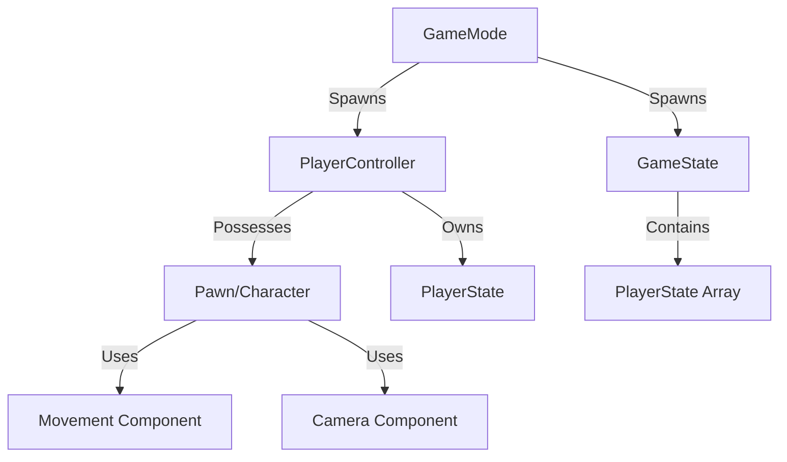

# Unreal Engine

A powerful, production-ready game engine and real-time 3D creation platform emphasizing AAA-quality graphics and visual fidelity.

## Overview

| Aspect | Details |
|--------|---------|
| **Type** | Game Engine & Real-time 3D Platform |
| **Primary Language** | C++ |
| **Scripting** | Blueprint Visual Scripting |
| **Platforms** | Windows, macOS, Linux, iOS, Android, PlayStation, Xbox, Nintendo Switch |
| **Renderer** | Nanite virtualized geometry, Lumen global illumination |
| **Physics** | Chaos Physics Engine |
| **License** | Free + 5% royalty on gross revenue after $1M USD |
| **Backing** | Epic Games |
| **First Release** | 1998 (UE1), 2022 (UE5) |
| **Best For** | AAA games, photorealistic graphics, film/TV production, architectural visualization |

## Core Programming Models

### Blueprints vs C++

| Aspect | Blueprints | C++ |
|--------|-----------|-----|
| **Learning Curve** | Gentle, visual | Steep, requires C++ knowledge |
| **Performance** | Good for most gameplay logic | Maximum performance |
| **Iteration Speed** | Fast, hot-reload friendly | Slower compilation times |
| **Debugging** | Visual debugger, breakpoints | Full IDE debugging support |
| **Code Reuse** | Blueprint function libraries | Templates, inheritance, full C++ |
| **Team Collaboration** | Designer-friendly | Programmer-focused |
| **Best For** | Rapid prototyping, gameplay logic, UI | Performance-critical code, core systems |

**Recommended Approach:** Hybrid model - C++ for core systems and performance-critical code, Blueprints for gameplay logic and rapid iteration. Expose C++ functions to Blueprints using `UFUNCTION(BlueprintCallable)`.

## Rendering System

### Nanite

Virtualized geometry system enabling millions of polygons without performance degradation.

- **Dynamic Level of Detail:** Automatically streams and scales geometry
- **Film-Quality Assets:** Import high-poly models directly from ZBrush/Maya
- **No Polygon Budget:** Traditional LOD authoring largely unnecessary
- **Limitations:** Not compatible with skeletal meshes (characters), translucent materials

### Lumen

Fully dynamic global illumination and reflections system.

- **Real-time GI:** No baked lightmaps required, dynamic time-of-day support
- **Diffuse Interreflection:** Realistic light bouncing between surfaces
- **Reflections:** Screen-space and ray-traced options
- **Performance Scalable:** Works on current-gen consoles and modern PCs
- **Limitations:** Performance cost higher than baked lighting, requires UE5+

### Material System

Node-based material editor with physically-based rendering (PBR).

- **Material Instances:** Fast parameter tweaking without shader recompilation
- **Material Functions:** Reusable node graphs
- **Virtual Texturing:** Stream massive texture sets efficiently
- **Shader Model 6.6:** Advanced rendering features, ray tracing support

## Physics

### Chaos Physics

Unreal's native physics engine (replaced PhysX in UE5).

- **Destruction:** Real-time fracturing and destruction simulation
- **Cloth Simulation:** Character clothing and soft bodies
- **Vehicles:** Advanced vehicle physics with suspension simulation
- **Fields System:** Volume-based forces and constraints
- **Deterministic Mode:** Network-replicated physics for multiplayer

## Animation System

### Core Components

| Component | Purpose |
|-----------|---------|
| **Skeleton** | Bone hierarchy defining character structure |
| **Animation Blueprint** | State machines and blend logic for runtime animation |
| **Control Rig** | Procedural animation and runtime IK |
| **Sequencer** | Cinematic animation and cutscene authoring |
| **Motion Matching** | Data-driven animation selection (UE5.4+) |

### Key Features

- **Animation Montages:** Play one-off animations (attacks, reactions)
- **Blend Spaces:** Interpolate between animations based on parameters
- **Animation Layers:** Additive animations, layered body part control
- **IK (Inverse Kinematics):** Procedural foot placement, look-at targeting
- **Animation Retargeting:** Share animations across different skeletons

## VFX System

### Niagara

Modern particle and VFX system replacing Cascade.

- **GPU Simulation:** Millions of particles with compute shaders
- **Data-Driven:** Spreadsheet-like parameter control
- **Modules & Emitters:** Reusable, composable effect building blocks
- **Events:** Inter-particle communication and collision events
- **Scratch Pad:** Custom HLSL code for advanced effects

**Use Cases:** Fire, smoke, weather effects, magic spells, explosions, UI particles

## Audio System

### MetaSounds

Node-based audio synthesis and processing system.

- **Procedural Audio:** Generate sound at runtime
- **DSP Graph:** Visual audio processing pipeline
- **Data-Driven:** Parameter-driven sound design
- **Replaces:** Blueprint Sound Cues for new projects

### Traditional Audio

- **Sound Cues:** Node-based audio mixing and randomization
- **Attenuation:** 3D spatial audio with distance falloff
- **Reverb:** Environmental audio effects
- **Audio Mixer:** Low-latency, high-performance mixing (Unreal Audio Engine)

## Networking

### Replication Model

Actor-based server-authoritative replication.

- **Network Relevancy:** Optimize bandwidth by culling irrelevant actors
- **RPC (Remote Procedure Calls):** Server, Client, Multicast function calls
- **Property Replication:** Automatic synchronization of marked variables (`UPROPERTY(Replicated)`)
- **Prediction:** Client-side prediction for smooth movement

### Networking Modes

| Mode | Description | Use Case |
|------|-------------|----------|
| **Listen Server** | Player hosts, acts as server | Peer-to-peer, small games |
| **Dedicated Server** | Standalone server, no local player | Competitive multiplayer |
| **Client** | Connects to server | All multiplayer clients |
| **Standalone** | Single-player, no networking | Offline games |

## Project Structure

### Directory Layout

```
MyProject/
├── Config/               # INI configuration files
│   ├── DefaultEngine.ini
│   └── DefaultGame.ini
├── Content/              # All game assets (uasset files)
│   ├── Blueprints/
│   ├── Maps/
│   ├── Materials/
│   └── Meshes/
├── Source/               # C++ source code
│   ├── MyProject/
│   │   ├── Public/
│   │   └── Private/
│   └── MyProject.Target.cs
├── Plugins/              # Third-party and custom plugins
├── Saved/                # Logs, autosaves, config overrides
└── MyProject.uproject    # Project descriptor
```

### Asset Types

| Extension | Type | Description |
|-----------|------|-------------|
| `.uasset` | Asset | Blueprint, material, texture, mesh, etc. |
| `.umap` | Map | Level/scene file |
| `.cpp/.h` | C++ | Source code |

## Gameplay Framework

### Core Classes



### Class Responsibilities

| Class | Purpose | Authority |
|-------|---------|-----------|
| **GameMode** | Defines game rules, spawn logic, win conditions | Server Only |
| **GameState** | Replicated game state (score, time remaining) | Server → All Clients |
| **PlayerController** | Player input handling, UI management | Client + Server |
| **PlayerState** | Player-specific data (name, score, ping) | Server → All Clients |
| **Pawn** | Physical representation in world, can be possessed | Server → All Clients |
| **Character** | Pawn with built-in movement, collision | Server → All Clients |
| **HUD** | 2D UI rendering, legacy UI system | Client Only |

### Modern UI: UMG (Unreal Motion Graphics)

Widget-based UI system with visual designer.

- **Widget Blueprints:** Visual UI authoring
- **Animations:** Built-in timeline-based UI animations
- **Data Binding:** Connect UI to gameplay variables
- **3D Widgets:** Render UI in world space (diegetic UI)

## Asset Pipeline

### Import Formats

| Asset Type | Supported Formats |
|------------|-------------------|
| **3D Models** | FBX, OBJ, USD, glTF, Alembic |
| **Textures** | PNG, JPG, TGA, PSD, EXR, HDR |
| **Audio** | WAV, MP3, OGG, FLAC |
| **Animation** | FBX (skeletal), Alembic (geometry cache) |

### Asset Workflow

1. **Import:** Drag-and-drop or import dialog with options
2. **Process:** Automatic generation of thumbnails, LODs (optional)
3. **Edit:** In-engine editors (material editor, blueprint editor, etc.)
4. **Reference:** Assets reference each other, no file path strings
5. **Cook:** Packaging process converts assets to platform-specific formats

### Content Browser

Centralized asset management interface.

- **Folders:** Organize assets hierarchically
- **Filters:** Search by type, tag, modification date
- **Collections:** Virtual groupings without moving files
- **Migration:** Copy assets with dependencies to other projects

## Comparison with Unity and Godot

### Feature Matrix

| Feature | Unreal Engine | Unity | Godot |
|---------|---------------|-------|-------|
| **Rendering Quality** | ✅ Industry-leading (Nanite, Lumen) | ✅ Good, customizable | ❌ Basic, improving |
| **Visual Scripting** | ✅ Blueprints (powerful) | ❌ Deprecated (Bolt discontinued) | ✅ VisualScript (simpler) |
| **C++ Support** | ✅ Native, first-class | ❌ Limited, plugins only | ✅ Via GDNative/GDExtension |
| **2D Game Support** | ❌ Minimal, 3D-focused | ✅ Excellent (Unity 2D) | ✅ Best-in-class |
| **Mobile Performance** | ❌ Heavy, high-end devices | ✅ Good optimization | ✅ Excellent, lightweight |
| **Learning Curve** | ❌ Steep, complex | ✅ Moderate | ✅ Gentle |
| **Asset Marketplace** | ✅ Large, high-quality | ✅ Largest | ❌ Smaller, growing |
| **Source Access** | ✅ Full GitHub access | ❌ Partial (C# only) | ✅ Fully open-source |
| **AAA Production** | ✅ Industry standard | ✅ Common | ❌ Rare |
| **Indie-Friendly** | ❌ Resource-heavy, complex | ✅ Very accessible | ✅ Most accessible |
| **Licensing** | 5% royalty after $1M | Free (recent changes) | ✅ MIT license, free |

### Rendering Comparison

| Capability | Unreal Engine | Unity | Godot |
|------------|---------------|-------|-------|
| **PBR Materials** | ✅ Advanced | ✅ Standard | ✅ Basic |
| **Global Illumination** | ✅ Lumen (real-time) | ✅ Baked + limited RT | ✅ Baked only |
| **Ray Tracing** | ✅ Full DXR support | ✅ HDRP only | ❌ Not yet |
| **Virtualized Geometry** | ✅ Nanite | ❌ No | ❌ No |
| **Film Production** | ✅ Widely used (Mandalorian) | ❌ Rarely | ❌ No |

### Scripting Comparison

| Engine | Primary Language | Visual Scripting | Performance | Compile Time |
|--------|-----------------|------------------|-------------|--------------|
| **Unreal** | C++ | Blueprints (excellent) | ✅ Fastest | ❌ Slow (C++) |
| **Unity** | C# | (Deprecated) | ✅ Good (JIT/AOT) | ✅ Fast |
| **Godot** | GDScript | VisualScript (basic) | ❌ Slower | ✅ Instant |

## When to Use Unreal Engine

### Strengths

| Area | Benefit |
|------|---------|
| **Visual Fidelity** | Best-in-class graphics, photorealistic rendering out-of-box |
| **AAA Production** | Battle-tested in major titles, complete production pipeline |
| **Blueprint Prototyping** | Rapid iteration without compilation, designer empowerment |
| **Full Source Access** | Modify engine code, deep customization, no black boxes |
| **Film/Broadcast** | Virtual production, real-time cinematics (nDisplay, Live Link) |
| **Marketplace** | High-quality assets, many free monthly content |
| **Large Worlds** | World Partition, streaming, massive open-world support |

### Considerations

| Area | Limitation |
|------|------------|
| **Complexity** | Steep learning curve, overwhelming for beginners |
| **Hardware Requirements** | Editor demands high-end PC, large disk space (100GB+) |
| **Compilation Time** | C++ builds can take 10+ minutes for large projects |
| **Mobile/2D** | Not optimized for lightweight or 2D-focused games |
| **Royalties** | 5% after $1M revenue (significant for successful indie titles) |
| **Iteration Speed** | Shader compilation, lighting builds can be slow |

### Best For

- **AAA games** requiring cutting-edge graphics
- **Architectural visualization** and real-time rendering
- **Film/TV virtual production** (LED volumes, virtual sets)
- **Realistic simulations** (automotive, aerospace, training)
- **Large-scale multiplayer** games (Fortnite, PUBG)
- **Teams with C++ expertise** wanting maximum control

### Consider Alternatives If

- Building **2D games** or pixel art (use Godot, Unity)
- Need **fast iteration** and lightweight builds (use Unity, Godot)
- Targeting **low-end mobile** devices (use Unity, Godot)
- **Solo developer** with no C++ experience (start with Unity or Godot)
- Want **zero royalties** (use Godot, Unity Personal)
- Rapid prototyping or **game jams** (Godot, Unity faster to get started)

## Related

- [[Game Development MOC]] - Game development overview
- [[Unity]] - Cross-platform game engine alternative
- [[Godot]] - Open-source game engine alternative
- [[C++]] - Primary programming language
- [[Blueprint Visual Scripting]] - Node-based scripting system
