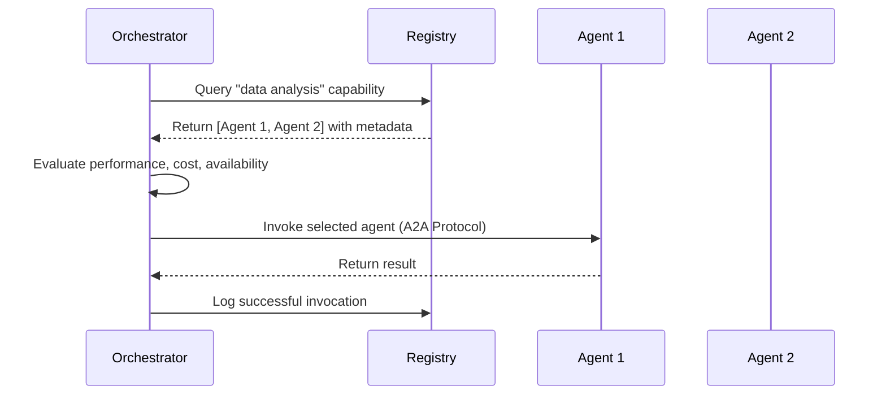

# Agent Registry

A centralized service for discovering, advertising, and managing AI agents in multi-agent systems.

## Overview

| Aspect | Details |
|--------|---------|
| **Purpose** | Enable agent discovery, capability advertisement, and orchestration coordination |
| **Scope** | Agent metadata, service endpoints, capability schemas, health status |
| **Protocols** | A2A Protocol, MCP, REST APIs, gRPC |
| **Key Concepts** | Agent cards, capability advertisement, service discovery, health monitoring |
| **Use Cases** | Multi-agent orchestration, agent marketplaces, enterprise AI platforms |

## Core Concepts

### Agent Cards

Standardized metadata describing an agent's identity, capabilities, and interaction patterns:

- **Identity**: Unique ID, name, version, owner/publisher
- **Capabilities**: Skills, supported protocols, input/output schemas
- **Endpoints**: Service URLs, authentication requirements, rate limits
- **Policies**: Privacy level, data retention, usage restrictions
- **Dependencies**: Required models, external APIs, system requirements

### Service Discovery

Mechanisms for agents and orchestrators to find appropriate agents:

- **Registry queries**: Search by capability, domain, performance characteristics
- **Dynamic registration**: Agents register on startup, deregister on shutdown
- **Health checks**: Periodic status updates, availability monitoring
- **Load balancing**: Route requests to available instances

### Capability Advertisement

Structured representation of what an agent can do:

- **Skill schemas**: JSON Schema or OpenAPI definitions of agent functions
- **Protocol support**: A2A, MCP, custom protocols
- **Performance metrics**: Latency, throughput, accuracy benchmarks
- **Resource requirements**: Compute, memory, API quotas

## Agent Metadata Schema

```yaml
agent:
  id: "agent-uuid-1234"
  name: "DataAnalysisAgent"
  version: "2.1.0"
  publisher: "acme-corp"

  capabilities:
    - skill: "analyze_csv"
      protocol: "a2a"
      input_schema: "https://registry/schemas/csv-analysis-input.json"
      output_schema: "https://registry/schemas/analysis-report.json"
    - skill: "generate_visualization"
      protocol: "mcp"
      tools: ["create_chart", "export_image"]

  endpoints:
    - type: "a2a"
      url: "https://api.acme.com/agents/data-analysis/v2"
      auth: "bearer_token"
      rate_limit: "1000/hour"
    - type: "health"
      url: "https://api.acme.com/agents/data-analysis/health"

  policies:
    privacy_level: "enterprise"
    data_retention_days: 7
    allowed_regions: ["us-east-1", "eu-west-1"]

  dependencies:
    models: ["gpt-4", "claude-3-opus"]
    external_apis: ["pandas", "matplotlib"]
    min_memory_gb: 4
```

## Registry Operations

### Registration

Agents self-register with the registry on startup:

1. **Authenticate**: Verify agent identity and ownership
2. **Validate**: Check schema compliance, capability definitions
3. **Store**: Persist agent card in registry database
4. **Announce**: Notify subscribers of new agent availability

### Discovery

Orchestrators and agents query the registry:

- **Capability search**: "Find agents that can analyze CSV files"
- **Protocol filtering**: "A2A-compatible agents only"
- **Performance criteria**: "Latency < 500ms, accuracy > 95%"
- **Availability check**: "Currently healthy instances"

### Health Monitoring

Registry tracks agent status:

- **Heartbeats**: Agents send periodic status updates
- **Active probing**: Registry polls health endpoints
- **Circuit breakers**: Mark unresponsive agents as unavailable
- **Recovery detection**: Automatic re-enablement on health restoration

## Authentication & Authorization

| Method | Use Case | Security Level |
|--------|----------|----------------|
| **API Keys** | Simple service-to-service | ✅ Basic |
| **OAuth 2.0** | User-delegated agent access | ✅ Standard |
| **mTLS** | Enterprise zero-trust environments | ✅ High |
| **JWT Tokens** | Stateless authentication | ✅ Standard |
| **HMAC Signatures** | Request integrity verification | ✅ High |

### Access Control

- **Agent registration**: Verified publishers only
- **Discovery queries**: Public, authenticated, or role-based
- **Agent invocation**: Capability-specific permissions
- **Admin operations**: Registry management, schema updates

## Versioning Strategies

### Agent Versioning

| Strategy | Example | Breaking Changes | Compatibility |
|----------|---------|------------------|---------------|
| **Semantic** | `2.1.0` → `2.1.1` | Only major bumps | ✅ Standard |
| **Date-based** | `2024-11-30` | Explicit deprecation | ✅ Temporal |
| **Hash-based** | `abc123def` | Immutable | ❌ Complex |

### Schema Evolution

- **Backward compatible**: Add optional fields, deprecate gracefully
- **Breaking changes**: New major version, parallel operation period
- **Deprecation policy**: Announce → warn → disable (90-day cycle)

## Orchestration Patterns

### Registry-Driven Orchestration



### Multi-Agent Workflows

- **Sequential**: Registry provides next agent based on previous output
- **Parallel**: Discover multiple agents, fan-out requests
- **Conditional**: Select agent based on runtime criteria
- **Fallback**: Use registry to find alternative on failure

## Health Monitoring

### Health Check Schema

```json
{
  "agent_id": "agent-uuid-1234",
  "status": "healthy",
  "timestamp": "2025-11-30T12:00:00Z",
  "metrics": {
    "uptime_seconds": 86400,
    "requests_last_hour": 432,
    "avg_latency_ms": 120,
    "error_rate": 0.002
  },
  "dependencies": {
    "model_api": "healthy",
    "database": "healthy",
    "external_service": "degraded"
  }
}
```

### Status Levels

| Status | Meaning | Registry Action |
|--------|---------|-----------------|
| **Healthy** | Operating normally | ✅ Route traffic |
| **Degraded** | Partial functionality | ⚠️ Route with warning |
| **Unhealthy** | Not responding | ❌ Stop routing |
| **Maintenance** | Planned downtime | ⏸️ Temporary removal |

## Comparison with Service Registries

| Aspect | Agent Registry | Service Registry (Consul, Eureka) |
|--------|----------------|-----------------------------------|
| **Purpose** | AI agent discovery | Microservice discovery |
| **Metadata** | Capabilities, models, schemas | Endpoints, health, tags |
| **Protocols** | A2A, MCP, custom AI protocols | HTTP, gRPC, TCP |
| **Discovery** | Capability-based search | Service name lookup |
| **Schema** | Rich capability definitions | Simple key-value tags |
| **Versioning** | Semantic, capability evolution | Service version tags |
| **Authentication** | AI-specific (model access, data policies) | Standard service auth |
| **Use Cases** | Multi-agent orchestration, AI marketplaces | Microservice mesh, load balancing |

### When to Use Agent Registry vs Service Registry

**Use Agent Registry when:**

- Discovering agents by capability, not just endpoint
- Managing AI-specific metadata (models, performance, schemas)
- Orchestrating multi-agent workflows with A2A/MCP protocols
- Building agent marketplaces or enterprise AI platforms

**Use Service Registry when:**

- Traditional microservice discovery (REST/gRPC services)
- Simple health checks and load balancing
- No AI-specific capability advertisement needed
- Existing infrastructure (Kubernetes, service mesh)

## Implementation Patterns

### Centralized Registry

Single authoritative registry for all agents:

**Strengths:**

- Simple to query and manage
- Consistent view across system
- Easy to enforce policies

**Considerations:**

- Single point of failure (mitigate with replication)
- Potential bottleneck at scale
- Network latency for distributed agents

**Best for:** Enterprise platforms, controlled environments, < 10,000 agents

### Federated Registry

Multiple regional or domain-specific registries:

**Strengths:**

- Geographic distribution, lower latency
- Domain isolation (security, compliance)
- Horizontal scalability

**Considerations:**

- Synchronization complexity
- Cross-registry discovery challenges
- Consistent policy enforcement

**Best for:** Global deployments, multi-tenant platforms, regulatory boundaries

### Hybrid Registry

Distributed discovery with central coordination:

**Strengths:**

- Local discovery speed
- Central governance
- Resilience to network partitions

**Considerations:**

- Implementation complexity
- Eventual consistency trade-offs
- Conflict resolution required

**Best for:** Large-scale multi-agent systems, edge deployments

## A2A Protocol Integration

Agent registry serves as the foundation for A2A discovery:

- **Agent manifest**: Registry stores A2A agent manifests
- **Task routing**: Orchestrator queries registry for task-capable agents
- **Protocol negotiation**: Registry advertises supported A2A protocol versions
- **Authentication flow**: Registry coordinates OAuth/API key exchange

## MCP Registry Integration

Registry can manage MCP servers as specialized agents:

- **Tool discovery**: MCP tools advertised as agent capabilities
- **Server metadata**: Connection details, authentication, schemas
- **Resource endpoints**: Files, databases, APIs exposed via MCP
- **Prompt registry**: Reusable prompts as discoverable capabilities

## Security Considerations

| Threat | Mitigation |
|--------|------------|
| **Malicious agent registration** | Publisher verification, code signing |
| **Registry poisoning** | Schema validation, rate limiting, audit logs |
| **Unauthorized discovery** | Access control, encrypted queries |
| **Agent impersonation** | Mutual TLS, token verification |
| **Data exfiltration** | Privacy policies, data retention limits |
| **DDoS on registry** | Rate limiting, caching, CDN |

## Best Practices

1. **Schema validation**: Enforce strict agent card schemas, reject invalid registrations
2. **Health monitoring**: Active probing, not just self-reported status
3. **Graceful degradation**: Cache registry data, allow offline operation
4. **Audit logging**: Track all registry operations for security and debugging
5. **Versioning discipline**: Semantic versioning, deprecation policies
6. **Performance tracking**: Monitor discovery latency, optimize queries
7. **Documentation**: Clear API docs, capability schema examples
8. **Testing**: Chaos engineering, failure injection, load testing

## Related

- [[Agent Frameworks]] - Frameworks that integrate with agent registries
- [[A2A Protocol]] - Protocol for agent-to-agent communication
- [[MCP Registry]] - Model Context Protocol server registry
- [[Multi-Agent Systems]] - Architectures using agent registries
- [[Service Discovery]] - General service registry patterns
- [[API Gateway]] - Complementary pattern for agent access control
