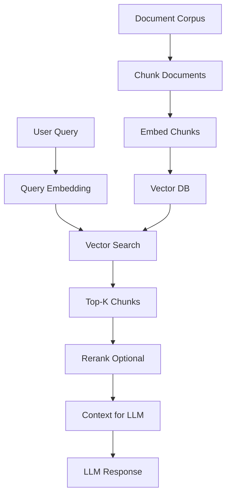

# Embeddings

Dense vector representations that capture semantic meaning of text, images, or other data in continuous space.

## Overview

| Aspect | Details |
|--------|---------|
| **Purpose** | Transform discrete data (text, images) into continuous vectors for ML tasks |
| **Dimensions** | Typically 128-4096 dimensions depending on model and use case |
| **Key Property** | Similar items have similar embeddings (measured by cosine similarity) |
| **Primary Use Cases** | Semantic search, RAG, clustering, classification, recommendation |
| **Storage** | Vector databases (Pinecone, Weaviate, Qdrant) or traditional DB with extensions |

## Core Concepts

### Embedding Space

**Dense Vectors:** Each item represented as array of floating-point numbers capturing semantic features.

**Similarity Metrics:**

- **Cosine Similarity:** Most common, measures angle between vectors (0-1 range)
- **Euclidean Distance:** L2 distance in vector space
- **Dot Product:** Raw similarity score, affected by magnitude

**Dimensionality:** Higher dimensions capture more nuance but increase storage/compute costs.

### Text Embeddings

**Sentence vs Document:**

- **Sentence embeddings:** Single vector per sentence, optimized for short text
- **Document embeddings:** Average/pool multiple sentence vectors, or use specialized models
- **Chunking:** Long documents split into overlapping chunks (typically 256-512 tokens)

**Semantic Properties:**

- Synonyms have similar embeddings
- Context-aware (same word, different meanings = different embeddings)
- Support cross-lingual similarity in multilingual models

### Image Embeddings

**CLIP (Contrastive Language-Image Pre-training):**

- Joint text-image embedding space
- Same vector space for images and descriptions
- Enables image search via text queries

**Vision Transformers:**

- ViT models produce image embeddings
- Used for image classification, similarity, clustering

### Multimodal Embeddings

Models that embed multiple data types into shared space:

- **Text + Images:** CLIP, ALIGN
- **Text + Audio:** CLAP
- **Text + Video:** VideoCLIP

## Text Embedding Models Comparison

| Model | Dimensions | Provider | Speed | Quality | Best For |
|-------|-----------|----------|-------|---------|----------|
| **text-embedding-3-small** | 1536 | OpenAI | Fast | Good | General purpose, cost-sensitive |
| **text-embedding-3-large** | 3072 | OpenAI | Medium | Excellent | High-quality retrieval |
| **embed-english-v3.0** | 1024 | Cohere | Fast | Excellent | English semantic search |
| **embed-multilingual-v3.0** | 1024 | Cohere | Fast | Excellent | Cross-lingual search |
| **voyage-2** | 1024 | Voyage AI | Fast | Excellent | Code + text, customizable |
| **voyage-large-2** | 1536 | Voyage AI | Medium | Excellent | Long context, high quality |
| **bge-large-en-v1.5** | 1024 | BAAI | Fast | Very Good | Open-source, self-hosted |
| **bge-m3** | 1024 | BAAI | Medium | Very Good | Multilingual, hybrid search |
| **e5-mistral-7b-instruct** | 4096 | Microsoft | Slow | Excellent | Highest quality, long context |
| **nomic-embed-text-v1.5** | 768 | Nomic AI | Fast | Good | Fully open, long context (8192) |

## Key Techniques

### Chunking Strategies

**Fixed-Size Chunks:**

- Split documents into equal token/character counts
- Simple but may break semantic units
- Overlap recommended (50-100 tokens)

**Semantic Chunks:**

- Split on paragraph/section boundaries
- Preserve logical units
- Variable size but more coherent

**Recursive Splitting:**

- Try splitting on larger units first (sections)
- Fall back to smaller units (sentences) if too large
- Maintains hierarchy and context

### Fine-Tuning Embeddings

**Domain Adaptation:**

- Fine-tune on domain-specific paired data (question-answer, query-document)
- Improves retrieval for specialized vocabularies (medical, legal, technical)
- Requires training infrastructure

**Approaches:**

- Contrastive learning: Bring similar items closer, push dissimilar apart
- Triplet loss: Anchor, positive, negative examples
- In-batch negatives: Efficient training with large batches

### Retrieval Optimization

**Hybrid Search:**

- Combine vector similarity with keyword search (BM25)
- Handles both semantic and exact matches
- Rerank combined results

**Metadata Filtering:**

- Pre-filter by date, category, source before vector search
- Reduces search space and improves relevance

**Reranking:**

- Initial broad retrieval (top 100)
- Cross-encoder reranking for final top-k
- Significantly improves precision

## Embedding Dimensions

| Use Case | Recommended Dimensions | Rationale |
|----------|----------------------|-----------|
| **Simple FAQ/Search** | 384-768 | Lower latency, sufficient for clear distinctions |
| **General RAG** | 1024-1536 | Balanced quality and performance |
| **High-Quality Retrieval** | 1536-3072 | Nuanced semantic understanding |
| **Long Context/Code** | 3072-4096 | Captures complex structure and dependencies |

**Trade-offs:**

- Higher dimensions = better quality but slower search, more storage
- Can reduce dimensions via PCA/dimensionality reduction post-hoc
- OpenAI allows specifying output dimensions (flexibility)

## When to Use

### Strengths

| Scenario | Why Embeddings Excel |
|----------|---------------------|
| **Semantic Search** | Finds meaning, not just keywords (search "car" finds "automobile") |
| **RAG Systems** | Retrieves relevant context for LLM prompts |
| **Clustering** | Groups similar items without labels |
| **Classification** | Few-shot learning via nearest neighbors |
| **Recommendation** | "Find similar items" without explicit features |
| **Multilingual** | Single model handles multiple languages |

### Considerations

| Challenge | Mitigation |
|-----------|-----------|
| **Cold Start** | Requires good base model or domain data for fine-tuning |
| **Hallucination** | Embeddings retrieve but don't verify - validate critical info |
| **Cost** | API calls add up at scale - consider caching, batching, self-hosting |
| **Latency** | Large vectors = slower search - use approximate nearest neighbor (ANN) |
| **Updates** | Changing embeddings requires re-indexing entire corpus |

### Best For

✅ **Semantic search** where intent matters more than exact keywords
✅ **RAG pipelines** requiring relevant context retrieval
✅ **Content recommendation** based on similarity
✅ **Clustering and classification** with limited labeled data
✅ **Multimodal search** (text-to-image, image-to-text)

❌ **Exact match requirements** - use traditional search
❌ **Real-time updates at massive scale** - indexing overhead
❌ **Highly structured queries** - SQL better for complex joins/filters

## Implementation Patterns

### Basic Embedding Flow

### RAG with Embeddings

## Best Practices

**Chunking:**

- Keep chunks 256-512 tokens for most models
- Use overlap (50-100 tokens) to prevent context loss
- Test different strategies for your domain

**Storage:**

- Use vector databases for >10K vectors (Pinecone, Weaviate, Qdrant)
- Postgres pgvector works for smaller datasets
- Index with HNSW or IVF for fast approximate search

**Quality:**

- Evaluate retrieval with metrics (MRR, NDCG, Recall@K)
- A/B test different models and chunk sizes
- Monitor for drift as content changes

**Cost Optimization:**

- Batch embed requests (up to 100s per call)
- Cache embeddings for static content
- Consider self-hosted models (BGE, E5) for high volume

**Security:**

- Sanitize inputs before embedding (prompt injection)
- Validate retrieved content before passing to LLM
- Monitor for PII leakage in embeddings

## Related

- [[RAG]] - Retrieval-Augmented Generation using embeddings
- [[Vector Databases]] - Storage and retrieval for embeddings
- [[LLMs & Transformers]] - Models that produce and consume embeddings
- [[Semantic Search]] - Primary application of text embeddings
- [[Fine-tuning]] - Adapting embedding models to specific domains
