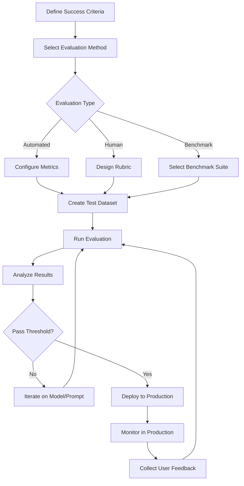

# LLM Evaluation

Systematic assessment of LLM performance across quality, safety, and task-specific metrics using automated frameworks, benchmarks, and human feedback.

## Overview

| Aspect | Details |
|--------|---------|
| **Purpose** | Measure accuracy, relevance, safety, and task performance |
| **Approaches** | Automated metrics, benchmarks, human eval, A/B testing |
| **Key Challenges** | Subjectivity, cost, consistency, prompt sensitivity |
| **Common Metrics** | Faithfulness, relevance, coherence, toxicity, hallucination rate |
| **Benchmark Types** | General knowledge (MMLU), coding (HumanEval), reasoning (GSM8K) |
| **Tools** | RAGAS, LangSmith, Braintrust, OpenAI Evals, Promptfoo |

## Core Evaluation Dimensions

### Quality Metrics

**Faithfulness** - Output accuracy relative to source information (critical for RAG)

- Measures hallucination and grounding
- Checks citation accuracy
- Validates fact consistency

**Relevance** - Answer appropriateness to the query

- Query-response alignment
- Context utilization
- Topic coherence

**Coherence** - Logical flow and readability

- Sentence structure quality
- Argument consistency
- Natural language fluency

**Completeness** - Coverage of required information

- Answer thoroughness
- Missing critical details
- Scope appropriateness

### Safety & Alignment

**Toxicity Detection** - Harmful or offensive content
**Bias Assessment** - Demographic fairness and representation
**PII Leakage** - Unintended personal information disclosure
**Jailbreak Resistance** - Robustness against prompt injection
**Refusal Appropriateness** - Declining harmful requests correctly

## Evaluation Frameworks Comparison

| Framework | Type | Best For | Key Features | Language Support | Pricing |
|-----------|------|----------|--------------|------------------|---------|
| **RAGAS** | Open-source | RAG pipelines | Faithfulness, relevance, context metrics | Python | Free |
| **LangSmith** | Commercial | LangChain apps | Tracing, datasets, human feedback | Python, TS | Paid tiers |
| **Braintrust** | Commercial | Production evals | Regression testing, A/B testing, CI/CD | Python, TS | Paid tiers |
| **OpenAI Evals** | Open-source | OpenAI models | Extensible eval templates, benchmarks | Python | Free |
| **Promptfoo** | Open-source | Prompt testing | CLI-based, model comparison, red-teaming | CLI, SDK | Free |

### Framework Details

**RAGAS** (RAG Assessment)

- Specialized for RAG system evaluation
- Metrics: faithfulness, answer relevance, context precision/recall
- Automated scoring using LLM-as-judge
- Integrates with LangChain and LlamaIndex

**LangSmith**

- End-to-end observability and evaluation
- Dataset management and versioning
- Human annotation workflows
- Production monitoring and debugging

**Braintrust**

- Focus on CI/CD integration for LLM apps
- Regression detection across prompt versions
- Cost and latency tracking
- Collaborative review workflows

**OpenAI Evals**

- Template-based evaluation framework
- Community-contributed eval sets
- Model-graded and rule-based evals
- JSON-based eval definitions

**Promptfoo**

- CLI-first workflow for rapid iteration
- Multi-provider support (OpenAI, Anthropic, local models)
- Automated red-teaming and security testing
- CSV/JSON output for analysis

## Standard Benchmarks

### General Knowledge & Reasoning

**MMLU (Massive Multitask Language Understanding)**

- 57 subjects across STEM, humanities, social sciences
- Multiple-choice format
- Tests breadth of knowledge

**GSM8K (Grade School Math 8K)**

- 8,500 grade school math word problems
- Tests multi-step reasoning
- Chain-of-thought evaluation

**HellaSwag**

- Commonsense reasoning about everyday events
- Sentence completion with context
- Tests physical and social reasoning

### Code & Technical

**HumanEval**

- 164 hand-written programming problems
- Function completion with test cases
- Python-focused, pass@k metric

**MBPP (Mostly Basic Python Problems)**

- 974 entry-level Python programming tasks
- Tests basic coding competency
- More accessible than HumanEval

### Domain-Specific

**TruthfulQA** - Factual accuracy and truthfulness
**ToxiGen** - Toxicity and bias detection
**BBH (Big Bench Hard)** - Challenging reasoning tasks
**MATH** - Competition-level mathematics problems

## Evaluation Approaches

### Automated Metrics

**Rule-Based**

- Exact match, regex patterns
- Format validation (JSON, structured output)
- Fast, deterministic, limited scope

**Model-Based (LLM-as-Judge)**

- Use strong LLM to score weaker model outputs
- Flexible criteria, closer to human judgment
- Risk of bias, requires careful prompt design

**Embedding Similarity**

- Semantic similarity via vector distance
- Good for paraphrase detection
- Misses factual errors with similar meaning

### Human Evaluation

**Expert Review**

- Domain specialists assess outputs
- High quality, expensive, slow
- Gold standard for complex tasks

**Crowdsourcing**

- Scale via platforms (Mechanical Turk, Scale AI)
- Requires quality control and clear rubrics
- Cost-effective for volume

**User Feedback**

- Thumbs up/down, implicit signals (clicks, edits)
- Real-world relevance
- Noisy, requires aggregation

### A/B Testing

**Online Experimentation**

- Compare prompt/model versions in production
- Measure business metrics (engagement, conversion)
- Requires traffic and statistical significance

**Interleaving**

- Mix results from variants in single session
- Faster convergence than traditional A/B
- Good for ranking and recommendation tasks

### Regression Testing

**Golden Datasets**

- Curated examples with expected outputs
- Detect degradation across model updates
- Version control for prompts and expected results

**CI/CD Integration**

- Run evals on every prompt change
- Automated pass/fail gates
- Track metrics over time

## Evaluation Workflow

## Best Practices

### Dataset Design

| Practice | Rationale |
|----------|-----------|
| **Diverse examples** | Cover edge cases and common scenarios |
| **Stratified sampling** | Balance difficulty levels and categories |
| **Version control** | Track dataset changes over time |
| **Contamination checks** | Ensure test data not in training set |
| **Regular updates** | Reflect evolving use cases and failure modes |

### Metric Selection

**For RAG Systems:**

- ✅ Faithfulness (most critical)
- ✅ Answer relevance
- ✅ Context precision/recall
- ❌ Generic fluency (less important if factually correct)

**For Chatbots:**

- ✅ Coherence and naturalness
- ✅ Instruction following
- ✅ Safety and toxicity
- ❌ Exact match (too strict for conversational AI)

**For Code Generation:**

- ✅ Pass@k (functional correctness)
- ✅ Test coverage
- ✅ Security vulnerability detection
- ❌ Syntactic similarity (correct code can differ structurally)

### LLM-as-Judge Guidance

**Strengths:**

- Flexible, human-like assessment
- Evaluates nuanced criteria (helpfulness, tone)
- Scales better than human annotation

**Pitfalls:**

- Position bias (favors first/last options)
- Verbosity bias (prefers longer responses)
- Self-preference (rates own outputs higher)

**Mitigations:**

- Use strong judge model (GPT-4, Claude 3.5 Sonnet)
- Randomize answer order
- Detailed rubrics and examples in judge prompt
- Validate against human labels

## When to Use Each Approach

| Scenario | Recommended Approach | Rationale |
|----------|---------------------|-----------|
| **Pre-production testing** | Automated metrics + benchmarks | Fast iteration, consistent baseline |
| **Prompt optimization** | A/B testing with small user sample | Real-world signal, controlled rollout |
| **Safety validation** | Human expert review | High stakes, nuanced judgment required |
| **Regression detection** | Golden dataset in CI/CD | Catch degradation automatically |
| **Research comparison** | Standard benchmarks (MMLU, HumanEval) | Reproducible, peer-comparable |
| **RAG quality** | RAGAS metrics | Domain-specific, automated |
| **Production monitoring** | User feedback + automated alerts | Continuous improvement, anomaly detection |

## Cost Considerations

**Budget-Friendly:**

- Rule-based metrics (free, instant)
- Open-source frameworks (RAGAS, Promptfoo)
- Crowdsourced human eval (moderate cost)

**Higher Cost:**

- LLM-as-judge with GPT-4 (API costs scale with volume)
- Expert human review (expensive, slow)
- Commercial platforms (LangSmith, Braintrust) at scale

**Optimization Strategies:**

- Start with automated metrics, escalate to human for ambiguous cases
- Cache judge responses for identical inputs
- Sample strategically rather than evaluating every output
- Use weaker models for simpler criteria

## Related

- [[RAG]] - Retrieval-augmented generation evaluation patterns
- [[Prompt Engineering]] - Iterative testing drives prompt refinement
- [[LLMs & Transformers]] - Understanding model capabilities informs evaluation design
- [[Observability]] - Production monitoring complements evaluation
