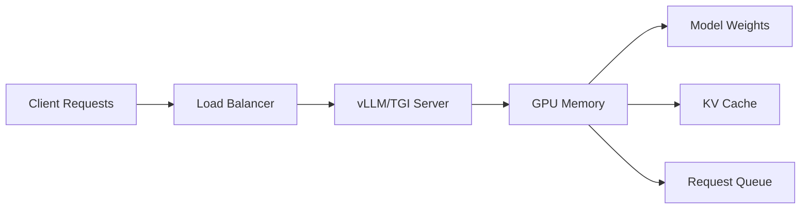
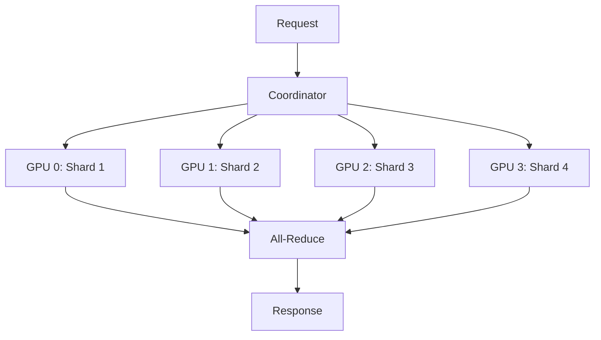
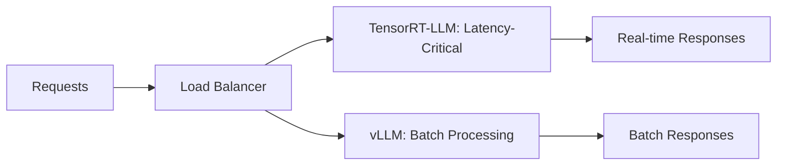

# Model Serving

Infrastructure and frameworks for deploying and serving machine learning models in production, with emphasis on large language model (LLM) inference optimization.

## Overview

| Aspect | Details |
|--------|---------|
| **Purpose** | Efficient model inference at scale with optimizations for throughput and latency |
| **Key Challenge** | Memory bandwidth bottleneck for autoregressive generation |
| **Core Techniques** | Batching, KV caching, quantization, parallelism |
| **Primary Use Cases** | LLM APIs, chatbots, embeddings, real-time inference |
| **Scale Considerations** | GPU memory limits, request patterns, cost per token |

## Serving Frameworks

### vLLM

High-performance LLM serving with PagedAttention for efficient KV cache management.

| Aspect | Details |
|--------|---------|
| **Strengths** | Best throughput, continuous batching, tensor parallelism |
| **KV Cache** | PagedAttention (non-contiguous memory blocks) |
| **Batching** | Continuous batching with preemption |
| **Quantization** | GPTQ, AWQ, SqueezeLLM |
| **Best For** | Production LLM APIs, maximum throughput |
| **Limitations** | GPU-only, complex setup for multi-node |

### Text Generation Inference (TGI)

Hugging Face's production-grade serving framework with broad model support.

| Aspect | Details |
|--------|---------|
| **Strengths** | Easy deployment, streaming, grammar-constrained generation |
| **KV Cache** | Optimized caching with flash attention |
| **Batching** | Continuous batching |
| **Quantization** | GPTQ, AWQ, bitsandbytes, EETQ |
| **Best For** | Hugging Face ecosystem, rapid deployment |
| **Limitations** | Slightly lower throughput than vLLM |

### NVIDIA Triton

General-purpose inference server supporting multiple frameworks and backends.

| Aspect | Details |
|--------|---------|
| **Strengths** | Multi-framework, ensemble models, broad backend support |
| **Backends** | TensorRT, PyTorch, ONNX, TensorFlow, OpenVINO |
| **Batching** | Dynamic batching, sequence batching |
| **Quantization** | TensorRT-LLM integration for LLMs |
| **Best For** | Heterogeneous model serving, non-LLM workloads |
| **Limitations** | More complex configuration than LLM-specific tools |

### TensorRT-LLM

NVIDIA's optimized engine specifically for LLM inference on NVIDIA GPUs.

| Aspect | Details |
|--------|---------|
| **Strengths** | Maximum single-request latency, custom kernels |
| **KV Cache** | Optimized paged KV cache |
| **Batching** | Inflight batching, chunked context |
| **Quantization** | INT8, INT4, FP8, SmoothQuant, GPTQ, AWQ |
| **Parallelism** | Tensor, pipeline, expert parallelism |
| **Best For** | NVIDIA GPUs, latency-critical applications |
| **Limitations** | NVIDIA hardware only, requires compilation |

### Ollama

Local LLM serving focused on developer experience and easy model management.

| Aspect | Details |
|--------|---------|
| **Strengths** | Simple CLI, model registry, cross-platform |
| **KV Cache** | Standard caching |
| **Quantization** | GGUF format (llama.cpp backend) |
| **Best For** | Local development, edge deployment, CPU inference |
| **Limitations** | Not optimized for high-throughput production |

### llama.cpp

CPU-optimized inference with quantization for running LLMs on consumer hardware.

| Aspect | Details |
|--------|---------|
| **Strengths** | CPU inference, minimal dependencies, GGUF format |
| **Quantization** | GGUF (2-8 bit), extensive quantization options |
| **Batching** | Basic batching support |
| **Best For** | Edge devices, CPU-only environments, local inference |
| **Limitations** | Lower throughput than GPU solutions |

## Core Optimization Techniques

### KV Cache Management

| Technique | Description | Trade-offs |
|-----------|-------------|------------|
| **Contiguous Cache** | Pre-allocate fixed memory blocks per sequence | Simple but memory inefficient |
| **PagedAttention** | Non-contiguous blocks like virtual memory (vLLM) | 2-4x memory efficiency, minimal overhead |
| **Flash Attention** | Fused attention kernels with tiling | Lower memory, faster, requires specific hardware |

### Batching Strategies

| Strategy | Description | Use Case |
|----------|-------------|----------|
| **Static Batching** | Wait for batch to fill before processing | Predictable workloads |
| **Dynamic Batching** | Batch requests within time window | Variable request rates |
| **Continuous Batching** | Add/remove requests dynamically during generation | Maximum throughput for LLMs |
| **Inflight Batching** | Interleave prompt processing and generation | Balance latency and throughput |

### Quantization Formats

| Format | Bits | Method | Best For |
|--------|------|--------|----------|
| **GPTQ** | 2-8 | Post-training quantization with calibration | GPU inference, good accuracy |
| **AWQ** | 4 | Activation-aware weight quantization | Better accuracy than GPTQ at 4-bit |
| **GGUF** | 2-8 | llama.cpp format with flexible quantization | CPU inference, edge deployment |
| **EETQ** | 8 | Easy and efficient quantization | Fast 8-bit with minimal accuracy loss |
| **SmoothQuant** | 8 | Activation and weight smoothing | Large models, balanced quantization |
| **FP8** | 8 | Floating point 8-bit (H100+) | Next-gen hardware, training + inference |

### Advanced Techniques

| Technique | Description | Speedup |
|-----------|-------------|---------|
| **Speculative Decoding** | Use small model to draft, large model to verify | 2-3x for certain workloads |
| **Tensor Parallelism** | Split model layers across GPUs | Enable larger models, linear scaling |
| **Pipeline Parallelism** | Distribute layers across GPUs sequentially | Better for fewer GPUs |
| **Chunked Prefill** | Process long contexts in chunks | Lower latency for long prompts |
| **Prefix Caching** | Cache common prompt prefixes | Faster for repeated system prompts |

## Performance Comparison

**Throughput (tokens/sec on A100 80GB, Llama 2 70B)**

| Framework | Quantization | Throughput | Memory |
|-----------|--------------|------------|--------|
| vLLM | AWQ 4-bit | ~2000 | 45 GB |
| TGI | AWQ 4-bit | ~1800 | 46 GB |
| TensorRT-LLM | FP8 | ~2400 | 55 GB |
| TensorRT-LLM | AWQ 4-bit | ~2200 | 42 GB |
| llama.cpp | Q4_K_M | ~150* | 40 GB |
| Ollama | Q4_K_M | ~140* | 40 GB |

*CPU inference (64-core server)

**Latency Characteristics**

| Framework | Time to First Token | Best Use Case |
|-----------|---------------------|---------------|
| TensorRT-LLM | ✅ Lowest | Interactive chat, real-time |
| vLLM | Good | High-throughput APIs |
| TGI | Good | Balanced workloads |
| Triton | Variable | Multi-model serving |
| Ollama | Higher | Local development |

## When to Use

### vLLM

**Strengths:**

- Highest throughput for LLM serving
- Excellent GPU memory efficiency with PagedAttention
- Production-ready with continuous batching
- Strong community and active development

**Considerations:**

- GPU-required (no CPU fallback)
- Python-based (may have higher overhead than compiled solutions)
- Limited to supported model architectures

**Best for:**

- Production LLM APIs with high request volume
- Cost optimization through better GPU utilization
- Serving popular model architectures (Llama, Mistral, GPT-NeoX)

### Text Generation Inference

**Strengths:**

- Easiest production deployment (Docker, Kubernetes)
- Integrated with Hugging Face ecosystem
- Streaming and server-sent events out of the box
- Grammar and regex-constrained generation

**Considerations:**

- Slightly lower throughput than vLLM
- Fewer quantization options than TensorRT-LLM
- Best with Hugging Face model formats

**Best for:**

- Rapid deployment from Hugging Face models
- Applications requiring streaming responses
- Teams already using Hugging Face infrastructure

### TensorRT-LLM

**Strengths:**

- Lowest latency for single requests
- Maximum optimization for NVIDIA hardware
- Advanced quantization (FP8 on H100)
- Multi-GPU and multi-node scaling

**Considerations:**

- Requires model compilation step
- NVIDIA GPUs only
- More complex setup than vLLM/TGI
- Limited to NVIDIA-supported architectures

**Best for:**

- Latency-critical applications (sub-100ms requirements)
- NVIDIA GPU infrastructure
- Maximum performance from hardware
- Large-scale deployments with engineering resources

### Triton Inference Server

**Strengths:**

- Multi-framework and multi-backend support
- Ensemble models (preprocessing + inference + postprocessing)
- Model versioning and A/B testing
- CPU and GPU backends

**Considerations:**

- Complex configuration for LLMs
- Not LLM-optimized out of the box
- Steeper learning curve

**Best for:**

- Serving multiple model types (CV, NLP, recommenders)
- Heterogeneous inference workloads
- Organizations already using NVIDIA infrastructure
- Ensemble pipelines with multiple models

### Ollama

**Strengths:**

- Simplest local deployment (single binary)
- Built-in model registry and management
- Cross-platform (macOS, Linux, Windows)
- Good developer experience

**Considerations:**

- Not designed for production scale
- Lower throughput than GPU-optimized solutions
- Limited customization compared to vLLM/TGI

**Best for:**

- Local development and testing
- Edge deployment on consumer hardware
- Prototyping and experimentation
- CPU-only environments

### llama.cpp

**Strengths:**

- Best CPU inference performance
- Minimal dependencies (C++ binary)
- Extensive quantization options (GGUF)
- Runs on edge devices and embedded systems

**Considerations:**

- CPU-bound (much slower than GPU)
- Basic batching support
- Manual quantization and model conversion

**Best for:**

- CPU-only deployment requirements
- Edge devices and embedded systems
- Minimal infrastructure overhead
- Privacy-sensitive local inference

## Decision Guide

| Requirement | Recommended Framework |
|-------------|----------------------|
| **Maximum throughput** | vLLM or TensorRT-LLM |
| **Lowest latency** | TensorRT-LLM |
| **Easiest deployment** | Text Generation Inference or Ollama |
| **CPU inference** | llama.cpp or Ollama |
| **Multi-model serving** | Triton Inference Server |
| **Hugging Face models** | Text Generation Inference |
| **Local development** | Ollama |
| **Edge deployment** | llama.cpp |
| **Cost optimization** | vLLM (best GPU utilization) |
| **Streaming responses** | TGI or vLLM |
| **Constrained generation** | TGI (grammar support) |
| **Multi-GPU scaling** | TensorRT-LLM or vLLM |

## Architecture Patterns

### Single-GPU Serving

### Multi-GPU Tensor Parallelism

### Hybrid Pipeline

## Production Considerations

| Concern | Solution |
|---------|----------|
| **Memory overflow** | Model quantization, smaller batch size, request queueing |
| **Cold start latency** | Model pre-loading, warm pool of instances |
| **Request spikes** | Autoscaling, queue backpressure, rate limiting |
| **Cost optimization** | Continuous batching, spot instances, right-size GPUs |
| **Multi-tenancy** | Model multiplexing, prefix caching for system prompts |
| **Monitoring** | Token throughput, queue depth, GPU utilization, TTFT/TPOT metrics |
| **Fallback** | Multiple backends, graceful degradation, request retry |

## Key Metrics

| Metric | Description | Target |
|--------|-------------|--------|
| **TTFT** | Time to first token (latency) | <200ms for interactive |
| **TPOT** | Time per output token | <50ms for streaming feel |
| **Throughput** | Tokens/second across all requests | Maximize for cost efficiency |
| **GPU Utilization** | % of GPU compute used | >80% for cost optimization |
| **Queue Depth** | Pending requests | <100 for latency SLA |
| **Memory Usage** | KV cache + model weights | <90% to avoid OOM |

## Related

- [[LLMs & Transformers]] - Model architectures and training
- [[LLM Internals]] - Attention mechanisms and transformer details
- [[ML Infrastructure]] - Broader ML deployment patterns
- [[Quantization Techniques]] - Detailed quantization methods
- [[GPU Optimization]] - Hardware-specific optimizations
