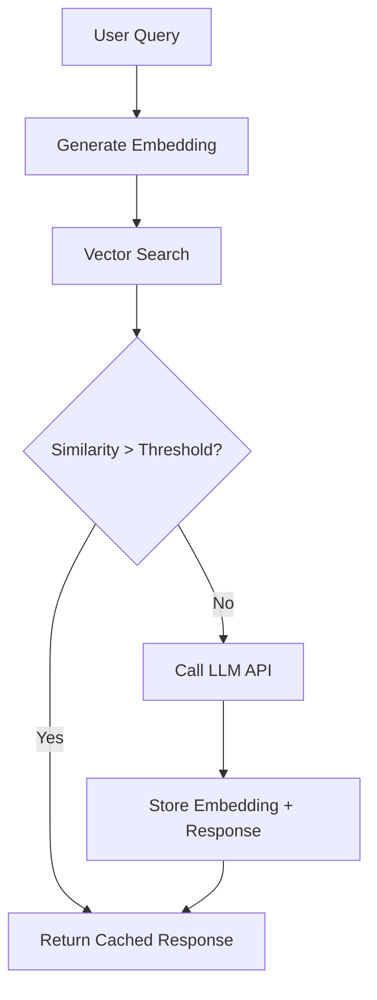

# Semantic Caching

Cache LLM responses based on semantic similarity of queries rather than exact string matching, reducing costs and latency for similar but not identical requests.

## Overview

| Aspect | Details |
|--------|---------|
| **Purpose** | Reduce LLM API costs and response latency by caching semantically similar queries |
| **Core Mechanism** | Embedding-based similarity matching instead of exact key matching |
| **Primary Use Case** | LLM applications with high query similarity (support bots, FAQ systems, RAG) |
| **Cost Reduction** | 70-95% for workloads with semantic overlap |
| **Latency Improvement** | 10-100x faster than LLM API calls |
| **Trade-offs** | Embedding computation cost vs. LLM call cost, accuracy vs. cache hit rate |

## Core Concepts

### Traditional vs Semantic Caching

| Aspect | Traditional Caching | Semantic Caching |
|--------|-------------------|------------------|
| **Key Matching** | Exact string match | Similarity threshold |
| **Cache Key** | Raw query string | Query embedding vector |
| **Hit Criteria** | Identical input | Cosine similarity > threshold |
| **Use Case** | Repeated identical queries | Paraphrased/similar queries |
| **Example Hit** | "What is Python?" = "What is Python?" | "What is Python?" ≈ "Can you explain Python?" |

### Similarity Matching

**Cosine Similarity:** Measure angle between query embeddings in high-dimensional space.

```
similarity = (A · B) / (||A|| × ||B||)
```

- **1.0:** Identical semantic meaning
- **0.9-0.99:** Very similar (typical cache hit)
- **0.7-0.89:** Moderately similar (tunable)
- **<0.7:** Different queries

### Cache Hit Strategy

1. **Query arrives** → Generate embedding using fast model (text-embedding-3-small, sentence-transformers)
2. **Vector search** → Find nearest cached embeddings within similarity threshold
3. **Cache hit** → Return cached response (latency: 10-50ms)
4. **Cache miss** → Call LLM, store query embedding + response (latency: 500-5000ms)

## Implementation Patterns

### Architecture Components



### Storage Options

| Solution | Vector Search | Scalability | Complexity | Best For |
|----------|--------------|-------------|------------|----------|
| **GPTCache** | FAISS, Milvus, Qdrant | Medium | Low | Quick prototypes, single-node |
| **Redis + RediSearch** | HNSW index | High | Medium | Production, existing Redis infra |
| **Pinecone/Weaviate/Qdrant** | Native vector DB | Very High | Medium | Large-scale, multi-tenant |
| **PostgreSQL + pgvector** | IVFFlat, HNSW | Medium | Low | Existing Postgres, simple stack |
| **In-Memory (FAISS)** | FAISS CPU/GPU | Low | Very Low | Development, single-instance |

### GPTCache Integration

**Features:**

- Pre-built similarity evaluators (embedding distance, BERT score)
- Multiple storage backends (SQLite, Redis, Qdrant)
- Automatic cache eviction policies (LRU, LFU)
- Built-in embedding model management

**Example Flow:**

1. Configure similarity threshold (0.9 recommended starting point)
2. Select embedding model (OpenAI, Sentence Transformers, Cohere)
3. Choose vector store (FAISS for dev, Redis/Qdrant for prod)
4. Wrap LLM calls with cache layer

### Redis with Vector Search

**Advantages:**

- Existing infrastructure reuse
- Fast in-memory vector search with HNSW
- TTL-based cache expiration
- Horizontal scaling with Redis Cluster

**Pattern:**

- Store embeddings as FLOAT32 vectors in Redis Hash
- Create vector index with distance metric (cosine, L2)
- Query: `FT.SEARCH idx "@vector:[VECTOR_BLOB $K]"` → K nearest neighbors
- Return cached response if top result > similarity threshold

## Threshold Tuning

### Similarity Threshold Selection

| Threshold | Hit Rate | Accuracy | Use Case |
|-----------|----------|----------|----------|
| **0.95-0.99** | Low | Very High | Critical accuracy (legal, medical) |
| **0.90-0.94** | Medium | High | General chatbots, support |
| **0.85-0.89** | High | Medium | FAQ retrieval, low-stakes |
| **<0.85** | Very High | Low | Not recommended (semantic drift) |

### Tuning Process

1. **Start conservative:** 0.95 threshold, measure hit rate
2. **Analyze misses:** Review queries below threshold - are they truly different?
3. **A/B test:** Gradually lower threshold, compare LLM vs cached response quality
4. **Monitor drift:** Track user feedback, hallucination rates, response relevance
5. **Domain-specific tuning:** Technical support may need 0.92, casual chat 0.88

### Evaluation Metrics

- **Cache Hit Rate:** `hits / (hits + misses)` - target 40-70% for ROI
- **False Positive Rate:** Semantically different queries returning same cached response
- **Cost Savings:** `(avoided_llm_calls × cost_per_call) - embedding_costs`
- **P95 Latency:** Ensure cache lookups don't degrade user experience

## Cache Invalidation

### Strategies

| Strategy | Trigger | Use Case | Complexity |
|----------|---------|----------|------------|
| **TTL-based** | Time expiration (hours/days) | Time-sensitive data (weather, news) | Low |
| **Event-driven** | Data updates | Product catalogs, documentation | Medium |
| **Version tags** | Model/prompt changes | LLM upgrades, prompt engineering | Medium |
| **LRU/LFU eviction** | Memory limits | Cost optimization | Low |
| **Manual purge** | Critical corrections | Bug fixes, policy changes | High |

### Invalidation Patterns

**TTL Example:**

- Cache product recommendations for 6 hours
- Cache general knowledge indefinitely
- Cache user-specific data for 1 hour

**Version Tags:**

- Tag cache entries with `gpt-4-1106` model version
- Purge all entries when upgrading to `gpt-4-turbo`
- Separate caches for different system prompts

**Selective Invalidation:**

- Track cache entries by topic/domain using metadata
- Invalidate only affected domain on data update
- Use embedding metadata filtering in vector DBs

## Cost Savings Analysis

### Break-Even Calculation

**Costs:**

- LLM API call: $0.01-0.10 per request (GPT-4)
- Embedding generation: $0.0001 per query (text-embedding-3-small)
- Vector search: $0.00001 per lookup (Redis/managed service)

**Savings:**

- 50% hit rate → 50% cost reduction (minus embedding overhead)
- 70% hit rate → 65-70% cost reduction
- 90% hit rate → 85-90% cost reduction

**Example:**

- 1M queries/month at $0.02/query = $20,000
- 70% hit rate → 700K cached, 300K LLM calls
- Cost: (1M × $0.0001) + (300K × $0.02) = $6,100
- **Savings: $13,900/month (69.5%)**

### Latency Improvement

| Operation | Typical Latency | Impact |
|-----------|----------------|--------|
| **LLM API call** | 500-5000ms | User-facing delay |
| **Embedding generation** | 10-50ms | Negligible |
| **Vector search** | 5-20ms | Negligible |
| **Total cache hit** | 15-70ms | **10-100x faster** |

## Decision Guide

### When to Use Semantic Caching

| Scenario | Recommendation | Threshold |
|----------|----------------|-----------|
| High-volume FAQ/support | ✅ Strong fit | 0.90-0.92 |
| RAG with repeated questions | ✅ Strong fit | 0.88-0.90 |
| Code generation (unique prompts) | ❌ Poor fit | N/A |
| Content moderation (unique inputs) | ❌ Poor fit | N/A |
| Chatbot with common queries | ✅ Good fit | 0.90-0.93 |
| Real-time data queries (stocks, weather) | ⚠️ Use with short TTL | 0.92 + 5-15min TTL |
| Creative writing assistance | ❌ Poor fit | N/A |
| Document Q&A (limited corpus) | ✅ Excellent fit | 0.89-0.91 |

### Selection Criteria

**Use Semantic Caching If:**

- 30%+ of queries are semantically similar
- LLM costs are significant ($500+/month)
- Response latency impacts UX
- Query distribution is skewed (power law)

**Avoid Semantic Caching If:**

- Every query is unique (creative, code gen)
- Real-time accuracy critical (no cached staleness)
- Very low query volume (<1000/day)
- Embedding costs exceed LLM savings

### Vector Store Selection

**Choose GPTCache If:**

- Rapid prototyping
- Single-node deployment
- Minimal infrastructure

**Choose Redis If:**

- Existing Redis infrastructure
- Need TTL-based expiration
- Moderate scale (10M+ queries/day)

**Choose Dedicated Vector DB (Pinecone/Weaviate/Qdrant) If:**

- Massive scale (100M+ queries/day)
- Multi-tenant isolation required
- Advanced filtering/metadata needs

**Choose PostgreSQL + pgvector If:**

- Already using Postgres
- Want unified relational + vector storage
- Moderate scale, simple stack

## Implementation Checklist

- [ ] Measure baseline: query distribution, cost, latency
- [ ] Select embedding model (fast, cheap: text-embedding-3-small)
- [ ] Choose vector store based on scale and infrastructure
- [ ] Start with conservative threshold (0.95)
- [ ] Implement cache hit/miss logging and metrics
- [ ] A/B test threshold tuning (0.90-0.95 range)
- [ ] Define invalidation strategy (TTL, version tags)
- [ ] Monitor false positive rate via user feedback
- [ ] Calculate ROI: cost savings vs infrastructure cost
- [ ] Set up alerts for cache hit rate degradation

## Common Pitfalls

| Issue | Impact | Solution |
|-------|--------|----------|
| **Threshold too low** | Semantically different queries share cache | Increase threshold, monitor false positives |
| **Threshold too high** | Low hit rate, minimal savings | Decrease threshold, A/B test |
| **Stale cached data** | Outdated responses | Implement TTL or event-driven invalidation |
| **Embedding model mismatch** | Poor similarity matching | Use consistent model for cache and lookup |
| **Cold start problem** | Initial queries all miss | Pre-populate cache with common queries |
| **Vector search latency** | Cache slower than expected | Use HNSW index, tune search parameters |

## Related

- [[Caching Strategies]] - Traditional caching patterns and trade-offs
- [[Embeddings]] - Text embedding models and vector representations
- [[Vector Databases]] - Storage and retrieval of high-dimensional vectors
- [[LLM Cost Optimization]] - Strategies for reducing LLM API expenses
- [[RAG (Retrieval Augmented Generation)]] - Semantic search for context retrieval
