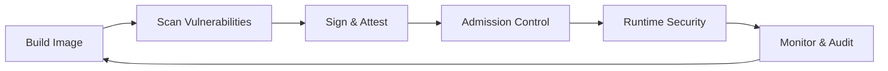
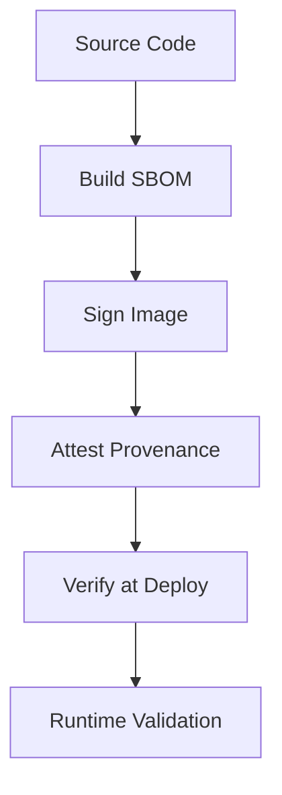

# Container Security

Security practices and tools for securing containerized applications throughout the software lifecycle, from image creation to runtime.

## Overview

| Aspect | Details |
|--------|---------|
| **Scope** | Image security, runtime protection, orchestration security |
| **Key Phases** | Build, Scan, Deploy, Runtime, Monitor |
| **Primary Risks** | Vulnerable dependencies, misconfigurations, privilege escalation, secrets exposure |
| **Standards** | CIS Benchmarks, Pod Security Standards, NIST SP 800-190 |
| **Defense Layers** | Image scanning, admission control, runtime detection, network policies |

## Security Lifecycle



## Image Security

### Base Image Selection

| Strategy | Security Profile | Use Case |
|----------|-----------------|----------|
| **Distroless** | Minimal attack surface, no shell, package manager | Production microservices |
| **Alpine** | Small size, minimal packages | General purpose, build stages |
| **Scratch** | Empty image, only app binary | Go/Rust static binaries |
| **Hardened** | CIS-hardened, patched | Compliance-heavy environments |

**Best Practices:**

- Use specific version tags, never `latest`
- Prefer official or verified publisher images
- Scan base images before use
- Keep base images updated regularly
- Use multi-stage builds to minimize final image

### Vulnerability Scanning

| Tool | Type | Strengths | Considerations |
|------|------|-----------|----------------|
| **Trivy** | Open Source | Fast, comprehensive DB, SBOM generation | ✅ Best all-around free option |
| **Grype** | Open Source | Anchore-backed, accurate matching | ✅ Good for CI/CD integration |
| **Snyk** | Commercial | Developer-focused, fix guidance | Developer experience, cost |
| **Clair** | Open Source | Static analysis, API-driven | Requires PostgreSQL, complex setup |
| **Aqua** | Commercial | Platform solution, runtime integration | Enterprise features, cost |

**Scanning Strategy:**

```yaml
# Example: Multi-stage scanning
Build Time:    Scan base images, dependencies
CI/CD:         Gate on critical/high CVEs
Registry:      Continuous scanning of stored images
Admission:     Final check before deployment
Runtime:       Monitor for new vulnerabilities
```

### Image Hardening

**Minimal Images:**

```dockerfile
# Distroless example (Go app)
FROM golang:1.21 AS builder
WORKDIR /app
COPY . .
RUN CGO_ENABLED=0 go build -o app

FROM gcr.io/distroless/static-debian12
COPY --from=builder /app/app /app
USER nonroot:nonroot
ENTRYPOINT ["/app"]
```

**Security Checklist:**

- ✅ Run as non-root user
- ✅ Use read-only root filesystem where possible
- ✅ Drop all capabilities, add only required
- ✅ Set resource limits (CPU, memory)
- ✅ No secrets in image layers
- ✅ Minimal installed packages
- ✅ Verified signatures (Sigstore/Cosign)

## Kubernetes Security

### Pod Security Standards

| Level | Restrictions | Use Case |
|-------|-------------|----------|
| **Privileged** | Unrestricted | Trusted workloads, operators |
| **Baseline** | Prevents known privilege escalations | Default for most workloads |
| **Restricted** | Heavily restricted, follows hardening best practices | High-security environments |

**Restricted Profile Requirements:**

- Non-root user
- No privilege escalation
- Read-only root filesystem
- Dropped ALL capabilities
- No host namespaces
- Seccomp profile applied

### Admission Control

| Mechanism | Purpose | Example Tools |
|-----------|---------|---------------|
| **OPA/Gatekeeper** | Policy as code, Rego policies | Image sources, label requirements |
| **Kyverno** | Kubernetes-native policies, YAML | Mutation, validation, generation |
| **Pod Security Admission** | Built-in PSS enforcement | Replace PodSecurityPolicy |
| **Falco Admission** | Runtime threat-based admission | Block workloads with suspicious behavior |

**Common Policies:**

- Enforce image registry allowlist
- Require resource limits/requests
- Block privileged containers
- Enforce pod security standards
- Validate image signatures
- Prevent host path mounts

### Network Policies

```yaml
# Example: Default deny ingress
apiVersion: networking.k8s.io/v1
kind: NetworkPolicy
metadata:
  name: default-deny-ingress
spec:
  podSelector: {}
  policyTypes:
  - Ingress
```

**Best Practices:**

- Default deny all traffic
- Explicit allow required connections
- Namespace isolation
- Egress controls for external traffic
- Service mesh for mTLS (Istio, Linkerd)

## Runtime Security

### Runtime Detection Tools

| Tool | Focus | Detection Method | Integration |
|------|-------|------------------|-------------|
| **Falco** | System call monitoring | eBPF/kernel module | CNCF, rule-based alerts |
| **Sysdig** | Comprehensive monitoring | eBPF | Commercial, full platform |
| **Tetragon** | eBPF-based security | Cilium eBPF | Kubernetes-native |
| **Tracee** | Runtime security events | eBPF | Aqua, signatures & policies |

**Falco Example Rules:**

```yaml
# Detect shell spawned in container
- rule: Shell in Container
  condition: container and proc.name in (bash, sh, zsh)
  output: Shell spawned (user=%user.name container=%container.name)
  priority: WARNING
```

### Runtime Best Practices

**Container Configuration:**

- Run as non-root user (`runAsNonRoot: true`)
- Read-only filesystem (`readOnlyRootFilesystem: true`)
- Drop capabilities (`drop: [ALL]`)
- Use seccomp profiles (RuntimeDefault or custom)
- Set AppArmor/SELinux contexts

**Rootless Containers:**

- Rootless Docker/Podman for development
- Kubernetes user namespace isolation (alpha)
- Reduced blast radius from container escape
- No setuid binaries in rootless mode

## Secrets Management

### Anti-Patterns

| ❌ Bad Practice | Why Dangerous |
|----------------|---------------|
| Hardcoded in Dockerfile | Visible in image layers forever |
| Environment variables | Visible in `docker inspect`, process list |
| Mounted config files | Easy to leak in logs/errors |
| Kubernetes Secrets (base64) | Not encrypted at rest by default |

### Secure Approaches

| ✅ Solution | Security Benefit | Tool Examples |
|------------|------------------|---------------|
| **External Secrets** | Centralized, audited, rotated | HashiCorp Vault, AWS Secrets Manager |
| **CSI Drivers** | Mount secrets as volumes | secrets-store-csi-driver |
| **Sealed Secrets** | Encrypted in Git, decrypted in-cluster | Bitnami Sealed Secrets |
| **SOPS** | Encrypted YAML/JSON with key management | Mozilla SOPS |
| **Workload Identity** | No static credentials | GKE Workload Identity, IRSA |

**Best Practices:**

- Never commit secrets to Git
- Rotate secrets regularly
- Use short-lived credentials
- Audit secret access
- Encrypt secrets at rest in etcd

## Supply Chain Security

### Image Provenance



**Tools:**

- **Sigstore/Cosign:** Keyless signing, transparency log
- **Notary:** Docker Content Trust, TUF-based
- **in-toto:** Supply chain attestation framework
- **SLSA:** Framework for supply chain integrity

### SBOM Generation

| Format | Use Case | Tools |
|--------|----------|-------|
| **SPDX** | Industry standard, compliance | Syft, Tern |
| **CycloneDX** | Security-focused, VEX support | Syft, Trivy |

**Why SBOMs Matter:**

- Rapid vulnerability response (Log4Shell scenarios)
- License compliance
- Dependency transparency
- Supply chain risk assessment

## Security Checklist

### Build Phase

- [ ] Use minimal base images (distroless/scratch)
- [ ] Scan for vulnerabilities (Trivy/Grype)
- [ ] Multi-stage builds to reduce final image
- [ ] No secrets in layers
- [ ] Run as non-root user
- [ ] Sign images with Cosign/Notary
- [ ] Generate and store SBOM

### Deploy Phase

- [ ] Admission policies enforce security standards
- [ ] Image signature verification required
- [ ] Pod Security Standards applied
- [ ] Network policies default-deny
- [ ] Resource limits set
- [ ] Secrets from external vault
- [ ] Registry scanning enabled

### Runtime Phase

- [ ] Runtime security monitoring (Falco)
- [ ] Read-only root filesystem
- [ ] Capabilities dropped
- [ ] Seccomp/AppArmor profiles applied
- [ ] mTLS between services
- [ ] Audit logging enabled
- [ ] Anomaly detection configured

### Monitoring Phase

- [ ] CVE scanning on schedule
- [ ] Security event alerts configured
- [ ] Compliance reporting automated
- [ ] Incident response playbooks defined
- [ ] Regular security audits
- [ ] Secrets rotation automated

## Tool Selection Guide

| Requirement | Recommended Tools | Rationale |
|-------------|-------------------|-----------|
| **Free, comprehensive scanning** | Trivy | Best free option, fast, accurate |
| **Open source runtime security** | Falco | CNCF, wide adoption, flexible rules |
| **Kubernetes admission control** | Kyverno or OPA/Gatekeeper | Kyverno simpler, OPA more powerful |
| **Enterprise platform** | Aqua, Sysdig, Prisma Cloud | Full lifecycle coverage |
| **Image signing** | Sigstore/Cosign | Keyless, transparency log |
| **Secrets management** | HashiCorp Vault, Cloud-native (AWS/GCP) | Mature ecosystem, audit trails |

## Common Vulnerabilities

| Vulnerability | Attack Vector | Mitigation |
|---------------|---------------|------------|
| **Vulnerable Dependencies** | Exploited libraries (Log4Shell) | Continuous scanning, patching |
| **Privilege Escalation** | Container escape via capabilities | Drop capabilities, non-root |
| **Exposed Secrets** | Hardcoded credentials | External secrets management |
| **Misconfigurations** | Privileged pods, host mounts | Admission policies, PSS |
| **Supply Chain Attack** | Compromised base image | Image signing, SBOM verification |
| **Network Exposure** | No network policies | Default deny, service mesh |

## Compliance & Standards

### CIS Benchmarks

- CIS Docker Benchmark
- CIS Kubernetes Benchmark
- Automated scanning with kube-bench

### NIST SP 800-190

Application Container Security Guide covering:

- Image security
- Registry security
- Orchestrator security
- Container runtime security
- Host OS security

### Pod Security Standards (PSS)

Kubernetes-native replacement for PodSecurityPolicy:

- Privileged
- Baseline (default)
- Restricted (hardened)

## Related

- [[Container Tools]] - Docker, Podman, containerd
- [[Kubernetes]] - Container orchestration platform
- [[Supply Chain Security]] - SBOM, signing, provenance
- [[DevSecOps]] - Security in CI/CD pipelines
- [[Cloud Security]] - Cloud-native security patterns
- [[Zero Trust]] - Network security architecture
