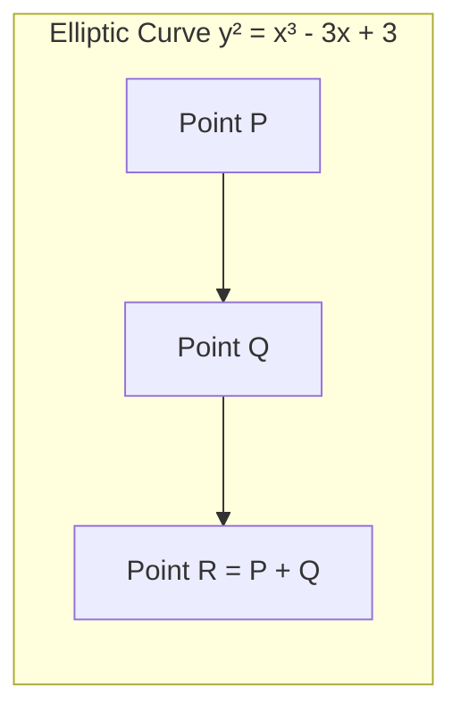
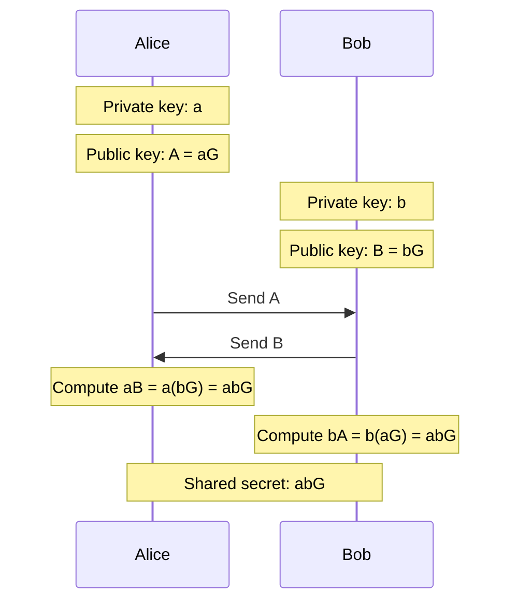

# Elliptic Curve Cryptography

Asymmetric cryptography based on the algebraic structure of elliptic curves over finite fields, providing equivalent security to RSA with much smaller keys.

## Overview

| Aspect | Details |
|--------|---------|
| **Invented** | Proposed independently by Neal Koblitz and Victor Miller (1985) |
| **Security Basis** | Elliptic Curve Discrete Logarithm Problem (ECDLP) |
| **Key Advantage** | 256-bit ECC ≈ 3072-bit RSA security |
| **Common Uses** | TLS, SSH, cryptocurrency, code signing, mobile/IoT |
| **Quantum Status** | ❌ Broken by Shor's algorithm (need PQC for future) |

## The Mathematics

### Elliptic Curve Definition

An elliptic curve over a field is defined by the Weierstrass equation:

```
y² = x³ + ax + b
```

Where `4a³ + 27b² ≠ 0` (ensures no singularities)



### Point Addition

The group operation on elliptic curves:

1. Draw a line through points P and Q
2. Line intersects curve at third point R'
3. Reflect R' over x-axis to get R = P + Q

**Special cases:**

- P + O = P (identity element at infinity)
- P + (-P) = O (inverse)
- P + P = 2P (point doubling, tangent line)

### Scalar Multiplication

The core operation: multiply point G by scalar k

```
k × G = G + G + G + ... + G  (k times)
```

**Example:** If k = 23 (binary: 10111)

```
23G = 16G + 4G + 2G + G
    = 2(2(2(2G))) + 2(2G) + 2G + G
```

Uses **double-and-add** algorithm: O(log k) operations.

### The Hard Problem (ECDLP)

**Given:** Points G (generator) and P = kG on the curve
**Find:** The scalar k

For properly chosen curves and large k (256-bit), this is computationally infeasible.

## Standard Curves

### NIST Curves

| Curve | Key Size | Security Level | Status |
|-------|----------|----------------|--------|
| **P-256** (secp256r1) | 256-bit | 128-bit | ✅ Most common, TLS default |
| **P-384** (secp384r1) | 384-bit | 192-bit | ✅ High security |
| **P-521** (secp521r1) | 521-bit | 256-bit | ✅ Highest NIST level |

**Concerns:** NIST curves have unexplained seed values, leading to some distrust.

### Curve25519 Family (Modern Preference)

| Curve | Purpose | Key Size | Status |
|-------|---------|----------|--------|
| **Curve25519** | Key exchange (X25519) | 256-bit | ✅ Preferred for new systems |
| **Ed25519** | Signatures (EdDSA) | 256-bit | ✅ Preferred for new systems |
| **Ed448** | Signatures | 448-bit | ✅ Higher security margin |
| **X448** | Key exchange | 448-bit | ✅ Higher security margin |

**Advantages of Curve25519:**

- Designed by Daniel J. Bernstein for security and performance
- Complete addition formulas (no special cases = simpler, safer code)
- Constant-time implementations easier
- Fast on commodity hardware
- Fully specified, no unexplained constants

### Other Curves

| Curve | Use Case | Notes |
|-------|----------|-------|
| **secp256k1** | Bitcoin, Ethereum | Koblitz curve, efficient |
| **Brainpool** | European government systems | Alternative to NIST |
| **SM2** | Chinese national standard | Required in China |

## ECC Algorithms

### ECDH (Key Exchange)

Elliptic Curve Diffie-Hellman for establishing shared secrets.



**X25519:** ECDH using Curve25519. Default in TLS 1.3, Signal, WireGuard.

### ECDSA (Digital Signatures)

Elliptic Curve Digital Signature Algorithm.

**Signing (simplified):**

1. Generate random k, compute R = kG
2. r = x-coordinate of R
3. s = k⁻¹(hash(message) + r × private_key) mod n
4. Signature = (r, s)

**Verification:**

1. Compute u₁ = hash(message) × s⁻¹ mod n
2. Compute u₂ = r × s⁻¹ mod n
3. Compute R' = u₁G + u₂(public_key)
4. Valid if x-coordinate of R' equals r

**Critical:** The random k must be truly random and never reused. Same k with different messages reveals private key.

### EdDSA (Modern Signatures)

Edwards-curve Digital Signature Algorithm. Designed to avoid ECDSA pitfalls.

| Feature | ECDSA | EdDSA |
|---------|-------|-------|
| **Nonce generation** | Random (dangerous) | Deterministic from message + key |
| **Side-channel resistance** | Harder | Easier (complete formulas) |
| **Performance** | Slower | Faster |
| **Specification** | Ambiguous | Fully specified |

**Ed25519:** EdDSA using Curve25519. Default for SSH keys (OpenSSH 8.0+).

## Key Sizes Compared

| Security Level | Symmetric | RSA | ECC |
|---------------|-----------|-----|-----|
| 80-bit | 80 | 1024 | 160 |
| 112-bit | 112 | 2048 | 224 |
| **128-bit** | **128** | **3072** | **256** |
| 192-bit | 192 | 7680 | 384 |
| 256-bit | 256 | 15360 | 521 |

**256-bit ECC key provides 128-bit security with 12x smaller key than RSA-3072.**

## Performance Comparison

| Operation | RSA-2048 | RSA-4096 | P-256 | Ed25519 |
|-----------|----------|----------|-------|---------|
| Key generation | ~100ms | ~1s | ~1ms | ~0.1ms |
| Signing | ~1ms | ~5ms | ~0.5ms | ~0.1ms |
| Verification | ~0.1ms | ~0.2ms | ~1ms | ~0.2ms |
| Signature size | 256 B | 512 B | 64 B | 64 B |
| Public key size | 256 B | 512 B | 64 B | 32 B |

_Approximate values; actual performance varies by implementation and hardware._

## Implementation Considerations

### Side-Channel Attacks

| Attack | Description | Mitigation |
|--------|-------------|------------|
| **Timing** | Key bits leak through operation timing | Constant-time scalar multiplication |
| **Power analysis** | Key bits leak through power consumption | Randomized projective coordinates |
| **Cache attacks** | Memory access patterns reveal key | Avoid secret-dependent branches/lookups |
| **Fault injection** | Induce errors to reveal key bits | Point validation, checksums |

### Safe Implementation Practices

**DO:**

- Use well-vetted libraries (libsodium, ring, Go crypto)
- Prefer Ed25519/X25519 over NIST curves
- Validate points are on curve before operations
- Use constant-time implementations

**DON'T:**

- Implement your own ECC primitives
- Use ECDSA with poor random number generation
- Ignore point validation (invalid curve attacks)
- Use deprecated/weak curves (sect163k1, etc.)

### Invalid Curve Attacks

If implementation doesn't validate that received points are on the expected curve:

```
Attacker sends point P' on different curve
Victim computes k × P' (using their private key k)
Attacker analyzes result to recover k
```

**Mitigation:** Always validate received public keys/points.

## Quantum Vulnerability

**Shor's Algorithm** can solve ECDLP efficiently on a quantum computer.

| Curve | Classical Security | Quantum Attack |
|-------|-------------------|----------------|
| P-256 | 128-bit | Broken |
| P-384 | 192-bit | Broken |
| Ed25519 | 128-bit | Broken |

**Timeline:** Cryptographically relevant quantum computers expected 2030-2040.

**Mitigation:** Transition to [[Post-Quantum Cryptography]] (ML-KEM, ML-DSA) or hybrid approaches.

## Common Libraries

| Language | Library | Recommended Curves |
|----------|---------|-------------------|
| **C** | libsodium | X25519, Ed25519 |
| **Rust** | ring, curve25519-dalek | X25519, Ed25519 |
| **Go** | crypto/elliptic, x/crypto | P-256, Ed25519 |
| **Python** | cryptography | P-256, Ed25519 |
| **JavaScript** | noble-curves | All modern curves |
| **Java** | Bouncy Castle | P-256, Ed25519 |

## When to Use

### Prefer ECC (Ed25519/X25519)

| Scenario | Why |
|----------|-----|
| **SSH keys** | Smaller, faster than RSA |
| **TLS key exchange** | TLS 1.3 default |
| **Mobile/IoT** | Lower power, smaller keys |
| **New applications** | Modern security, performance |
| **Cryptocurrency** | Industry standard |

### Consider RSA Still

| Scenario | Why |
|----------|-----|
| **Legacy compatibility** | Older systems may not support ECC |
| **Hardware constraints** | Some HSMs better support RSA |
| **Regulatory requirements** | Some standards mandate RSA |

### Plan for PQC

| Scenario | Recommendation |
|----------|----------------|
| **Long-term secrets** | Start hybrid ECC + PQC now |
| **New protocol design** | Build in crypto agility |
| **General applications** | Monitor PQC standardization |

## Related

- [[Cryptography]]
- [[Post-Quantum Cryptography]]
- [[Forward Secrecy]]
- [[Cryptographic Algorithms Comparison]]
- [[Security Concepts]]

## References

- [SafeCurves](https://safecurves.cr.yp.to/) - Evaluating elliptic curve security
- [RFC 7748](https://tools.ietf.org/html/rfc7748) - X25519 and X448
- [RFC 8032](https://tools.ietf.org/html/rfc8032) - Ed25519 and Ed448
- [NIST SP 800-186](https://csrc.nist.gov/publications/detail/sp/800-186/final) - Elliptic Curve recommendations
