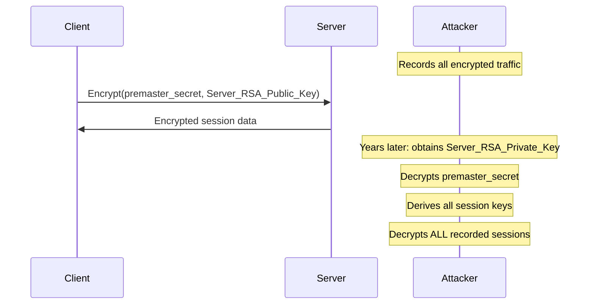
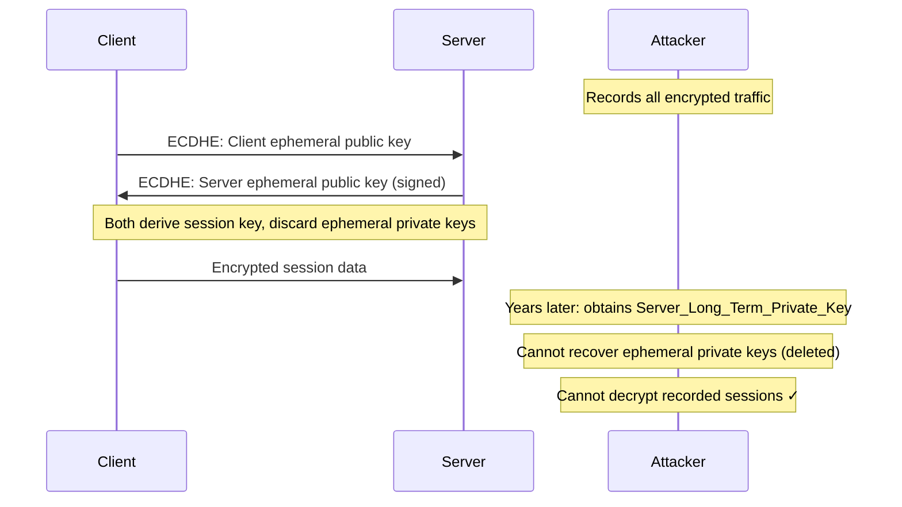
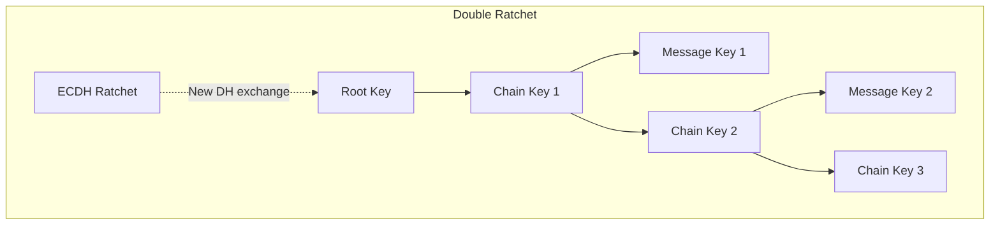

# Forward Secrecy

A property of key-exchange protocols ensuring that session keys cannot be compromised even if long-term secrets are later exposed.

## Overview

| Aspect | Details |
|--------|---------|
| **Also Called** | Perfect Forward Secrecy (PFS) |
| **Core Idea** | Compromise of long-term keys doesn't reveal past sessions |
| **Mechanism** | Ephemeral keys for each session |
| **Protocols** | TLS (DHE, ECDHE), Signal Protocol, WireGuard |
| **Opposite** | Static key exchange (RSA key transport) |

## The Problem Forward Secrecy Solves

### Without Forward Secrecy (RSA Key Transport)



**Vulnerability:** One key compromise exposes all past traffic ever encrypted with that key.

### With Forward Secrecy (Ephemeral Key Exchange)



**Protection:** Each session uses unique ephemeral keys that are immediately discarded.

## Types of Secrecy Properties

### Forward Secrecy (FS)

**Definition:** Compromise of long-term keys doesn't reveal past session keys.

**Guarantee:** If attacker obtains long-term key at time T, all sessions before T remain secure.

### Perfect Forward Secrecy (PFS)

In practice, PFS and FS are used interchangeably. Technically, PFS may imply:

- Even compromise of _all_ long-term keys doesn't help
- Security relies solely on the hardness of the mathematical problem

### Future Secrecy (Post-Compromise Security)

**Definition:** After a session key compromise, future sessions become secure again.

**Requires:** Continuous key rotation, often called "self-healing."

| Property | Past Sessions | Future Sessions |
|----------|---------------|-----------------|
| **Forward Secrecy** | ✅ Protected | (not addressed) |
| **Future Secrecy** | (not addressed) | ✅ Protected (after recovery) |
| **Both (Signal)** | ✅ Protected | ✅ Protected |

## How Ephemeral Key Exchange Works

### Ephemeral Diffie-Hellman (DHE)

```
Client                          Server
------                          ------
Generate ephemeral:             Generate ephemeral:
  private: a                      private: b
  public: A = g^a mod p           public: B = g^b mod p

        -------- A -------->
        <------- B ---------

Compute: K = B^a mod p          Compute: K = A^b mod p
       = g^ab mod p                    = g^ab mod p

Session key = KDF(K)            Session key = KDF(K)

Discard: a                      Discard: b
```

Both parties compute the same shared secret without transmitting it.

### Ephemeral Elliptic Curve Diffie-Hellman (ECDHE)

Same principle, using elliptic curve operations:

```
Client                          Server
------                          ------
Generate ephemeral:             Generate ephemeral:
  private: a                      private: b
  public: A = aG                  public: B = bG

        -------- A -------->
        <------- B ---------

Compute: K = aB = abG           Compute: K = bA = baG

Session key = KDF(K)            Session key = KDF(K)

Discard: a                      Discard: b
```

**ECDHE is preferred:** Smaller keys, faster computation, same security.

## TLS and Forward Secrecy

### TLS 1.2 Cipher Suite Names

| Cipher Suite | Forward Secrecy |
|--------------|-----------------|
| `TLS_ECDHE_RSA_WITH_AES_128_GCM_SHA256` | ✅ Yes (ECDHE) |
| `TLS_DHE_RSA_WITH_AES_256_GCM_SHA384` | ✅ Yes (DHE) |
| `TLS_RSA_WITH_AES_128_CBC_SHA` | ❌ No (RSA key transport) |

**Look for:** DHE or ECDHE in the cipher suite name.

### TLS 1.3: Mandatory Forward Secrecy

TLS 1.3 **only** supports forward-secure key exchange:

```
Supported key exchanges:
- ecdhe_x25519
- ecdhe_secp256r1
- ecdhe_secp384r1
- ecdhe_secp521r1
- dhe_ffdhe2048 (and larger)
```

RSA key transport is **removed entirely** from TLS 1.3.

### Configuring Forward Secrecy

**Nginx:**

```nginx
ssl_protocols TLSv1.2 TLSv1.3;
ssl_ciphers ECDHE+AESGCM:DHE+AESGCM;
ssl_prefer_server_ciphers on;
```

**Apache:**

```apache
SSLProtocol all -SSLv3 -TLSv1 -TLSv1.1
SSLCipherSuite ECDHE+AESGCM:DHE+AESGCM
SSLHonorCipherOrder on
```

## The Signal Protocol: Double Ratchet

Signal achieves both forward secrecy and future secrecy through continuous key evolution.



### Key Ratcheting

**Symmetric Ratchet (KDF Chain):**

- Each message advances the chain: `chain_key_n+1 = KDF(chain_key_n)`
- Message keys derived from chain keys, then deleted
- Forward secrecy within a chain

**Asymmetric Ratchet (DH Ratchet):**

- Periodically exchange new ephemeral DH keys
- Provides future secrecy (post-compromise security)
- Compromise of one key doesn't help with later messages

### Security Properties

| Scenario | Protection |
|----------|------------|
| Attacker gets current message key | Can't derive past or future message keys |
| Attacker gets current chain key | Can derive future message keys in chain (until next DH ratchet) |
| Attacker gets current DH private key | Limited exposure; next DH ratchet re-secures |
| Long-term identity key compromised | Past sessions still protected |

## Protocol Comparison

| Protocol | Forward Secrecy | Future Secrecy | Mechanism |
|----------|-----------------|----------------|-----------|
| **TLS 1.3** | ✅ | ❌ | ECDHE per session |
| **Signal** | ✅ | ✅ | Double Ratchet |
| **WireGuard** | ✅ | ❌ | DH per session |
| **SSH** | ✅ | ❌ | ECDH key exchange |
| **IPsec (IKEv2)** | ✅ | ❌ | DHE with rekey |
| **OpenPGP** | ❌* | ❌ | Static RSA/ECC |

*OpenPGP can use ephemeral subkeys, but not by default.

## Implementation Requirements

### Secure Ephemeral Key Handling

| Requirement | Description |
|-------------|-------------|
| **Generate fresh keys** | New ephemeral pair for each session |
| **Cryptographic randomness** | Use CSPRNG for private key generation |
| **Immediate deletion** | Destroy ephemeral private keys after computing shared secret |
| **Memory protection** | Prevent keys from being swapped to disk |

### Common Mistakes

| Mistake | Impact |
|---------|--------|
| Reusing ephemeral keys | Defeats forward secrecy |
| Weak random number generation | Predictable keys |
| Keys persisted to storage | Can be recovered forensically |
| Long session reuse without rekey | Limits protection scope |

## Session Resumption Considerations

### TLS Session Tickets (Pre-1.3)

Traditional session tickets can weaken forward secrecy:

```
Server encrypts session state with static ticket key
If ticket key compromised: past sessions decryptable
```

**Mitigations:**

- Rotate ticket keys frequently (hourly)
- Use different keys per server
- TLS 1.3 improves ticket security

### TLS 1.3 0-RTT Resumption

Early data (0-RTT) sacrifices forward secrecy for latency:

| Mode | Forward Secrecy | Latency |
|------|-----------------|---------|
| Full handshake (1-RTT) | ✅ Full | 1 round-trip |
| Resumption (1-RTT) | ✅ Full | 1 round-trip |
| 0-RTT early data | ⚠️ Reduced | 0 round-trips |

**0-RTT risks:**

- Replay attacks possible
- Uses previous session's resumption secret
- Not forward-secure until handshake completes

## Testing Forward Secrecy

### SSL Labs Test

```bash
# Online test (web servers)
https://www.ssllabs.com/ssltest/

# Check for: "Forward Secrecy: Yes (with most browsers)"
```

### Command Line Testing

```bash
# Check supported cipher suites
openssl s_client -connect example.com:443 -cipher ECDHE

# Enumerate all ciphers
nmap --script ssl-enum-ciphers -p 443 example.com
```

### Programmatic Check

```python
import ssl
import socket

context = ssl.create_default_context()
with socket.create_connection(("example.com", 443)) as sock:
    with context.wrap_socket(sock, server_hostname="example.com") as ssock:
        cipher = ssock.cipher()
        # cipher[0] contains cipher suite name
        has_pfs = "ECDHE" in cipher[0] or "DHE" in cipher[0]
        print(f"Forward Secrecy: {has_pfs}")
```

## When Forward Secrecy Matters Most

| Scenario | Priority | Rationale |
|----------|----------|-----------|
| **Financial data** | Critical | Long-term value of transaction records |
| **Healthcare records** | Critical | Lifetime sensitivity |
| **Government communications** | Critical | National security implications |
| **Authentication tokens** | High | Credential exposure risk |
| **Personal messaging** | High | Privacy expectations |
| **Public website content** | Lower | Information already public |

## Related

- [[Cryptography]]
- [[Elliptic Curve Cryptography]]
- [[Post-Quantum Cryptography]]
- [[Cryptographic Algorithms Comparison]]
- [[TLS Best Practices]]
- [[Security Concepts]]

## References

- [RFC 8446](https://tools.ietf.org/html/rfc8446) - TLS 1.3 (mandatory PFS)
- [Signal Protocol Specification](https://signal.org/docs/)
- [OWASP Transport Layer Security Cheat Sheet](https://cheatsheetseries.owasp.org/cheatsheets/Transport_Layer_Security_Cheat_Sheet.html)
- [Mozilla SSL Configuration Generator](https://ssl-config.mozilla.org/)
