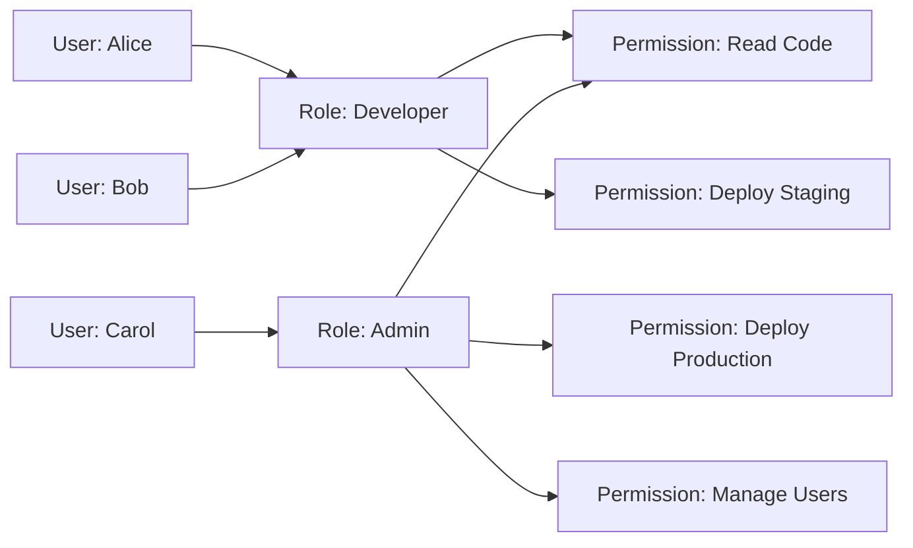
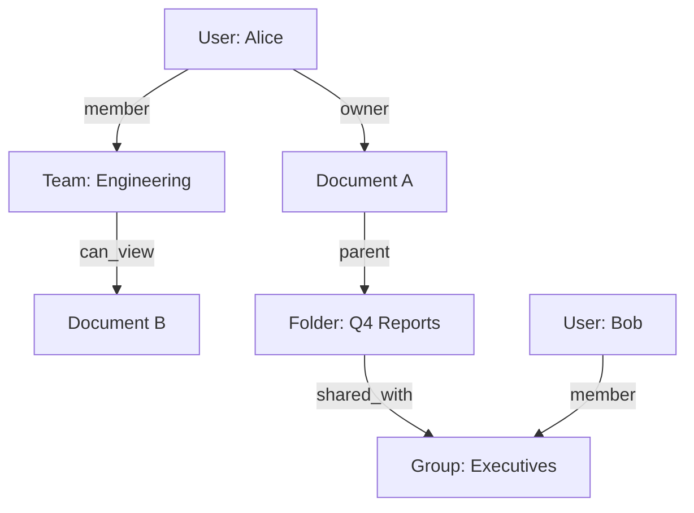
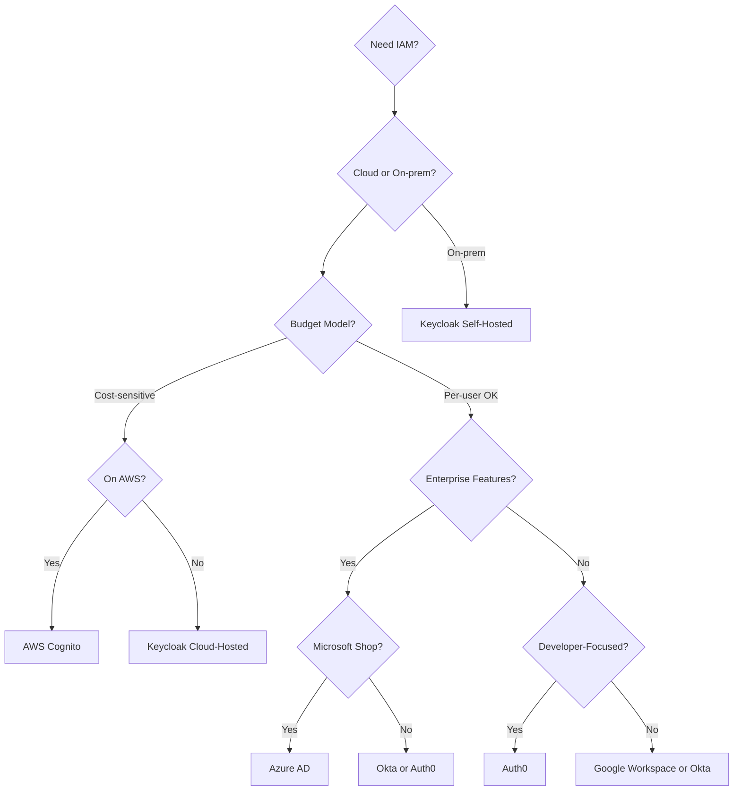

# Identity and Access Management

Managing who can access what resources and under what conditions across applications and organizations.

## Overview

| Aspect | Details |
|--------|---------|
| **Core Problem** | Verify identity (authentication) and control access (authorization) at scale |
| **Key Components** | Identity providers, directory services, policy engines, provisioning systems |
| **Standards** | SAML 2.0, OAuth 2.0, OpenID Connect, SCIM, LDAP |
| **Architecture** | Centralized (single IdP), federated (multiple IdPs), decentralized (self-sovereign) |
| **Modern Trends** | Zero trust, just-in-time access, policy-as-code, passwordless auth |
| **Critical Features** | SSO, MFA, session management, audit logging, emergency access |

## Core Concepts

### Authentication vs Authorization

**Authentication** answers "who are you?" through credentials, biometrics, or tokens. **Authorization** answers "what can you do?" through policies, roles, or attributes.

### Identity Provider (IdP)

Central authority that creates, maintains, and manages identity information. Handles authentication and issues tokens/assertions that applications trust.

### Federation

Trust relationship between multiple identity providers, allowing users from one organization to access resources in another without separate credentials. Common in B2B scenarios and multi-cloud environments.

### Single Sign-On (SSO)

Authenticate once, access multiple applications. Reduces password fatigue, improves security through centralized policy enforcement, and simplifies user experience.

### Provisioning

Creating, updating, and deactivating user accounts across systems. SCIM (System for Cross-domain Identity Management) standardizes automated provisioning via REST APIs.

## Access Control Models

| Model | Description | Best For | Example |
|-------|-------------|----------|---------|
| **RBAC** | Role-Based Access Control - permissions assigned to roles, users assigned to roles | Structured organizations with clear job functions | "Developers can deploy to staging, Ops can deploy to production" |
| **ABAC** | Attribute-Based Access Control - policies evaluate user/resource/environment attributes | Dynamic, context-aware decisions | "Allow if department=Finance AND location=HQ AND time=business_hours" |
| **ReBAC** | Relationship-Based Access Control - permissions based on graph relationships | Multi-tenant apps, social networks, collaborative tools | "Allow if user is owner of document OR in document's shared_with list" |
| **PBAC** | Policy-Based Access Control - centralized policies define all access rules | Complex compliance requirements | "Allow only if user cleared background check AND resource classified ≤ user clearance" |
| **ACL** | Access Control Lists - per-resource list of principals and permissions | Simple systems, filesystem permissions | "File X: Alice (read,write), Bob (read)" |

### RBAC Deep Dive



**Strengths**: Simple to understand, easy to audit, maps to organizational structure
**Limitations**: Role explosion with complex requirements, hard to express context, inflexible for dynamic scenarios

### ABAC Deep Dive

Evaluates boolean expressions over attributes:

```python
# Policy example (pseudocode)
ALLOW IF (
    user.department == "Finance" AND
    resource.classification == "Public" AND
    request.action == "read" AND
    environment.time BETWEEN 09:00 AND 17:00 AND
    environment.ip IN corporate_network
)
```

**Strengths**: Highly flexible, context-aware, reduces policy count
**Limitations**: Complex to design and debug, performance overhead, requires attribute infrastructure

### ReBAC Deep Dive

Models relationships as a graph, queries for paths between user and resource:



**Strengths**: Natural for hierarchies and sharing, supports transitive permissions, intuitive for users
**Limitations**: Complex queries can be slow, requires graph database or specialized engine, harder to audit

## Protocol Comparison

| Protocol | Purpose | Flow | Token Format | Common Use |
|----------|---------|------|--------------|------------|
| **SAML 2.0** | Enterprise SSO | Browser redirects with XML assertions | Signed XML | Legacy enterprise apps, HR systems |
| **OAuth 2.0** | Delegated authorization | Multiple grant types (authorization code, client credentials, etc.) | Opaque or JWT access tokens | API access, third-party app permissions |
| **OpenID Connect** | Authentication layer on OAuth 2.0 | Authorization code flow + ID token | JWT ID token + access token | Modern SSO, mobile apps, SPAs |
| **LDAP** | Directory access protocol | Bind, search, modify operations | N/A (directory protocol) | Corporate directories, on-prem systems |
| **SCIM** | User provisioning | REST API for CRUD on users/groups | JSON | Automated user lifecycle management |

### SAML vs OpenID Connect

| Aspect | SAML 2.0 | OpenID Connect |
|--------|----------|----------------|
| **Format** | XML | JSON |
| **Complexity** | High (cryptic error messages, verbose) | Low (REST-based, readable) |
| **Mobile Support** | Poor (designed for browsers) | Excellent |
| **API Access** | Not designed for it | Native support via access tokens |
| **Adoption** | Legacy enterprises | Modern apps, cloud-native |
| **Security** | Mature, well-vetted | Modern crypto, simpler implementation |

**Decision**: Use OIDC for new systems. Use SAML only when integrating with legacy enterprise IdPs that don't support OIDC.

## Identity Providers

### Comparison

| Provider | Type | Strengths | Pricing Model | Best For |
|----------|------|-----------|---------------|----------|
| **Okta** | Cloud SaaS | Extensive integrations, enterprise features, lifecycle management | Per user/month | Large enterprises, complex workflows |
| **Auth0** | Cloud SaaS | Developer-friendly, customizable login UI, rules engine | MAU-based | B2C apps, developer experience priority |
| **Azure AD** | Cloud SaaS | Deep Microsoft integration, hybrid identity, conditional access | Per user/month or bundled with M365 | Microsoft-heavy orgs, Office 365 users |
| **Keycloak** | Self-hosted OSS | Full control, no per-user costs, highly customizable | Free (self-managed costs) | Cost-sensitive, on-prem requirements, full control |
| **AWS Cognito** | Cloud SaaS | AWS integration, scales automatically, simple for basic use | Pay per MAU | AWS-native apps, serverless architectures |
| **Google Workspace** | Cloud SaaS | Google ecosystem integration, simple admin | Per user/month | Google Workspace orgs, simple needs |
| **Ping Identity** | Cloud/On-prem | Enterprise-grade, flexible deployment, API security | Enterprise licensing | Large regulated enterprises, hybrid cloud |

### Decision Guide



**Choose Okta if**: Large enterprise, need broad app catalog, lifecycle management critical, compliance requirements
**Choose Auth0 if**: Developer experience matters, B2C use case, need custom login flows, rules/hooks flexibility
**Choose Azure AD if**: Microsoft-centric, Office 365 users, hybrid AD + cloud, conditional access policies
**Choose Keycloak if**: Self-hosting preferred, cost-sensitive, need full customization, open-source requirement
**Choose AWS Cognito if**: AWS-native architecture, simple auth needs, serverless apps, pay-per-use model

## Policy Engines

### Open Policy Agent (OPA)

**Language**: Rego (declarative logic language)
**Architecture**: Sidecar or library, policy-as-code in version control
**Use Cases**: Kubernetes admission control, API authorization, microservices

```rego
# Example OPA policy
package authz

default allow = false

allow {
    user_is_admin
}

allow {
    user_is_developer
    action_is_read
}

user_is_admin {
    input.user.roles[_] == "admin"
}
```

**Strengths**: Language-agnostic, high performance, policy decoupling, extensive tooling
**Considerations**: Learning curve for Rego, requires infrastructure for policy distribution

### AWS Cedar

**Language**: Cedar (purpose-built policy language)
**Architecture**: Embedded library or service (AWS Verified Permissions)
**Use Cases**: Application authorization, AWS resources, fine-grained access control

```cedar
// Example Cedar policy
permit (
    principal == User::"alice",
    action == Action::"view",
    resource in Folder::"documents"
)
when {
    context.ip_address.isInRange("10.0.0.0/8")
};
```

**Strengths**: Formally verified, human-readable, schema-enforced, AWS integration
**Considerations**: Newer ecosystem, primarily AWS-focused (though open-source)

### Comparison

| Aspect | OPA | Cedar |
|--------|-----|-------|
| **Maturity** | Production-ready since 2016 | Released 2022 |
| **Language** | Rego (logic programming) | Cedar (imperative-style) |
| **Verification** | Testing and tooling | Formal verification built-in |
| **Ecosystem** | Broad (K8s, Envoy, Terraform, etc.) | Growing (AWS-native) |
| **Learning Curve** | Moderate-High | Low-Moderate |
| **Performance** | Very fast | Very fast |

**Decision**: Use OPA for Kubernetes and established ecosystems. Use Cedar for AWS-native apps or when formal verification is critical.

## Advanced Patterns

### Just-In-Time (JIT) Access

Provide elevated privileges only when needed, for limited time, with approval workflow.

**Benefits**: Reduces standing privileges, improves audit trail, limits blast radius of compromised accounts
**Implementation**: Approval bot + temporary role assignment + automatic revocation
**Tools**: Teleport, CyberArk, custom with IdP APIs

### Zero Trust Architecture

Never trust, always verify. Authenticate and authorize every request regardless of network location.

**Principles**:
- Verify explicitly (use all data points: identity, device, location, behavior)
- Least privilege access (just-enough, just-in-time)
- Assume breach (segment access, verify end-to-end encryption, analytics for threat detection)

**Implementation**:
- Strong authentication (MFA, passwordless)
- Device trust (MDM, compliance checks)
- Micro-segmentation (per-resource policies)
- Continuous verification (risk-based re-authentication)

### Passwordless Authentication

Eliminate passwords using FIDO2/WebAuthn, magic links, or biometrics.

**Methods**:
- **FIDO2/WebAuthn**: Hardware keys or platform authenticators (Face ID, Windows Hello)
- **Magic Links**: One-time URLs sent to verified email
- **Passkeys**: Synced FIDO2 credentials across devices (Apple/Google/Microsoft)
- **SMS/OTP**: Fallback only (vulnerable to SIM swapping)

**Benefits**: Eliminates phishing, credential stuffing, password reuse
**Considerations**: User education, fallback mechanisms, device loss scenarios

### Session Management

**Best Practices**:
- Short-lived access tokens (5-15 minutes)
- Longer-lived refresh tokens with rotation
- Sliding session expiration for active users
- Absolute maximum session length (e.g., 8 hours)
- Device binding to prevent token theft
- Revocation on logout, password change, or suspicious activity

## Security Considerations

### Token Security

- **Storage**: Use httpOnly, secure, SameSite cookies for web. Secure enclave/keychain for mobile
- **Transport**: Always HTTPS/TLS 1.3, certificate pinning for mobile
- **Validation**: Verify signature, issuer, audience, expiration on every request
- **Rotation**: Refresh tokens should rotate on use, old tokens invalidated

### Common Vulnerabilities

| Vulnerability | Description | Mitigation |
|---------------|-------------|------------|
| **Credential Stuffing** | Reuse of leaked passwords from other breaches | Passwordless, breach monitoring, MFA |
| **Session Fixation** | Attacker sets victim's session ID | Regenerate session ID after login |
| **Token Theft** | Stolen access/refresh tokens | Short expiration, device binding, anomaly detection |
| **Privilege Escalation** | User gains unauthorized higher privileges | Strict RBAC, approval workflows, audit logging |
| **Broken Access Control** | Authorization checks missing or flawed | Deny-by-default, centralized policy enforcement |
| **Account Takeover** | Attacker gains control of legitimate account | MFA, impossible travel detection, device fingerprinting |

### Audit and Compliance

**Log Everything**:
- Authentication attempts (success and failure)
- Authorization decisions
- Permission changes
- Administrative actions
- Token issuance and revocation

**Compliance Requirements**:
- SOC 2: Access reviews, separation of duties, audit trails
- GDPR: Right to access, right to be forgotten, consent management
- HIPAA: Minimum necessary access, emergency access procedures, encryption
- PCI DSS: Multi-factor authentication, quarterly access reviews, role-based access

## Implementation Checklist

### Basic IAM

- [ ] Choose identity provider aligned with organization size and needs
- [ ] Implement SSO for all internal applications
- [ ] Enforce MFA for all users (or at least privileged accounts)
- [ ] Define roles and permissions following least privilege
- [ ] Set up automated provisioning/deprovisioning
- [ ] Configure session timeouts and token expiration
- [ ] Implement audit logging for authentication and authorization

### Advanced IAM

- [ ] Deploy policy engine (OPA/Cedar) for fine-grained authorization
- [ ] Implement just-in-time access for privileged operations
- [ ] Configure risk-based authentication (step-up auth for sensitive actions)
- [ ] Set up automated access reviews and certifications
- [ ] Implement emergency access procedures with break-glass accounts
- [ ] Deploy device trust and conditional access policies
- [ ] Integrate SIEM for security monitoring and anomaly detection
- [ ] Establish federation with partner organizations if needed

### Zero Trust Progression

- [ ] Inventory all resources and data classification
- [ ] Implement strong authentication (MFA minimum, passwordless preferred)
- [ ] Deploy device management and compliance checking
- [ ] Segment network and applications (micro-segmentation)
- [ ] Move to per-request authorization (no implicit trust from network)
- [ ] Implement continuous monitoring and risk scoring
- [ ] Encrypt all data in transit and at rest
- [ ] Verify explicitly on every access attempt

## Related

- [[Security Concepts]]
- [[Auth Standards & RFCs]]
- [[OAuth 2.0]]
- [[OpenID Connect]]
- [[SAML]]
- [[Zero Trust Architecture]]
- [[API Security]]
- [[Cryptography]]
