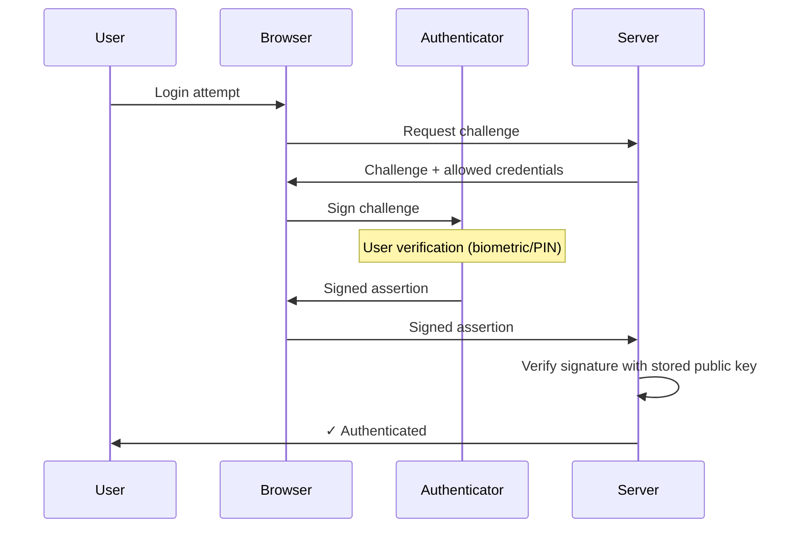
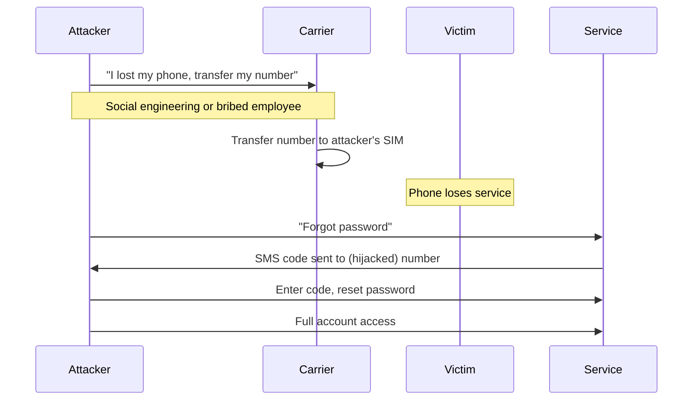
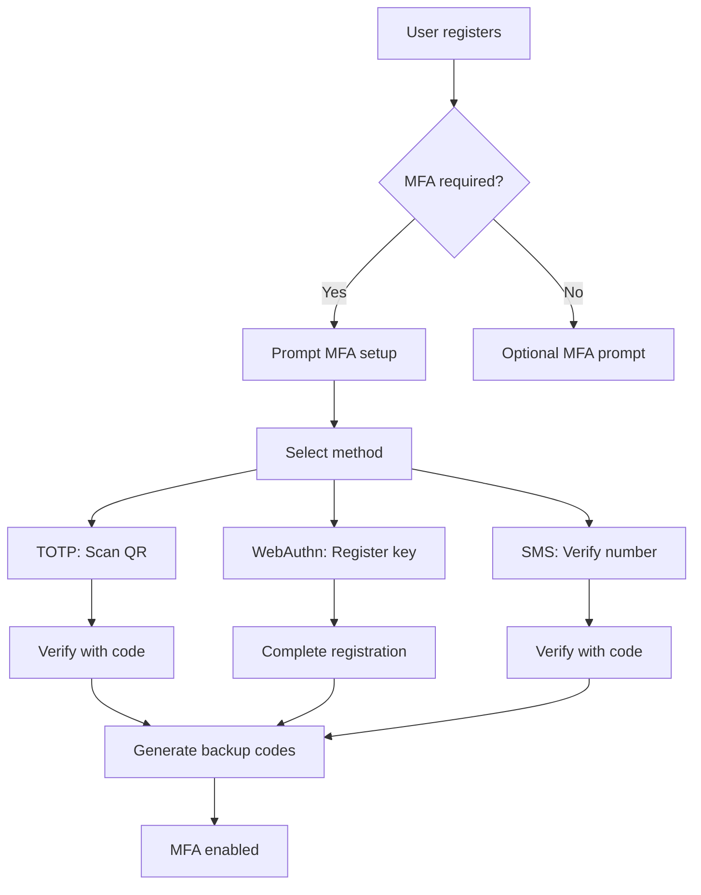
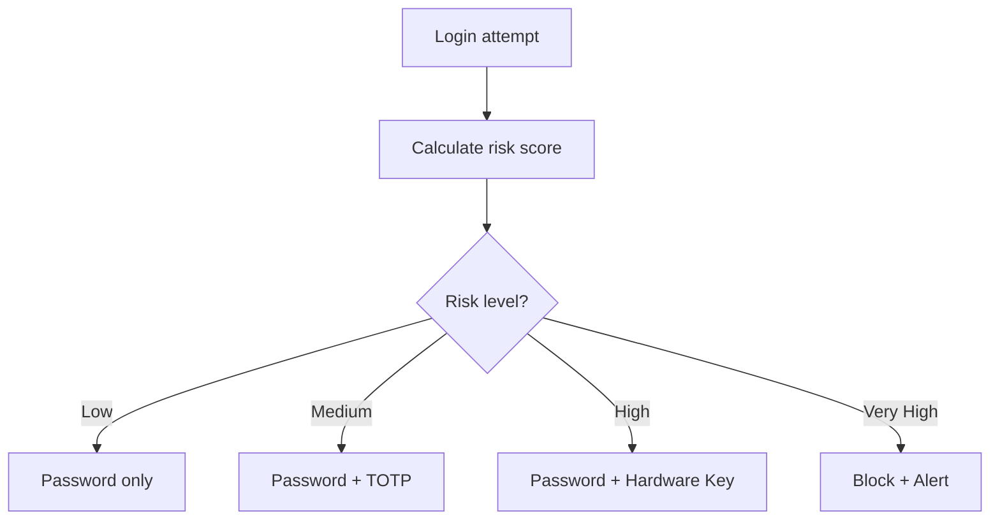

# Multi-Factor Authentication

Authentication requiring multiple independent credentials from different categories, significantly reducing account compromise risk.

## Overview

| Aspect | Details |
|--------|---------|
| **Purpose** | Defense in depth for authentication |
| **Principle** | Compromise of one factor doesn't grant access |
| **Factors** | Something you know, have, are |
| **Common Forms** | Password + TOTP, Password + Hardware Key, Biometric + PIN |
| **Standards** | NIST SP 800-63B, FIDO2/WebAuthn |

## Authentication Factors

### The Three Categories

| Factor | Description | Examples |
|--------|-------------|----------|
| **Knowledge** (something you know) | Secret information | Password, PIN, security questions |
| **Possession** (something you have) | Physical object | Phone, hardware token, smart card |
| **Inherence** (something you are) | Biometric trait | Fingerprint, face, iris, voice |

### Additional Factors (Context-Based)

| Factor | Description | Examples |
|--------|-------------|----------|
| **Location** | Geographic position | GPS, IP geolocation |
| **Time** | Temporal patterns | Business hours, usual login times |
| **Behavior** | Usage patterns | Typing rhythm, mouse movement |

Context factors are typically used for **adaptive/risk-based authentication**, not as primary factors.

### True MFA vs False MFA

| Configuration | True MFA? | Why |
|--------------|-----------|-----|
| Password + TOTP | ✅ Yes | Knowledge + Possession |
| Password + Hardware Key | ✅ Yes | Knowledge + Possession |
| Password + Fingerprint | ✅ Yes | Knowledge + Inherence |
| Password + Security Question | ❌ No | Both are Knowledge |
| Two passwords | ❌ No | Same factor twice |
| SMS code only | ❌ No | Single factor (weak possession) |

## MFA Methods Comparison

### Comprehensive Comparison

| Method | Phishing Resistant | Convenience | Security | Cost |
|--------|-------------------|-------------|----------|------|
| **WebAuthn/Passkeys** | ✅ Excellent | ✅ Easy | ✅ Excellent | Low |
| **Hardware Security Key** | ✅ Excellent | ⚠️ Carry device | ✅ Excellent | $25-70 |
| **TOTP Apps** | ⚠️ Partial | ✅ Good | ✅ Good | Free |
| **Push Notifications** | ⚠️ Partial | ✅ Easy | ✅ Good | Varies |
| **Smart Cards** | ✅ Excellent | ⚠️ Infrastructure | ✅ Excellent | High |
| **SMS OTP** | ❌ Poor | ✅ Easy | ❌ Weak | Low |
| **Email OTP** | ❌ Poor | ✅ Easy | ⚠️ Weak | Free |
| **Voice Call** | ❌ Poor | ⚠️ Slow | ❌ Weak | Low |

### Method Details

#### WebAuthn / FIDO2 / Passkeys

**Why it's phishing-resistant:**
- Authenticator checks origin (domain) before signing
- Credentials are bound to specific websites
- Private key never leaves the authenticator

| Aspect | Details |
|--------|---------|
| **Pros** | Phishing-proof, passwordless capable, excellent UX |
| **Cons** | Requires modern browser/platform support |
| **Examples** | YubiKey, Touch ID, Windows Hello, Passkeys |

#### TOTP/HOTP Authenticator Apps

See [[One-Time Password]] for detailed coverage.

| Aspect | Details |
|--------|---------|
| **Pros** | Offline, standardized, widely supported |
| **Cons** | Real-time phishing possible, secret can be cloned |
| **Examples** | Google Authenticator, Authy, Microsoft Authenticator |

#### Push Notifications

| Aspect | Details |
|--------|---------|
| **Pros** | Easy UX, shows context (location, device) |
| **Cons** | Requires network, push fatigue attacks |
| **Examples** | Duo, Microsoft Authenticator, Okta Verify |

**Push Fatigue Attack:** Attacker repeatedly triggers push notifications until user accidentally approves. Mitigations: number matching, rate limiting, anomaly detection.

#### Hardware Security Keys

| Aspect | Details |
|--------|---------|
| **Pros** | Strongest security, phishing-proof |
| **Cons** | Physical device to carry, cost |
| **Examples** | YubiKey, Google Titan, Feitian |

## Why SMS is Bad for Authentication

### The Problems with SMS OTP

| Vulnerability | Description | Real-World Impact |
|---------------|-------------|-------------------|
| **SIM Swapping** | Attacker convinces carrier to transfer number | Twitter CEO hack (2019) |
| **SS7 Attacks** | Exploit telecom protocol to intercept SMS | German bank heists (2017) |
| **Malware** | Android malware reads SMS | Banking trojans |
| **Social Engineering** | Trick user into forwarding code | Account takeovers |
| **Number Recycling** | Old numbers reassigned to new users | Account recovery attacks |
| **No Encryption** | SMS transmitted in plaintext | Interception possible |

### SIM Swapping in Detail

**How common?**
- FBI reported 1,611 SIM swapping complaints in 2021 ($68M losses)
- Often targets cryptocurrency holders, executives

### SS7 Vulnerabilities

SS7 (Signaling System 7) is the protocol telecom carriers use to exchange information.

| Attack | Description |
|--------|-------------|
| **Interception** | Redirect SMS to attacker-controlled number |
| **Location tracking** | Track any phone's location |
| **Call interception** | Listen to voice calls |

**Who can exploit SS7?**
- State actors
- Telecom insiders
- Anyone who can access SS7 network (surprisingly accessible)

### When SMS is Still Used

| Scenario | Acceptable? | Notes |
|----------|-------------|-------|
| **Low-value accounts** | ⚠️ Maybe | Better than nothing |
| **Password reset** | ❌ Avoid | Use email or better methods |
| **Banking** | ❌ Bad | Yet still common |
| **Emergency fallback** | ⚠️ Last resort | Have better primary method |

### Regulatory Guidance

| Authority | Position on SMS |
|-----------|-----------------|
| **NIST 800-63B** | "Restricted" authenticator, discouraged |
| **PCI DSS 4.0** | Phishing-resistant MFA required for admin access |
| **FFIEC (Banking)** | Additional controls required if SMS used |

## Implementing MFA

### Enrollment Flow

### Best Practices

**For Organizations:**

| Practice | Description |
|----------|-------------|
| **Offer multiple methods** | WebAuthn + TOTP at minimum |
| **Deprecate SMS** | Remove or restrict SMS option |
| **Require MFA for sensitive ops** | Admin actions, financial, data export |
| **Provide backup codes** | Prevent lockout |
| **Monitor for anomalies** | Detect MFA fatigue attacks |

**For Users:**

| Practice | Description |
|----------|-------------|
| **Use hardware keys** | For high-value accounts |
| **Enable on all accounts** | Email, banking, social media |
| **Store backup codes safely** | Password manager or physical safe |
| **Use authenticator apps over SMS** | Always prefer TOTP |
| **Register multiple methods** | Redundancy prevents lockout |

### Recovery Considerations

| Scenario | Recovery Method |
|----------|-----------------|
| **Lost phone** | Backup codes, secondary method |
| **Lost hardware key** | Registered backup key, backup codes |
| **Lost everything** | Identity verification process |

**Critical:** Plan recovery before it's needed. Users locked out without recovery options is common.

## Adaptive / Risk-Based Authentication

Adjust authentication requirements based on risk signals.

| Signal | Low Risk | High Risk |
|--------|----------|-----------|
| **Location** | Home country | Foreign VPN |
| **Device** | Known device | New device |
| **Behavior** | Normal patterns | Unusual activity |
| **Time** | Business hours | 3 AM |
| **Action** | Read data | Delete account |

## Enterprise MFA Solutions

| Solution | Type | Key Features |
|----------|------|--------------|
| **Okta** | IdP + MFA | Adaptive, wide integrations |
| **Duo Security** | MFA | Push, trusted endpoints |
| **Microsoft Entra ID** | IdP + MFA | Passwordless, Conditional Access |
| **Google Workspace** | IdP + MFA | Context-aware access |
| **Auth0** | IdP + MFA | Developer-friendly |
| **Ping Identity** | IdP + MFA | Enterprise features |

## Passwordless Authentication

MFA evolution: remove the password entirely.

| Method | How It Works |
|--------|--------------|
| **Passkeys** | WebAuthn credential replaces password |
| **Magic Links** | Email link with token |
| **Biometric + Device** | Face/fingerprint tied to device possession |

**Passwordless benefits:**
- No password to phish, steal, or forget
- Better UX (no password entry)
- Reduces account lockouts

## Related

- [[One-Time Password]] — TOTP/HOTP details
- [[Identity and Access Management]]
- [[Auth Standards & RFCs]]
- [[Security Concepts]]
- [[Cryptography]]

## References

- [NIST SP 800-63B](https://pages.nist.gov/800-63-3/sp800-63b.html) — Digital Identity Guidelines
- [FIDO Alliance](https://fidoalliance.org/) — WebAuthn/Passkeys standards
- [SMS Security Best Practices](https://www.cisa.gov/mfa) — CISA guidance
