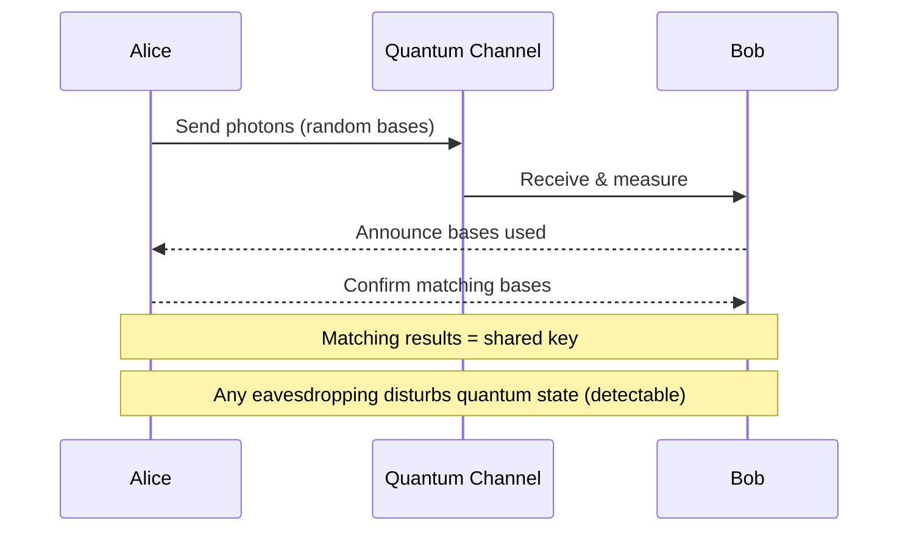

# One-Time Pad

The only encryption scheme proven to provide **perfect secrecy** — mathematically unbreakable regardless of computational power.

## Overview

| Aspect | Details |
|--------|---------|
| **Invented** | Gilbert Vernam (1917), Claude Shannon proved security (1949) |
| **Security** | Information-theoretic (unconditional) security |
| **Key Property** | Key must be at least as long as the message |
| **Practical Use** | Limited (diplomatic, military hot lines historically) |
| **Modern Relevance** | Theoretical foundation, QKD applications |

## How It Works

### Encryption

```
Plaintext:  H  E  L  L  O     (ASCII or binary)
Key:        X  M  C  K  Q     (truly random, same length)
XOR:        ⊕  ⊕  ⊕  ⊕  ⊕
Ciphertext: P  Q  N  V  E     (result)
```

**Binary example:**

```
Plaintext:  01001000  (H)
Key:        01011000  (X)
XOR:        --------
Ciphertext: 00010000  (result)
```

### Decryption

```
Ciphertext: 00010000
Key:        01011000  (same key)
XOR:        --------
Plaintext:  01001000  (H recovered)
```

XOR is self-inverse: `(P ⊕ K) ⊕ K = P`

## Requirements for Perfect Secrecy

All four conditions must be met. Violating **any one** destroys security.

| Requirement | Description | Violation Impact |
|-------------|-------------|------------------|
| **Key length ≥ message length** | Key must be at least as long as the plaintext | Patterns become detectable |
| **Key is truly random** | Must use cryptographically secure random source | Predictable keys can be guessed |
| **Key used only once** | Never reuse any portion of the key | Two-time pad attack |
| **Key kept secret** | Only sender and receiver possess the key | Obvious compromise |

## Shannon's Proof

Claude Shannon proved in "Communication Theory of Secrecy Systems" (1949):

> For perfect secrecy, the key must have at least as much entropy as the plaintext.

**Information-theoretic security:** Given the ciphertext, every possible plaintext is equally likely. No amount of computation helps — there's literally no information to extract.

```
Given ciphertext "PQNVE":
- Could decrypt to "HELLO" (with key "XMCKQ")
- Could decrypt to "WORLD" (with key "CVQIQ")
- Could decrypt to "XXXXX" (with key "HLNYJ")
- All equally probable
```

## The Two-Time Pad Attack

What happens when keys are reused:

```
Message 1:  P₁ ⊕ K = C₁
Message 2:  P₂ ⊕ K = C₂

Attacker computes: C₁ ⊕ C₂ = P₁ ⊕ K ⊕ P₂ ⊕ K = P₁ ⊕ P₂
```

The attacker now has the XOR of two plaintexts — key completely cancels out!

### Exploiting P₁ ⊕ P₂

**Crib dragging:** If attacker knows or guesses part of one message, they can recover the other.

```
If P₁ contains "the " at position 10:
XOR "the " with C₁ ⊕ C₂ at position 10
Result reveals that portion of P₂
```

**Historical failure:** Soviet "VENONA" project. USSR reused one-time pads during WWII; US cryptanalysts recovered thousands of messages.

## Practical Challenges

### Key Distribution Problem

| Challenge | Description |
|-----------|-------------|
| **Pre-shared keys** | Must securely exchange key material equal to all future messages |
| **Physical transport** | Historically: diplomatic pouches, trusted couriers |
| **Key storage** | Secure storage for potentially massive key material |
| **Key synchronization** | Both parties must track position in key stream |

### Key Generation

| Source | Suitable? | Notes |
|--------|-----------|-------|
| **Hardware RNG** | ✅ Yes | Radioactive decay, thermal noise, quantum effects |
| **Cryptographic PRNG** | ❌ No | Deterministic, reduces to computational security |
| **Pseudo-random** | ❌ No | Predictable patterns |
| **Human-generated** | ❌ No | Humans are terrible at randomness |

### Scale Problem

| Scenario | Key Required |
|----------|--------------|
| Encrypt 1 MB file | 1 MB of random key material |
| Daily 100 KB messages for 1 year | ~36.5 GB of pre-shared keys |
| Video call (1 Mbps) for 1 hour | ~450 MB per direction |

## Historical Uses

### Moscow-Washington Hotline

Established 1963 after Cuban Missile Crisis. Originally used one-time tape system.

**Process:**

1. Key tapes produced in each country
2. Physical exchange of tapes
3. Teletype messages encrypted with OTP
4. Each tape section used once, then destroyed

### Number Stations

Shortwave radio broadcasts of encrypted messages to field agents.

```
"5-7-2... 3-9-1... 8-4-6..."
```

Agent has matching OTP booklet; tears out and destroys each page after use.

### SIGSALY

WWII voice encryption between Churchill and Roosevelt. Used vinyl records of random noise.

## Modern Applications

### Quantum Key Distribution (QKD)

Uses quantum mechanics to securely distribute keys for OTP.



**Advantage:** Laws of physics guarantee security
**Limitation:** Distance (fiber: ~100 km, satellite: global), expensive equipment

### One-Time Password (Different OTP!)

Confusingly, "OTP" also refers to one-time passwords (TOTP, HOTP).

| Term | Meaning | Security |
|------|---------|----------|
| **One-Time Pad** | Encryption with random key = message length | Information-theoretic |
| **One-Time Password** | Time-based authentication codes (Google Authenticator) | Computational |

These are **completely different** concepts that share an acronym.

## Comparison with Modern Cryptography

| Aspect | One-Time Pad | AES-256 |
|--------|--------------|---------|
| **Security type** | Information-theoretic | Computational |
| **Key size** | = message size | 256 bits (fixed) |
| **Key reuse** | ❌ Never | ✅ Safe with proper IV/nonce |
| **Practicality** | Low | High |
| **Quantum resistance** | ✅ Perfect | ✅ Grover halves security |
| **Proven security** | ✅ Mathematical proof | Assumed (no known attacks) |

## Stream Ciphers: Practical Approximation

Modern stream ciphers (ChaCha20, AES-CTR) approximate OTP:

```
OTP:           Plaintext ⊕ Random_Key
Stream cipher: Plaintext ⊕ PRG(Short_Key)
```

**Trade-off:**

- OTP: Unconditional security, impractical key distribution
- Stream cipher: Computational security, practical 256-bit keys

## When to Use

### Appropriate Use Cases

| Scenario | Rationale |
|----------|-----------|
| **Highest-security government communications** | When stakes justify logistics |
| **Quantum key distribution systems** | QKD naturally produces OTP keys |
| **Theoretical analysis** | Baseline for security proofs |

### Inappropriate Use Cases

| Scenario | Better Alternative |
|----------|-------------------|
| **General encryption** | AES-256-GCM |
| **Internet communications** | TLS 1.3 |
| **File encryption** | ChaCha20-Poly1305 |
| **Most real-world applications** | Standard cryptographic algorithms |

## Common Misconceptions

| Misconception | Reality |
|---------------|---------|
| "Any XOR encryption is OTP" | Only true OTP with proper key management |
| "Long random-looking key = OTP" | Must be truly random, truly one-time |
| "OTP is always the best choice" | Key management usually makes it impractical |
| "Breaking OTP just requires more computing power" | No amount of computation helps — mathematically impossible |

## Related

- [[Cryptography]]
- [[Forward Secrecy]]
- [[Cryptographic Algorithms Comparison]]
- [[Security Concepts]]

## References

- Shannon, C. (1949). "Communication Theory of Secrecy Systems"
- [VENONA Project Declassified](https://www.nsa.gov/Helpful-Links/NSA-FOIA/Declassification-Transparency-Initiatives/Historical-Releases/VENONA/)
- [Quantum Key Distribution Overview](https://www.etsi.org/technologies/quantum-key-distribution)
