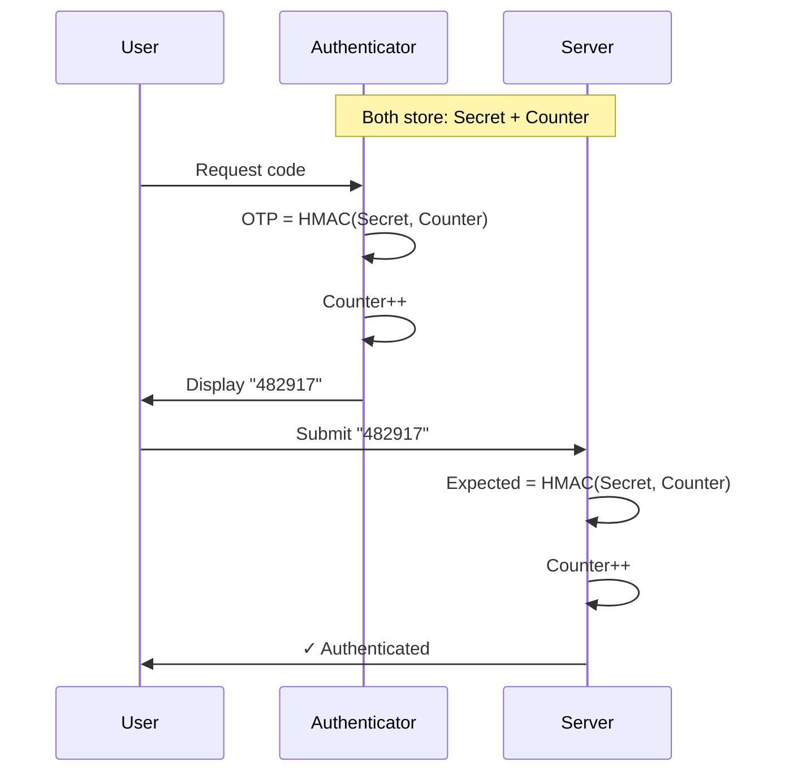
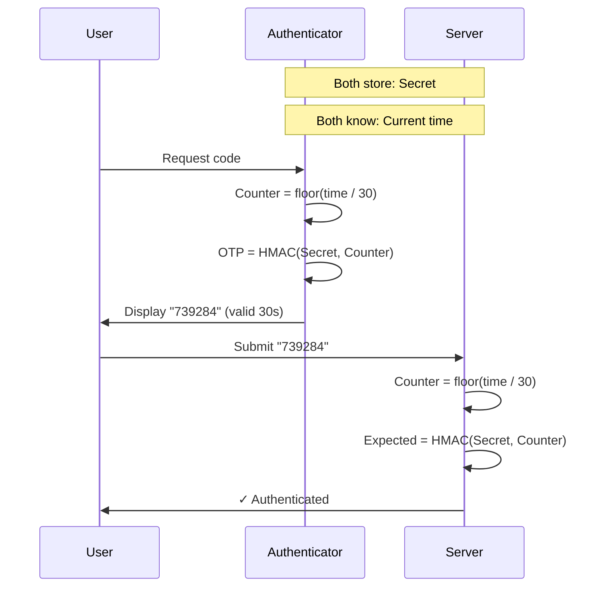

# One-Time Password

Short-lived authentication codes used for two-factor authentication (2FA), providing a second layer of security beyond passwords.

## Overview

| Aspect | Details |
|--------|---------|
| **Purpose** | Second authentication factor ("something you have") |
| **Types** | TOTP (time-based), HOTP (counter-based) |
| **Standards** | RFC 4226 (HOTP), RFC 6238 (TOTP) |
| **Common Apps** | Google Authenticator, Authy, Microsoft Authenticator, 1Password |
| **Code Length** | Typically 6-8 digits |

> **Not to be confused with:** [[One-Time Pad]] — a completely different cryptographic concept (encryption cipher with perfect secrecy).

## HOTP (Counter-Based)

HMAC-based One-Time Password (RFC 4226).

### How It Works

```
OTP = Truncate(HMAC-SHA1(Secret, Counter)) mod 10^d
```

Where:

- **Secret**: Shared key between server and authenticator
- **Counter**: Incrementing value, synchronized between parties
- **d**: Number of digits (typically 6)



### Synchronization Problem

If user generates codes without submitting them, counters desync.

**Solution:** Server accepts codes within a "look-ahead window" (e.g., next 10 counter values).

| Aspect | HOTP Behavior |
|--------|---------------|
| **Valid until** | Used or superseded |
| **Sync issue** | Counter drift if codes generated but not used |
| **Use case** | Hardware tokens, offline scenarios |

## TOTP (Time-Based)

Time-based One-Time Password (RFC 6238). Most common form today.

### How It Works

```
Counter = floor(CurrentUnixTime / TimeStep)
OTP = Truncate(HMAC-SHA1(Secret, Counter)) mod 10^d
```

Where:

- **TimeStep**: Usually 30 seconds
- **CurrentUnixTime**: Seconds since Unix epoch



### Time Window

| Parameter | Typical Value |
|-----------|---------------|
| **Time step** | 30 seconds |
| **Clock skew tolerance** | ±1 step (allows previous/next code) |
| **Effective validity** | ~90 seconds with tolerance |

### TOTP vs HOTP

| Aspect | TOTP | HOTP |
|--------|------|------|
| **Validity** | ~30 seconds | Until used |
| **Sync mechanism** | Time | Counter |
| **Clock dependency** | Yes | No |
| **Security** | Higher (expires) | Lower (replay window) |
| **Common use** | Authenticator apps | Hardware tokens |

## Implementation Details

### Secret Generation

```
Secret: 20+ bytes from CSPRNG
Encoding: Base32 for QR codes / manual entry
Example: JBSWY3DPEHPK3PXP
```

**Requirements:**

- Minimum 128 bits entropy (160 bits recommended)
- Generated server-side using secure random
- Stored encrypted, never in plaintext

### Provisioning URI

Standard format for QR codes (Google Authenticator compatible):

```
otpauth://totp/Example:alice@example.com?secret=JBSWY3DPEHPK3PXP&issuer=Example&algorithm=SHA1&digits=6&period=30
```

| Parameter | Description | Default |
|-----------|-------------|---------|
| `secret` | Base32-encoded shared secret | Required |
| `issuer` | Service name | — |
| `algorithm` | HMAC algorithm | SHA1 |
| `digits` | Code length | 6 |
| `period` | Time step (TOTP only) | 30 |

### Algorithm Options

| Algorithm | Security | Compatibility |
|-----------|----------|---------------|
| **SHA-1** | Adequate for HMAC | ✅ Universal |
| **SHA-256** | Better margin | ⚠️ Limited app support |
| **SHA-512** | Highest margin | ⚠️ Limited app support |

SHA-1's collision weaknesses don't affect HMAC security. SHA-1 remains acceptable for TOTP/HOTP.

## Security Considerations

### Strengths

| Benefit | Description |
|---------|-------------|
| **Phishing resistant** | Code changes, can't reuse captured codes |
| **Offline capable** | No network needed for code generation |
| **No SMS dependency** | Avoids SIM swapping attacks |
| **Standardized** | Interoperable across services |

### Weaknesses

| Risk | Mitigation |
|------|------------|
| **Phishing (real-time)** | Attacker proxies code immediately | Use WebAuthn/FIDO2 instead |
| **Secret compromise** | Attacker clones authenticator | Encrypt secrets at rest |
| **Device loss** | User locked out | Backup codes, recovery flow |
| **Malware** | Keylogger captures code | Hardware tokens, platform auth |

### Backup Codes

One-time recovery codes for when authenticator unavailable:

```
Backup codes (use each only once):
1. a8f3-92kd-x8m2
2. p3nf-x82j-qk4m
3. r9x2-m4kf-n8p3
...
```

**Best practices:**

- Generate 8-10 codes
- Single-use only
- Store securely (password manager, safe)
- Regenerate periodically

## Comparison with Other 2FA Methods

| Method | Phishing Resistant | Convenience | Security |
|--------|-------------------|-------------|----------|
| **TOTP/HOTP** | ⚠️ Partial | ✅ Good | ✅ Good |
| **SMS OTP** | ❌ No | ✅ Easy | ⚠️ Weak (SIM swap) |
| **Email OTP** | ❌ No | ✅ Easy | ⚠️ Weak |
| **Push notification** | ⚠️ Partial | ✅ Easy | ✅ Good |
| **WebAuthn/FIDO2** | ✅ Yes | ✅ Easy | ✅ Excellent |
| **Hardware token** | ✅ Yes | ⚠️ Carry device | ✅ Excellent |

**Recommendation:** Use WebAuthn/FIDO2 (passkeys) where supported; TOTP as fallback.

## Common Libraries

| Language | Library | Notes |
|----------|---------|-------|
| **Python** | `pyotp` | Simple TOTP/HOTP |
| **JavaScript** | `otplib` | Full-featured |
| **Go** | `pquerna/otp` | Standard choice |
| **Java** | `aerogear-otp-java` | JBoss project |
| **Ruby** | `rotp` | Rails-friendly |
| **C#** | `Otp.NET` | .NET Standard |

### Python Example

```python
import pyotp

# Generate secret
secret = pyotp.random_base32()  # e.g., 'JBSWY3DPEHPK3PXP'

# Create TOTP
totp = pyotp.TOTP(secret)

# Generate current code
code = totp.now()  # e.g., '492039'

# Verify code (with 1 step tolerance)
is_valid = totp.verify(user_input, valid_window=1)

# Generate provisioning URI
uri = totp.provisioning_uri(
    name="alice@example.com",
    issuer_name="MyApp"
)
```

## Authenticator Apps

| App | Platforms | Backup/Sync | Notes |
|-----|-----------|-------------|-------|
| **Google Authenticator** | iOS, Android | Cloud backup | Most common |
| **Microsoft Authenticator** | iOS, Android | Cloud backup | Push + TOTP |
| **Authy** | iOS, Android, Desktop | Encrypted cloud | Multi-device |
| **1Password** | All | Vault sync | Integrated with password manager |
| **Bitwarden** | All | Vault sync | Open source option |

## When to Use

### Appropriate

| Scenario | Notes |
|----------|-------|
| **Account protection** | Standard 2FA for web services |
| **WebAuthn fallback** | When hardware keys unavailable |
| **Offline environments** | No network needed |
| **Cross-platform** | Works everywhere |

### Consider Alternatives

| Scenario | Better Option |
|----------|---------------|
| **High-security accounts** | WebAuthn/FIDO2 hardware keys |
| **Enterprise SSO** | Push-based MFA or smart cards |
| **Passwordless** | Passkeys (WebAuthn) |
| **Phishing-prone users** | Hardware security keys |

## Related

- [[One-Time Pad]] — Different concept (encryption cipher)
- [[Auth Standards & RFCs]]
- [[Identity and Access Management]]
- [[Security Concepts]]
- [[Cryptography]]

## References

- [RFC 4226](https://tools.ietf.org/html/rfc4226) — HOTP specification
- [RFC 6238](https://tools.ietf.org/html/rfc6238) — TOTP specification
- [Google Authenticator Key URI Format](https://github.com/google/google-authenticator/wiki/Key-Uri-Format)
