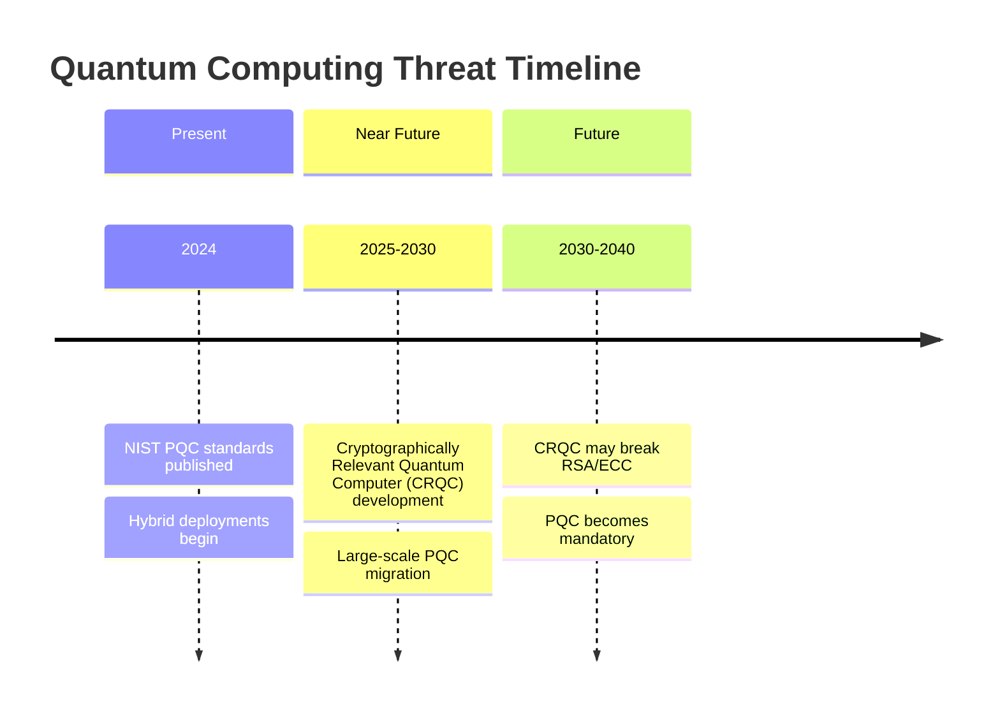
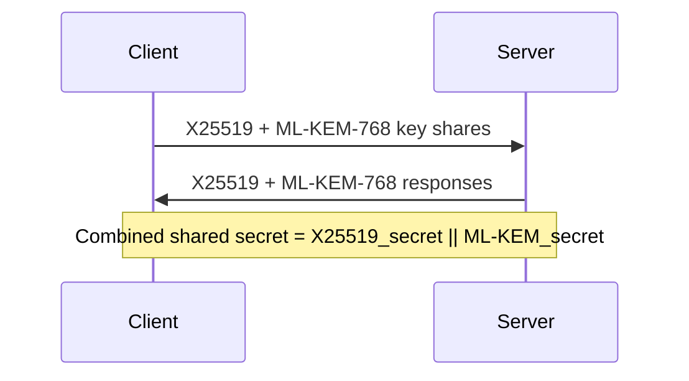

# Post-Quantum Cryptography

Cryptographic algorithms designed to resist attacks from both classical and quantum computers.

## Overview

| Aspect | Details |
|--------|---------|
| **Purpose** | Maintain cryptographic security in the quantum computing era |
| **Threat** | Shor's algorithm breaks RSA, ECC, DSA; Grover's algorithm weakens symmetric crypto |
| **Timeline** | Quantum computers capable of breaking current crypto expected 2030-2040 |
| **Standards Body** | NIST Post-Quantum Cryptography Standardization |
| **Status** | First standards published 2024 (FIPS 203, 204, 205) |

## The Quantum Threat

### Vulnerable Algorithms

| Algorithm Type | Example | Quantum Attack | Impact |
|---------------|---------|----------------|--------|
| **RSA** | RSA-2048 | Shor's algorithm | Completely broken |
| **ECC** | P-256, X25519 | Shor's algorithm | Completely broken |
| **DSA/ECDSA** | Digital signatures | Shor's algorithm | Completely broken |
| **Diffie-Hellman** | DH, ECDH | Shor's algorithm | Completely broken |
| **AES** | AES-256 | Grover's algorithm | Halved security (still secure with larger keys) |
| **SHA-256** | Hashing | Grover's algorithm | Reduced collision resistance (still acceptable) |

### Timeline Considerations



**"Harvest Now, Decrypt Later":** Adversaries may collect encrypted data today to decrypt once quantum computers are available. Long-lived secrets (health records, government data) need quantum-resistant protection now.

## NIST Standardized Algorithms

### ML-KEM (FIPS 203) — Key Encapsulation

Formerly CRYSTALS-Kyber. Module Lattice-based Key Encapsulation Mechanism.

| Parameter Set | Security Level | Public Key | Ciphertext | Shared Secret |
|--------------|----------------|------------|------------|---------------|
| **ML-KEM-512** | 1 (AES-128 equivalent) | 800 bytes | 768 bytes | 32 bytes |
| **ML-KEM-768** | 3 (AES-192 equivalent) | 1,184 bytes | 1,088 bytes | 32 bytes |
| **ML-KEM-1024** | 5 (AES-256 equivalent) | 1,568 bytes | 1,568 bytes | 32 bytes |

**Based on:** Module Learning With Errors (MLWE) problem
**Use cases:** TLS key exchange, VPN, secure messaging

### ML-DSA (FIPS 204) — Digital Signatures

Formerly CRYSTALS-Dilithium. Module Lattice-based Digital Signature Algorithm.

| Parameter Set | Security Level | Public Key | Signature | Secret Key |
|--------------|----------------|------------|-----------|------------|
| **ML-DSA-44** | 2 (collision ~128-bit) | 1,312 bytes | 2,420 bytes | 2,560 bytes |
| **ML-DSA-65** | 3 (collision ~192-bit) | 1,952 bytes | 3,293 bytes | 4,032 bytes |
| **ML-DSA-87** | 5 (collision ~256-bit) | 2,592 bytes | 4,595 bytes | 4,896 bytes |

**Based on:** Module Learning With Errors (MLWE) and Module Short Integer Solution (MSIS) problems
**Use cases:** Code signing, certificate signatures, document signing

### SLH-DSA (FIPS 205) — Stateless Hash-Based Signatures

Formerly SPHINCS+. Hash-based signature scheme.

| Variant | Security Level | Public Key | Signature |
|---------|----------------|------------|-----------|
| **SLH-DSA-128s** | 1 | 32 bytes | 7,856 bytes |
| **SLH-DSA-128f** | 1 | 32 bytes | 17,088 bytes |
| **SLH-DSA-192s** | 3 | 48 bytes | 16,224 bytes |
| **SLH-DSA-192f** | 3 | 48 bytes | 35,664 bytes |
| **SLH-DSA-256s** | 5 | 64 bytes | 29,792 bytes |
| **SLH-DSA-256f** | 5 | 64 bytes | 49,856 bytes |

**Based on:** Hash function security only (most conservative)
**s variants:** Smaller signatures, slower signing
**f variants:** Fast signing, larger signatures
**Use cases:** High-security applications, long-term signatures

## Algorithm Families

### Lattice-Based Cryptography

| Property | Details |
|----------|---------|
| **Hard Problem** | Learning With Errors (LWE), Short Integer Solution (SIS) |
| **Advantages** | Efficient, small keys (relative to other PQC), well-studied |
| **Disadvantages** | Larger than classical crypto, requires careful parameter selection |
| **NIST Algorithms** | ML-KEM, ML-DSA |

**Key Concept:** Finding short vectors in high-dimensional lattices is computationally hard for both classical and quantum computers.

### Hash-Based Cryptography

| Property | Details |
|----------|---------|
| **Hard Problem** | Security of underlying hash function |
| **Advantages** | Minimal assumptions, well-understood security |
| **Disadvantages** | Large signatures, stateful variants require careful state management |
| **NIST Algorithms** | SLH-DSA |

**Types:**

- **Stateful (LMS, XMSS):** Smaller signatures, must track state (dangerous if misused)
- **Stateless (SPHINCS+/SLH-DSA):** Larger signatures, no state management

### Code-Based Cryptography

| Property | Details |
|----------|---------|
| **Hard Problem** | Decoding random linear codes |
| **Advantages** | Very long history (McEliece, 1978), high confidence |
| **Disadvantages** | Very large public keys (megabytes) |
| **NIST Round 4** | Classic McEliece (backup KEM), BIKE, HQC |

### Isogeny-Based Cryptography

| Property | Details |
|----------|---------|
| **Hard Problem** | Finding isogenies between supersingular elliptic curves |
| **Advantages** | Small key sizes |
| **Disadvantages** | SIKE broken in 2022, field in flux |
| **Status** | Research continues with new constructions |

## Hybrid Approaches

Combine classical and post-quantum algorithms for defense in depth.

### Hybrid Key Exchange



**Rationale:**

- If ML-KEM is broken → X25519 still provides security
- If quantum computers arrive → ML-KEM provides security
- Defense against unknown attacks on either algorithm

### Current Hybrid Deployments

| System | Hybrid Approach | Status |
|--------|-----------------|--------|
| **Google Chrome** | X25519 + ML-KEM-768 | Production (TLS) |
| **Signal** | X25519 + ML-KEM-768 | Production (PQXDH) |
| **AWS** | Hybrid TLS | Available |
| **Cloudflare** | X25519 + ML-KEM-768 | Production |
| **iMessage** | X25519 + ML-KEM-768 | Production (PQ3) |

## Migration Strategies

### Crypto Agility

Design systems to swap cryptographic algorithms without major rewrites.

```
Key Management Layer
    ↓
Algorithm Abstraction Layer  ← Add PQC here
    ↓
Application Code (unchanged)
```

**Requirements:**

- Decouple algorithm choice from application logic
- Use algorithm identifiers (OIDs) for negotiation
- Plan for key/signature size increases

### Migration Phases

| Phase | Actions | Timeline |
|-------|---------|----------|
| **1. Inventory** | Catalog all crypto usage, dependencies | Now |
| **2. Assess** | Identify long-lived secrets, high-risk systems | Now |
| **3. Plan** | Select algorithms, test compatibility | 2024-2025 |
| **4. Hybrid Deploy** | Add PQC alongside classical crypto | 2025-2027 |
| **5. Full Transition** | Phase out classical-only connections | 2027-2030 |

### Size Impact

| Use Case | Classical | Post-Quantum | Increase |
|----------|-----------|--------------|----------|
| **TLS Key Exchange** | X25519 (32 B) | ML-KEM-768 (1,184 B) | ~37x |
| **TLS Handshake** | ~1.5 KB | ~4 KB | ~2.7x |
| **Code Signing** | ECDSA (64 B sig) | ML-DSA-65 (3,293 B) | ~51x |
| **SSH Public Key** | Ed25519 (32 B) | ML-DSA-65 (1,952 B) | ~61x |

**Mitigations:**

- Compression for repeated transmissions
- Caching certificates/public keys
- Bandwidth planning for constrained environments

## Implementation Considerations

### Library Support

| Library | ML-KEM | ML-DSA | SLH-DSA | Notes |
|---------|--------|--------|---------|-------|
| **liboqs** | ✅ | ✅ | ✅ | Open Quantum Safe reference |
| **BoringSSL** | ✅ | ⚠️ Experimental | ❌ | Google's OpenSSL fork |
| **OpenSSL 3.x** | ✅ Provider | ✅ Provider | ✅ Provider | Via oqs-provider |
| **AWS-LC** | ✅ | ⚠️ Experimental | ❌ | Amazon's fork |
| **Bouncy Castle** | ✅ | ✅ | ✅ | Java/C# |

### Side-Channel Considerations

| Attack Type | Risk | Mitigation |
|-------------|------|------------|
| **Timing attacks** | High | Constant-time implementations |
| **Power analysis** | Medium | Masking, shuffling |
| **Cache attacks** | High | Avoid secret-dependent memory access |
| **Fault injection** | Medium | Redundant computation, checksums |

**Use vetted implementations** — PQC algorithms are more complex and have more potential side-channel vulnerabilities than classical crypto.

## When to Use

### Start Now

| Scenario | Recommendation |
|----------|----------------|
| **Long-lived secrets** | Government, healthcare, financial records | Deploy hybrid now |
| **New protocol design** | Build in crypto agility, plan for PQC |
| **High-security applications** | Test PQC integration |

### Wait and Watch

| Scenario | Recommendation |
|----------|----------------|
| **Short-lived data** | Session keys, temporary tokens | Classical still acceptable |
| **Constrained devices** | IoT, embedded | Wait for optimized implementations |
| **Legacy systems** | Assess timeline, plan migration path |

## Comparison with Classical Cryptography

| Aspect | Classical (RSA/ECC) | Post-Quantum (Lattice) |
|--------|---------------------|------------------------|
| **Key sizes** | Small (32-512 bytes) | Larger (1-3 KB) |
| **Signature sizes** | Small (64-512 bytes) | Larger (2-5 KB) |
| **Performance** | Well-optimized | Improving rapidly |
| **Security basis** | Factoring, discrete log | Lattice problems |
| **Quantum resistance** | ❌ Broken by Shor | ✅ Resistant |
| **Maturity** | Decades of analysis | ~10 years of focused study |

## Related

- [[Cryptography]]
- [[Elliptic Curve Cryptography]]
- [[Forward Secrecy]]
- [[Cryptographic Algorithms Comparison]]
- [[Security Concepts]]

## References

- [NIST Post-Quantum Cryptography](https://csrc.nist.gov/projects/post-quantum-cryptography)
- [FIPS 203 (ML-KEM)](https://csrc.nist.gov/pubs/fips/203/final)
- [FIPS 204 (ML-DSA)](https://csrc.nist.gov/pubs/fips/204/final)
- [FIPS 205 (SLH-DSA)](https://csrc.nist.gov/pubs/fips/205/final)
- [Open Quantum Safe Project](https://openquantumsafe.org/)
