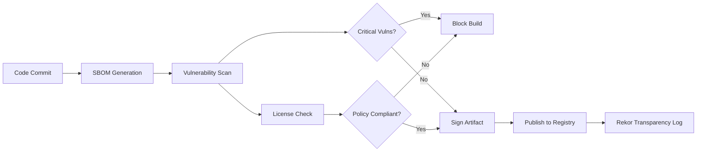

# Supply Chain Security

Protecting software from vulnerabilities and tampering throughout the build, distribution, and deployment pipeline.

## Overview

| Aspect | Details |
|--------|---------|
| **Focus** | Dependencies, build process, artifacts, distribution |
| **Key Concerns** | Malicious packages, compromised builds, vulnerability propagation |
| **Standards** | SLSA, in-toto, SBOM (CycloneDX, SPDX) |
| **Tools** | Sigstore, Trivy, Snyk, Dependabot, Syft, GUAC |
| **Scope** | Source → Build → Artifact → Deploy → Runtime |

## Core Concepts

### Software Bill of Materials (SBOM)

Machine-readable inventory of all components in software.

**CycloneDX vs SPDX:**

| Aspect | CycloneDX | SPDX |
|--------|-----------|------|
| **Origin** | OWASP (2017) | Linux Foundation (2010) |
| **Focus** | Security, vulnerability tracking | License compliance, provenance |
| **Format** | JSON, XML | JSON, YAML, RDF, Tag-Value |
| **Adoption** | Security tools, CI/CD | Enterprise, legal teams |
| **Strengths** | Richer vulnerability metadata | ISO standard (ISO/IEC 5962:2021) |
| **Best For** | Continuous security scanning | Compliance, audit trails |

**When to Use Which:**

- **CycloneDX:** Agile security-first environments, DevSecOps pipelines
- **SPDX:** Regulatory compliance, enterprise procurement, license auditing
- **Both:** Generate both for maximum interoperability

### Provenance & Attestation

**Provenance:** Verifiable record of how an artifact was built (source, builder, materials).

**Attestation:** Cryptographically signed statement about an artifact (test results, scan findings).

**SLSA Framework (Supply-chain Levels for Software Artifacts):**

| Level | Requirements | Verification |
|-------|-------------|--------------|
| **SLSA 0** | No guarantees | None |
| **SLSA 1** | Build provenance exists | Unsigned |
| **SLSA 2** | Signed provenance, hosted build | Signature verified |
| **SLSA 3** | Non-falsifiable provenance, isolated build | Tamper-resistant |
| **SLSA 4** | Hermetic builds, two-party review | Auditable, reproducible |

### Reproducible Builds

Identical binaries produced from same source, regardless of build environment.

**Benefits:**

- Verify official binaries match source code
- Detect build-time tampering
- Enable independent verification

**Challenges:**

- Timestamps, file ordering, environment variables
- Compiler non-determinism
- Build tool versions

## Key Technologies

### Sigstore Ecosystem

Open-source signing and verification for software artifacts.

| Component | Purpose | Analogy |
|-----------|---------|---------|
| **Cosign** | Sign/verify container images and blobs | GPG for containers |
| **Rekor** | Transparency log (immutable audit trail) | Certificate Transparency |
| **Fulcio** | Short-lived signing certificates tied to OIDC | Let's Encrypt for code signing |

**Workflow:**

1. Developer authenticates via OIDC (GitHub, Google, etc.)
2. Fulcio issues short-lived certificate (10 minutes)
3. Cosign signs artifact with ephemeral key
4. Signature and certificate logged in Rekor
5. Consumer verifies against transparency log

**Key Benefits:**

- No long-lived private keys to manage
- Public transparency log prevents backdating
- Identity-based trust (who signed) vs key-based (what key signed)

### Dependency Scanning Tools

| Tool | Strengths | Best For | Pricing |
|------|-----------|----------|---------|
| **Dependabot** | GitHub-native, auto-PRs | GitHub repos, basic scanning | Free |
| **Snyk** | Deep vulnerability DB, fix guidance | Commercial apps, dev-friendly UX | Free tier + paid |
| **Trivy** | Multi-scanner (vulns, secrets, misconfig) | Containers, IaC, SBOM generation | Open source |
| **Grype** | Fast, accurate, SBOM-native | CI/CD pipelines, offline scanning | Open source |
| **OWASP Dependency-Check** | Multi-language, detailed reports | Java/Maven, compliance-heavy orgs | Open source |

### SBOM Generation Tools

| Tool | Output Formats | Languages/Ecosystems | Notes |
|------|----------------|---------------------|-------|
| **Syft** | CycloneDX, SPDX, JSON | Multi-language, containers | From Anchore, pairs with Grype |
| **CycloneDX CLI** | CycloneDX (XML, JSON) | npm, Maven, NuGet, PyPI, Go | Format-native tooling |
| **SPDX SBOM Generator** | SPDX | Multi-language | Reference implementation |
| **Tern** | SPDX, JSON | Container layers | Deep container inspection |

## Vulnerability Management

### Scanning Workflow



### Severity Prioritization

Not all CVEs require immediate action. Focus on:

1. **Exploitability:** Is there a known exploit? (CISA KEV catalog)
2. **Reachability:** Is the vulnerable code actually used?
3. **Context:** Runtime environment, network exposure
4. **Fix Availability:** Is a patch available?

**Prioritization Frameworks:**

- **CVSS:** Base score (severity) + environmental adjustments
- **EPSS:** Probability of exploitation (data-driven)
- **VEX (Vulnerability Exploitability eXchange):** Document which CVEs affect your product

## License Compliance

### Common License Types

| License Type | Commercial Use | Distribution | Modification | Copyleft |
|--------------|---------------|--------------|--------------|----------|
| **MIT/BSD** | ✅ | ✅ | ✅ | ❌ |
| **Apache 2.0** | ✅ | ✅ | ✅ | ❌ (patent grant) |
| **GPL 2.0/3.0** | ✅ | ✅ | ✅ | ✅ (strong) |
| **LGPL** | ✅ | ✅ | ✅ | ✅ (weak) |
| **AGPL** | ✅ | ✅ | ✅ | ✅ (network use = distribution) |
| **Proprietary** | ⚠️ | ❌ | ❌ | ❌ |

**Red Flags:**

- GPL/AGPL in proprietary software (copyleft contamination)
- Missing license (assume proprietary)
- Custom licenses (legal review required)
- Dual licensing (check which applies)

### License Scanning Tools

- **FOSSA:** Commercial, policy automation, legal team workflows
- **FOSSology:** Open source, detailed analysis, compliance reporting
- **Licensee (GitHub):** Ruby, simple license detection
- **ScanCode Toolkit:** Comprehensive, detects text in any file

## Build & Release Pipeline

### Secure Build Practices

**CI/CD Hardening:**

- Use ephemeral build environments
- Pin dependencies with lock files (package-lock.json, Pipfile.lock, go.sum)
- Verify checksums of downloaded tools
- Separate build and deploy credentials
- Minimal permissions for CI service accounts

**Artifact Signing:**

```bash
# Generate SBOM
syft packages myapp:latest -o cyclonedx-json > sbom.json

# Sign container image
cosign sign --key cosign.key myapp:latest

# Generate and sign provenance
cosign attest --predicate provenance.json --key cosign.key myapp:latest

# Verify signature and provenance
cosign verify --key cosign.pub myapp:latest
cosign verify-attestation --key cosign.pub myapp:latest
```

### In-toto Framework

Supply chain metadata specification for end-to-end verification.

**Layout:** Define steps (build, test, package) and required signatures.

**Link Metadata:** Cryptographically signed record of each step's inputs/outputs.

**Verification:** Ensure layout followed, all signatures valid, materials/products match.

**Use Case:** Detect if untrusted actor modified code between commit and release.

## Runtime Protection

### Admission Control (Kubernetes)

**Policy Enforcement:**

- **Open Policy Agent (OPA) Gatekeeper:** Rego policies for allowed registries, required signatures
- **Kyverno:** Kubernetes-native policies (YAML)
- **Ratify (Notary v2):** Verify artifact signatures before admission

**Example Policies:**

- Only allow images from approved registries
- Require Sigstore signatures
- Block images with critical vulnerabilities
- Enforce SBOM presence

### Software Composition Analysis (SCA) at Runtime

**Why Runtime Scanning:**

- Base images updated after deployment
- New CVEs disclosed after release
- Detect runtime-loaded dependencies

**Tools:**

- **Anchore Enterprise:** Continuous container scanning
- **Aqua Security:** Runtime vulnerability management
- **Sysdig Secure:** Threat detection + vulnerability correlation

## Decision Guide

### Choosing Tools

| Need | Recommended Tools | Rationale |
|------|------------------|-----------|
| **GitHub Projects** | Dependabot + GitHub Actions + Syft | Native integration, auto-PRs |
| **Multi-Cloud/Large Scale** | Snyk + Sigstore + Trivy | Enterprise features, broad support |
| **Open Source First** | Trivy + Grype + Cosign + Rekor | Community-driven, no vendor lock-in |
| **Compliance-Heavy** | FOSSA + SPDX + SLSA 3+ | Audit trails, legal workflows |
| **Kubernetes-Centric** | OPA Gatekeeper + Trivy Operator + Cosign | Policy as code, admission control |

### Maturity Model

| Stage | Practices | Tools |
|-------|-----------|-------|
| **Ad-Hoc** | Manual dependency updates | None |
| **Reactive** | Automated vulnerability alerts | Dependabot |
| **Preventive** | Automated scanning + SBOM generation | Trivy + Syft |
| **Enforced** | Policy-based admission, signed artifacts | Cosign + OPA |
| **Optimized** | Continuous verification, SLSA 3+, VEX | Sigstore + GUAC + in-toto |

### Quick Start Checklist

**Immediate Wins:**

- [ ] Enable Dependabot (GitHub) or Renovate (GitLab)
- [ ] Generate SBOMs in CI/CD (Syft)
- [ ] Scan containers before push (Trivy)
- [ ] Pin dependencies with lock files
- [ ] Sign release artifacts (Cosign)

**Medium Term:**

- [ ] Implement SLSA Level 2 provenance
- [ ] Automate license compliance checks
- [ ] Set up Rekor transparency log monitoring
- [ ] Deploy admission controllers (Kubernetes)
- [ ] Establish vulnerability triage process

**Advanced:**

- [ ] Achieve SLSA Level 3 with hermetic builds
- [ ] Implement reproducible builds
- [ ] Integrate VEX for false positive reduction
- [ ] Deploy GUAC for supply chain graph analysis
- [ ] Automate policy enforcement across entire SDLC

## Best Practices

**Dependency Management:**

- Review dependencies before adding (maintenance, security history)
- Minimize dependency count
- Prefer well-maintained libraries over abandoned ones
- Use automated updates but test thoroughly
- Monitor for typosquatting attacks

**Build Security:**

- Run builds in isolated, ephemeral environments
- Use minimal base images (distroless, Alpine)
- Multi-stage Dockerfiles (separate build and runtime)
- No secrets in build logs or layer history
- Verify all downloaded artifacts (checksums, signatures)

**Monitoring & Response:**

- Subscribe to security advisories (GitHub, CVE feeds)
- Establish SLAs for patching by severity
- Maintain inventory of all deployed software
- Test rollback procedures
- Document incident response for supply chain attacks

## Emerging Trends (2025)

- **GUAC (Graph for Understanding Artifact Composition):** Unified supply chain graph
- **SLSA v1.0 Adoption:** Industry-wide maturity benchmarking
- **AI/ML Model SBOMs:** Extending supply chain security to ML artifacts
- **Policy as Code:** Shift-left compliance with OPA, Kyverno
- **Attestation Ecosystems:** Beyond containers (npm, PyPI, Maven)

## Related

- [[Container Tools]] - Docker, Podman, image scanning
- [[CI-CD Pipelines]] - Build automation, deployment workflows
- [[Security Concepts]] - Broader security principles and frameworks
- [[Kubernetes]] - Admission control, policy enforcement
- [[Observability]] - Runtime monitoring, threat detection
