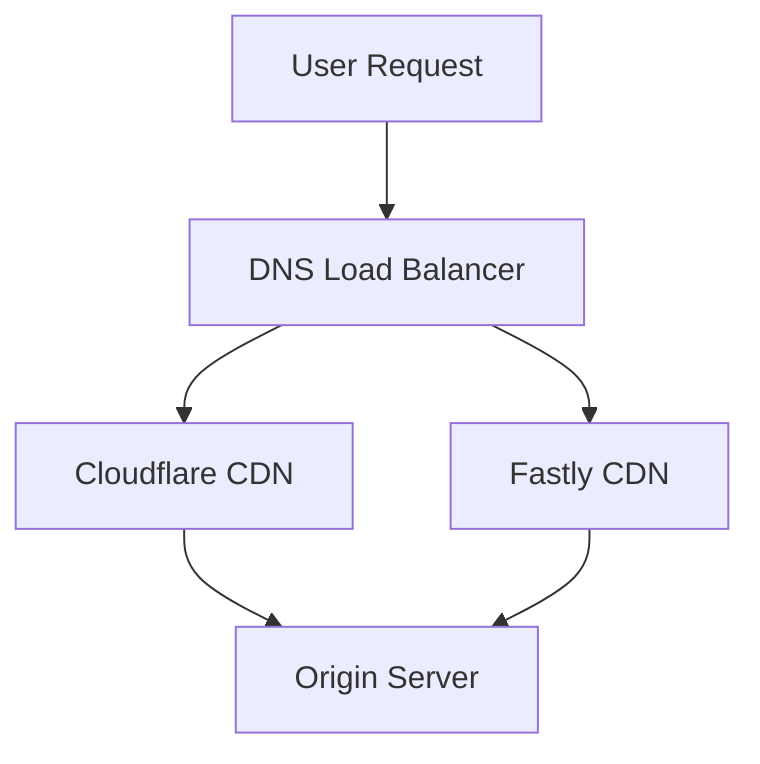
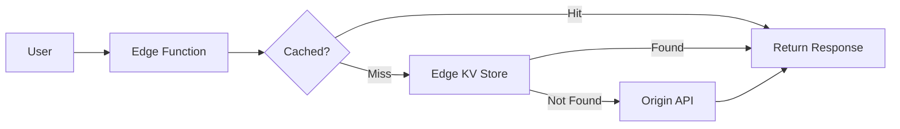
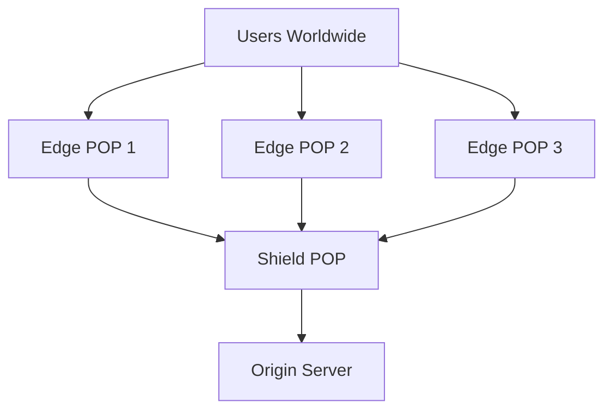

# CDN

Geographically distributed network of servers that cache and deliver content from locations closest to end users, reducing latency and improving performance.

## Overview

| Aspect | Details |
|--------|---------|
| **Purpose** | Accelerate content delivery, reduce origin load, improve reliability |
| **Key Benefit** | Lower latency through geographic proximity |
| **Common Use Cases** | Static assets, video streaming, API acceleration, DDoS mitigation |
| **Cost Model** | Pay-per-bandwidth + request pricing (varies by provider) |
| **Alternatives** | Self-hosted edge servers, origin-only delivery |

## Core Concepts

### Edge Caching

Content stored at edge locations (Points of Presence) closer to users:

- **Cache Hit**: Content served from edge without origin request
- **Cache Miss**: Edge fetches from origin, caches, then serves
- **TTL (Time to Live)**: How long content remains cached
- **Cache Keys**: URL parameters that differentiate cached versions

### Cache Invalidation

Removing or updating cached content before TTL expires:

- **Purge**: Delete specific cached objects immediately
- **Soft Purge**: Mark as stale, serve while revalidating
- **Surrogate Keys**: Tag-based invalidation across multiple URLs
- **Version-Based**: Change URLs to bypass cache (e.g., `app.v2.js`)

### Edge Compute

Running code at edge locations instead of origin:

- **Edge Functions**: Serverless compute at CDN edge (Cloudflare Workers, Fastly Compute@Edge)
- **Edge Middleware**: Request/response manipulation
- **A/B Testing**: Route users to variants at edge
- **Personalization**: Modify responses based on location/headers

### Origin Shielding

Additional caching layer between edge and origin:

- Reduces origin requests from distributed edges
- Consolidates cache misses through single shield location
- Protects origin from traffic spikes
- Higher cache hit ratio overall

### DDoS Protection

Mitigating distributed denial-of-service attacks:

- **L3/L4 Protection**: Network/transport layer (TCP SYN floods)
- **L7 Protection**: Application layer (HTTP floods)
- **Rate Limiting**: Request caps per IP/region
- **WAF Integration**: Block malicious requests

### SSL/TLS Termination

Handling encryption at edge:

- Edge decrypts client HTTPS requests
- Can communicate with origin via HTTP or HTTPS
- Reduces origin CPU load
- Enables SSL offloading and modern TLS versions

## Provider Comparison

| Provider | Strengths | Edge Compute | Free Tier | Best For |
|----------|-----------|--------------|-----------|----------|
| **Cloudflare** | DDoS protection, Workers, generous free tier | Workers (V8 isolates) | ✅ Unlimited bandwidth | Security-first, global reach |
| **Fastly** | Real-time purging, Compute@Edge, VCL control | Compute@Edge (WASM) | ❌ | Enterprise, fine-grained control |
| **AWS CloudFront** | AWS integration, Lambda@Edge, global reach | Lambda@Edge, CloudFront Functions | ✅ 1TB/year | AWS-native applications |
| **Akamai** | Largest network, enterprise features, reliability | EdgeWorkers | ❌ | Large enterprises, media streaming |
| **Bunny CDN** | Low cost, simple pricing, good performance | Edge Scripting (beta) | ❌ | Cost-conscious, straightforward needs |
| **Vercel Edge** | Next.js optimization, middleware, instant deploys | Edge Functions (V8) | ✅ Generous | Next.js/React applications |

## Feature Matrix

| Feature | Cloudflare | Fastly | CloudFront | Akamai | Bunny | Vercel |
|---------|------------|--------|------------|--------|-------|--------|
| **Edge Locations** | 300+ | 100+ | 450+ | 4,100+ | 100+ | Cloudflare-backed |
| **HTTP/3 Support** | ✅ | ✅ | ✅ | ✅ | ✅ | ✅ |
| **Brotli Compression** | ✅ | ✅ | ✅ | ✅ | ✅ | ✅ |
| **Image Optimization** | ✅ | ✅ | ❌ (requires Lambda) | ✅ | ✅ | ✅ |
| **Real-time Purging** | ✅ | ✅ | ❌ (eventual) | ✅ | ✅ | ✅ |
| **Instant SSL** | ✅ Free | ✅ Paid | ✅ Free | ✅ Paid | ✅ Free | ✅ Free |
| **DDoS Mitigation** | ✅ Unmetered | ✅ | ✅ (Shield Extra) | ✅ | Basic | ✅ |
| **WAF** | ✅ Paid | ✅ | ✅ | ✅ | ❌ | ✅ |
| **Analytics** | ✅ Real-time | ✅ Real-time | ✅ Delayed | ✅ Advanced | ✅ Basic | ✅ |
| **Pricing Model** | Flat/Enterprise | Usage-based | AWS pricing | Enterprise | Per-GB (low) | Free tier + Pro |

## Architecture Patterns

### Multi-CDN Strategy

Using multiple CDN providers for resilience:



**Benefits:**
- Geographic optimization (use best CDN per region)
- Failover capability
- Leverage provider strengths (Cloudflare DDoS + Fastly VCL)

**Challenges:**
- Complexity in cache invalidation
- Higher costs
- Split analytics

### Edge-First Architecture

Handle requests entirely at edge when possible:



**Use Cases:**
- API responses with predictable data
- A/B testing and feature flags
- Authentication/authorization checks
- URL rewrites and redirects

### Origin Shielding Pattern



**Configuration Example (CloudFront):**
- Enable Origin Shield in region closest to origin
- All edge locations route through shield
- Reduces origin requests by 80-90%

## Cache Control Strategies

### Static Assets (Long TTL)

```http
Cache-Control: public, max-age=31536000, immutable
```

**For:** Versioned files (`app.abc123.js`, `logo.v2.png`)
**TTL:** 1 year
**Invalidation:** Not needed (URL changes on update)

### Dynamic Content (Short TTL)

```http
Cache-Control: public, max-age=60, stale-while-revalidate=300
```

**For:** API responses, frequently updated pages
**TTL:** 1 minute
**Stale-while-revalidate:** Serve stale content while fetching fresh

### User-Specific Content (No CDN Cache)

```http
Cache-Control: private, no-store
```

**For:** Authenticated user data, personalized content
**TTL:** Not cached at CDN (browser only)

### Conditional Caching

```http
Cache-Control: public, max-age=300
ETag: "abc123"
Vary: Accept-Encoding, Accept-Language
```

**For:** Content that varies by headers
**Vary Header:** Creates separate cache entries per combination

## Performance Optimization

### Compression

Enable at CDN edge:

| Method | Compression Ratio | CPU Cost | Support |
|--------|------------------|----------|---------|
| **Gzip** | ~70% | Low | Universal |
| **Brotli** | ~80% | Medium | Modern browsers |
| **Zstd** | ~75% | Low | Limited (Cloudflare) |

**Best Practice:** Pre-compress static assets at build time, enable edge compression for dynamic content.

### Image Optimization

CDN-provided transformations:

- **Resizing:** Serve appropriate dimensions per device
- **Format Conversion:** WebP/AVIF for modern browsers, fallback to JPEG/PNG
- **Quality Adjustment:** Reduce quality for mobile/slow connections
- **Lazy Loading Headers:** `Link: <image.jpg>; rel=preload; as=image`

**Example (Cloudflare Images):**
```
https://example.com/cdn-cgi/image/width=800,format=auto/image.jpg
```

### HTTP/3 and QUIC

Benefits over HTTP/2:

- Faster connection establishment (0-RTT)
- Better handling of packet loss
- Connection migration (network switching)

**Availability:** All major CDN providers support HTTP/3.

## Security Features

### DDoS Mitigation Layers

| Layer | Attack Type | Mitigation |
|-------|-------------|------------|
| **L3** | IP floods | Anycast routing, traffic scrubbing |
| **L4** | SYN floods, UDP amplification | SYN cookies, rate limiting |
| **L7** | HTTP floods, slowloris | Challenge pages, rate limiting, bot detection |

### Web Application Firewall (WAF)

Common rule sets:

- **OWASP Top 10:** SQL injection, XSS, etc.
- **Rate Limiting:** Requests per IP/endpoint
- **Geo-blocking:** Allow/deny by country
- **Bot Management:** Distinguish good/bad bots

### SSL/TLS Best Practices

| Setting | Recommendation |
|---------|----------------|
| **Minimum TLS Version** | TLS 1.2 (disable 1.0/1.1) |
| **Cipher Suites** | Modern only (ECDHE, AES-GCM) |
| **HSTS** | Enable with long max-age |
| **Certificate** | Free auto-renewing (Let's Encrypt) |
| **Origin Connection** | Full SSL/TLS (not flexible) |

## Monitoring and Analytics

### Key Metrics

| Metric | Description | Target |
|--------|-------------|--------|
| **Cache Hit Ratio** | % of requests served from cache | >90% for static, >50% for dynamic |
| **Origin Response Time** | Time origin takes to respond | <200ms |
| **Edge Response Time** | Total time including CDN processing | <50ms |
| **Bandwidth Savings** | Traffic served from cache vs origin | >80% |
| **Error Rate** | 4xx/5xx responses | <1% |

### Log Analysis

Available data from CDN providers:

- Request/response headers
- Client IP, country, ASN
- Cache status (HIT, MISS, EXPIRED)
- Origin response time
- Edge compute execution time

**Integration:** Stream logs to SIEM, analytics platform (Datadog, Splunk, CloudWatch).

## Cost Optimization

### Bandwidth Pricing Tiers

| Provider | First TB | 10-50 TB | 150+ TB | Notes |
|----------|----------|----------|---------|-------|
| **Cloudflare** | Free | Free | Free | Paid plans for enterprise features |
| **AWS CloudFront** | $0.085/GB | $0.060/GB | $0.020/GB | US/Europe pricing |
| **Fastly** | $0.12/GB | $0.08/GB | Custom | Per-request fees additional |
| **Bunny CDN** | $0.01/GB | $0.01/GB | $0.005/GB | Flat per-region pricing |
| **Akamai** | Custom | Custom | Custom | Volume commitments |

### Cost Reduction Strategies

1. **Increase Cache Hit Ratio:** Tune TTLs, use origin shield
2. **Compress Content:** Reduce bandwidth consumption
3. **Optimize Images:** Serve smaller files
4. **Purge Strategically:** Use surrogate keys instead of full purges
5. **Edge Compute:** Process at edge instead of origin requests
6. **Reserved Capacity:** Commit to volume for discounts (enterprise)

## When to Use

### Strengths

| Scenario | Benefit |
|----------|---------|
| **Global Audience** | Low latency worldwide through geographic distribution |
| **Static Assets** | Massive cache hit ratios, reduced origin load |
| **Traffic Spikes** | Handle viral content, product launches |
| **DDoS Attacks** | Always-on protection, traffic scrubbing |
| **Video Streaming** | Optimized for large file delivery |
| **API Acceleration** | Edge caching for cacheable endpoints |

### Considerations

| Factor | Impact |
|--------|--------|
| **Cost at Scale** | Bandwidth costs can be significant for large video/downloads |
| **Cache Invalidation** | Purging across global network takes time (except real-time providers) |
| **Debugging Complexity** | Additional layer between user and origin |
| **Vendor Lock-in** | Edge compute often provider-specific |
| **Compliance** | Data residency requirements may conflict with global caching |

### Best For

**Use CDN when:**
- Serving users across multiple geographic regions
- High traffic volume (>1TB/month bandwidth)
- Need DDoS protection and WAF
- Static asset-heavy applications (images, video, downloads)
- API responses have cacheability (even short TTL helps)

**Skip CDN when:**
- Purely local/regional audience (single data center sufficient)
- 100% dynamic, user-specific content with no caching
- Very low traffic (<100GB/month)
- Strict data residency prevents edge caching

## Provider Selection Guide

| Choose | If You Need |
|--------|-------------|
| **Cloudflare** | Best free tier, DDoS protection, Workers for edge compute, global reach |
| **Fastly** | Real-time purging, VCL customization, Compute@Edge (WASM), enterprise control |
| **AWS CloudFront** | Deep AWS integration, Lambda@Edge, existing AWS infrastructure |
| **Akamai** | Largest network, maximum reliability, media delivery, enterprise SLAs |
| **Bunny CDN** | Lowest cost, transparent pricing, straightforward setup |
| **Vercel Edge** | Next.js optimization, frontend-first, instant deployments |

## Quick Start Examples

### Cloudflare Setup

1. Add domain to Cloudflare
2. Update nameservers at registrar
3. Configure cache rules:
   - **Cache Everything:** Page rules for static routes
   - **Bypass Cache:** Dynamic API endpoints
4. Enable HTTP/3, Brotli, Auto Minify
5. Set up Workers for edge logic (optional)

### AWS CloudFront

1. Create distribution pointing to S3/ALB origin
2. Configure behaviors (path patterns → cache policies)
3. Enable compression, HTTP/2
4. Request ACM certificate for custom domain
5. Update DNS to CloudFront domain

### Fastly

1. Create service, define origin
2. Write VCL for cache logic (or use default)
3. Configure purging (API keys, surrogate keys)
4. Set up logging endpoints
5. Deploy and test

## Related

- [[Caching Strategies]] - Cache invalidation patterns, TTL strategies
- [[Load Balancing]] - Distributing traffic across origins
- [[Web Security]] - DDoS mitigation, WAF rules, SSL/TLS configuration
- [[HTTP]] - Protocol features leveraged by CDNs
- [[DNS]] - How DNS routing works with CDNs
- [[Observability Tools]] - Monitoring CDN performance and costs
