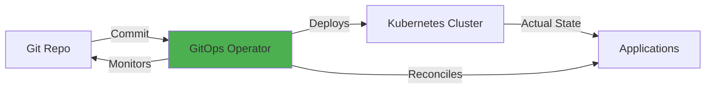
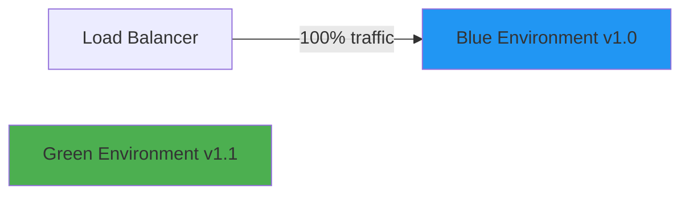
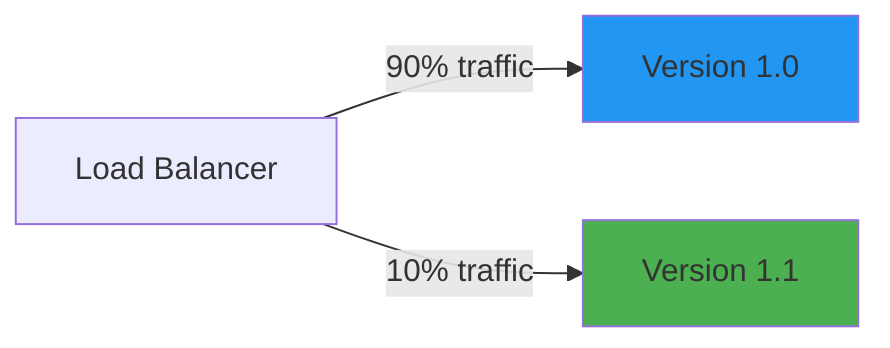
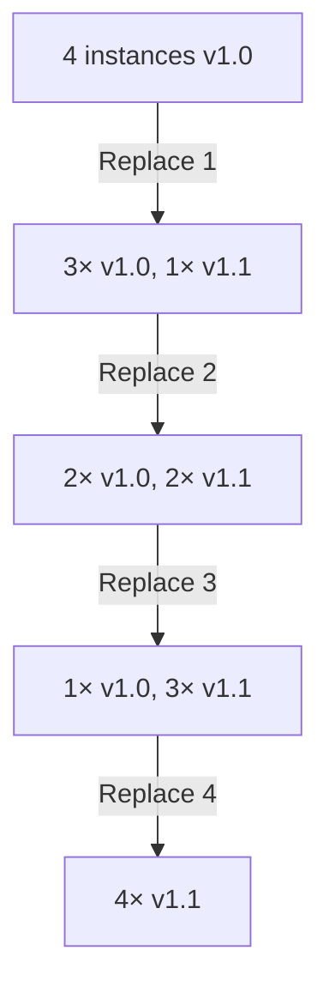

# CI/CD Pipelines

Automated systems for building, testing, and deploying code from source control to production environments.

## Overview

| Aspect | Details |
|--------|---------|
| **Purpose** | Automate software delivery lifecycle from commit to deployment |
| **Core Stages** | Build → Test → Package → Deploy |
| **Deployment Models** | Push (imperative), Pull (GitOps/declarative) |
| **Execution Environments** | Cloud-hosted, self-hosted, hybrid |
| **Configuration** | YAML-based (most), Groovy (Jenkins), UI + code |
| **Modern Trends** | GitOps, progressive delivery, ephemeral environments |

## Platform Comparison

| Platform | Type | Hosting | Config | Best For | Pricing |
|----------|------|---------|--------|----------|---------|
| **GitHub Actions** | CI/CD | Cloud + self-hosted | YAML (`.github/workflows/`) | GitHub repos, matrix builds | Free tier + pay-per-minute |
| **GitLab CI** | CI/CD | Cloud + self-hosted | YAML (`.gitlab-ci.yml`) | GitLab repos, integrated DevOps | Free tier + runners |
| **Jenkins** | CI/CD | Self-hosted | Groovy + UI | Legacy systems, max flexibility | Free (self-hosted costs) |
| **CircleCI** | CI/CD | Cloud + self-hosted | YAML (`.circleci/config.yml`) | Fast builds, Docker-first | Free tier + pay-per-container |
| **ArgoCD** | GitOps CD | Self-hosted (K8s) | Git repos + CRDs | Kubernetes deployments | Free (open source) |
| **Tekton** | Cloud-native CI/CD | Self-hosted (K8s) | Kubernetes CRDs | K8s-native pipelines, flexibility | Free (open source) |

## Pipeline Stages

### Build Stage

**Compile source code and prepare artifacts**

- Dependency installation and caching
- Code compilation (for compiled languages)
- Asset bundling and minification
- Version stamping and metadata injection
- Static analysis and linting

### Test Stage

**Validate code quality and functionality**

- Unit tests (fast, isolated)
- Integration tests (database, APIs)
- End-to-end tests (full user flows)
- Security scanning (SAST, dependency checks)
- Code coverage reporting

### Package Stage

**Create deployable artifacts**

- Container image builds (Docker, OCI)
- Archive creation (JAR, ZIP, tar.gz)
- Artifact signing and verification
- Registry uploads (container, package, artifact)
- SBOM (Software Bill of Materials) generation

### Deploy Stage

**Release to target environments**

- Environment-specific configurations
- Database migrations
- Service health checks
- Rollback capabilities
- Deployment notifications

## Core Concepts

### Artifacts

**Build outputs stored for deployment**

- Immutable packages built once, deployed many times
- Stored in registries (Docker Hub, npm, Maven Central, Artifactory)
- Tagged with version numbers or commit SHAs
- Retention policies to manage storage costs
- Artifact promotion between environments (dev → staging → prod)

### Caching

**Reusing dependencies and build outputs for speed**

- **Dependency caching**: npm, pip, Maven, NuGet packages
- **Build caching**: Docker layers, compiled code, test results
- **Cache keys**: Hash of lock files, OS, architecture
- **Cache invalidation**: Automatic on dependency changes
- **Multi-level caching**: Local, runner, remote

### Matrix Builds

**Test across multiple configurations in parallel**

```yaml
# Example: Test on multiple OS and language versions
matrix:
  os: [ubuntu-latest, windows-latest, macos-latest]
  node: [18, 20, 22]
# Runs 9 jobs in parallel (3 OS × 3 versions)
```

**Use cases:**

- Cross-platform compatibility testing
- Multiple language/framework versions
- Different database engines
- Browser compatibility (Selenium grids)

### Self-Hosted Runners

**Run builds on your own infrastructure**

| Aspect | Cloud Runners | Self-Hosted Runners |
|--------|---------------|---------------------|
| **Setup** | None required | Install + register agents |
| **Cost** | Per-minute charges | Infrastructure costs only |
| **Performance** | Standard specs | Custom hardware (GPU, memory) |
| **Security** | Isolated, ephemeral | Network access to private resources |
| **Maintenance** | Managed by provider | You manage OS, updates, scaling |
| **Use Cases** | Public repos, standard builds | Private networks, special hardware, cost savings |

## GitOps Approach

**Declarative infrastructure and deployment using Git as source of truth**



### GitOps Tools

**ArgoCD**

- Kubernetes-native continuous delivery
- Visual application health dashboards
- Automated sync with Git repositories
- Multi-cluster support
- RBAC and SSO integration
- Rollback to any Git commit

**Flux CD**

- CNCF graduated project
- GitOps toolkit (source, kustomize, helm controllers)
- Image automation for automatic deployments
- Notification system (Slack, Teams, webhooks)
- Progressive delivery with Flagger

**Key Benefits:**

- ✅ Audit trail (all changes in Git history)
- ✅ Easy rollbacks (git revert)
- ✅ Consistent environments (infrastructure as code)
- ✅ Self-healing (auto-sync on drift detection)

## Deployment Strategies

### Blue-Green Deployment

**Two identical environments, switch traffic atomically**



**Steps:**

1. Deploy new version to idle environment (green)
2. Test green environment thoroughly
3. Switch load balancer to green
4. Keep blue as instant rollback option

**Pros:** Zero downtime, instant rollback, full testing before switch
**Cons:** 2× infrastructure cost, database migrations complex

### Canary Deployment

**Gradually shift traffic to new version**



**Steps:**

1. Deploy new version alongside old
2. Route small percentage (5-10%) to new version
3. Monitor metrics (errors, latency, business KPIs)
4. Gradually increase percentage (10% → 25% → 50% → 100%)
5. Rollback instantly if issues detected

**Pros:** Low risk, real production testing, gradual validation
**Cons:** Requires traffic splitting, longer deployment time

### Rolling Deployment

**Replace instances incrementally**



**Pros:** No extra infrastructure, automatic with Kubernetes/ECS
**Cons:** Mixed versions during rollout, slower rollback

### Feature Flags + Deployment

**Decouple deployment from release**

- Deploy code with features disabled
- Enable features gradually via flags
- A/B test specific user segments
- Kill switch for instant disable (no deployment)
- Separate deployment risk from feature risk

## Platform Deep Dive

### GitHub Actions

**Strengths:**

- Native GitHub integration (PR checks, status badges)
- Massive marketplace of actions (30,000+)
- Matrix builds for cross-platform testing
- Reusable workflows and composite actions
- OIDC for keyless cloud authentication

**Configuration Example:**

```yaml
name: CI
on: [push, pull_request]
jobs:
  test:
    runs-on: ubuntu-latest
    strategy:
      matrix:
        node: [18, 20, 22]
    steps:
      - uses: actions/checkout@v4
      - uses: actions/setup-node@v4
        with:
          node-version: ${{ matrix.node }}
          cache: 'npm'
      - run: npm ci
      - run: npm test
```

**Best Practices:**

- Pin action versions to SHA (not tags) for security
- Use `concurrency` groups to cancel outdated runs
- Cache dependencies with `actions/cache`
- Use environments for deployment protection rules

### GitLab CI

**Strengths:**

- Integrated with GitLab repos, issues, merge requests
- Built-in container registry and package registry
- Auto DevOps for zero-config pipelines
- Review apps (ephemeral environments per MR)
- Compliance pipelines for regulated industries

**Key Features:**

- **Stages:** Define sequential or parallel execution
- **DAG pipelines:** Direct dependencies between jobs
- **Child pipelines:** Trigger separate pipelines dynamically
- **GitLab Runner:** Self-hosted executor (Docker, Kubernetes, Shell)

### Jenkins

**Strengths:**

- Maximum flexibility and customization
- 1,800+ plugins for any integration
- Declarative and scripted pipelines
- Shared libraries for reusable pipeline code
- Battle-tested for complex enterprise workflows

**Considerations:**

- Requires dedicated infrastructure and maintenance
- UI/UX less modern than cloud-native platforms
- Plugin compatibility can break on upgrades
- Security requires careful configuration

**Modern Usage:**

- Jenkins X for Kubernetes-native CI/CD
- Jenkinsfiles in source control (pipeline as code)
- Blue Ocean UI for better visualization

### CircleCI

**Strengths:**

- Optimized for Docker workflows
- Intelligent caching and parallelism
- Orbs (reusable config packages)
- SSH debug access to failed builds
- Built-in insights and analytics

**Resource Classes:**

- Small, medium, large, xlarge executors
- GPU and ARM instances available
- Docker layer caching for fast image builds

### ArgoCD

**Strengths:**

- Visual Git → Kubernetes sync status
- Automated drift detection and correction
- Multi-cluster management from single pane
- SSO integration (OIDC, SAML)
- Webhooks for event-driven sync

**Architecture:**

- Application CRDs define deployment targets
- Controllers continuously reconcile Git → cluster
- Projects for multi-tenancy and RBAC
- ApplicationSets for app-of-apps patterns

### Tekton

**Strengths:**

- Cloud Native Computing Foundation project
- Kubernetes CRDs for tasks, pipelines, triggers
- No central server (runs in K8s clusters)
- Vendor-neutral, extensible architecture
- Tekton Chains for supply chain security (SLSA)

**Concepts:**

- **Tasks:** Reusable steps (build, test, deploy)
- **Pipelines:** DAG of tasks with parameters
- **Triggers:** Event-driven pipeline execution
- **Results:** Pass data between tasks

## When to Use

### GitHub Actions

**Best for:**

- ✅ Projects hosted on GitHub
- ✅ Open source with community actions
- ✅ Matrix builds across OS/versions
- ✅ Rapid setup with marketplace integrations

**Considerations:**

- ❌ Cost on private repos with high usage
- ❌ Limited to GitHub ecosystem

### GitLab CI

**Best for:**

- ✅ GitLab-native projects
- ✅ End-to-end DevOps platform (SCM to monitoring)
- ✅ Review apps and dynamic environments
- ✅ Compliance and audit requirements

**Considerations:**

- ❌ Less marketplace ecosystem than GitHub
- ❌ Self-hosted GitLab has maintenance overhead

### Jenkins

**Best for:**

- ✅ Complex enterprise workflows
- ✅ Legacy systems integration
- ✅ Highly customized pipelines
- ✅ On-premises deployments

**Considerations:**

- ❌ High maintenance burden
- ❌ Plugin fragmentation and breakage
- ❌ Outdated UI/UX

### CircleCI

**Best for:**

- ✅ Docker-heavy workflows
- ✅ Teams needing advanced caching
- ✅ Performance-critical builds
- ✅ Cross-platform mobile (iOS + Android)

**Considerations:**

- ❌ Pricing higher than some alternatives
- ❌ Less flexible than Jenkins

### ArgoCD

**Best for:**

- ✅ Kubernetes-native deployments
- ✅ GitOps adoption
- ✅ Multi-cluster management
- ✅ Declarative infrastructure

**Considerations:**

- ❌ Kubernetes-only (not for VMs, serverless)
- ❌ Requires K8s cluster to run

### Tekton

**Best for:**

- ✅ Cloud-native pipelines on Kubernetes
- ✅ Vendor-neutral CI/CD
- ✅ Supply chain security (SLSA compliance)
- ✅ Custom pipeline controllers

**Considerations:**

- ❌ Steeper learning curve
- ❌ Requires Kubernetes expertise
- ❌ Less turnkey than managed platforms

## Decision Guide

| Scenario | Recommended Platform | Why |
|----------|---------------------|-----|
| **GitHub-hosted project** | GitHub Actions | Native integration, free tier, marketplace |
| **GitLab-hosted project** | GitLab CI | Integrated DevOps, review apps |
| **Kubernetes deployments** | ArgoCD or Tekton | GitOps, K8s-native, declarative |
| **Multi-cloud, vendor-neutral** | Tekton or Jenkins | No vendor lock-in, extensible |
| **Legacy systems integration** | Jenkins | Maximum flexibility, plugin ecosystem |
| **Docker-first workflows** | CircleCI | Optimized for containers, layer caching |
| **Self-hosted with control** | GitLab CI (self-hosted) or Jenkins | Own infrastructure, no cloud limits |
| **Fast setup, low maintenance** | GitHub Actions or CircleCI | Managed, minimal config |
| **Compliance and audit** | GitLab CI (Ultimate) or Jenkins | Audit trails, approval gates |
| **Progressive delivery** | ArgoCD + Flagger | Canary, blue-green, A/B testing |

## Best Practices

### Pipeline Design

- **Fast feedback:** Run fast tests (unit) before slow (integration, e2e)
- **Fail fast:** Exit immediately on first error
- **Parallelize:** Run independent jobs concurrently
- **Idempotent:** Safe to rerun without side effects
- **Versioned config:** Pipeline definitions in source control

### Security

- **Secrets management:** Use vault integrations (HashiCorp Vault, AWS Secrets Manager)
- **Least privilege:** Minimal permissions for service accounts
- **OIDC authentication:** Keyless cloud access (GitHub → AWS, GCP, Azure)
- **Signed artifacts:** Verify build provenance (Sigstore, Cosign)
- **Dependency scanning:** Automated CVE detection (Dependabot, Snyk)

### Performance

- **Dependency caching:** Avoid re-downloading packages
- **Docker layer caching:** Reuse unchanged layers
- **Incremental builds:** Only rebuild changed modules
- **Artifact reuse:** Build once, deploy many times
- **Concurrency limits:** Prevent resource exhaustion

### Observability

- **Structured logs:** JSON output for parsing
- **Metrics dashboards:** Build times, success rates, queue depth
- **Alerting:** Notify on failures (Slack, PagerDuty)
- **Trace deployments:** Link commits → builds → deployments
- **DORA metrics:** Track deployment frequency, lead time, MTTR, change failure rate

## Advanced Patterns

### Monorepo CI

**Challenges:** Avoid rebuilding unchanged projects

**Solutions:**

- **Path filters:** Trigger only on changed directories
- **Nx/Turborepo:** Incremental builds with dependency graphs
- **Split pipelines:** Per-project workflows with shared config

### Multi-Environment Promotion

**Pattern:** dev → staging → production with gates


**Gates:**

- Automated tests passing
- Manual approval (security, product review)
- Time-based windows (deploy only during business hours)
- External approvals (change management systems)

### Ephemeral Environments

**Concept:** Temporary, on-demand environments per PR

**Benefits:**

- Test features in isolation
- QA preview before merge
- Automated cleanup on PR close

**Tools:**

- GitLab Review Apps
- Heroku Review Apps
- Kubernetes namespaces per PR
- Vercel/Netlify preview deployments

## Related

- [[Deployment]]
- [[Container Tools]]
- [[Kubernetes]]
- [[Infrastructure as Code]]
- [[Observability Tools]]
