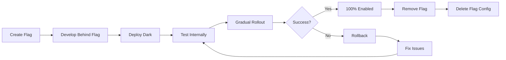
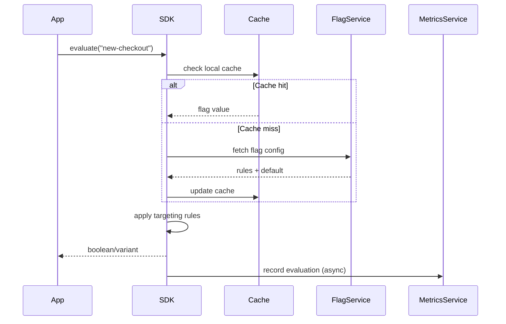

# Feature Flags

Runtime configuration mechanism to enable/disable features without deploying new code.

## Overview

| Aspect | Details |
|--------|---------|
| **Purpose** | Decouple deployment from release, enable gradual rollouts, A/B testing |
| **Key Benefit** | Deploy dark, release when ready; instant rollback without deployment |
| **Common Uses** | Canary releases, A/B testing, ops toggles, permission controls |
| **Implementations** | SaaS platforms (LaunchDarkly, Split), self-hosted (Unleash, Flagsmith), DIY |
| **Risks** | Technical debt if not cleaned up, added complexity, flag sprawl |

## Flag Types

### Release Flags

Control rollout of new features to users.

- **Purpose**: Progressive delivery, gradual rollouts
- **Lifespan**: Temporary (remove after full rollout)
- **Example**: New checkout flow enabled for 10% of users
- **Targeting**: User segments, percentages, geographic regions

### Ops Flags

Circuit breakers and system controls for operational concerns.

- **Purpose**: Manage system load, degrade gracefully, kill switches
- **Lifespan**: Long-lived (permanent system controls)
- **Example**: Disable expensive recommendation engine during high load
- **Targeting**: System-wide, by service, by region

### Experiment Flags

A/B testing and multivariate experiments.

- **Purpose**: Test hypotheses, measure impact, optimize conversion
- **Lifespan**: Temporary (until winner determined)
- **Example**: Test three pricing page variants, measure conversions
- **Targeting**: Random assignment, consistent bucketing

### Permission Flags

Entitlements and access control.

- **Purpose**: Premium features, role-based access, beta access
- **Lifespan**: Long-lived (tied to business model)
- **Example**: Advanced analytics only for enterprise tier
- **Targeting**: User attributes, subscription level, organization

## Core Capabilities

### Targeting Rules

Determine who sees which variant.

**Common Targeting Criteria:**

- User attributes (ID, email, role, tier)
- Geographic location (country, region, city)
- Device/platform (mobile, desktop, OS, browser)
- Custom attributes (company size, signup date)
- Percentage rollouts (10% of users)
- Allowlists/blocklists (specific user IDs)

**Rule Composition:**

- AND/OR logic combining multiple criteria
- Rule priority and fallback behavior
- Default variants for non-matching users

### Gradual Rollouts

Incrementally increase exposure to reduce risk.

```
Initial: 1% → Monitor metrics → 5% → 25% → 50% → 100%
```

**Strategies:**

- **Percentage-based**: Random selection of user percentage
- **Ring-based**: Internal → Beta users → Power users → All users
- **Geographic**: Region by region rollout
- **Attribute-based**: Start with low-risk segments

### A/B Testing

Compare variants to measure impact.

**Key Components:**

- **Variants**: Control (A), Treatment (B), optional C/D/E
- **Metrics**: Primary (conversion), Secondary (engagement, revenue)
- **Statistical significance**: Confidence intervals, sample sizes
- **Consistent assignment**: User always sees same variant

**Example Setup:**

- Control: Current checkout (50%)
- Treatment A: One-click checkout (25%)
- Treatment B: Guest checkout (25%)
- Measure: Completion rate, time to purchase

### Kill Switches

Instant rollback without deployment.

**Use Cases:**

- Bug discovered in production
- Performance degradation from new feature
- Third-party service outage affecting feature
- Unexpected user behavior or confusion

**Best Practices:**

- Monitor metrics for automatic triggers
- Define rollback criteria upfront
- Test kill switch before rollout
- Have runbook for emergency disablement

## Platform Comparison

| Platform | Type | Pricing Model | Key Strengths | Considerations |
|----------|------|---------------|---------------|----------------|
| **LaunchDarkly** | SaaS | Seats + MAU | Enterprise features, robust SDKs, mature | Premium pricing |
| **Split** | SaaS | Seats + MAU | Strong A/B testing, metrics integration | Analytics-focused |
| **Unleash** | Self-hosted / Cloud | Free OSS / Paid Cloud | Open source, privacy control, flexible | Self-manage infrastructure |
| **Flagsmith** | Self-hosted / Cloud | Free OSS / Paid Cloud | Simple UI, good API, easy self-host | Smaller ecosystem |
| **ConfigCat** | SaaS | Requests + Seats | Affordable, good DX, transparent pricing | Fewer enterprise features |
| **PostHog** | Self-hosted / Cloud | Free OSS / Usage-based | All-in-one (flags + analytics), cheap | Broader tool, not specialized |

### Feature Matrix

| Feature | LaunchDarkly | Split | Unleash | Flagsmith | ConfigCat | PostHog |
|---------|--------------|-------|---------|-----------|-----------|---------|
| **Percentage rollouts** | ✅ | ✅ | ✅ | ✅ | ✅ | ✅ |
| **User targeting** | ✅ | ✅ | ✅ | ✅ | ✅ | ✅ |
| **A/B testing** | ✅ | ✅ | ✅ | ✅ | ✅ | ✅ |
| **Built-in analytics** | ✅ | ✅ | ❌ | ❌ | ❌ | ✅ |
| **Self-hosted option** | ❌ | ❌ | ✅ | ✅ | ❌ | ✅ |
| **Edge computing** | ✅ | ✅ | ✅ | ✅ | ✅ | ❌ |
| **Audit logs** | ✅ | ✅ | ✅ | ✅ | ✅ | ✅ |
| **SSO/SAML** | ✅ | ✅ | ✅ (Pro) | ✅ (Enterprise) | ✅ (Enterprise) | ✅ |
| **SDK breadth** | ✅ Excellent | ✅ Excellent | ✅ Good | ✅ Good | ✅ Good | ✅ Good |
| **Local evaluation** | ✅ | ✅ | ✅ | ✅ | ✅ | ❌ |
| **Free tier** | Limited | Limited | ✅ OSS | ✅ OSS | ✅ Generous | ✅ OSS |

## Implementation Patterns

### Client-Side vs Server-Side

**Client-Side Evaluation:**

- SDK downloads flag state to client
- Fast evaluation (no network calls)
- Risk: Flag rules visible to users
- Best for: Public flags, low-sensitivity targeting

**Server-Side Evaluation:**

- SDK queries service for each evaluation
- Targeting rules remain private
- Latency consideration (use caching)
- Best for: Sensitive logic, fine-grained targeting

**Hybrid Approach:**

- Edge workers evaluate at CDN layer
- Low latency + server-side privacy
- Supported by LaunchDarkly, Split, Unleash

### Flag Lifecycle



**Best Practices:**

- Create flag in platform first
- Reference flag in code via constants
- Deploy code with flag off
- Test thoroughly before rollout
- Monitor metrics during rollout
- Clean up after 100% rollout (within 1-2 sprints)

### Flag Management

**Naming Conventions:**

```
release.new-checkout-flow
ops.recommendation-engine
experiment.pricing-page-variant
permission.advanced-analytics
```

**Organization:**

- Prefix by type (release, ops, experiment, permission)
- Use kebab-case for readability
- Include ticket/epic number for traceability
- Tag with team, service, domain

**Preventing Flag Sprawl:**

- Set TTL/expiration dates on creation
- Automated alerts for stale flags
- Quarterly flag cleanup sprints
- Required removal as part of "done"
- Archive rather than delete (audit trail)

## Decision Guide

### When to Use Feature Flags

| Use Case | Flag Type | Example |
|----------|-----------|---------|
| **New feature rollout** | Release | Launch redesigned dashboard to 10%, then 50%, then 100% |
| **Large refactor** | Release | Switch from old to new payment processor incrementally |
| **A/B test** | Experiment | Test three homepage variants, measure signup conversion |
| **Ops control** | Ops | Disable expensive search indexing during peak traffic |
| **Premium features** | Permission | Unlock advanced reports for enterprise customers only |
| **Kill switch** | Ops | Instant rollback if new feature causes performance issues |
| **Beta access** | Permission | Early access program for new features |
| **Regional rollout** | Release | Launch in US, then EU, then APAC |

### Platform Selection Criteria

**Choose LaunchDarkly if:**

- Enterprise org with budget
- Need mature integrations (Datadog, Slack, Jira)
- Require robust RBAC and compliance
- Want best-in-class support

**Choose Split if:**

- Strong focus on experimentation/A/B testing
- Need tight analytics integration
- Value feature impact measurement
- Want built-in statistical analysis

**Choose Unleash if:**

- Want open source flexibility
- Need data residency/privacy control
- Have infra team to manage deployment
- Want no per-user pricing

**Choose Flagsmith if:**

- Want simpler OSS option than Unleash
- Need easy self-hosting
- Prefer straightforward UI
- Don't need extensive integrations

**Choose ConfigCat if:**

- Startup/small team with budget constraints
- Want transparent, predictable pricing
- Need good DX without enterprise complexity
- Appreciate generous free tier

**Choose PostHog if:**

- Already using PostHog for analytics
- Want all-in-one product analytics + flags
- Prefer unified user tracking
- Value integrated experimentation + insights

**Build custom if:**

- Very simple use cases (on/off toggles)
- Strong privacy/compliance requirements
- Existing config infrastructure to extend
- Extremely cost-sensitive

## Architecture Patterns

### Flag Evaluation Flow



### Caching Strategy

**Local SDK Cache:**

- In-memory cache of flag states
- TTL: 1-5 minutes typical
- Reduces latency and service load
- Trade-off: Slight staleness acceptable

**Edge Caching:**

- Evaluate at CDN edge workers
- Sub-millisecond latency
- Reduced origin load
- Best of client + server approaches

**Backend Cache:**

- Redis/Memcached for server-side SDKs
- Shared across instances
- Faster than service calls
- Invalidation on flag changes

## Best Practices

### Development

- ✅ Use SDK constants, not string literals
- ✅ Provide default values for all flags
- ✅ Test both on/off states in CI
- ✅ Log flag evaluations in development
- ✅ Handle evaluation errors gracefully
- ❌ Don't nest flags deeply (max 2 levels)
- ❌ Don't use flags for configuration (use config management)
- ❌ Don't evaluate flags in tight loops (evaluate once, cache)

### Operations

- ✅ Monitor flag evaluation metrics
- ✅ Set up alerts for evaluation errors
- ✅ Document rollout plan before starting
- ✅ Define success metrics upfront
- ✅ Have rollback criteria ready
- ✅ Test kill switches before rollout
- ❌ Don't roll out without monitoring
- ❌ Don't skip gradual rollout for "small" changes

### Hygiene

- ✅ Delete code and flag config after 100% rollout
- ✅ Set expiration dates on flag creation
- ✅ Review stale flags quarterly
- ✅ Require flag cleanup as part of "done"
- ✅ Tag flags with epic/ticket for traceability
- ❌ Don't leave permanent release flags
- ❌ Don't accumulate unused flags
- ❌ Don't reuse flag names

## Security Considerations

**Flag Privacy:**

- Server-side evaluation for sensitive targeting
- Avoid exposing business logic in client flags
- Use environment-specific SDKs

**Access Control:**

- RBAC for flag modifications
- Audit logs for all changes
- Approval workflows for production
- Separate dev/staging/prod environments

**Data Exposure:**

- Don't log user PII in flag events
- Sanitize user context before sending
- Consider data residency requirements
- Review SDK telemetry settings

## Monitoring and Observability

**Key Metrics:**

- Flag evaluation rate
- Evaluation errors/timeouts
- Cache hit rate
- SDK initialization time
- Feature-specific metrics (conversion, latency, errors)

**Alerting:**

- Sudden spike in evaluation errors
- Feature metrics degrade during rollout
- Kill switch activated
- Flag not cleaned up after TTL

**Integration:**

- Connect to APM (Datadog, New Relic)
- Link to incident management (PagerDuty)
- Export to data warehouse for analysis
- Correlate with deployment events

## Related

- [[CI-CD Pipelines]] - Automated deployment workflows
- [[Deployment Strategies]] - Canary, blue-green, rolling deployments
- [[A-B Testing]] - Experimentation and statistical analysis
- [[Observability]] - Monitoring flag impact on system behavior
- [[Configuration Management]] - Environment-specific settings
