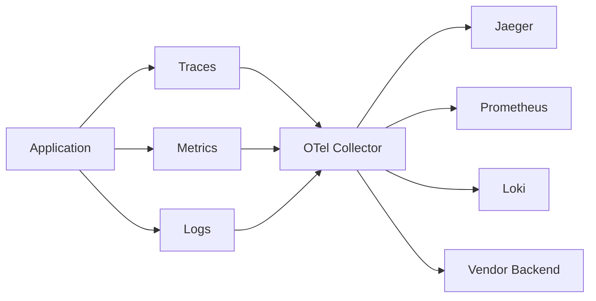

# OpenTelemetry

Vendor-neutral observability framework for generating, collecting, and exporting telemetry data (traces, metrics, logs).

## Why OpenTelemetry?

Before OTel, each observability vendor had proprietary instrumentation:

- Jaeger for tracing
- Prometheus for metrics
- Different log formats everywhere
- Switching vendors meant re-instrumenting everything

**OTel solves this:**

- One instrumentation, export anywhere
- Standard wire protocol (OTLP)
- Auto-instrumentation for common libraries
- Unified context propagation

---

## The Three Pillars



| Pillar | Purpose | Data Shape |
|--------|---------|------------|
| **Traces** | Request flow across services | Spans with parent/child relationships |
| **Metrics** | Aggregated measurements | Counters, gauges, histograms |
| **Logs** | Discrete events | Structured records with context |

### Traces

Track a request's journey through distributed systems.

**Concepts:**

- **Trace** — End-to-end request, identified by `trace_id`
- **Span** — Single operation within a trace (has `span_id`)
- **Parent Span** — The span that initiated this one
- **Attributes** — Key-value metadata on spans
- **Events** — Timestamped logs within a span
- **Status** — Ok, Error, or Unset

**Example trace structure:**

```
[HTTP Request] ─── trace_id: abc123
    └── [API Gateway] ─── span_id: 001, parent: null
        ├── [Auth Service] ─── span_id: 002, parent: 001
        └── [Order Service] ─── span_id: 003, parent: 001
            ├── [Database Query] ─── span_id: 004, parent: 003
            └── [Cache Lookup] ─── span_id: 005, parent: 003
```

**When to use:** Always in distributed systems. Essential for debugging latency and failures across service boundaries.

### Metrics

Aggregated numerical data over time.

**Types:**

| Type | Use Case | Example |
|------|----------|---------|
| Counter | Things that only go up | Request count, errors |
| Gauge | Point-in-time value | CPU usage, queue depth |
| Histogram | Distribution of values | Request latency buckets |

**When to use:** SLIs/SLOs, capacity planning, alerting. Lower cardinality than traces.

### Logs

Structured events with trace context.

**OTel adds:**

- Automatic `trace_id` and `span_id` injection
- Standard severity levels
- Resource attributes (service name, version)
- Unified export pipeline

**When to use:** Detailed debugging, audit trails, events that don't fit span model.

---

## Architecture

### Components

| Component | Role |
|-----------|------|
| **SDK** | In-app instrumentation, creates telemetry |
| **API** | Stable interface for instrumenting code |
| **Exporter** | Sends data to backends (OTLP, Jaeger, etc.) |
| **Collector** | Receives, processes, exports telemetry |
| **Auto-instrumentation** | Library hooks (HTTP, DB, etc.) |

### Deployment Patterns

**Direct export:**

```
App SDK → Exporter → Backend
```

Simple, but tightly couples app to backend.

**Via Collector (recommended):**

```
App SDK → OTLP Exporter → OTel Collector → Multiple Backends
```

Benefits:

- Decouples app from backends
- Collector handles batching, retry, sampling
- Can switch backends without app changes
- Central configuration

### Collector Modes

| Mode | Use Case |
|------|----------|
| **Agent** | Sidecar per pod/host, local buffering |
| **Gateway** | Centralized, receives from multiple agents |
| **No Collector** | Direct export for simple setups |

---

## Context Propagation

How trace context flows across service boundaries.

**Propagators:**

| Format | Protocol | Notes |
|--------|----------|-------|
| W3C Trace Context | HTTP headers | Standard, use this |
| B3 | HTTP headers | Zipkin legacy |
| Jaeger | HTTP headers | Jaeger legacy |
| AWS X-Ray | HTTP headers | AWS-specific |

**HTTP headers (W3C):**

```
traceparent: 00-{trace_id}-{span_id}-{flags}
tracestate: vendor=value
```

**Key insight:** Context propagation is automatic with auto-instrumentation. Manual only needed for custom protocols.

---

## Language Support

| Language | SDK | Auto-Instrumentation |
|----------|-----|---------------------|
| C# | `OpenTelemetry.NET` | ✅ ASP.NET Core, HttpClient, EF Core |
| Go | `go.opentelemetry.io/otel` | Partial (more manual) |
| Python | `opentelemetry-python` | ✅ Flask, Django, requests, SQLAlchemy |
| TypeScript | `@opentelemetry/sdk-node` | ✅ Express, HTTP, pg, mysql |
| Rust | `opentelemetry` crate | ✅ via `tracing-opentelemetry` |

### Language Notes

**C#:** Best-in-class. `ActivitySource` is OTel-native in .NET. Auto-instruments most common libraries.

**Go:** More manual than others. Use `otelhttp` middleware, instrument DB calls explicitly.

**Python:** Good coverage. `opentelemetry-instrumentation-*` packages for major frameworks.

**TypeScript:** Solid. `@opentelemetry/auto-instrumentations-node` covers most cases.

**Rust:** `tracing` crate is the standard. `tracing-opentelemetry` bridges to OTel export.

---

## Sampling

Not every trace needs to be recorded. Sampling strategies:

| Strategy | Description | Use Case |
|----------|-------------|----------|
| **Always On** | Record everything | Dev, low-traffic |
| **Always Off** | Record nothing | Disable tracing |
| **Probability** | Random % of traces | General production |
| **Rate Limiting** | N traces per second | High-traffic |
| **Parent-based** | Inherit parent's decision | Consistent sampling across services |
| **Tail-based** | Decide after trace completes | Keep errors, slow traces |

**Recommendation:** Start with parent-based probability sampling (10-20%). Add tail-based at the collector to keep interesting traces.

---

## Resource Attributes

Standard metadata attached to all telemetry:

| Attribute | Description |
|-----------|-------------|
| `service.name` | Logical service identifier |
| `service.version` | Deployment version |
| `deployment.environment` | prod, staging, dev |
| `host.name` | Machine hostname |
| `k8s.pod.name` | Kubernetes pod |
| `cloud.provider` | AWS, GCP, Azure |

**Essential:** Always set `service.name`. Everything else is gravy.

---

## Common Backends

| Backend | Traces | Metrics | Logs | Notes |
|---------|--------|---------|------|-------|
| Jaeger | ✅ | ❌ | ❌ | Tracing specialist, great UI |
| Zipkin | ✅ | ❌ | ❌ | Older, simpler |
| Prometheus | ❌ | ✅ | ❌ | Metrics standard, pull-based |
| Grafana Tempo | ✅ | ❌ | ❌ | Correlates with Grafana |
| Grafana Loki | ❌ | ❌ | ✅ | Log aggregation |
| Elasticsearch | ✅ | ✅ | ✅ | Full-text search |
| Datadog | ✅ | ✅ | ✅ | Commercial, excellent UX |
| Honeycomb | ✅ | ❌ | ✅ | High-cardinality pioneer |
| New Relic | ✅ | ✅ | ✅ | Commercial, full APM |

**OSS stack:** Jaeger + Prometheus + Loki + Grafana

---

## Anti-Patterns

| Anti-Pattern | Problem | Fix |
|--------------|---------|-----|
| No sampling | Storage explosion, performance hit | Always sample in production |
| Missing service.name | Can't identify source | Set it first |
| High-cardinality attributes | Blows up storage/cost | Use low-cardinality for metrics |
| Instrumenting everything | Noise | Focus on boundaries and slow paths |
| Ignoring context propagation | Broken traces | Use auto-instrumentation |

---

## Getting Started

1. **Add SDK** to your app
2. **Configure exporter** (OTLP to collector or direct)
3. **Set resource attributes** (at minimum `service.name`)
4. **Enable auto-instrumentation** for HTTP, DB, etc.
5. **Deploy collector** (optional but recommended)
6. **Choose backend** (Jaeger for traces is a good start)

---

## Related

- [[Logging Libraries]]
- [[Distributed Tracing]]
- [[Debugging Tools]]
- [[Deployment]]
