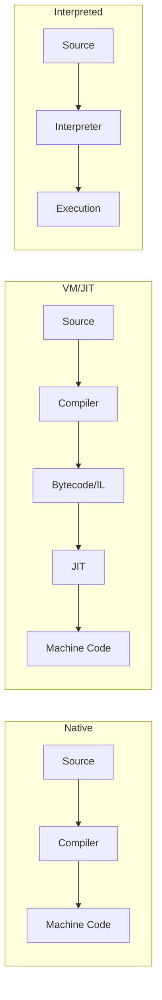

# Runtimes

How code executes: interpreters, virtual machines, and native compilation.

## Execution Models

| Model | Languages | How It Works |
|-------|-----------|--------------|
| **Native** | Rust, Go, C | Compile directly to machine code |
| **VM/JIT** | C#, Java | Compile to bytecode, JIT to native at runtime |
| **Interpreted** | Python, Ruby | Execute source directly (with bytecode caching) |
| **Transpiled** | TypeScript | Convert to another language, then run |

---

## Runtime Components

| Component | Purpose |
|-----------|---------|
| **Garbage Collector** | Automatic memory management |
| **Scheduler** | Thread/task management |
| **JIT Compiler** | Runtime optimization |
| **Standard Library** | Core functionality |
| **Memory Allocator** | Heap management |

---

## Language-Specific Runtimes

### Rust — No Runtime*

*Minimal runtime. No GC, no VM.

**What runs:**

- Small startup code (sets up stack, calls main)
- Panic handler
- Allocator (optional, can be no_std)

**Result:**

- Instant startup
- Predictable performance (no GC pauses)
- Smallest binaries
- Full control over memory

**Trade-off:** Manual memory management (via ownership system).

### Go — Small Runtime

Go has a runtime, but it's compiled into every binary.

**Runtime provides:**

- Garbage collector (concurrent, low-latency)
- Goroutine scheduler (M:N threading)
- Channel operations
- Stack management

**Characteristics:**

- Larger binaries than Rust (runtime included)
- Fast startup (still native code)
- GC pauses (typically < 1ms)
- Goroutines are cheap (2KB initial stack)

### C# — CLR/.NET Runtime

The Common Language Runtime is a full VM.

**Runtime provides:**

- JIT compilation (IL → native)
- Garbage collector (generational)
- Type system enforcement
- Exception handling
- Security sandbox

**Deployment modes:**

| Mode | What Ships | Startup |
|------|------------|---------|
| Framework-dependent | Just your IL | Requires .NET installed |
| Self-contained | IL + runtime | Large, no dependencies |
| Native AOT | Native binary | Small, fast startup |

**Native AOT:** Compiles ahead of time. No JIT. Trims unused code. Best for CLI tools, containers.

### Python — CPython Interpreter

The reference implementation interprets bytecode.

**Runtime provides:**

- Bytecode compilation (`.pyc` files)
- Garbage collector (reference counting + cycle detector)
- Global Interpreter Lock (GIL)
- Dynamic typing infrastructure

**The GIL:**

- Only one thread executes Python at a time
- I/O releases the GIL (async works fine)
- CPU parallelism requires multiprocessing
- Being removed in Python 3.13+ (free-threaded builds)

**Alternative runtimes:**

| Runtime | Difference |
|---------|------------|
| PyPy | JIT compiler, faster for long-running |
| Cython | Compiles to C |
| GraalPy | On GraalVM, polyglot |

### TypeScript/JavaScript — V8, SpiderMonkey, etc

JavaScript engines are sophisticated JIT compilers.

**V8 (Chrome, Node.js):**

- Ignition (interpreter) → TurboFan (optimizing JIT)
- Hidden classes for object optimization
- Generational GC
- Inline caching

**Other engines:**

| Engine | Used By |
|--------|---------|
| V8 | Chrome, Node.js, Deno, Bun |
| SpiderMonkey | Firefox |
| JavaScriptCore | Safari, Bun |

**Node.js vs Deno vs Bun:**

| Runtime | Engine | Key Difference |
|---------|--------|----------------|
| Node.js | V8 | Established, npm |
| Deno | V8 | TypeScript native, secure by default |
| Bun | JSC | Fast startup, built-in bundler |

---

## Garbage Collection

| Language | GC Type | Characteristics |
|----------|---------|-----------------|
| Rust | None | Ownership system, compile-time memory management |
| Go | Concurrent mark-sweep | Low latency (< 1ms), tunable |
| C# | Generational | Gen 0/1/2, compacting |
| Python | Reference counting + cycle GC | Deterministic for non-cycles |
| JavaScript | Generational | Engine-specific |

### GC Impact

| Concern | Low-latency GCs (Go) | Throughput GCs (C#) |
|---------|---------------------|---------------------|
| Pause time | Very short | Can be longer |
| CPU overhead | Higher continuous | Lower overall |
| Memory overhead | More | Less |
| Tuning | GOGC | Server vs Workstation GC |

---

## Startup Time

| Language | Typical Startup | Why |
|----------|-----------------|-----|
| Rust | < 1ms | Native code, minimal init |
| Go | 1-5ms | Native + runtime init |
| C# (Native AOT) | 5-20ms | Native, no JIT |
| C# (JIT) | 50-200ms | JIT compilation overhead |
| Node.js | 30-100ms | V8 initialization |
| Python | 20-50ms | Interpreter + imports |

**For CLI tools:** Startup matters. Prefer native or AOT.

**For servers:** Startup is one-time. JIT amortizes.

---

## Memory Footprint

| Language | Base Memory | Why |
|----------|-------------|-----|
| Rust | ~1 MB | Just your code |
| Go | ~5-10 MB | Runtime + GC |
| C# (AOT) | ~10-20 MB | Trimmed runtime |
| C# (JIT) | ~30-50 MB | Full runtime |
| Node.js | ~30-50 MB | V8 heap |
| Python | ~15-30 MB | Interpreter + stdlib |

---

## Concurrency Models

| Language | Model | Primitives |
|----------|-------|------------|
| Rust | Ownership-based | `std::thread`, async/await, channels |
| Go | CSP | Goroutines, channels |
| C# | Task-based | `async/await`, `Task`, thread pool |
| Python | GIL-limited | `asyncio`, `threading` (I/O only), `multiprocessing` |
| JavaScript | Event loop | `async/await`, single-threaded |

---

## Embedding & Interop

| Scenario | Options |
|----------|---------|
| Call C from Rust | FFI (safe wrappers) |
| Call C from Go | CGO |
| Call C from Python | ctypes, cffi |
| Call .NET from Python | pythonnet |
| Embed Python in Rust | pyo3 |
| Embed JavaScript in Rust | deno_core, v8 crate |

---

## Decision Factors

| Factor | Best Runtime |
|--------|--------------|
| Fastest startup | Rust, Go |
| Smallest memory | Rust |
| Predictable latency | Rust, Go |
| Fastest throughput | C# JIT (optimizes hot paths) |
| Easiest deployment | Go (single binary) |
| Ecosystem libraries | C#, Python, JavaScript |

---

## Related

- [[Build Systems]]
- [[Cross-Compilation]]
- [[Deployment]]
- [[Memory Management]]
