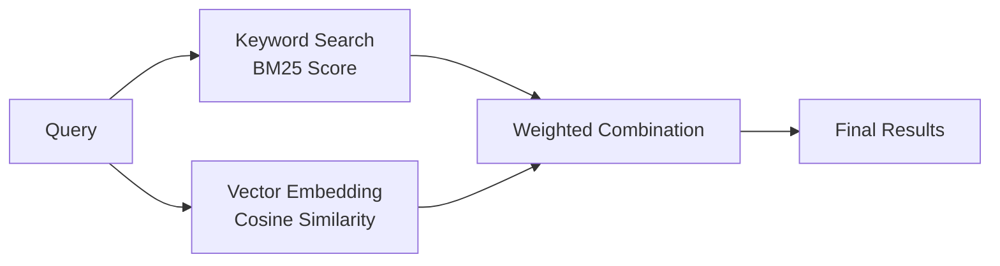
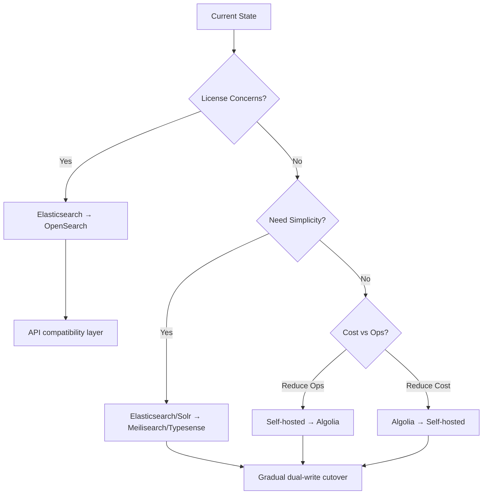

# Search Engines

Specialized databases optimized for full-text search, faceted filtering, and relevance ranking using inverted indexes and sophisticated scoring algorithms.

## Overview

| Aspect | Details |
|--------|---------|
| **Purpose** | Fast text search with relevance ranking, filtering, and analytics |
| **Core Technology** | Inverted indexes, tokenization, scoring algorithms (BM25, TF-IDF) |
| **Primary Use Cases** | Site search, log analytics, product discovery, autocomplete |
| **Key Features** | Fuzzy matching, faceted search, highlighting, aggregations, typo tolerance |
| **Architecture** | Distributed, replicated, horizontally scalable clusters |
| **Query Performance** | Sub-second for millions of documents, millisecond for autocomplete |

## Core Concepts

### Inverted Index

The fundamental data structure that enables fast full-text search:

```
Term → Document IDs + Positions
"search" → [doc1:pos3, doc2:pos7, doc5:pos2]
"engine" → [doc1:pos4, doc3:pos1, doc5:pos3]
```

- Maps terms to documents containing them (reverse of document-to-terms)
- Enables rapid lookups: find all documents containing "search engine"
- Stores term positions for phrase queries and proximity scoring
- Updated incrementally as documents are indexed

### Tokenization and Analysis

Text processing pipeline that converts raw text into searchable terms:

- **Tokenization**: Split text into terms (`"Search Engines"` → `["Search", "Engines"]`)
- **Normalization**: Lowercase, remove accents (`"Café"` → `"cafe"`)
- **Stemming**: Reduce to root form (`"searching"` → `"search"`)
- **Stop words**: Filter common words (`"the"`, `"and"`, `"is"`)
- **N-grams**: Generate character/word sequences for autocomplete (`"search"` → `["se", "sea", "sear", ...]`)

### Relevance Scoring

Algorithms that rank search results by relevance:

**TF-IDF (Term Frequency-Inverse Document Frequency)**

```
score = TF(term, doc) × IDF(term)

TF  = how often term appears in document
IDF = log(total_docs / docs_containing_term)
```

- Classic algorithm: rewards term frequency, penalizes common terms
- Simple, interpretable, fast to compute
- Doesn't account for document length well

**BM25 (Best Matching 25)**

```
score = IDF(term) × (TF × (k1 + 1)) / (TF + k1 × (1 - b + b × (doc_length / avg_doc_length)))

k1 = term frequency saturation (typically 1.2-2.0)
b  = length normalization (typically 0.75)
```

- Modern standard: addresses TF-IDF weaknesses
- Diminishing returns for term frequency (saturation)
- Normalizes for document length
- Default in Elasticsearch, Solr, most modern engines

### Faceted Search

Categorized filters based on document attributes:

```
Results: 1,247 products

Brand (facets with counts):
  ✓ Apple (342)
  ✓ Samsung (198)
  □ Google (87)

Price:
  ✓ $0-$500 (521)
  □ $500-$1000 (389)
  □ $1000+ (337)
```

- Dynamic filter generation from result set
- Shows counts for each facet value
- Enables drill-down exploration
- Essential for e-commerce, content discovery

### Fuzzy Matching

Handles typos and spelling variations using edit distance:

```
Query: "seacrh"
Matches: "search" (edit distance: 1)

Levenshtein distance:
- Insertions: "seach" → "search"
- Deletions: "searchh" → "search"
- Substitutions: "seurch" → "search"
```

- Configurable maximum edit distance (1-2 typical)
- Performance cost increases with distance
- Essential for user-facing search

### Hybrid Search

Combines keyword search with vector similarity:



- Keyword search: exact term matching, traditional relevance
- Vector search: semantic similarity, meaning-based
- Reciprocal Rank Fusion (RRF) or weighted scoring to combine
- Best of both worlds: precision + semantic understanding

## Search Engine Comparison

| Feature | Elasticsearch | OpenSearch | Meilisearch | Typesense | Algolia | Solr |
|---------|--------------|------------|-------------|-----------|---------|------|
| **License** | SSPL (proprietary) | Apache 2.0 | MIT | GPL v3 | Proprietary SaaS | Apache 2.0 |
| **Language** | Java | Java | Rust | C++ | Proprietary | Java |
| **Ease of Setup** | Complex | Complex | Simple | Simple | Instant (SaaS) | Complex |
| **Typo Tolerance** | ✅ Fuzzy queries | ✅ Fuzzy queries | ✅ Built-in | ✅ Built-in | ✅ Best-in-class | ✅ Fuzzy queries |
| **Autocomplete** | ✅ Completion suggester | ✅ Completion suggester | ✅ Prefix search | ✅ Prefix search | ✅ Instant | ✅ Suggester component |
| **Faceted Search** | ✅ Aggregations | ✅ Aggregations | ✅ Yes | ✅ Yes | ✅ Yes | ✅ Yes |
| **Hybrid Search** | ✅ kNN + BM25 | ✅ kNN + BM25 | ✅ (Beta) | ✅ Vector + keyword | ✅ Vector + keyword | ✅ Dense vector |
| **Analytics** | ✅ Extensive | ✅ Extensive | ❌ Basic | ❌ Limited | ✅ Dashboard | ✅ Extensive |
| **Multi-tenancy** | ✅ Indexes | ✅ Indexes | ✅ Indexes/Keys | ✅ Collections | ✅ Indexes/API keys | ✅ Collections |
| **Scaling** | Horizontal | Horizontal | Vertical + replicas | Horizontal | Auto (SaaS) | Horizontal |
| **Query Language** | JSON DSL | JSON DSL | RESTful params | RESTful params | JSON params | Solr query syntax |
| **Real-time Indexing** | Near real-time | Near real-time | Real-time | Real-time | Real-time | Near real-time |
| **Learning Curve** | Steep | Steep | Gentle | Gentle | Gentle | Steep |

## Search Engines in Detail

### Elasticsearch

The most popular search and analytics engine, now under proprietary license.

**Strengths:**
- Battle-tested at massive scale (billions of documents)
- Rich ecosystem: Kibana (visualization), Logstash (ingestion), Beats (shippers)
- Powerful query DSL with complex bool queries, nested objects, geo search
- Extensive aggregation framework for analytics
- Machine learning features (anomaly detection, forecasting)

**Considerations:**
- SSPL license restricts cloud hosting (AWS, GCP, Azure cannot offer managed service)
- Resource intensive: requires careful tuning (heap size, shards, replicas)
- Operational complexity: cluster management, monitoring, upgrades
- Can be overkill for simple site search

**Best For:**
- Log analytics and observability (ELK stack)
- Enterprise search with complex requirements
- Large-scale data analytics
- Teams with dedicated Elasticsearch expertise

### OpenSearch

AWS fork of Elasticsearch (pre-license change), fully open source.

**Strengths:**
- Apache 2.0 license: truly open source
- API compatible with Elasticsearch 7.10.2
- Active development by AWS and community
- AWS managed service (OpenSearch Service)
- Security plugins included (authentication, encryption, audit)

**Considerations:**
- Smaller ecosystem than Elasticsearch
- Feature lag behind latest Elasticsearch innovations
- AWS-centric development priorities
- Same operational complexity as Elasticsearch

**Best For:**
- Organizations requiring open source license
- AWS-native architectures
- Migration from Elasticsearch avoiding license issues
- Large-scale search and analytics

### Meilisearch

Modern, developer-friendly search engine focused on instant search experiences.

**Strengths:**
- Zero-config defaults: works out-of-box with sensible settings
- Built-in typo tolerance and relevance tuning
- Instant search (as-you-type) optimized
- Simple REST API with intuitive JSON responses
- Excellent performance on single-node deployments
- Written in Rust: memory-safe, fast

**Considerations:**
- Limited analytics capabilities (not for log analysis)
- Horizontal scaling still maturing
- Smaller community and ecosystem
- Not ideal for complex aggregations or reporting

**Best For:**
- Site search and product discovery
- Rapid prototyping and MVPs
- Small to medium deployments
- Teams wanting simplicity over power

### Typesense

Lightning-fast, typo-tolerant search engine with developer experience focus.

**Strengths:**
- Blazing fast: C++ implementation, in-memory indexing
- Built-in typo tolerance with smart defaults
- Tuned for instant search (sub-10ms queries)
- Simple REST API with clear documentation
- Excellent autocomplete and filtering performance
- Affordable cloud hosting option

**Considerations:**
- GPL v3 license (requires open-sourcing derivative works)
- Primarily in-memory: RAM = dataset size
- Limited analytics features
- Smaller ecosystem than Elasticsearch/Solr

**Best For:**
- E-commerce product search
- Autocomplete and instant search
- Performance-critical applications
- Small to medium datasets (< 100GB)

### Algolia

Hosted search-as-a-service with exceptional developer experience.

**Strengths:**
- Best-in-class typo tolerance and relevance out-of-box
- Sub-50ms global latency via CDN-like infrastructure
- Zero ops: fully managed, auto-scaling
- Rich client libraries and UI components (InstantSearch)
- Built-in analytics and A/B testing
- Excellent documentation and support

**Considerations:**
- Expensive at scale (pay per record and operation)
- Proprietary SaaS: vendor lock-in
- Limited customization vs self-hosted options
- Data residency considerations
- Pricing can be prohibitive for large catalogs

**Best For:**
- E-commerce with global users
- Companies prioritizing speed-to-market over cost
- Teams without search infrastructure expertise
- Applications requiring 99.99% uptime SLA

### Solr

Veteran open-source search platform built on Lucene (same core as Elasticsearch).

**Strengths:**
- Mature, stable, well-documented (since 2004)
- Apache 2.0 license: truly open source
- Rich feature set: facets, geospatial, spell check, more-like-this
- Powerful configuration via XML
- Strong support for structured data and document databases
- Active community and extensive plugins

**Considerations:**
- Steeper learning curve than modern alternatives
- XML-heavy configuration (less developer-friendly)
- Slower innovation pace vs Elasticsearch
- Smaller mindshare in modern stacks

**Best For:**
- Organizations standardized on Lucene ecosystem
- Legacy systems requiring long-term stability
- Complex document search (research, legal, publishing)
- Teams with existing Solr expertise

## Decision Guide

### Choose Elasticsearch/OpenSearch if:
- ✅ You need log analytics and observability (ELK/EFK stack)
- ✅ Complex aggregations and analytics are core requirements
- ✅ Massive scale (billions of documents) with horizontal scaling
- ✅ You have dedicated search infrastructure team
- ✅ Budget for operational complexity exists

### Choose Meilisearch if:
- ✅ You want instant search without configuration complexity
- ✅ Site search or product search for small-medium catalogs
- ✅ Developer experience and speed-to-market are priorities
- ✅ Open source with permissive license (MIT) required
- ✅ Single-node performance is sufficient

### Choose Typesense if:
- ✅ Sub-10ms query latency is critical
- ✅ You need blazing-fast autocomplete and filtering
- ✅ Dataset fits in memory (< 100GB typical)
- ✅ Simple deployment with minimal ops overhead
- ✅ GPL v3 license is acceptable

### Choose Algolia if:
- ✅ Zero operations burden is worth premium pricing
- ✅ Global low-latency is critical (CDN-like search)
- ✅ Time-to-market outweighs cost concerns
- ✅ You want best-in-class relevance out-of-box
- ✅ Analytics and A/B testing built-in are valuable

### Choose Solr if:
- ✅ You need proven stability and long-term support
- ✅ Existing Lucene/Solr expertise in organization
- ✅ Complex document search (legal, research, archives)
- ✅ Apache 2.0 license and true open source required
- ✅ Legacy integrations or migrations from older Solr versions

## Migration Paths



## Performance Optimization

### Indexing Strategy

**Bulk Indexing:**
- Batch documents (1000-5000 per request)
- Disable refresh during bulk operations
- Use async indexing where possible

**Index Settings:**
- Number of shards: `num_docs / 50GB` as starting point
- Number of replicas: balance availability vs resource cost
- Refresh interval: increase for write-heavy workloads (default 1s)

### Query Optimization

**Reduce Scope:**
- Filter before querying (filters are cacheable)
- Limit fields searched (`_source` filtering)
- Use `size` parameter to limit results returned

**Caching:**
- Query cache: cache filter results
- Field data cache: for aggregations and sorting
- Request cache: cache result counts

**Scoring:**
- Disable scoring when not needed (`constant_score` query)
- Use `track_total_hits: false` if count not required
- Consider approximate aggregations for large datasets

### Monitoring

Key metrics to track:
- **Query latency**: p50, p95, p99 response times
- **Indexing throughput**: documents/second
- **Cluster health**: green/yellow/red status
- **Resource usage**: CPU, memory, disk I/O, network
- **Cache hit rates**: query cache, filter cache
- **Rejected requests**: thread pool rejections

## Related

- [[Database Engines]] - Transactional and analytical databases
- [[Vector Databases]] - Semantic search and embeddings
- [[Observability Tools]] - Monitoring and logging platforms
