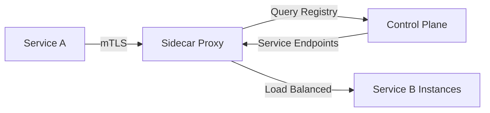

# Service Discovery

A pattern and toolset enabling services to find and communicate with each other in dynamic, distributed systems without hardcoded endpoints.

## Overview

| Aspect | Details |
|--------|---------|
| **Purpose** | Automatically register, discover, and route to service instances |
| **Problem Solved** | Dynamic IP addresses, scaling instances, service health tracking |
| **Core Pattern** | Registry stores service locations; clients query or subscribe for updates |
| **Common Use Cases** | Microservices, containerized apps, cloud-native systems |
| **Alternative** | Static DNS, load balancer config, environment variables |

## Core Concepts

### Service Registration

**Self-Registration**: Services register themselves on startup, deregister on shutdown.

**Third-Party Registration**: External agent (sidecar, controller) handles registration.

### Service Discovery Patterns

**Client-Side Discovery**: Client queries registry, performs load balancing, makes direct request.

- More network hops avoided
- Client complexity increases
- Examples: Netflix Ribbon + Eureka, Consul with client library

**Server-Side Discovery**: Client requests via load balancer/proxy, which queries registry.

- Simpler clients
- Additional proxy layer
- Examples: Kubernetes Service + DNS, AWS ELB + Route 53

### Health Checks

- **Active Health Checks**: Registry pings services periodically (HTTP, TCP, gRPC)
- **Passive Health Checks**: Services send heartbeats to registry
- **TTL-Based**: Services must refresh registration before expiration
- **Combination**: Active checks + heartbeats for reliability

## Service Discovery Tools

### Consul

**Type**: Full-featured service mesh with built-in discovery
**Backing**: HashiCorp (open source + enterprise)

**Key Features**:

- DNS and HTTP APIs for service lookup
- Multi-datacenter support with WAN gossip
- Built-in health checking (HTTP, TCP, script, TTL)
- Key-value store for configuration
- Service mesh capabilities (Connect)
- ACLs and security policies

**Architecture**: Agent-based with Raft consensus (server cluster) + gossip protocol (agents)

### etcd

**Type**: Distributed key-value store used for service discovery
**Backing**: Cloud Native Computing Foundation (CNCF)

**Key Features**:

- Strong consistency via Raft consensus
- Watch API for real-time updates
- Lease-based TTL for ephemeral keys
- MVCC for versioned key history
- gRPC API with HTTP gateway

**Architecture**: Distributed consensus cluster (typically 3-5 nodes)

**Common Usage**: Kubernetes backing store, CoreDNS backend, service registration

### ZooKeeper

**Type**: Distributed coordination service with service discovery capabilities
**Backing**: Apache Software Foundation

**Key Features**:

- Hierarchical namespace (like filesystem)
- Ephemeral nodes for session-based registration
- Watchers for change notifications
- Strong consistency guarantees
- ACL-based security

**Architecture**: Leader-follower ensemble with ZAB consensus protocol

**Common Usage**: Kafka coordination, Hadoop cluster management, legacy microservices

### Netflix Eureka

**Type**: Service registry for AWS-based microservices
**Backing**: Netflix OSS

**Key Features**:

- RESTful service registration and discovery
- Client-side load balancing (with Ribbon)
- Zone awareness for AWS regions
- Self-preservation mode during network partitions
- Dashboard UI for registry visualization

**Architecture**: Peer-to-peer replication between Eureka servers

**Status**: Maintenance mode (Netflix uses alternatives internally)

### Kubernetes DNS

**Type**: Built-in DNS-based service discovery for Kubernetes
**Backing**: Kubernetes / CNCF

**Key Features**:

- Automatic DNS records for Services and Pods
- Service-based discovery (`service-name.namespace.svc.cluster.local`)
- Headless Services for direct pod IPs
- Integrated with cluster networking
- No separate registry needed

**Architecture**: CoreDNS addon watches Kubernetes API for Service/Pod changes

### DNS-SD (mDNS/Bonjour)

**Type**: Zero-configuration service discovery using DNS
**Backing**: IETF standard (RFC 6763)

**Key Features**:

- Multicast DNS for local network discovery
- No central registry required
- Standard DNS record types (SRV, TXT, PTR)
- Cross-platform (Avahi on Linux, Bonjour on macOS/Windows)

**Common Usage**: IoT devices, local network services, printer discovery

## Comparison Matrix

| Tool | Consistency | Health Checks | Multi-DC | K8s Native | Complexity | Best For |
|------|-------------|---------------|----------|------------|------------|----------|
| **Consul** | Strong (Raft) | ✅ Active + TTL | ✅ | Integration | Medium | Multi-cloud, service mesh |
| **etcd** | Strong (Raft) | ❌ (TTL only) | ✅ | ✅ (K8s) | Medium | Kubernetes, config storage |
| **ZooKeeper** | Strong (ZAB) | ❌ (ephemeral) | ✅ | Integration | High | Legacy systems, coordination |
| **Eureka** | Eventually consistent | ✅ Heartbeat | ❌ (zones) | Integration | Low | AWS-based microservices |
| **K8s DNS** | Eventual | ✅ (K8s probes) | ❌ (single cluster) | ✅ | Very Low | Kubernetes-only deployments |
| **DNS-SD** | Eventually consistent | ❌ | ❌ | ❌ | Low | Local networks, IoT |

## Integration Patterns

### Load Balancing Integration

**Client-Side Load Balancing**:

- Service discovery returns all healthy instances
- Client library (Ribbon, gRPC LB) selects instance
- Algorithms: Round-robin, least connections, random

**Server-Side Load Balancing**:

- Discovery system updates load balancer config
- Examples: Consul Template → HAProxy, K8s Service → kube-proxy

### Service Mesh Integration

Modern service meshes combine discovery with traffic management:

**Examples**: Consul Connect, Istio (etcd), Linkerd

## Decision Guide

| Choose | When You Need | Avoid If |
|--------|---------------|----------|
| **Consul** | Multi-cloud, service mesh, strong consistency | Simple K8s-only setup |
| **etcd** | Kubernetes, distributed config, strong consistency | Non-K8s microservices |
| **ZooKeeper** | Existing ZK infrastructure, Kafka/Hadoop | Greenfield projects |
| **Eureka** | AWS microservices, Spring Boot ecosystem | Active development (maintenance mode) |
| **K8s DNS** | Kubernetes-native apps, simplicity | Multi-cluster, non-K8s services |
| **DNS-SD** | Local networks, zero-config, IoT | Cloud deployments, WAN |

## When to Use Service Discovery

### Strengths

- **Dynamic Scaling**: Services auto-register as instances scale up/down
- **Failure Handling**: Unhealthy instances removed automatically
- **Environment Portability**: No hardcoded IPs or DNS names
- **Zero Downtime Deploys**: New instances registered before old ones removed
- **Multi-Cloud**: Single discovery mechanism across providers

### Considerations

- **Additional Complexity**: New infrastructure component to manage
- **Single Point of Failure**: Registry must be highly available
- **Network Overhead**: Additional lookup requests
- **Eventual Consistency**: Some systems may serve stale data briefly
- **Learning Curve**: Teams must understand distributed systems concepts

### Best For

- **Microservices Architectures**: Many services with dynamic instances
- **Container Orchestration**: Kubernetes, ECS, Nomad deployments
- **Cloud-Native Apps**: Multi-region, auto-scaling workloads
- **Service Meshes**: mTLS, traffic routing, observability integration

### Not Needed For

- **Monoliths**: Single service with static endpoints
- **Small Scale**: 2-3 services with predictable locations
- **Static Infrastructure**: VMs with fixed IPs and DNS
- **Simple Client-Server**: Mobile/web apps calling single backend

## Security Considerations

### Registry Security

- **ACLs and RBAC**: Control which services can register/query
- **mTLS**: Encrypt communication between services and registry
- **Token-Based Auth**: API tokens for service registration
- **Network Segmentation**: Registry isolated from public internet

### Service-to-Service Security

Service discovery enables, but doesn't provide:

- **Authentication**: Verify service identity (mTLS, JWT)
- **Authorization**: Enforce access policies
- **Encryption**: Protect data in transit

**Recommendation**: Combine discovery with service mesh for complete security.

## Observability Integration

### Metrics

- Registry size (total services, instances)
- Query latency and error rates
- Health check pass/fail counts
- Registration/deregistration events

### Logging

- Service lifecycle events (register, deregister, health changes)
- Failed health checks with reasons
- Query patterns and hot services

### Tracing

- Distributed traces including discovery lookups
- Correlation of discovery failures with request failures
- Discovery latency impact on overall request latency

**Tools**: Prometheus (metrics), OpenTelemetry (traces), Grafana (visualization)

## Related

- [[Kubernetes]] - Built-in DNS-based service discovery
- [[Service Mesh]] - Service discovery with traffic management and security
- [[Load Balancing]] - Often integrated with service discovery
- [[API Gateway]] - May use service discovery for backend routing
- [[Container Orchestration]] - Platforms providing discovery mechanisms
