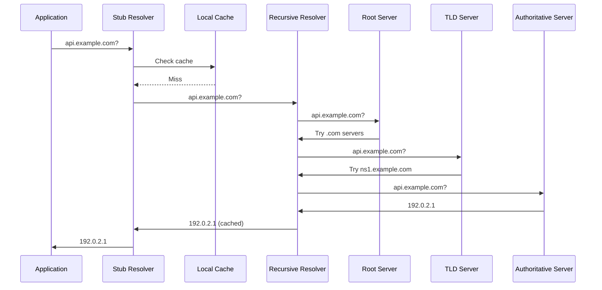
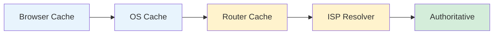
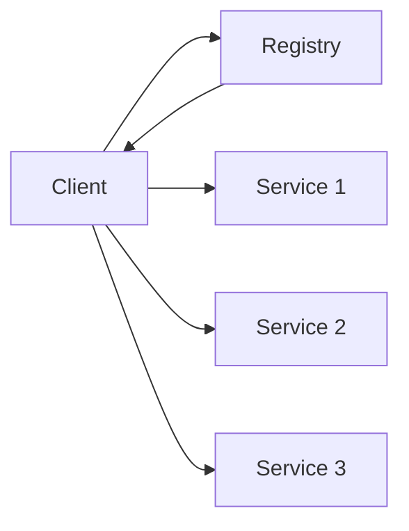
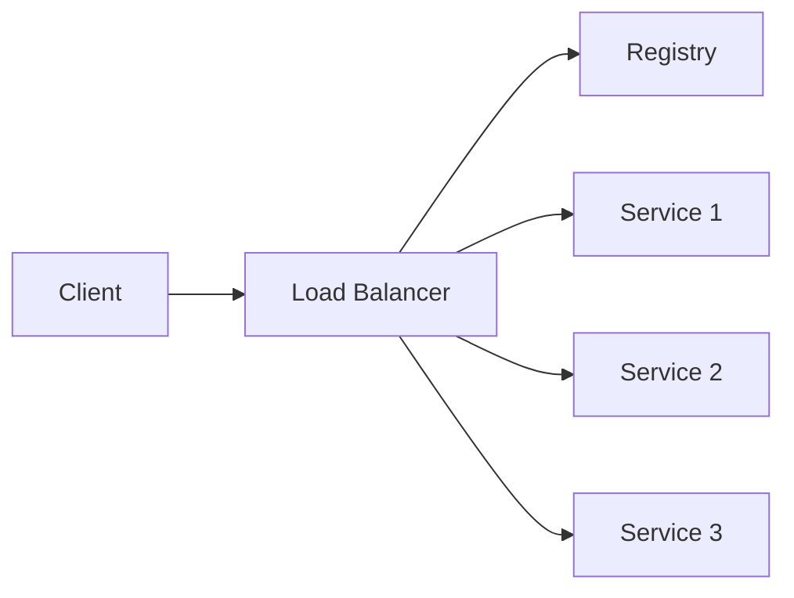
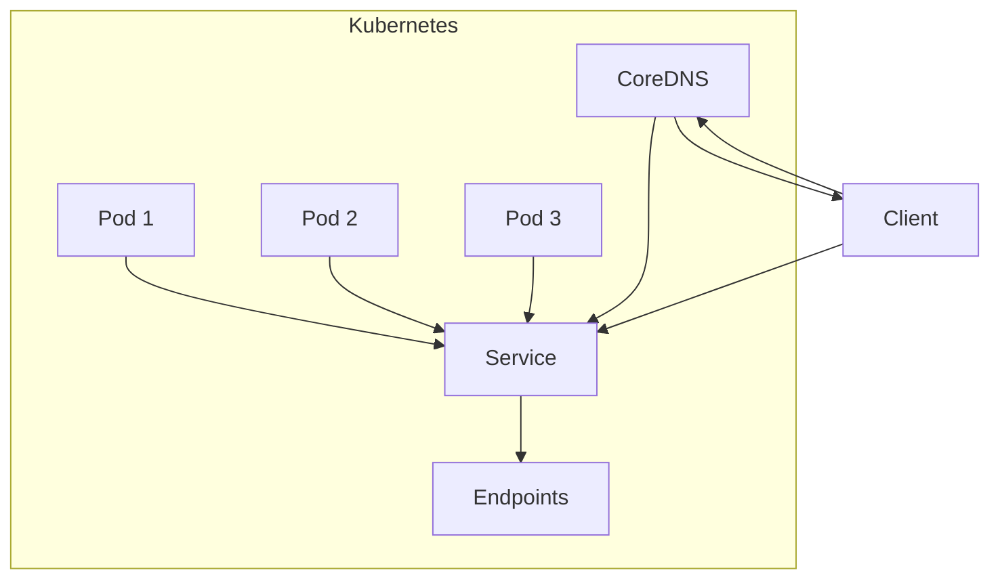

# DNS & Service Discovery

How machines find each other—from domain names to dynamic service registration.

## DNS Fundamentals

The Domain Name System translates human-readable names to IP addresses.

| Component | Role |
|-----------|------|
| **Recursive Resolver** | Your ISP/corporate DNS; caches and queries on your behalf |
| **Root Servers** | 13 logical servers; know TLD servers |
| **TLD Servers** | Manage `.com`, `.org`, `.io`, etc. |
| **Authoritative Servers** | Hold actual DNS records for domains |

---

## DNS Resolution



---

## DNS Record Types

| Type | Purpose | Example |
|------|---------|---------|
| **A** | IPv4 address | `example.com → 93.184.216.34` |
| **AAAA** | IPv6 address | `example.com → 2606:2800:220:1:...` |
| **CNAME** | Canonical name (alias) | `www.example.com → example.com` |
| **MX** | Mail exchange | `example.com → mail.example.com` (priority 10) |
| **TXT** | Arbitrary text | SPF, DKIM, domain verification |
| **NS** | Name server | `example.com → ns1.example.com` |
| **SOA** | Start of authority | Zone metadata, serial number |
| **SRV** | Service location | `_http._tcp.example.com → server:8080` |
| **PTR** | Reverse lookup | `34.216.184.93.in-addr.arpa → example.com` |
| **CAA** | Certificate authority auth | Which CAs can issue certs |

### TXT Record Uses

| Purpose | Format |
|---------|--------|
| SPF (email auth) | `v=spf1 include:_spf.google.com ~all` |
| DKIM (email signing) | `v=DKIM1; k=rsa; p=...` |
| Domain verification | `google-site-verification=...` |
| DMARC | `v=DMARC1; p=reject; rua=mailto:...` |

---

## TTL (Time To Live)

How long records are cached.

| TTL | Use Case |
|-----|----------|
| 60s | Frequent changes, failover |
| 300s (5m) | Active management |
| 3600s (1h) | Standard |
| 86400s (1d) | Stable records |

**Trade-off:** Lower TTL = faster changes, more queries, higher load.

**Pre-migration pattern:** Lower TTL days before a change, restore after.

---

## DNS Caching Layers



**Cache invalidation is hard:** Must wait for TTL to expire across all layers.

---

## DNS Query Types

| Type | Description |
|------|-------------|
| **Recursive** | Resolver does all the work, returns final answer |
| **Iterative** | Resolver returns referral, client follows chain |
| **Inverse** | IP to hostname (PTR records) |

---

## DNSSEC

DNS Security Extensions—cryptographic authentication of DNS responses.

| Record | Purpose |
|--------|---------|
| RRSIG | Signature over record set |
| DNSKEY | Public key for zone |
| DS | Delegation signer (chain of trust) |
| NSEC/NSEC3 | Authenticated denial of existence |

**Problem solved:** Prevents DNS spoofing/cache poisoning.

**Adoption:** Slow due to complexity; not universal.

---

## DNS over HTTPS/TLS

| Protocol | Port | Description |
|----------|------|-------------|
| Traditional DNS | 53 (UDP/TCP) | Unencrypted |
| DNS over TLS (DoT) | 853 | TLS-encrypted DNS |
| DNS over HTTPS (DoH) | 443 | DNS via HTTPS |

**Benefits:** Privacy, prevents tampering.
**Concerns:** Bypasses network policies, centralizes trust.

---

## Service Discovery

In distributed systems, services need to find each other dynamically.

### Why Not Just DNS?

| DNS Limitation | Service Discovery Need |
|----------------|----------------------|
| Slow propagation | Instant updates |
| No health checks | Only healthy instances |
| Limited metadata | Rich service metadata |
| Static records | Dynamic registration |

---

## Service Discovery Patterns

### Client-Side Discovery



- Client queries registry, chooses instance
- Client handles load balancing
- Examples: Netflix Eureka, Consul (direct)

### Server-Side Discovery



- Client talks to load balancer
- LB queries registry, routes request
- Examples: Kubernetes Services, AWS ALB

---

## Service Discovery Tools

| Tool | Type | Health Checks | Key Features |
|------|------|---------------|--------------|
| **Consul** | CP (Raft) | HTTP, TCP, gRPC, script | KV store, multi-DC |
| **etcd** | CP (Raft) | TTL-based | Kubernetes backend |
| **ZooKeeper** | CP (ZAB) | Session-based | Mature, complex |
| **Eureka** | AP | Client heartbeat | Netflix, Spring Cloud |
| **Nacos** | AP/CP | HTTP, TCP | Alibaba, config management |

### Kubernetes Service Discovery



- Services get DNS names: `my-service.namespace.svc.cluster.local`
- CoreDNS resolves to ClusterIP or Pod IPs
- Endpoints updated automatically as pods scale

---

## Health Checking

| Type | Description | Use Case |
|------|-------------|----------|
| **TCP** | Port open? | Basic connectivity |
| **HTTP** | Returns 2xx? | Web services |
| **gRPC** | Health protocol | gRPC services |
| **Script** | Custom command | Complex checks |
| **TTL** | Heartbeat-based | Self-reporting services |

### Health Check Patterns

| Pattern | Description |
|---------|-------------|
| **Liveness** | Is the process alive? Restart if not |
| **Readiness** | Can it handle traffic? Remove from LB if not |
| **Startup** | Is it still starting? Don't check liveness yet |

---

## DNS-Based Service Discovery

### SRV Records

Standard DNS service location:

```
_http._tcp.api.example.com. 300 IN SRV 10 5 8080 server1.example.com.
_http._tcp.api.example.com. 300 IN SRV 10 5 8080 server2.example.com.
```

Format: `priority weight port target`

### DNS-SD (Service Discovery)

Multicast DNS for local networks (Bonjour, Avahi).

- `_services._dns-sd._udp.local` lists available services
- Used for printers, AirPlay, etc.

---

## Comparison

| Aspect | DNS | Service Registry |
|--------|-----|------------------|
| Update speed | Minutes | Seconds |
| Health awareness | No | Yes |
| Metadata | Limited (TXT) | Rich |
| Complexity | Simple | More complex |
| Infrastructure | Universal | Additional system |
| Scale | Global | Cluster/DC level |

---

## Best Practices

| Practice | Rationale |
|----------|-----------|
| Use short TTLs for dynamic services | Faster failover |
| Implement client-side caching | Reduce registry load |
| Health check all instances | Only route to healthy |
| Use sidecar proxies | Offload discovery from app |
| Plan for registry failure | Cache last known good |
| Monitor DNS resolution time | Detect issues early |

---

## Related

- [[Networking Fundamentals]]
- [[Distributed Systems]]
- [[System Design]]
- [[API Design Patterns]]
