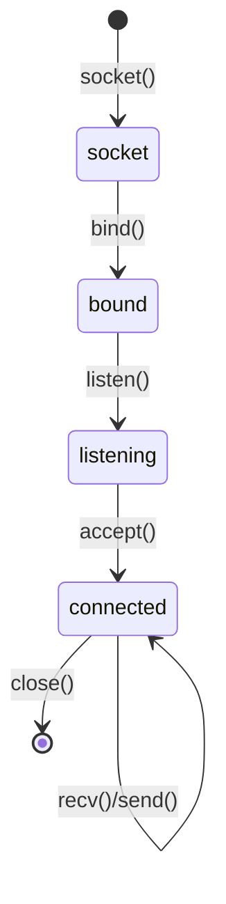
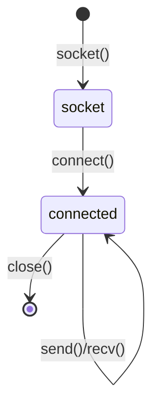
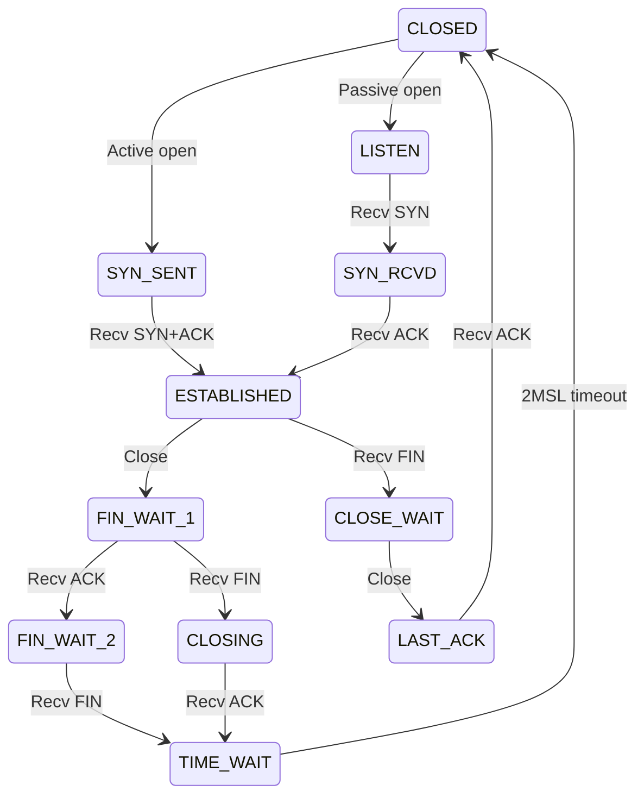

# Sockets & Low-Level Networking

The programming interface for network communication—how applications send and receive data over networks.

## What is a Socket?

An endpoint for communication between two machines. Think of it as a file descriptor for network I/O.

| Component | Description |
|-----------|-------------|
| **IP Address** | Identifies the machine |
| **Port** | Identifies the application/service |
| **Protocol** | TCP or UDP |

A socket is uniquely identified by: `(protocol, local IP, local port, remote IP, remote port)`

---

## Socket Types

| Type | Constant | Protocol | Description |
|------|----------|----------|-------------|
| Stream | `SOCK_STREAM` | TCP | Reliable, ordered, connection-oriented |
| Datagram | `SOCK_DGRAM` | UDP | Unreliable, unordered, connectionless |
| Raw | `SOCK_RAW` | IP | Direct IP packet access (requires privileges) |

---

## TCP Socket Lifecycle

### Server Side



### Client Side



---

## Core Socket Operations

### Server Operations

| Function | Purpose | Notes |
|----------|---------|-------|
| `socket()` | Create socket | Returns file descriptor |
| `bind()` | Assign local address | IP + port |
| `listen()` | Mark as passive | Specify backlog queue size |
| `accept()` | Accept connection | Blocks until client connects, returns new socket |
| `recv()` | Receive data | Blocks until data available |
| `send()` | Send data | May not send all bytes |
| `close()` | Close socket | Release resources |

### Client Operations

| Function | Purpose | Notes |
|----------|---------|-------|
| `socket()` | Create socket | Same as server |
| `connect()` | Connect to server | Initiates TCP handshake |
| `send()` | Send data | Same as server |
| `recv()` | Receive data | Same as server |
| `close()` | Close socket | Same as server |

---

## Address Structures

### IPv4 (sockaddr_in)

```
struct sockaddr_in {
    sa_family_t    sin_family;  // AF_INET
    in_port_t      sin_port;    // Port (network byte order)
    struct in_addr sin_addr;    // IP address
};
```

### IPv6 (sockaddr_in6)

```
struct sockaddr_in6 {
    sa_family_t     sin6_family;   // AF_INET6
    in_port_t       sin6_port;     // Port
    uint32_t        sin6_flowinfo; // Flow info
    struct in6_addr sin6_addr;     // IPv6 address
    uint32_t        sin6_scope_id; // Scope ID
};
```

---

## Byte Order

Networks use **big-endian** (network byte order). Hosts may use little-endian.

| Function | Conversion |
|----------|------------|
| `htons()` | Host to network short (16-bit) |
| `htonl()` | Host to network long (32-bit) |
| `ntohs()` | Network to host short |
| `ntohl()` | Network to host long |

**Always convert** port numbers and IP addresses before use.

---

## Socket Options

Set with `setsockopt()`, get with `getsockopt()`.

| Option | Level | Purpose |
|--------|-------|---------|
| `SO_REUSEADDR` | SOL_SOCKET | Reuse address immediately after close |
| `SO_REUSEPORT` | SOL_SOCKET | Multiple sockets on same port |
| `SO_KEEPALIVE` | SOL_SOCKET | Send keepalive probes |
| `SO_RCVBUF` | SOL_SOCKET | Receive buffer size |
| `SO_SNDBUF` | SOL_SOCKET | Send buffer size |
| `TCP_NODELAY` | IPPROTO_TCP | Disable Nagle's algorithm |
| `SO_LINGER` | SOL_SOCKET | Control close() behavior |

### Common Patterns

**Reuse address** (avoid "Address already in use"):

```
setsockopt(sock, SOL_SOCKET, SO_REUSEADDR, &enable, sizeof(enable));
```

**Disable Nagle** (for low-latency):

```
setsockopt(sock, IPPROTO_TCP, TCP_NODELAY, &enable, sizeof(enable));
```

---

## I/O Models

### Blocking I/O (Default)

- `recv()` blocks until data arrives
- `send()` blocks until buffer has space
- Simple but doesn't scale

### Non-Blocking I/O

Set with `fcntl(fd, F_SETFL, O_NONBLOCK)`

- Operations return immediately with `EAGAIN`/`EWOULDBLOCK` if can't complete
- Must poll or use event notification

### I/O Multiplexing

Handle multiple sockets with one thread.

| Method | Portability | Scalability | Notes |
|--------|-------------|-------------|-------|
| `select()` | Universal | O(n) | Limited to ~1024 fds |
| `poll()` | POSIX | O(n) | No fd limit |
| `epoll` | Linux | O(1) | Edge/level triggered |
| `kqueue` | BSD/macOS | O(1) | Similar to epoll |
| `IOCP` | Windows | O(1) | Completion-based |

### Async I/O

- `io_uring` (Linux 5.1+): True async, kernel-side queues
- IOCP (Windows): Completion ports

---

## TCP State Machine



### TIME_WAIT

- Lasts 2×MSL (Maximum Segment Lifetime), typically 60 seconds
- Prevents old packets from being misinterpreted
- Why "Address already in use" happens—use `SO_REUSEADDR`

---

## UDP Sockets

Simpler than TCP—no connection state.

| Operation | Description |
|-----------|-------------|
| `sendto()` | Send datagram to address |
| `recvfrom()` | Receive datagram, get sender address |

**No guarantees:** Packets may arrive out of order, duplicated, or not at all.

**Use cases:** DNS, video streaming, gaming, IoT

---

## Common Pitfalls

| Issue | Cause | Solution |
|-------|-------|----------|
| Address already in use | TIME_WAIT state | `SO_REUSEADDR` |
| Partial sends | `send()` may not send all | Loop until complete |
| Partial receives | TCP is a stream | Frame messages, read until complete |
| Connection reset | Peer closed unexpectedly | Handle `ECONNRESET` |
| Blocking forever | No timeout | Set `SO_RCVTIMEO`/`SO_SNDTIMEO` |
| Broken pipe | Write to closed connection | Handle `SIGPIPE` or `MSG_NOSIGNAL` |

---

## Message Framing

TCP is a byte stream—no message boundaries. You must frame messages.

| Method | Description |
|--------|-------------|
| **Length prefix** | First N bytes indicate message length |
| **Delimiter** | Special byte/sequence marks end (e.g., `\n`, `\r\n\r\n`) |
| **Fixed size** | All messages same length |

**HTTP uses:** `Content-Length` header or chunked encoding.

---

## Performance Tips

| Tip | Why |
|-----|-----|
| Use `TCP_NODELAY` for latency | Disable Nagle's batching |
| Tune buffer sizes | Match bandwidth-delay product |
| Use `writev()`/`readv()` | Scatter-gather I/O, fewer syscalls |
| Use `sendfile()` | Zero-copy file transfer |
| Consider `SO_BUSY_POLL` | Reduce latency at CPU cost |

---

## Language Support

| Language | TCP Server | UDP | Async |
|----------|------------|-----|-------|
| C | `sys/socket.h` | Same | `select`/`epoll`/`kqueue` |
| Python | `socket` module | Same | `asyncio`, `selectors` |
| Go | `net` package | Same | Built-in goroutines |
| Rust | `std::net` | Same | `tokio`, `async-std` |
| Node.js | `net` module | `dgram` | Built-in event loop |
| Java | `java.net.Socket` | `DatagramSocket` | NIO, Netty |

---

## Related

- [[Networking Fundamentals]]
- [[Network Performance]]
- [[Concurrency Patterns]]
- [[System Design]]
