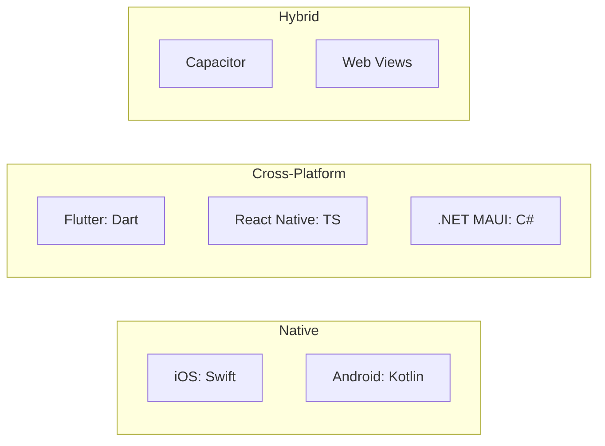

# Mobile Development

Building applications for iOS and Android.

## Platform Overview

| Platform | Language | UI Framework | IDE |
|----------|----------|--------------|-----|
| iOS | Swift, Obj-C | SwiftUI, UIKit | Xcode |
| Android | Kotlin, Java | Jetpack Compose, XML Views | Android Studio |

---

## Development Approaches

| Approach | Examples | Trade-off |
|----------|----------|-----------|
| **Native** | SwiftUI, Compose | Best UX, platform-specific code |
| **Cross-platform** | Flutter, React Native | Code sharing, some compromises |
| **Hybrid** | Capacitor, Cordova | Web skills, web-like UX |
| **PWA** | Web app + manifest | No app store, limited APIs |

---

## Native iOS

### Frameworks

| Framework | Era | Style |
|-----------|-----|-------|
| SwiftUI | 2019+ | Declarative, modern |
| UIKit | 2008+ | Imperative, mature |

### SwiftUI

**Declarative UI** with Swift.

**Strengths:**
- Concise, readable code
- Live previews
- Cross-Apple platforms (iOS, macOS, watchOS, tvOS)
- State management built-in

**Considerations:**
- iOS 13+ minimum
- Some UIKit features still needed
- Debugging can be tricky

### UIKit

**Imperative UI** with view controllers.

**When to use:**
- Complex custom UI
- Pre-iOS 13 support
- Wrapping in SwiftUI

### Architecture Patterns

| Pattern | Description |
|---------|-------------|
| MVVM | SwiftUI natural fit |
| MVC | UIKit traditional |
| TCA | Composable Architecture (Point-Free) |
| VIPER | Enterprise, testable |

---

## Native Android

### Frameworks

| Framework | Era | Style |
|-----------|-----|-------|
| Jetpack Compose | 2021+ | Declarative, modern |
| XML Views | 2008+ | Imperative, mature |

### Jetpack Compose

**Declarative UI** with Kotlin.

**Strengths:**
- Kotlin-native
- Less boilerplate
- Better state management
- Interop with existing Views

**Considerations:**
- API 21+ (practical minimum)
- Still maturing
- Performance considerations for lists

### Architecture Patterns

| Pattern | Description |
|---------|-------------|
| MVVM | Recommended by Google |
| MVI | Unidirectional data flow |
| Clean Architecture | Layer separation |

### Android Jetpack

| Component | Purpose |
|-----------|---------|
| ViewModel | UI state holder |
| Room | SQLite abstraction |
| Navigation | Screen navigation |
| WorkManager | Background tasks |
| DataStore | Preferences |

---

## Cross-Platform

### Flutter

| Aspect | Details |
|--------|---------|
| Language | Dart |
| Rendering | Custom (Skia/Impeller) |
| Platforms | iOS, Android, Web, Desktop |
| State | Provider, Riverpod, Bloc |

**Strengths:**
- Fast development (hot reload)
- Consistent UI across platforms
- Single codebase
- Good performance

**Considerations:**
- Dart learning curve
- Large app size
- Platform feel can differ

### React Native

| Aspect | Details |
|--------|---------|
| Language | TypeScript/JavaScript |
| Rendering | Native components |
| Platforms | iOS, Android |
| State | Redux, Zustand, Jotai |

**Strengths:**
- JavaScript/React skills transfer
- Large ecosystem
- Native look and feel
- Expo for rapid development

**Considerations:**
- Bridge overhead (old arch)
- Native modules sometimes needed
- Debugging complexity

### .NET MAUI

| Aspect | Details |
|--------|---------|
| Language | C# |
| Rendering | Native controls |
| Platforms | iOS, Android, macOS, Windows |
| State | MVVM, CommunityToolkit |

**Strengths:**
- C# ecosystem
- Native controls
- Enterprise support
- Xamarin migration path

**Considerations:**
- Smaller community than Flutter/RN
- macOS/Linux dev limited

### Kotlin Multiplatform (KMP)

| Aspect | Details |
|--------|---------|
| Language | Kotlin |
| Rendering | Native UI per platform |
| Platforms | iOS, Android, Desktop, Web |

**Approach:** Share business logic, native UI per platform.

**Strengths:**
- Best native experience
- Kotlin everywhere
- Gradual adoption

**Considerations:**
- Still maturing
- iOS interop complexity

---

## Comparison Matrix

| Factor | Native | Flutter | React Native | MAUI |
|--------|--------|---------|--------------|------|
| Performance | Best | Excellent | Good | Good |
| Native feel | Best | Custom | Good | Good |
| Dev speed | Medium | Fast | Fast | Medium |
| Code sharing | None | High | High | High |
| Team skills | Platform | Dart | JS/React | C# |
| App size | Smallest | Larger | Medium | Medium |

---

## Common Concerns

### Navigation

| Platform | Solution |
|----------|----------|
| iOS | NavigationStack (SwiftUI), UINavigationController |
| Android | Navigation Component, Compose Navigation |
| Flutter | go_router, Navigator 2.0 |
| React Native | React Navigation |

### State Management

| Platform | Options |
|----------|---------|
| iOS | @State, @Observable, TCA |
| Android | ViewModel, StateFlow |
| Flutter | Provider, Riverpod, Bloc |
| React Native | Redux, Zustand, Jotai |

### Networking

All platforms: Use platform HTTP client or cross-platform library.

### Local Storage

| Type | iOS | Android | Cross-platform |
|------|-----|---------|----------------|
| Key-value | UserDefaults | DataStore | Hive, MMKV |
| SQL | Core Data, SQLite | Room | Drift, sqflite |

---

## Decision Guide

| Scenario | Recommendation |
|----------|----------------|
| Best UX for each platform | Native (Swift + Kotlin) |
| Fast MVP, small team | Flutter or React Native |
| Existing React team | React Native |
| Existing .NET team | .NET MAUI |
| Shared logic, native UI | Kotlin Multiplatform |
| Web team, simple app | PWA or Capacitor |

---

## Related

- [[Desktop Development]]
- [[Web Development]]
- [[Cross-Compilation]]
