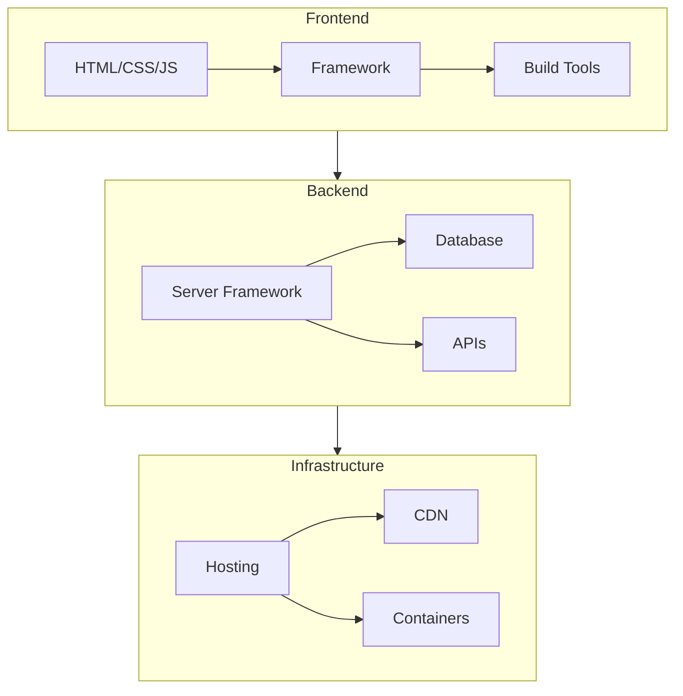

# Web Development

Building applications for the browser and server.

## The Stack

---

## Frontend

### Frameworks

| Framework | Language | Architecture | Best For |
|-----------|----------|--------------|----------|
| [[React]] | TypeScript/JS | Component, virtual DOM | Large apps, ecosystem |
| [[Vue]] | TypeScript/JS | Component, reactivity | Progressive adoption |
| [[Angular]] | TypeScript | Full framework, DI | Enterprise, structure |
| [[Svelte]] | TypeScript/JS | Compile-time | Performance, simplicity |
| [[Solid]] | TypeScript/JS | Fine-grained reactivity | React-like, faster |
| [[HTMX]] | HTML attributes | Hypermedia | Server-rendered, simplicity |

### Meta-Frameworks

| Framework | Base | Rendering |
|-----------|------|-----------|
| [[Next.js]] | React | SSR, SSG, ISR |
| [[Nuxt]] | Vue | SSR, SSG |
| [[SvelteKit]] | Svelte | SSR, SSG |
| [[Remix]] | React | SSR, nested routes |
| [[Astro]] | Any | Static-first, islands |

### Build Tools

| Tool | Purpose |
|------|---------|
| Vite | Dev server + bundler |
| esbuild | Fast bundler |
| Webpack | Legacy, configurable |
| Turbopack | Next.js bundler |
| Bun | Runtime + bundler |

### CSS

| Approach | Examples |
|----------|----------|
| Utility-first | Tailwind CSS |
| CSS-in-JS | styled-components, Emotion |
| CSS Modules | Scoped CSS |
| Component libraries | shadcn/ui, Radix, MUI |

---

## Backend

### Frameworks by Language

| Language | Frameworks |
|----------|------------|
| TypeScript | Express, Fastify, NestJS, Hono |
| Python | FastAPI, Django, Flask |
| Go | net/http, Gin, Echo, Fiber |
| C# | ASP.NET Core |
| Rust | Axum, Actix-web |
| Java | Spring Boot, Quarkus |
| Kotlin | Ktor, Spring Boot |
| Ruby | Rails, Sinatra |
| PHP | Laravel, Symfony |

See [[Web Frameworks]] for detailed comparison.

### API Styles

| Style | Use Case |
|-------|----------|
| REST | Standard APIs |
| GraphQL | Flexible queries |
| gRPC | Service-to-service |
| tRPC | End-to-end type safety |
| WebSocket | Real-time |

### Databases

| Type | Examples |
|------|----------|
| Relational | PostgreSQL, MySQL |
| Document | MongoDB, CouchDB |
| Key-Value | Redis, DynamoDB |
| Graph | Neo4j |
| Vector | Pinecone, pgvector |

---

## Full-Stack

### Monolithic

Single codebase for frontend + backend.

| Framework | Language | Notes |
|-----------|----------|-------|
| Next.js | TypeScript | React + API routes |
| Remix | TypeScript | React + loaders |
| Django | Python | Templates + ORM |
| Rails | Ruby | Convention over config |
| Laravel | PHP | Blade + Eloquent |
| ASP.NET Core | C# | Razor/Blazor + EF Core |

### Separated

| Pattern | Description |
|---------|-------------|
| SPA + API | Frontend app, backend API |
| BFF | Backend-for-frontend pattern |
| Micro-frontends | Independent frontend modules |

---

## Rendering Strategies

| Strategy | Acronym | When |
|----------|---------|------|
| Client-side | CSR | Dynamic, authenticated |
| Server-side | SSR | SEO, initial load |
| Static generation | SSG | Content sites |
| Incremental static | ISR | Cached + fresh |
| Streaming | - | Progressive rendering |

---

## Authentication

| Method | Use Case |
|--------|----------|
| Session cookies | Traditional server apps |
| JWT | Stateless APIs |
| OAuth 2.0 / OIDC | Third-party login |
| Passkeys | Passwordless |

### Providers

Auth0, Clerk, Supabase Auth, Firebase Auth, NextAuth.js

---

## Deployment

| Platform | Type |
|----------|------|
| Vercel | Serverless, Next.js |
| Netlify | JAMstack, serverless |
| Cloudflare Pages | Edge, Workers |
| AWS | Full control |
| Railway, Render | Simple PaaS |
| Fly.io | Edge containers |

---

## Related

- [[Web Frameworks]]
- [[HTTP Clients]]
- [[ORMs & Database Access]]
- [[Deployment]]
- [[Mobile Development]]
