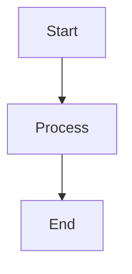

# {{title}}

Brief definition/overview.

## Key Concepts

### Concept 1

Explanation.

### Concept 2

Explanation.

## Visual



## Examples

### Example 1

```
Code or demonstration
```

## Common Pitfalls

- Pitfall 1
- Pitfall 2

## Related

- [[Related Page 1]]
- [[Related Page 2]]

## References

- [External Resource](url)
