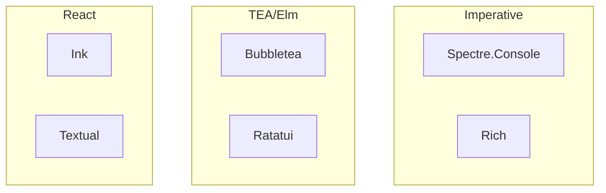

# Terminal UI & Language Features Comparison

Cross-language comparison of terminal UI libraries and core language capabilities across C#, Go, Python, TypeScript, and Rust.

## Terminal UI Libraries

### Library Overview

| Language | Library | Architecture | Focus |
|----------|---------|--------------|-------|
| C# | Spectre.Console | Imperative | CLI prompts, formatted output |
| Go | Charm (Bubbletea) | Elm/TEA | Full TUI apps |
| Python | Rich / Textual | Imperative + Reactive | Output (Rich) / Full TUI (Textual) |
| JS/TS | Ink | React model | Full TUI apps |
| Rust | Ratatui | Elm/TEA | Full TUI apps |

### Feature Matrix

| Feature | Spectre.Console | Charm/Bubbletea | Rich/Textual | Ink | Ratatui |
|---------|-----------------|-----------------|--------------|-----|---------|
| Full TUI apps | Limited | ✅ | ✅ Textual | ✅ | ✅ |
| CLI prompts | ✅ Excellent | ✅ Huh | ✅ | ✅ | ❌ |
| Tables | ✅ | ✅ Lipgloss | ✅ | ✅ | ✅ |
| Progress bars | ✅ | ✅ Bubbles | ✅ | ✅ | ✅ |
| Spinners | ✅ | ✅ Bubbles | ✅ | ✅ | ✅ |
| Markdown render | ✅ | ✅ Glamour | ✅ | ❌ | ❌ |
| Syntax highlight | ✅ | ✅ Glamour | ✅ Pygments | ❌ | ❌ |
| Layout system | Basic | ✅ Lipgloss | ✅ CSS-like | Flexbox | Constraints |
| Mouse support | ❌ | ✅ | ✅ Textual | ❌ | ✅ |

### Ecosystem Breakdown

**Spectre.Console (C#)**

- `Spectre.Console` — Core output, tables, trees, charts
- `Spectre.Console.Cli` — Command-line argument parsing
- Single package, batteries included
- No full-screen mode or persistent TUI

**Charm Stack (Go)**

- `bubbletea` — Core TEA framework
- `bubbles` — Pre-built components (inputs, lists, spinners)
- `lipgloss` — CSS-like styling
- `glamour` — Markdown rendering
- `huh` — Form/prompt builder
- Modular, compose what you need

**Rich + Textual (Python)**

- `rich` — Pretty printing, tables, syntax highlighting (output only)
- `textual` — Full reactive TUI framework with CSS styling
- Two distinct libs from same maintainer (Textualize)

**Ink (JS/TS)**

- Core uses React reconciler + Yoga (flexbox)
- Components via `ink-*` packages (ink-text-input, ink-select-input, etc.)
- React mental model—hooks, JSX, component state

**Ratatui (Rust)**

- Fork of `tui-rs`, very active
- Constraint-based layout
- No built-in prompts—you build everything
- Often paired with `crossterm` for terminal backend

### Architecture Comparison



| Pattern | Libraries | Mental Model |
|---------|-----------|--------------|
| Imperative | Spectre, Rich | Call methods, output happens |
| TEA/Elm | Bubbletea, Ratatui | Model → Update → View cycle |
| React-like | Ink, Textual | Components, state, reconciliation |

### Rendering Models

| Library | Rendering Approach |
|---------|-------------------|
| Spectre.Console | Direct write to stdout |
| Bubbletea | Full repaint per Update cycle |
| Rich | Direct write, Live for updates |
| Textual | Virtual DOM diff, partial updates |
| Ink | Full repaint via React reconciler |
| Ratatui | Immediate mode, full repaint |

---

## Async & Concurrency

### Model Comparison

| Language | Model | Syntax | Runtime |
|----------|-------|--------|---------|
| C# | Task-based | `async/await` | CLR thread pool |
| Go | CSP | `go func()`, channels | M:N scheduler |
| Python | Coroutines | `async/await` | Single-threaded event loop |
| JS/TS | Event loop | `async/await` | libuv (Node) |
| Rust | Zero-cost futures | `async/await` | BYO (tokio, async-std) |

### Parallelism Reality

| Language | True Parallelism | How |
|----------|------------------|-----|
| C# | ✅ | `Task.WhenAll`, `Parallel.ForEachAsync` |
| Go | ✅ | Goroutines (default behavior) |
| Python | ❌ (GIL) | `multiprocessing` for CPU work |
| JS/TS | ❌ | Worker threads (limited) |
| Rust | ✅ | `tokio::spawn`, rayon for CPU |

### Code Patterns

**C# — Task-based**

```csharp
// Concurrent I/O
var results = await Task.WhenAll(
    FetchA(),
    FetchB(),
    FetchC()
);

// Parallel CPU work
await Parallel.ForEachAsync(items, async (item, ct) =>
{
    await ProcessAsync(item, ct);
});
```

**Go — Goroutines + Channels**

```go
results := make(chan Result, len(items))

for _, item := range items {
    go func(i Item) {
        results <- process(i)
    }(item)
}

// Collect results
for range items {
    r := <-results
    // handle r
}
```

**Python — asyncio (I/O only)**

```python
# Concurrent I/O
results = await asyncio.gather(
    fetch_a(),
    fetch_b(),
    fetch_c()
)

# CPU parallelism requires multiprocessing
from concurrent.futures import ProcessPoolExecutor
with ProcessPoolExecutor() as pool:
    results = list(pool.map(cpu_work, items))
```

**Rust — tokio**

```rust
// Concurrent I/O
let (a, b, c) = tokio::join!(
    fetch_a(),
    fetch_b(),
    fetch_c()
);

// Parallel CPU (rayon)
let results: Vec<_> = items
    .par_iter()
    .map(|i| process(i))
    .collect();
```

---

## Type Safety

### Type System Comparison

| Feature | C# | Go | Python | TS | Rust |
|---------|----|----|--------|----|----- |
| Static typing | ✅ | ✅ | ❌ Hints only | ✅ | ✅ |
| Null safety | Opt-in NRTs | ❌ `nil` everywhere | ❌ | Optional strict | ✅ `Option<T>` |
| Generics | Reified | Limited (1.18+) | Hints only | Erased | Monomorphized |
| Sum types | ❌ Manual | ❌ | ❌ | ✅ Unions | ✅ `enum` |
| Pattern matching | ✅ | ❌ | ✅ 3.10+ | ❌ | ✅ |

### Null/None Handling

| Language | Approach | Safety Level |
|----------|----------|--------------|
| Rust | `Option<T>`, no null | Compile-time enforced |
| C# | Nullable reference types | Warnings only (bypassable) |
| TS | `strictNullChecks` | Compile-time (if enabled) |
| Go | `nil` valid for many types | Runtime panics |
| Python | `None` is valid anywhere | Runtime errors |

**Rust — Forced handling**

```rust
match config.api_key {
    Some(key) => use_key(key),
    None => panic!("API key required"),
}

// Or propagate with ?
let key = config.api_key.ok_or(Error::MissingKey)?;
```

**C# — Nullable Reference Types**

```csharp
// Project: <Nullable>enable</Nullable>
string? nullable = GetValue();  // May be null
string required = nullable ?? "default";

// Escape hatch (dangerous)
string forced = nullable!;
```

**Go — Manual nil checks**

```go
if config.APIKey == nil {
    return errors.New("API key required")
}
```

---

## Error Handling

### Model Comparison

| Language | Primary Model | Propagation |
|----------|---------------|-------------|
| Rust | `Result<T, E>` | `?` operator |
| Go | `(T, error)` tuple | `if err != nil` |
| C# | Exceptions | `try/catch` |
| Python | Exceptions | `try/except` |
| TS | Exceptions | `try/catch` |

### Code Patterns

**Rust — Result + ?**

```rust
fn load_config() -> Result<Config, Error> {
    let content = fs::read_to_string("config.toml")?;
    let config: Config = toml::from_str(&content)?;
    Ok(config)
}
```

**Go — Explicit error returns**

```go
func loadConfig() (*Config, error) {
    content, err := os.ReadFile("config.toml")
    if err != nil {
        return nil, fmt.Errorf("reading config: %w", err)
    }

    var config Config
    if err := toml.Unmarshal(content, &config); err != nil {
        return nil, fmt.Errorf("parsing config: %w", err)
    }

    return &config, nil
}
```

**C# — Exceptions**

```csharp
try
{
    var config = LoadConfig();
}
catch (FileNotFoundException)
{
    // Handle missing file
}
catch (JsonException ex)
{
    // Handle parse error
    logger.LogError(ex, "Config parse failed");
}
```

---

## CLI Argument Parsing

### Library Comparison

| Language | Library | Style |
|----------|---------|-------|
| C# | Spectre.Console.Cli | Classes + attributes |
| Go | cobra | Builder pattern |
| Python | typer | Decorators + type hints |
| TS | commander, yargs | Chained builders |
| Rust | clap | Derive macros |

### Code Patterns

**C# — Spectre.Console.Cli**

```csharp
public class Settings : CommandSettings
{
    [CommandArgument(0, "<name>")]
    public string Name { get; set; } = "";

    [CommandOption("-c|--count")]
    [DefaultValue(1)]
    public int Count { get; set; }
}
```

**Go — Cobra**

```go
var cmd = &cobra.Command{
    Use:   "greet <name>",
    Args:  cobra.ExactArgs(1),
    Run: func(cmd *cobra.Command, args []string) {
        count, _ := cmd.Flags().GetInt("count")
        name := args[0]
        // ...
    },
}
cmd.Flags().IntP("count", "c", 1, "repeat count")
```

**Python — Typer**

```python
@app.command()
def greet(
    name: str,
    count: int = typer.Option(1, "--count", "-c")
):
    for _ in range(count):
        print(f"Hello, {name}!")
```

**Rust — Clap**

```rust
#[derive(Parser)]
struct Args {
    name: String,

    #[arg(short, long, default_value_t = 1)]
    count: u32,
}
```

Typer and Clap are cleanest—type annotations define the schema.

---

## Serialization

### JSON Libraries

| Language | Library | Pattern |
|----------|---------|---------|
| C# | System.Text.Json | Attributes + reflection |
| Go | encoding/json | Struct tags |
| Python | json, orjson | Dicts or dataclasses |
| TS | Native JSON | Type assertions |
| Rust | serde_json | Derive macros |

### Code Patterns

**C# — System.Text.Json**

```csharp
public class Config
{
    [JsonPropertyName("apiKey")]
    public string ApiKey { get; set; } = "";

    [JsonIgnore]
    public string Secret { get; set; } = "";
}
```

**Go — Struct tags**

```go
type Config struct {
    APIKey string `json:"apiKey"`
    Secret string `json:"-"`
}
```

**Rust — Serde**

```rust
#[derive(Serialize, Deserialize)]
struct Config {
    #[serde(rename = "apiKey")]
    api_key: String,

    #[serde(skip)]
    secret: String,
}
```

Serde is the gold standard—single derive, multiple format support (JSON, YAML, TOML, etc.).

---

## Binary Distribution

### Output Comparison

| Language | Output | Typical Size | Cold Start |
|----------|--------|--------------|------------|
| Rust | Static binary | 1–10 MB | Instant |
| Go | Static binary | 5–15 MB | Instant |
| C# (AOT) | Native binary | 10–30 MB | Instant |
| C# (JIT) | IL + runtime | 50–80 MB self-contained | Slow |
| Python | Requires interpreter | N/A | Slow |
| Node/TS | Requires runtime | 40+ MB bundled | Slow |

### Distribution Strategy

| Goal | Best Choice |
|------|-------------|
| Single binary, small | Rust |
| Single binary, fast dev | Go |
| .NET ecosystem required | C# Native AOT |
| Rapid prototyping | Python |
| Team knows React | TS + Ink (accept Node overhead) |

---

## Dependency Management

| Language | Tool | Lockfile | Monorepo |
|----------|------|----------|----------|
| C# | NuGet + MSBuild | packages.lock.json (opt-in) | Directory.Build.props |
| Go | Go modules | go.sum | go.work |
| Python | pip/poetry/uv | poetry.lock, uv.lock | Weak |
| TS | npm/pnpm/yarn | package-lock.json | pnpm workspaces, nx |
| Rust | Cargo | Cargo.lock | Workspaces (native) |

Rust and Go have cleanest stories. Python is fragmented. Node works but tooling varies.

---

## Decision Matrix

### By Priority

| Priority | Best Choice |
|----------|-------------|
| Fastest development | Python (typer + rich) |
| Best type safety | Rust |
| Best async ergonomics | C# or Rust |
| Simplest concurrency | Go |
| Smallest binary | Rust (optimized) |
| Best TUI framework | Bubbletea (Go) or Ratatui (Rust) |
| Best CLI prompts | Spectre.Console (C#) |
| Team knows React | TS + Ink |

### By Use Case

| Use Case | Recommendation |
|----------|----------------|
| CLI tool for users | Go or Rust (single binary) |
| Internal automation | Python or C# (team familiarity) |
| Full TUI dashboard | Bubbletea, Textual, or Ratatui |
| Formatted CLI output | Spectre.Console or Rich |
| Cross-platform installer | Go or Rust |

---

## Related

- [[Testing Frameworks]]
- [[Build Systems]]
- [[HTTP Clients]]
- [[Logging Libraries]]
